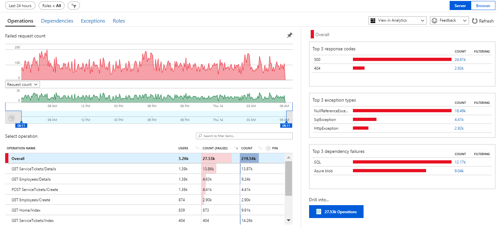
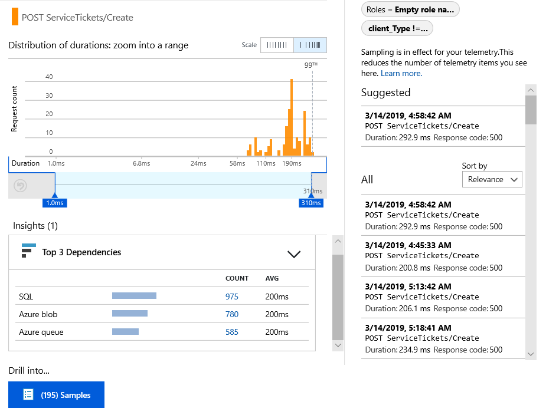
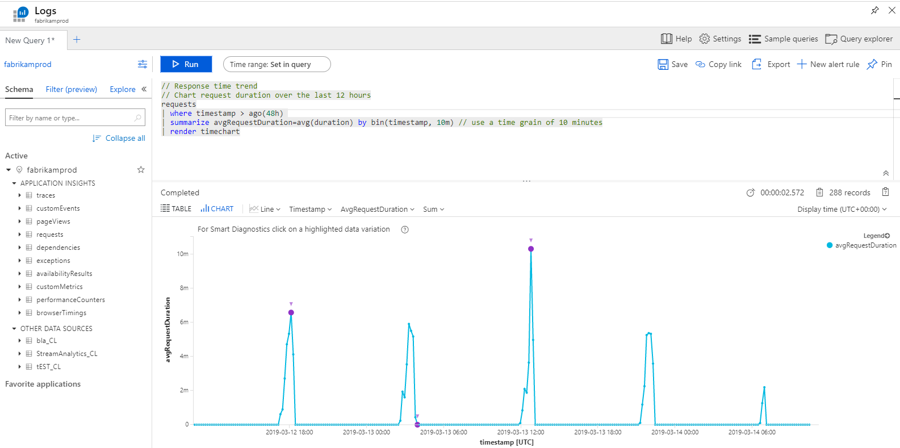
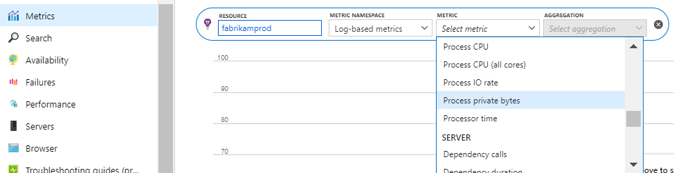

# Quickstart: Get started with Application Insights in a Java web project

In this quickstart, you use Application Insights to automatically instrument request, track dependencies, and collect performance counters, diagnose performance issues and exceptions, and write code to  track what users do with your app.

Application Insights is an extensible analytics service for web developers that helps you understand the performance and usage of your live application. Application Insights supports Java apps running on Linux, Unix, or Windows.

## Prerequisites

* An Azure account with an active subscription. [Create an account for free](https://azure.microsoft.com/free/?ref=microsoft.com&utm_source=microsoft.com&utm_medium=docs&utm_campaign=visualstudio).
* A functioning Java application.

## Get an Application Insights instrumentation key

1. Sign in to the [Azure portal](https://portal.azure.com/).
2. In the Azure portal, create an Application Insights resource. Set the application type to Java web application.

3. Find the instrumentation key of the new resource. You'll need to paste this key into your code project shortly.

    

## Add the Application Insights SDK for Java to your project

*Choose your project type.*

# [Maven](#tab/maven)

If your project is already set up to use Maven for build, merge the following code to your *pom.xml* file.

Then, refresh the project dependencies to get the binaries downloaded.

```XML
    <dependencies>
      <dependency>
        <groupId>com.microsoft.azure</groupId>
        <artifactId>applicationinsights-web-auto</artifactId>
        <!-- or applicationinsights-web for manual web filter registration -->
        <!-- or applicationinsights-core for bare API -->
        <version>2.5.0</version>
      </dependency>
    </dependencies>
```

# [Gradle](#tab/gradle)

If your project is already set up to use Gradle for build, merge the following code to your *build.gradle* file.

Then refresh the project dependencies to get the binaries downloaded.

```gradle
    dependencies {
      compile group: 'com.microsoft.azure', name: 'applicationinsights-web-auto', version: '2.5.0'
      // or applicationinsights-web for manual web filter registration
      // or applicationinsights-core for bare API
    }
```

# [Other types](#tab/other)

Download the [latest version](https://github.com/Microsoft/ApplicationInsights-Java/releases/latest) and copy the necessary files into your project, replacing any previous versions.

---

### Questions
* *What's the relationship between the `-web-auto`, `-web` and `-core` components?*
  * `applicationinsights-web-auto` gives you metrics that track HTTP servlet request counts and response times,
    by automatically registering the Application Insights servlet filter at runtime.
  * `applicationinsights-web` also gives you metrics that track HTTP servlet request counts and response times,
    but requires manual registration of the Application Insights servlet filter in your application.
  * `applicationinsights-core` gives you just the bare API, for example, if your application isn't servlet-based.
  
* *How should I update the SDK to the latest version?*
  * If you're using Gradle or Maven...
    * Update your build file to specify the latest version.
  * If you're manually managing dependencies...
    * Download the latest [Application Insights SDK for Java](https://github.com/Microsoft/ApplicationInsights-Java/releases/latest) and replace the old ones. Changes are described in the [SDK release notes](https://github.com/Microsoft/ApplicationInsights-Java#release-notes).

## Add an *ApplicationInsights.xml* file
Add *ApplicationInsights.xml* to the resources folder in your project, or make sure it's added to your project's deployment class path. Copy the following XML into it.

Replace the instrumentation key with the one that you got from the Azure portal.

```XML
<?xml version="1.0" encoding="utf-8"?>
<ApplicationInsights xmlns="http://schemas.microsoft.com/ApplicationInsights/2013/Settings" schemaVersion="2014-05-30">

   <!-- The key from the portal: -->
   <InstrumentationKey>** Your instrumentation key **</InstrumentationKey>

   <!-- HTTP request component (not required for bare API) -->
   <TelemetryModules>
      <Add type="com.microsoft.applicationinsights.web.extensibility.modules.WebRequestTrackingTelemetryModule"/>
      <Add type="com.microsoft.applicationinsights.web.extensibility.modules.WebSessionTrackingTelemetryModule"/>
      <Add type="com.microsoft.applicationinsights.web.extensibility.modules.WebUserTrackingTelemetryModule"/>
   </TelemetryModules>

   <!-- Events correlation (not required for bare API) -->
   <!-- These initializers add context data to each event -->
   <TelemetryInitializers>
      <Add type="com.microsoft.applicationinsights.web.extensibility.initializers.WebOperationIdTelemetryInitializer"/>
      <Add type="com.microsoft.applicationinsights.web.extensibility.initializers.WebOperationNameTelemetryInitializer"/>
      <Add type="com.microsoft.applicationinsights.web.extensibility.initializers.WebSessionTelemetryInitializer"/>
      <Add type="com.microsoft.applicationinsights.web.extensibility.initializers.WebUserTelemetryInitializer"/>
      <Add type="com.microsoft.applicationinsights.web.extensibility.initializers.WebUserAgentTelemetryInitializer"/>
   </TelemetryInitializers>

</ApplicationInsights>
```

Optionally, the configuration file can be in any location accessible to your application.  The system property `-Dapplicationinsights.configurationDirectory` specifies the directory that contains *ApplicationInsights.xml*. For example, a configuration file located at `E:\myconfigs\appinsights\ApplicationInsights.xml` would be configured with the property `-Dapplicationinsights.configurationDirectory="E:\myconfigs\appinsights"`.

* The instrumentation key is sent along with every item of telemetry and tells Application Insights to display it in your resource.
* The HTTP Request component is optional. It automatically sends telemetry about requests and response times to the portal.
* Event correlation is an addition to the HTTP request component. It assigns an identifier to each request received by the server. It then adds this identifier as a property to every item of telemetry as the property 'Operation.Id'. It allows you to correlate the telemetry associated with each request by setting a filter in [diagnostic search][diagnostic].

### Alternative ways to set the instrumentation key
Application Insights SDK looks for the key in this order:

1. System property: -DAPPINSIGHTS_INSTRUMENTATIONKEY=your_ikey
2. Environment variable: APPINSIGHTS_INSTRUMENTATIONKEY
3. Configuration file: *ApplicationInsights.xml*

You can also [set it in code](../../azure-monitor/app/api-custom-events-metrics.md#ikey):

```java
    String instrumentationKey = "00000000-0000-0000-0000-000000000000";

    if (instrumentationKey != null)
    {
        TelemetryConfiguration.getActive().setInstrumentationKey(instrumentationKey);
    }
```

## Add agent

[Install the Java Agent](java-agent.md) to capture outgoing HTTP calls, JDBC queries, application logging,
and better operation naming.

## Run your application
Either run it in debug mode on your development machine, or publish to your server.

## View your telemetry in Application Insights
Return to your Application Insights resource in [Microsoft Azure portal](https://portal.azure.com).

HTTP requests data appears on the overview blade. (If it isn't there, wait a few seconds and then click Refresh.)


[Learn more about metrics.][metrics]

Click through any chart to see more detailed aggregated metrics.



<!--
[TODO update image with 2.5.0 operation naming provided by agent]
-->

### Instance data
Click through a specific request type to see individual instances.



### Analytics: Powerful query language
As you accumulate more data, you can run queries both to aggregate data and to find individual instances.  [Analytics](../../azure-monitor/app/analytics.md) is a powerful tool for both for understanding performance and usage, and for diagnostic purposes.



## Install your app on the server
Now publish your app to the server, let people use it, and watch the telemetry show up on the portal.

* Make sure your firewall allows your application to send telemetry to these ports:

  * dc.services.visualstudio.com:443
  * f5.services.visualstudio.com:443

* If outgoing traffic must be routed through a firewall, define system properties `http.proxyHost` and `http.proxyPort`.

* On Windows servers, install:

  * [Microsoft Visual C++ Redistributable](https://www.microsoft.com/download/details.aspx?id=40784)

    (This component enables performance counters.)

## Azure App Service config (Spring Boot)

Spring Boot apps running on Windows require additional configuration to run on Azure App Services. Modify **web.config** and add the following configuration:

```xml
<?xml version="1.0" encoding="UTF-8"?>
<configuration>
    <system.webServer>
        <handlers>
            <add name="httpPlatformHandler" path="*" verb="*" modules="httpPlatformHandler" resourceType="Unspecified"/>
        </handlers>
        <httpPlatform processPath="%JAVA_HOME%\bin\java.exe" arguments="-Djava.net.preferIPv4Stack=true -Dserver.port=%HTTP_PLATFORM_PORT% -jar &quot;%HOME%\site\wwwroot\AzureWebAppExample-0.0.1-SNAPSHOT.jar&quot;">
        </httpPlatform>
    </system.webServer>
</configuration>
```

## Exceptions and request failures
Unhandled exceptions and request failures are automatically collected by the Application Insights web filter.

To collect data on other exceptions, you can [insert calls to trackException() in your code][apiexceptions].

## Monitor method calls and external dependencies
[Install the Java Agent](java-agent.md) to log specified internal methods and calls made through JDBC, with timing data.

And for automatic operation naming.

## W3C distributed tracing

The Application Insights Java SDK now supports [W3C distributed tracing](https://w3c.github.io/trace-context/).

The incoming SDK configuration is explained further in our article on [correlation](correlation.md).

Outgoing SDK configuration is defined in the [AI-Agent.xml](java-agent.md) file.

## Performance counters
Open **Investigate**, **Metrics**, to see a range of performance counters.



### Customize performance counter collection
To disable collection of the standard set of performance counters, add the following code under the root node of the *ApplicationInsights.xml* file:

```XML
    <PerformanceCounters>
       <UseBuiltIn>False</UseBuiltIn>
    </PerformanceCounters>
```

### Collect additional performance counters
You can specify additional performance counters to be collected.

#### JMX counters (exposed by the Java Virtual Machine)

```XML
    <PerformanceCounters>
      <Jmx>
        <Add objectName="java.lang:type=ClassLoading" attribute="TotalLoadedClassCount" displayName="Loaded Class Count"/>
        <Add objectName="java.lang:type=Memory" attribute="HeapMemoryUsage.used" displayName="Heap Memory Usage-used" type="composite"/>
      </Jmx>
    </PerformanceCounters>
```

* `displayName` – The name displayed in the Application Insights portal.
* `objectName` – The JMX object name.
* `attribute` – The attribute of the JMX object name to fetch
* `type` (optional) - The type of JMX object's attribute:
  * Default: a simple type such as int or long.
  * `composite`: the perf counter data is in the format of 'Attribute.Data'
  * `tabular`: the perf counter data is in the format of a table row

#### Windows performance counters
Each [Windows performance counter](https://msdn.microsoft.com/library/windows/desktop/aa373083.aspx) is a member of a category (in the same way that a field is a member of a class). Categories can either be global, or can have numbered or named instances.

```XML
    <PerformanceCounters>
      <Windows>
        <Add displayName="Process User Time" categoryName="Process" counterName="%User Time" instanceName="__SELF__" />
        <Add displayName="Bytes Printed per Second" categoryName="Print Queue" counterName="Bytes Printed/sec" instanceName="Fax" />
      </Windows>
    </PerformanceCounters>
```

* displayName – The name displayed in the Application Insights portal.
* categoryName – The performance counter category (performance object) with which this performance counter is associated.
* counterName – The name of the performance counter.
* instanceName – The name of the performance counter category instance, or an empty string (""), if the category contains a single instance. If the categoryName is Process, and the performance counter you'd like to collect is from the current JVM process on which your app is running, specify `"__SELF__"`.

### Unix performance counters
* [Install collectd with the Application Insights plugin](java-collectd.md) to get a wide variety of system and network data.

## Get user and session data
OK, you're sending telemetry from your web server. Now to get the full 360-degree view of your application, you can add more monitoring:

* [Add telemetry to your web pages][usage] to monitor page views and user metrics.
* [Set up web tests][availability] to make sure your application stays live and responsive.

## Send your own telemetry
Now that you've installed the SDK, you can use the API to send your own telemetry.

* [Track custom events and metrics][api] to learn what users are doing with your application.
* [Search events and logs][diagnostic] to help diagnose problems.

## Availability web tests
Application Insights can test your website at regular intervals to check that it's up and responding well.

[Learn more about how to set up availability web tests.][availability]

## Questions? Problems?
[Troubleshooting Java](java-troubleshoot.md)

## Next steps
* [Monitor dependency calls](java-agent.md)
* [Monitor Unix performance counters](java-collectd.md)
* Add [monitoring to your web pages](javascript.md) to monitor page load times, AJAX calls, browser exceptions.
* Write [custom telemetry](../../azure-monitor/app/api-custom-events-metrics.md) to track usage in the browser or at the server.
* Use  [Analytics](../../azure-monitor/app/analytics.md) for powerful queries over telemetry from your app
* For more information, visit [Azure for Java developers](/java/azure).

<!--Link references-->

[api]: ../../azure-monitor/app/api-custom-events-metrics.md
[apiexceptions]: ../../azure-monitor/app/api-custom-events-metrics.md#trackexception
[availability]: ../../azure-monitor/app/monitor-web-app-availability.md
[diagnostic]: ../../azure-monitor/app/diagnostic-search.md
[javalogs]: java-trace-logs.md
[metrics]: ../../azure-monitor/platform/metrics-charts.md
[usage]: javascript.md
