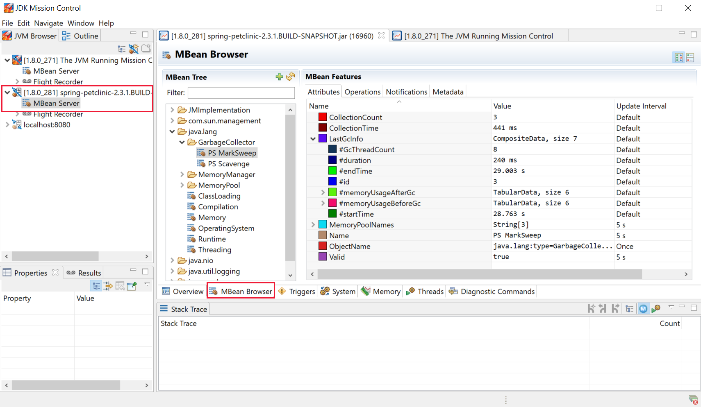
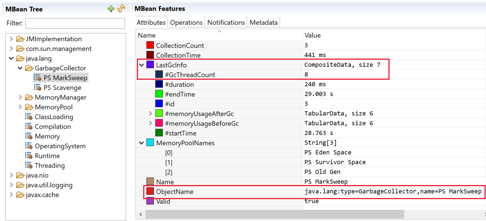

# Configuring JMX metrics

Application insights Java 3.0 agent collects some of the JMX metrics by default, but in many cases this is not enough. This document describes in the JMX configuration option in details.

## How do I collect additional JMX metrics?

JMX metrics collection can be configured by adding a ```"jmxMetrics"``` section to the applicationinsights.json file. You can specify the name of the metric the way you want it to appear in Azure portal in application insights resource. You have to define the object name and attribute for each of the metrics you want collected.

## How do I know what metrics are available to configure?

You nailed it - you must know the object names and the attributes, those properties are different for various libraries, frameworks, and application servers, and are often not well documented. To get the object names and attributes, you need to view the MBean tree. An MBean is a managed Java object, that can represent a device, an application, or a resource, and has a set of attributes. 

To view the available metrics and browse through the available metrics, we recommend using [Java Mission Control](https://www.oracle.com/java/technologies/jdk-mission-control.html).

### How to navigate the Java Mission Control to get to the right metrics?

When you run the Java Mission Control tool, you'll have a selection of JVMs available on the left side, click on the relevant process under the 'JVM Browser' tab. Wait until JMC loads the dashboard for the process, select 'MBean Browser' tab on the bottom (see below). The JMC must be located in the same folder as the JVM and your process/app must be up and running.



### How to get to the metrics I want, and the necessary attributes?

The MBean browser opens the MBean tree with the list of categories that can be expanded. Selecting a category on the left opens the list of attributes on the right. Below is an example of a metric, its object name, and the attributes. The attributes may be nested, as in the example below.



### Configuration example

From the selection as shown in the image above, lets configure a few metrics. The first one is an example of a nested metric - `LastGcInfo` that has several properties, and we want to capture the `GcThreadCount`.

```json
"jmxMetrics": [
      {
        "name": "Demo - GC Thread Count",
        "objectName": "java.lang:type=GarbageCollector,name=PS MarkSweep",
        "attribute": "LastGcInfo.GcThreadCount"
      },
      {
        "name": "Demo - GC Collection Count",
        "objectName": "java.lang:type=GarbageCollector,name=PS MarkSweep",
        "attribute": "CollectionCount"
      },
      {
        "name": "Demo - Thread Count",
        "objectName": "java.lang:type=Threading",
        "attribute": "ThreadCount"
      }
],
```

### Types of collected metrics and available configuration options?

We support numeric and boolean JMX metrics, while other types aren't supported and will be ignored. 

Currently, the wildcards and aggregated attributes aren't supported, that's why every attribute 'object name'/'attribute' pair must be configured separately. 


## Where do I find the JMX Metrics in application insights?

As your application is running and the JMX metrics are collected, you can view them by going to Azure portal and navigate to your application insights resource. Under Metrics tab, select the dropdown as shown below to view the metrics.


