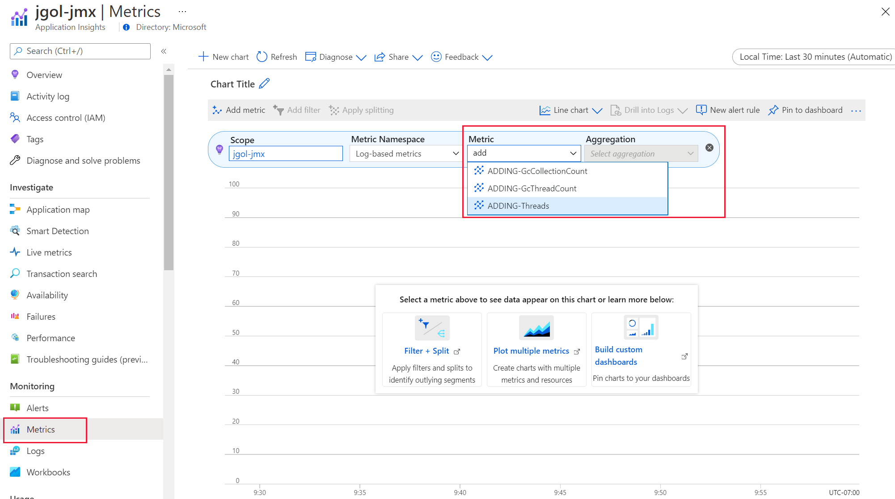

# Configuring JMX metrics

Application Insights Java 3.x collects some of the JMX metrics by default, but in many cases this is not enough. This document describes the JMX configuration option in details.

## How do I collect additional JMX metrics?

JMX metrics collection can be configured by adding a ```"jmxMetrics"``` section to the applicationinsights.json file. You can specify the name of the metric the way you want it to appear in Azure portal in application insights resource. Object name and attribute are required for each of the metrics you want collected.

## How do I know what metrics are available to configure?

You nailed it - you must know the object names and the attributes, those properties are different for various libraries, frameworks, and application servers, and are often not well documented. Luckily, it's easy to find exactly what JMX metrics are supported for your particular environment.

To view the available metrics, set the self-diagnostics level to `DEBUG` in your `applicationinsights.json` configuration file, for example:

```json
{
  "selfDiagnostics": {
    "level": "DEBUG"
  }
}
```

The available JMX metrics, with the object names and attribute names will appear in the application insights log file.

The output in the log file will look similar to the example below. In some cases the list can be quite extensive.
> [!div class="mx-imgBorder"]
> 


## Configuration example

Knowing what metrics are available, you can configure the agent to collect those. The first one is an example of a nested metric - `LastGcInfo` that has several properties, and we want to capture the `GcThreadCount`.

```json
"jmxMetrics": [
      {
        "name": "Demo - GC Thread Count",
        "objectName": "java.lang:type=GarbageCollector,name=PS MarkSweep",
        "attribute": "LastGcInfo.GcThreadCount"
      },
      {
        "name": "Demo - GC Collection Count",
        "objectName": "java.lang:type=GarbageCollector,name=PS MarkSweep",
        "attribute": "CollectionCount"
      },
      {
        "name": "Demo - Thread Count",
        "objectName": "java.lang:type=Threading",
        "attribute": "ThreadCount"
      }
],
```

## Types of collected metrics and available configuration options?

We support numeric and boolean JMX metrics, while other types aren't supported and will be ignored. 

Currently, the wildcards and aggregated attributes aren't supported, that's why every attribute 'object name'/'attribute' pair must be configured separately. 


## Where do I find the JMX Metrics in application insights?

As your application is running and the JMX metrics are collected, you can view them by going to Azure portal and navigate to your application insights resource. Under Metrics tab, select the dropdown as shown below to view the metrics.

> [!div class="mx-imgBorder"]
> 
