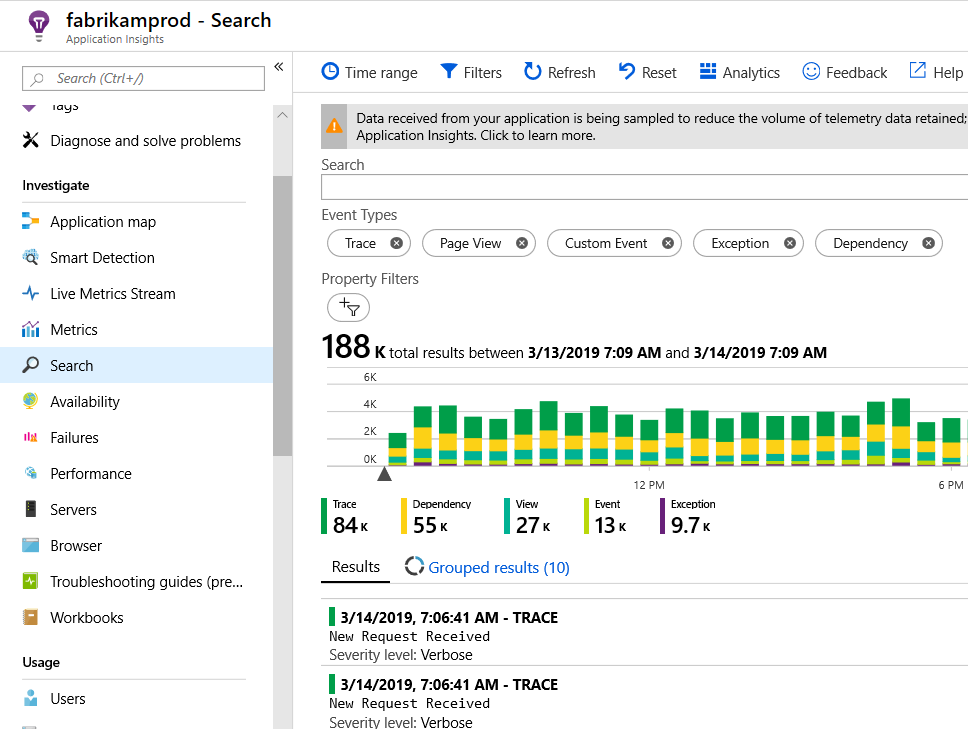

# Explore Java trace logs in Application Insights
If you're using Logback or Log4J (v1.2 or v2.0) for tracing, you can have your trace logs sent automatically to Application Insights where you can explore and search on them.

> [!TIP]
> You only need to set your Application Insights Instrumentation Key once for your application. If you are using a framework like Java Spring, you may have already registered the key elsewhere in your app's configuration.

## Using the Application Insights Java agent

By default, the Application Insights Java agent automatically captures logging performed at `WARN` level and above.

You can change the threshold of logging that is captured using the `AI-Agent.xml` file:

```xml
<?xml version="1.0" encoding="utf-8"?>
<ApplicationInsightsAgent>
   <Instrumentation>
      <BuiltIn>
         <Logging threshold="info"/>
      </BuiltIn>
   </Instrumentation>
</ApplicationInsightsAgent>
```

You can disable the Java agent's logging capture using the `AI-Agent.xml` file:

```xml
<?xml version="1.0" encoding="utf-8"?>
<ApplicationInsightsAgent>
   <Instrumentation>
      <BuiltIn>
         <Logging enabled="false"/>
      </BuiltIn>
   </Instrumentation>
</ApplicationInsightsAgent>
```

## Alternatively (as opposed to using the Java agent), you can follow the instructions below

### Install the Java SDK

Follow the instructions to install [Application Insights SDK for Java][java], if you haven't already done that.

### Add logging libraries to your project
*Choose the appropriate way for your project.*

#### If you're using Maven...
If your project is already set up to use Maven for build, merge one of the following snippets of code into your pom.xml file.

Then refresh the project dependencies, to get the binaries downloaded.

*Logback*

```XML

    <dependencies>
       <dependency>
          <groupId>com.microsoft.azure</groupId>
          <artifactId>applicationinsights-logging-logback</artifactId>
          <version>[2.0,)</version>
       </dependency>
    </dependencies>
```

*Log4J v2.0*

```XML

    <dependencies>
       <dependency>
          <groupId>com.microsoft.azure</groupId>
          <artifactId>applicationinsights-logging-log4j2</artifactId>
          <version>[2.0,)</version>
       </dependency>
    </dependencies>
```

*Log4J v1.2*

```XML

    <dependencies>
       <dependency>
          <groupId>com.microsoft.azure</groupId>
          <artifactId>applicationinsights-logging-log4j1_2</artifactId>
          <version>[2.0,)</version>
       </dependency>
    </dependencies>
```

#### If you're using Gradle...
If your project is already set up to use Gradle for build, add one of the following lines to the `dependencies` group in your build.gradle file:

Then refresh the project dependencies, to get the binaries downloaded.

**Logback**

```

    compile group: 'com.microsoft.azure', name: 'applicationinsights-logging-logback', version: '2.0.+'
```

**Log4J v2.0**

```
    compile group: 'com.microsoft.azure', name: 'applicationinsights-logging-log4j2', version: '2.0.+'
```

**Log4J v1.2**

```
    compile group: 'com.microsoft.azure', name: 'applicationinsights-logging-log4j1_2', version: '2.0.+'
```

#### Otherwise ...
Follow the guidelines to manually install Application Insights Java SDK, download the jar (After arriving at Maven Central Page click on 'jar' link in download section) for appropriate appender and add the downloaded appender jar to the project.

| Logger | Download | Library |
| --- | --- | --- |
| Logback |[Logback appender Jar](https://search.maven.org/#search%7Cga%7C1%7Ca%3A%22applicationinsights-logging-logback%22) |applicationinsights-logging-logback |
| Log4J v2.0 |[Log4J v2 appender Jar](https://search.maven.org/#search%7Cga%7C1%7Ca%3A%22applicationinsights-logging-log4j2%22) |applicationinsights-logging-log4j2 |
| Log4j v1.2 |[Log4J v1.2 appender Jar](https://search.maven.org/#search%7Cga%7C1%7Ca%3A%22applicationinsights-logging-log4j1_2%22) |applicationinsights-logging-log4j1_2 |


### Add the appender to your logging framework
To start getting traces, merge the relevant snippet of code to the Log4J or Logback configuration file: 

*Logback*

```XML

    <appender name="aiAppender" 
      class="com.microsoft.applicationinsights.logback.ApplicationInsightsAppender">
        <instrumentationKey>[APPLICATION_INSIGHTS_KEY]</instrumentationKey>
    </appender>
    <root level="trace">
      <appender-ref ref="aiAppender" />
    </root>
```

*Log4J v2.0*

```XML

    <Configuration packages="com.microsoft.applicationinsights.log4j.v2">
      <Appenders>
        <ApplicationInsightsAppender name="aiAppender" instrumentationKey="[APPLICATION_INSIGHTS_KEY]" />
      </Appenders>
      <Loggers>
        <Root level="trace">
          <AppenderRef ref="aiAppender"/>
        </Root>
      </Loggers>
    </Configuration>
```

*Log4J v1.2*

```XML

    <appender name="aiAppender" 
         class="com.microsoft.applicationinsights.log4j.v1_2.ApplicationInsightsAppender">
        <param name="instrumentationKey" value="[APPLICATION_INSIGHTS_KEY]" />
    </appender>
    <root>
      <priority value ="trace" />
      <appender-ref ref="aiAppender" />
    </root>
```

The Application Insights appenders can be referenced by any configured logger, and not necessarily by the root logger (as shown in the code samples above).

## Explore your traces in the Application Insights portal
Now that you've configured your project to send traces to Application Insights, you can view and search these traces in the Application Insights portal, in the [Search][diagnostic] blade.

Exceptions submitted via loggers will be displayed on the portal as Exception Telemetry.



## Next steps
[Diagnostic search][diagnostic]

<!--Link references-->

[diagnostic]: ../../azure-monitor/app/diagnostic-search.md
[java]: java-get-started.md


