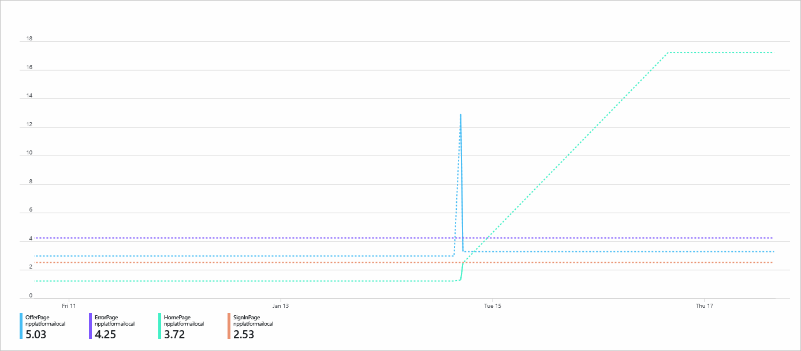
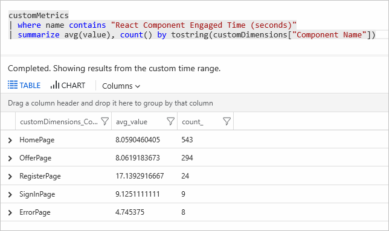

# React plug-in for Application Insights JavaScript SDK

The React plug-in for the Application Insights JavaScript SDK enables:

- Tracking of route changes.
- React components usage statistics.

## Get started

Install the npm package:

```bash

npm install @microsoft/applicationinsights-react-js @microsoft/applicationinsights-web --save

```

## Basic usage

Initialize a connection to Application Insights:

[!INCLUDE [azure-monitor-log-analytics-rebrand](../../../includes/azure-monitor-instrumentation-key-deprecation.md)]

```javascript
import React from 'react';
import { ApplicationInsights } from '@microsoft/applicationinsights-web';
import { ReactPlugin, withAITracking } from '@microsoft/applicationinsights-react-js';
import { createBrowserHistory } from "history";
const browserHistory = createBrowserHistory({ basename: '' });
var reactPlugin = new ReactPlugin();
var appInsights = new ApplicationInsights({
    config: {
        connectionString: 'YOUR_CONNECTION_STRING_GOES_HERE',
        extensions: [reactPlugin],
        extensionConfig: {
          [reactPlugin.identifier]: { history: browserHistory }
        }
    }
});
appInsights.loadAppInsights();
```

Wrap your component with the higher-order component function to enable Application Insights on it:

```javascript
import React from 'react';
import { withAITracking } from '@microsoft/applicationinsights-react-js';
import { reactPlugin, appInsights } from './AppInsights';

// To instrument various React components usage tracking, apply the `withAITracking` higher-order
// component function.

class MyComponent extends React.Component {
    ...
}

// withAITracking takes 4 parameters (reactPlugin, Component, ComponentName, className). 
// The first two are required and the other two are optional.

export default withAITracking(reactPlugin, MyComponent);
```

For `react-router v6` or other scenarios where router history isn't exposed, Application Insights configuration `enableAutoRouteTracking` can be used to auto-track router changes:

```javascript
var reactPlugin = new ReactPlugin();
var appInsights = new ApplicationInsights({
    config: {
        connectionString: 'YOUR_CONNECTION_STRING_GOES_HERE',
        enableAutoRouteTracking: true,
        extensions: [reactPlugin]
    }
});
appInsights.loadAppInsights();
```

## Configuration

| Name    | Default | Description                                                                                                    |
|---------|---------|----------------------------------------------------------------------------------------------------------------|
| history | null    | React router history. For more information, see the [React router package documentation](https://reactrouter.com/web/api/history). To learn how to access the history object outside of components, see the [React router FAQ](https://github.com/ReactTraining/react-router/blob/master/FAQ.md#how-do-i-access-the-history-object-outside-of-components).    |

### React components usage tracking

To instrument various React components usage tracking, apply the `withAITracking` higher-order component function.

It measures time from the `ComponentDidMount` event through the `ComponentWillUnmount` event. To make the result more accurate, it subtracts the time in which the user was idle by using `React Component Engaged Time = ComponentWillUnmount timestamp - ComponentDidMount timestamp - idle time`.

To see this metric in the Azure portal, go to the Application Insights resource and select the **Metrics** tab. Configure the empty charts to display the custom metric name `React Component Engaged Time (seconds)`. Select the aggregation (for example, sum or avg) of your metric and split by `Component Name`.



You can also run custom queries to divide Application Insights data to generate reports and visualizations as per your requirements. In the Azure portal, go to the Application Insights resource, select **Analytics** from the **Overview** tab, and run your query.



> [!NOTE]
> It can take up to 10 minutes for new custom metrics to appear in the Azure portal.

## Use React Hooks

[React Hooks](https://reactjs.org/docs/hooks-reference.html) are an approach to state and lifecycle management in a React application without relying on class-based React components. The Application Insights React plug-in provides several Hooks integrations that operate in a similar way to the higher-order component approach.

### Use React Context

The React Hooks for Application Insights are designed to use [React Context](https://reactjs.org/docs/context.html) as a containing aspect for it. To use Context, initialize Application Insights, and then import the Context object:

```javascript
import React from "react";
import { AppInsightsContext } from "@microsoft/applicationinsights-react-js";
import { reactPlugin } from "./AppInsights";

const App = () => {
    return (
        <AppInsightsContext.Provider value={reactPlugin}>
            /* your application here */
        </AppInsightsContext.Provider>
    );
};
```

This Context Provider makes Application Insights available as a `useContext` Hook within all children components of it:

```javascript
import React from "react";
import { useAppInsightsContext } from "@microsoft/applicationinsights-react-js";

const MyComponent = () => {
    const appInsights = useAppInsightsContext();
    const metricData = {
        average: engagementTime,
        name: "React Component Engaged Time (seconds)",
        sampleCount: 1
      };
    const additionalProperties = { "Component Name": 'MyComponent' };
    appInsights.trackMetric(metricData, additionalProperties);
    
    return (
        <h1>My Component</h1>
    );
}
export default MyComponent;
```

### useTrackMetric

The `useTrackMetric` Hook replicates the functionality of the `withAITracking` higher-order component, without adding another component to the component structure. The Hook takes two arguments. First is the Application Insights instance, which can be obtained from the `useAppInsightsContext` Hook. The second is an identifier for the component for tracking, such as its name.

```javascript
import React from "react";
import { useAppInsightsContext, useTrackMetric } from "@microsoft/applicationinsights-react-js";

const MyComponent = () => {
    const appInsights = useAppInsightsContext();
    const trackComponent = useTrackMetric(appInsights, "MyComponent");
    
    return (
        <h1 onHover={trackComponent} onClick={trackComponent}>My Component</h1>
    );
}
export default MyComponent;
```

It operates like the higher-order component, but it responds to Hooks lifecycle events rather than a component lifecycle. The Hook needs to be explicitly provided to user events if there's a need to run on particular interactions.

### useTrackEvent

The `useTrackEvent` Hook is used to track any custom event that an application might need to track, such as a button click or other API call. It takes four arguments:

-   Application Insights instance, which can be obtained from the `useAppInsightsContext` Hook.
-   Name for the event.
-   Event data object that encapsulates the changes that have to be tracked.
-   skipFirstRun (optional) flag to skip calling the `trackEvent` call on initialization. The default value is set to `true` to mimic more closely the way the non-Hook version works. With `useEffect` Hooks, the effect is triggered on each value update _including_ the initial setting of the value. As a result, tracking starts too early, which causes potentially unwanted events to be tracked.

```javascript
import React, { useState, useEffect } from "react";
import { useAppInsightsContext, useTrackEvent } from "@microsoft/applicationinsights-react-js";

const MyComponent = () => {
    const appInsights = useAppInsightsContext();
    const [cart, setCart] = useState([]);
    const trackCheckout = useTrackEvent(appInsights, "Checkout", cart);
    const trackCartUpdate = useTrackEvent(appInsights, "Cart Updated", cart);
    useEffect(() => {
        trackCartUpdate({ cartCount: cart.length });
    }, [cart]);
    
    const performCheckout = () => {
        trackCheckout();
        // submit data
    };
    
    return (
        <div>
            <ul>
                <li>Product 1 <button onClick={() => setCart([...cart, "Product 1"])}>Add to Cart</button></li>
                <li>Product 2 <button onClick={() => setCart([...cart, "Product 2"])}>Add to Cart</button></li>
                <li>Product 3 <button onClick={() => setCart([...cart, "Product 3"])}>Add to Cart</button></li>
                <li>Product 4 <button onClick={() => setCart([...cart, "Product 4"])}>Add to Cart</button></li>
            </ul>
            <button onClick={performCheckout}>Checkout</button>
        </div>
    );
}

export default MyComponent;
```

When the Hook is used, a data payload can be provided to it to add more data to the event when it's stored in Application Insights.

## React error boundaries

[Error boundaries](https://reactjs.org/docs/error-boundaries.html) provide a way to gracefully handle an exception when it occurs within a React application. When such an error occurs, it's likely that the exception needs to be logged. The React plug-in for Application Insights provides an error boundary component that automatically logs the error when it occurs.

```javascript
import React from "react";
import { reactPlugin } from "./AppInsights";
import { AppInsightsErrorBoundary } from "@microsoft/applicationinsights-react-js";

const App = () => {
    return (
        <AppInsightsErrorBoundary onError={() => <h1>I believe something went wrong</h1>} appInsights={reactPlugin}>
            /* app here */
        </AppInsightsErrorBoundary>
    );
};
```

The `AppInsightsErrorBoundary` requires two props to be passed to it. They're the `ReactPlugin` instance created for the application and a component to be rendered when an error occurs. When an unhandled error occurs, `trackException` is called with the information provided to the error boundary, and the `onError` component appears.

## Enable correlation

Correlation generates and sends data that enables distributed tracing and powers the [application map](../app/app-map.md), [end-to-end transaction view](../app/app-map.md#go-to-details), and other diagnostic tools.

In JavaScript, correlation is turned off by default to minimize the telemetry we send by default. To enable correlation, see the [JavaScript client-side correlation documentation](./javascript.md#enable-distributed-tracing).

### Route tracking

The React plug-in automatically tracks route changes and collects other React-specific telemetry.

> [!NOTE]
> `enableAutoRouteTracking` should be set to `false`. If it's set to `true`, then when the route changes, duplicate `PageViews` can be sent.

For `react-router v6` or other scenarios where router history isn't exposed, you can add `enableAutoRouteTracking: true` to your [setup configuration](#basic-usage).

### PageView

If a custom `PageView` duration isn't provided, `PageView` duration defaults to a value of `0`.

## Sample app

Check out the [Application Insights React demo](https://github.com/Azure-Samples/application-insights-react-demo).

## Next steps

- To learn more about the JavaScript SDK, see the [Application Insights JavaScript SDK documentation](javascript.md).
- To learn about the Kusto Query Language and querying data in Log Analytics, see the [Log query overview](../../azure-monitor/logs/log-query-overview.md).
