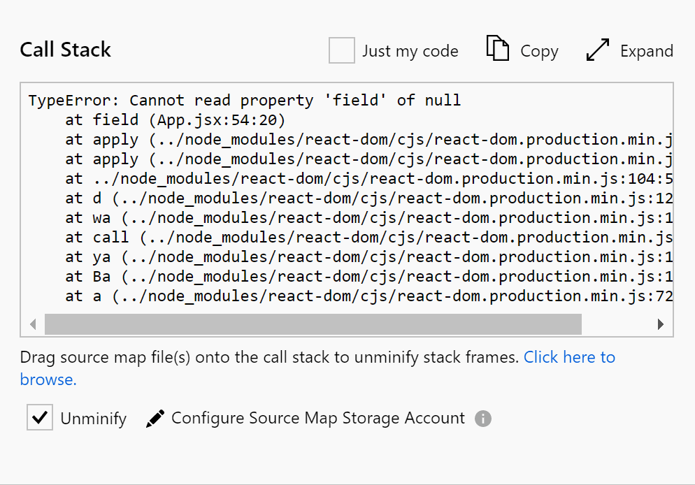
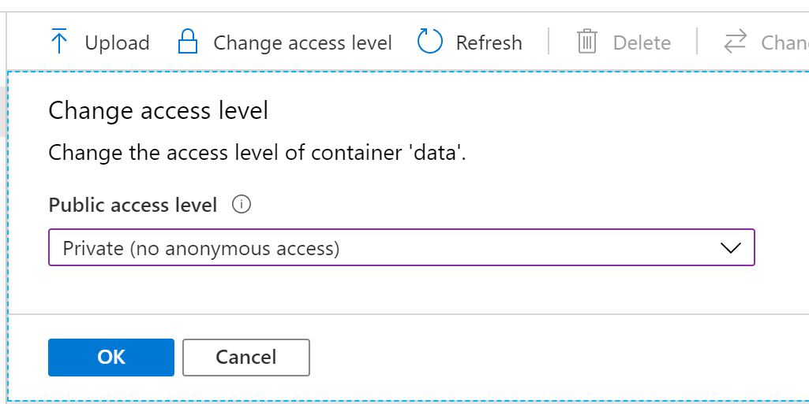
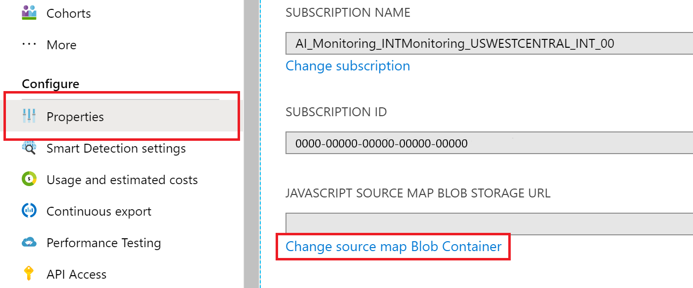

# Microsoft Azure Monitor Application Insights JavaScript SDK configuration

The Azure Application Insights JavaScript SDK provides configuration for tracking, monitoring, and debugging your web applications.

> [!div class="checklist"]
> - [SDK configuration](#sdk-configuration)
> - [Cookie management and configuration](#cookie-management)
> - [Source map un-minify support](#source-map)
> - [Tree shaking optimized code](#tree-shaking)

## SDK configuration

These configuration fields are optional and default to false unless otherwise stated.

For instructions on how to add SDK configuration, see [Add SDK configuration](./javascript-sdk.md#optional-add-sdk-configuration).

| Name | Type | Default |
|------|------|---------|
| accountId<br><br>An optional account ID, if your app groups users into accounts. No spaces, commas, semicolons, equals, or vertical bars | string | null |
| addRequestContext<br><br>Provide a way to enrich dependencies logs with context at the beginning of api call. Default is undefined. You need to check if `xhr` exists if you configure `xhr` related context. You need to check if `fetch request` and `fetch response` exist if you configure `fetch` related context. Otherwise you may not get the data you need. | (requestContext: IRequestionContext) => {[key: string]: any} | undefined |
| ajaxPerfLookupDelay<br><br>Defaults to 25 ms. The amount of time to wait before reattempting to find the windows.performance timings for an Ajax request, time is in milliseconds and is passed directly to setTimeout(). | numeric | 25 |
| appId<br><br>AppId is used for the correlation between AJAX dependencies happening on the client-side with the server-side requests. When Beacon API is enabled, it can't be used automatically, but can be set manually in the configuration. Default is null | string | null |
| autoTrackPageVisitTime<br><br>If true, on a pageview, the _previous_ instrumented page's view time is tracked and sent as telemetry and a new timer is started for the current pageview. It's sent as a custom metric named `PageVisitTime` in `milliseconds` and is calculated via the Date [now()](https://developer.mozilla.org/docs/Web/JavaScript/Reference/Global_Objects/Date/now) function (if available) and falls back to (new Date()).[getTime()](https://developer.mozilla.org/docs/Web/JavaScript/Reference/Global_Objects/Date/getTime) if now() is unavailable (IE8 or less). Default is false. | boolean | false |
| convertUndefined<br><br>Provide user an option to convert undefined field to user defined value. | `any` | undefined |
| cookieCfg<br><br>Defaults to cookie usage enabled see [ICookieCfgConfig](#cookie-management) settings for full defaults. | [ICookieCfgConfig](#cookie-management)<br>[Optional]<br>(Since 2.6.0) | undefined |
| cookieDomain<br><br>Custom cookie domain. It's helpful if you want to share Application Insights cookies across subdomains.<br>(Since v2.6.0) If `cookieCfg.domain` is defined it takes precedence over this value. | alias for [`cookieCfg.domain`](#cookie-management)<br>[Optional] | null |
| cookiePath<br><br>Custom cookie path. It's helpful if you want to share Application Insights cookies behind an application gateway.<br>If `cookieCfg.path` is defined, it takes precedence. | alias for [`cookieCfg.path`](#cookie-management)<br>[Optional]<br>(Since 2.6.0) | null |
| correlationHeaderDomains<br><br>Enable correlation headers for specific domains | string[] | undefined |
| correlationHeaderExcludedDomains<br><br>Disable correlation headers for specific domains | string[] | undefined |
| correlationHeaderExcludePatterns<br><br>Disable correlation headers using regular expressions | regex[] | undefined |
| createPerfMgr<br><br>Callback function that will be called to create a IPerfManager instance when required and ```enablePerfMgr``` is enabled, it enables you to override the default creation of a PerfManager() without needing to ```setPerfMgr()``` after initialization. | (core: IAppInsightsCore, notificationManager: INotificationManager) => IPerfManager | undefined |
| customHeaders<br><br>The ability for the user to provide extra headers when using a custom endpoint. customHeaders aren't added on browser shutdown moment when beacon sender is used. And adding custom headers isn't supported on IE9 or earlier. | `[{header: string, value: string}]` | undefined |
| diagnosticLogInterval<br><br>(internal) Polling interval (in ms) for internal logging queue | numeric | 10000 |
| disableAjaxTracking<br><br>If true, Ajax calls aren't autocollected. Default is false. | boolean | false |
| disableCookiesUsage<br><br>Default false. A boolean that indicates whether to disable the use of cookies by the SDK. If true, the SDK doesn't store or read any data from cookies.<br>(Since v2.6.0) If `cookieCfg.enabled` is defined it takes precedence. Cookie usage can be re-enabled after initialization via the core.getCookieMgr().setEnabled(true). | alias for [`cookieCfg.enabled`](#cookie-management)<br>[Optional] | false |
| disableCorrelationHeaders<br><br>If false, the SDK adds two headers ('Request-Id' and 'Request-Context') to all dependency requests to correlate them with corresponding requests on the server side. Default is false. | boolean | false |
| disableDataLossAnalysis<br><br>If false, internal telemetry sender buffers are checked at startup for items not yet sent. | boolean | true |
| disableExceptionTracking<br><br>If true, exceptions aren't autocollected. Default is false. | boolean | false |
| disableFetchTracking<br><br>The default setting for `disableFetchTracking` is `false`, meaning it's enabled. However, in versions prior to 2.8.10, it was disabled by default. When set to `true`, Fetch requests aren't automatically collected. The default setting changed from `true` to `false` in version 2.8.0. | boolean | false |
| disableFlushOnBeforeUnload<br><br>Default false. If true, flush method isn't called when onBeforeUnload event triggers | boolean | false |
| disableIkeyDeprecationMessage<br><br>Disable instrumentation Key deprecation error message. If true, error messages are NOT sent. | boolean | true |
| disableInstrumentationKeyValidation<br><br>If true, instrumentation key validation check is bypassed. Default value is false. | boolean | false |
| disableTelemetry<br><br>If true, telemetry isn't collected or sent. Default is false. | boolean | false |
| disableXhr<br><br>Don't use XMLHttpRequest or XDomainRequest (for IE < 9) by default instead attempt to use fetch() or sendBeacon. If no other transport is available, it uses XMLHttpRequest | boolean | false |
| distributedTracingMode<br><br>Sets the distributed tracing mode. If AI_AND_W3C mode or W3C mode is set, W3C trace context headers (traceparent/tracestate) are generated and included in all outgoing requests. AI_AND_W3C is provided for back-compatibility with any legacy Application Insights instrumented services. | numeric or `DistributedTracingModes` | `DistributedTracing Modes.AI_AND_W3C` |
| enableAjaxErrorStatusText<br><br>Default false. If true, include response error data text boolean in dependency event on failed AJAX requests. | boolean | false |
| enableAjaxPerfTracking<br><br>Default false. Flag to enable looking up and including extra browser window.performance timings in the reported Ajax (XHR and fetch) reported metrics. | boolean | false |
| enableAutoRouteTracking<br><br>Automatically track route changes in Single Page Applications (SPA). If true, each route change sends a new Pageview to Application Insights. Hash route changes (`example.com/foo#bar`) are also recorded as new page views.<br>***Note***: If you enable this field, don't enable the `history` object for [React router configuration](./javascript-framework-extensions.md?tabs=react#track-router-history) because you'll get multiple page view events. | boolean | false |
| enableCorsCorrelation<br><br>If true, the SDK adds two headers ('Request-Id' and 'Request-Context') to all CORS requests to correlate outgoing AJAX dependencies with corresponding requests on the server side. Default is false | boolean | false |
| enableDebug<br><br>If true, **internal** debugging data is thrown as an exception **instead** of being logged, regardless of SDK logging settings. Default is false. <br>***Note:*** Enabling this setting results in dropped telemetry whenever an internal error occurs. It can be useful for quickly identifying issues with your configuration or usage of the SDK. If you don't want to lose telemetry while debugging, consider using `loggingLevelConsole` or `loggingLevelTelemetry` instead of `enableDebug`. | boolean | false |
| enablePerfMgr<br><br>When enabled (true) it creates local perfEvents for code that has been instrumented to emit perfEvents (via the doPerf() helper). It can be used to identify performance issues within the SDK based on your usage or optionally within your own instrumented code. | boolean | false |
| enableRequestHeaderTracking<br><br>If true, AJAX & Fetch request headers is tracked, default is false. If ignoreHeaders isn't configured, Authorization and X-API-Key headers aren't logged. | boolean | false |
| enableResponseHeaderTracking<br><br>If true, AJAX & Fetch request's response headers is tracked, default is false. If ignoreHeaders isn't configured, WWW-Authenticate header isn't logged. | boolean | false |
| enableSessionStorageBuffer<br><br>Default true. If true, the buffer with all unsent telemetry is stored in session storage. The buffer is restored on page load | boolean | true |
| enableUnhandledPromiseRejectionTracking<br><br>If true, unhandled promise rejections are autocollected as a JavaScript error. When disableExceptionTracking is true (don't track exceptions), the config value is ignored and unhandled promise rejections aren't reported. | boolean | false |
| eventsLimitInMem<br><br>The number of events that can be kept in memory before the SDK starts to drop events when not using Session Storage (the default). | number | 10000 |
| excludeRequestFromAutoTrackingPatterns<br><br>Provide a way to exclude specific route from automatic tracking for XMLHttpRequest or Fetch request. If defined, for an Ajax / fetch request that the request url matches with the regex patterns, auto tracking is turned off. Default is undefined. | string[] \| RegExp[] | undefined |
| featureOptIn<br><br>Set Feature opt in details.<br><br>This configuration field is only available in version 3.0.3 and later. | IFeatureOptIn | undefined |
| idLength<br><br>Identifies the default length used to generate new random session and user IDs. Defaults to 22, previous default value was 5 (v2.5.8 or less), if you need to keep the previous maximum length you should set the value to 5. | numeric | 22 |
| ignoreHeaders<br><br>AJAX & Fetch request and response headers to be ignored in log data. To override or discard the default, add an array with all headers to be excluded or an empty array to the configuration. | string[] | ["Authorization", "X-API-Key", "WWW-Authenticate"] |
| isBeaconApiDisabled<br><br>If false, the SDK sends all telemetry using the [Beacon API](https://www.w3.org/TR/beacon) | boolean | true |
| isBrowserLinkTrackingEnabled<br><br>Default is false. If true, the SDK tracks all [Browser Link](/aspnet/core/client-side/using-browserlink) requests. | boolean | false |
| isRetryDisabled<br><br>Default false. If false, retry on 206 (partial success), 408 (timeout), 429 (too many requests), 500 (internal server error), 503 (service unavailable), and 0 (offline, only if detected) | boolean | false |
| isStorageUseDisabled<br><br>If true, the SDK doesn't store or read any data from local and session storage. Default is false. | boolean | false |
| loggingLevelConsole<br><br>Logs **internal** Application Insights errors to console. <br>0: off, <br>1: Critical errors only, <br>2: Everything (errors & warnings) | numeric | 0 |
| loggingLevelTelemetry<br><br>Sends **internal** Application Insights errors as telemetry. <br>0: off, <br>1: Critical errors only, <br>2: Everything (errors & warnings) | numeric | 1 |
| maxAjaxCallsPerView<br><br>Default 500 - controls how many Ajax calls are monitored per page view. Set to -1 to monitor all (unlimited) Ajax calls on the page. | numeric | 500 |
| maxAjaxPerfLookupAttempts<br><br>Defaults to 3. The maximum number of times to look for the window.performance timings (if available) is required. Not all browsers populate the window.performance before reporting the end of the XHR request. For fetch requests, it's added after it's complete. | numeric | 3 |
| maxBatchInterval<br><br>How long to batch telemetry for before sending (milliseconds) | numeric | 15000 |
| maxBatchSizeInBytes<br><br>Max size of telemetry batch. If a batch exceeds this limit, it's immediately sent and a new batch is started | numeric | 10000 |
| namePrefix<br><br>An optional value that is used as name postfix for localStorage and session cookie name. | string | undefined |
| onunloadDisableBeacon<br><br>Default false. when tab is closed, the SDK sends all remaining telemetry using the [Beacon API](https://www.w3.org/TR/beacon) | boolean | false |
| onunloadDisableFetch<br><br>If fetch keepalive is supported don't use it for sending events during unload, it may still fall back to fetch() without keepalive | boolean | false |
| overridePageViewDuration<br><br>If true, default behavior of trackPageView is changed to record end of page view duration interval when trackPageView is called. If false and no custom duration is provided to trackPageView, the page view performance is calculated using the navigation timing API. Default is false. | boolean | false |
| perfEvtsSendAll<br><br>When _enablePerfMgr_ is enabled and the [IPerfManager](https://github.com/microsoft/ApplicationInsights-JS/blob/master/shared/AppInsightsCore/src/JavaScriptSDK.Interfaces/IPerfManager.ts) fires a [INotificationManager](https://github.com/microsoft/ApplicationInsights-JS/blob/master/shared/AppInsightsCore/src/JavaScriptSDK.Interfaces/INotificationManager.ts).perfEvent() this flag determines whether an event is fired (and sent to all listeners) for all events (true) or only for 'parent' events (false &lt;default&gt;).<br />A parent [IPerfEvent](https://github.com/microsoft/ApplicationInsights-JS/blob/master/shared/AppInsightsCore/src/JavaScriptSDK.Interfaces/IPerfEvent.ts) is an event where no other IPerfEvent is still running at the point of the event being created and its _parent_ property isn't null or undefined. Since v2.5.7 | boolean | false |
| samplingPercentage<br><br>Percentage of events that is sent. Default is 100, meaning all events are sent. Set it if you wish to preserve your data cap for large-scale applications. | numeric | 100 |
| sdkExtension<br><br>Sets the SDK extension name. Only alphabetic characters are allowed. The extension name is added as a prefix to the 'ai.internal.sdkVersion' tag (for example, 'ext_javascript:2.0.0'). Default is null. | string | null |
| sessionCookiePostfix<br><br>An optional value that is used as name postfix for session cookie name. If undefined, namePrefix is used as name postfix for session cookie name. | string | undefined |
| sessionExpirationMs<br><br>A session is logged if it has continued for this amount of time in milliseconds. Default is 24 hours | numeric | 86400000 |
| sessionRenewalMs<br><br>A session is logged if the user is inactive for this amount of time in milliseconds. Default is 30 minutes | numeric | 1800000 |
| throttleMgrCfg<br><br>Set throttle mgr configuration by key.<br><br>This configuration field is only available in version 3.0.3 and later. | `{[key: number]: IThrottleMgrConfig}` | undefined |
| userCookiePostfix<br><br>An optional value that is used as name postfix for user cookie name. If undefined, no postfix is added on user cookie name. | string | undefined |

## Cookie management

Starting from version 2.6.0, the Azure Application Insights JavaScript SDK provides instance-based cookie management that can be disabled and re-enabled after initialization.

If you disabled cookies during initialization using the `disableCookiesUsage` or `cookieCfg.enabled` configurations, you can re-enable them using the `setEnabled` function of the [ICookieMgr object](https://microsoft.github.io/ApplicationInsights-JS/webSdk/applicationinsights-core-js/interfaces/ICookieMgr.html).

The instance-based cookie management replaces the previous CoreUtils global functions of `disableCookies()`, `setCookie()`, `getCookie()`, and `deleteCookie()`.

To take advantage of the tree-shaking enhancements introduced in version 2.6.0, it's recommended to no longer use the global functions.

### Cookie configuration

ICookieMgrConfig is a cookie configuration for instance-based cookie management added in 2.6.0. The options provided allow you to enable or disable the use of cookies by the SDK. You can also set custom cookie domains and paths and customize the functions for fetching, setting, and deleting cookies.

The ICookieMgrConfig options are defined in the following table.

| Name | Type | Default | Description |
|------|------|---------|-------------|
| enabled | boolean | true | The current instance of the SDK uses this boolean to indicate whether the use of cookies is enabled. If false, the instance of the SDK initialized by this configuration doesn't store or read any data from cookies. |
| domain | string | null | Custom cookie domain. It's helpful if you want to share Application Insights cookies across subdomains. If not provided uses the value from root `cookieDomain` value. |
| path | string | / | Specifies the path to use for the cookie, if not provided it uses any value from the root `cookiePath` value. |
| ignoreCookies | string[] | undefined | Specify the cookie name(s) to be ignored, it causes any matching cookie name to never be read or written. They may still be explicitly purged or deleted. You don't need to repeat the name in the `blockedCookies` configuration. (since v2.8.8)
| blockedCookies | string[] | undefined | Specify the cookie name(s) to never write. It prevents creating or updating any cookie name, but they can still be read unless also included in the ignoreCookies. They may still be purged or deleted explicitly. If not provided, it defaults to the same list in ignoreCookies. (Since v2.8.8)
| getCookie | `(name: string) => string` | null | Function to fetch the named cookie value, if not provided it uses the internal cookie parsing / caching. |
| setCookie | `(name: string, value: string) => void` | null | Function to set the named cookie with the specified value, only called when adding or updating a cookie. |
| delCookie | `(name: string, value: string) => void` | null | Function to delete the named cookie with the specified value, separated from setCookie to avoid the need to parse the value to determine whether the cookie is being added or removed. If not provided it uses the internal cookie parsing / caching. |

## Source map

Source map support helps you debug minified JavaScript code with the ability to unminify the minified callstack of your exception telemetry.

> [!div class="checklist"]
> - Compatible with all current integrations on the **Exception Details** panel
> - Supports all current and future JavaScript SDKs, including Node.JS, without the need for an SDK upgrade

### Link to Blob Storage account

Application Insights supports the uploading of source maps to your Azure Storage account blob container. You can use source maps to unminify call stacks found on the **End-to-end transaction details** page. You can also use source maps to unminify any exception sent by the [JavaScript SDK][ApplicationInsights-JS] or the [Node.js SDK][ApplicationInsights-Node.js].



#### Create a new storage account and blob container

If you already have an existing storage account or blob container, you can skip this step.

1. [Create a new storage account][create storage account].
1. [Create a blob container][create blob container] inside your storage account. Set **Public access level** to **Private** to ensure that your source maps aren't publicly accessible.

    > [!div class="mx-imgBorder"]
    >

#### Push your source maps to your blob container

Integrate your continuous deployment pipeline with your storage account by configuring it to automatically upload your source maps to the configured blob container.

You can upload source maps to your Azure Blob Storage container with the same folder structure they were compiled and deployed with. A common use case is to prefix a deployment folder with its version, for example, `1.2.3/static/js/main.js`. When you unminify via an Azure blob container called `sourcemaps`, the pipeline tries to fetch a source map located at `sourcemaps/1.2.3/static/js/main.js.map`.

##### Upload source maps via Azure Pipelines (recommended)

If you're using Azure Pipelines to continuously build and deploy your application, add an [Azure file copy][azure file copy] task to your pipeline to automatically upload your source maps.

> [!div class="mx-imgBorder"]
> 

#### Configure your Application Insights resource with a source map storage account

You have two options for configuring your Application Insights resource with a source map storage account.

##### End-to-end transaction details tab

From the **End-to-end transaction details** tab, select **Unminify**. Configure your resource if it's unconfigured.

1. In the Azure portal, view the details of an exception that's minified.
1. Select **Unminify**.
1. If your resource isn't configured, configure it.

##### Properties tab

To configure or change the storage account or blob container that's linked to your Application Insights resource:

1. Go to the **Properties** tab of your Application Insights resource.
1. Select **Change source map Blob Container**.
1. Select a different blob container as your source map container.
1. Select **Apply**.

> [!div class="mx-imgBorder"]
> 

### View the unminified callstack
 
To view the unminified callstack, select an Exception Telemetry item in the Azure portal, find the source maps that match the call stack, and drag and drop the source maps onto the call stack in the Azure portal. The source map must have the same name as the source file of a stack frame, but with a `map` extension.

If you experience issues that involve source map support for JavaScript applications, see [Troubleshoot source map support for JavaScript applications](/troubleshoot/azure/azure-monitor/app-insights/javascript-sdk-troubleshooting#troubleshoot-source-map-support-for-javascript-applications).

:::image type="content" source="media/javascript-sdk-configuration/javascript-sdk-advanced-unminify.gif" alt-text="Animation demonstrating unminify feature.":::

## Tree shaking

Tree shaking eliminates unused code from the final JavaScript bundle.

To take advantage of tree shaking, import only the necessary components of the SDK into your code. By doing so, unused code isn't included in the final bundle, reducing its size and improving performance.

### Tree shaking enhancements and recommendations

In version 2.6.0, we deprecated and removed the internal usage of these static helper classes to improve support for tree-shaking algorithms. It lets npm packages safely drop unused code.

- `CoreUtils`
- `EventHelper`
- `Util`
- `UrlHelper`
- `DateTimeUtils`
- `ConnectionStringParser`

 The functions are now exported as top-level roots from the modules, making it easier to refactor your code for better tree-shaking.

The static classes were changed to const objects that reference the new exported functions, and future changes are planned to further refactor the references.

### Tree shaking deprecated functions and replacements

This section only applies to you if you're using the deprecated functions and you want to optimize package size. We recommend using the replacement functions to reduce size and support all the versions of Internet Explorer.

| Existing | Replacement |
|----------|-------------|
| **CoreUtils** | **@microsoft/applicationinsights-core-js** |
| CoreUtils._canUseCookies | None. Don't use as it causes all of CoreUtils reference to be included in your final code.<br> Refactor your cookie handling to use the `appInsights.getCookieMgr().setEnabled(true/false)` to set the value and `appInsights.getCookieMgr().isEnabled()` to check the value. |
| CoreUtils.isTypeof | isTypeof |
| CoreUtils.isUndefined | isUndefined |
| CoreUtils.isNullOrUndefined | isNullOrUndefined |
| CoreUtils.hasOwnProperty | hasOwnProperty |
| CoreUtils.isFunction | isFunction |
| CoreUtils.isObject | isObject |
| CoreUtils.isDate | isDate |
| CoreUtils.isArray | isArray |
| CoreUtils.isError | isError |
| CoreUtils.isString | isString |
| CoreUtils.isNumber | isNumber |
| CoreUtils.isBoolean | isBoolean |
| CoreUtils.toISOString | toISOString or getISOString |
| CoreUtils.arrForEach | arrForEach |
| CoreUtils.arrIndexOf | arrIndexOf |
| CoreUtils.arrMap | arrMap |
| CoreUtils.arrReduce | arrReduce |
| CoreUtils.strTrim | strTrim |
| CoreUtils.objCreate | objCreateFn |
| CoreUtils.objKeys | objKeys |
| CoreUtils.objDefineAccessors | objDefineAccessors |
| CoreUtils.addEventHandler | addEventHandler |
| CoreUtils.dateNow | dateNow |
| CoreUtils.isIE | isIE |
| CoreUtils.disableCookies | disableCookies<br>Referencing either causes CoreUtils to be referenced for backward compatibility.<br> Refactor your cookie handling to use the `appInsights.getCookieMgr().setEnabled(false)` |
| CoreUtils.newGuid | newGuid |
| CoreUtils.perfNow | perfNow |
| CoreUtils.newId | newId |
| CoreUtils.randomValue | randomValue |
| CoreUtils.random32 | random32 |
| CoreUtils.mwcRandomSeed | mwcRandomSeed |
| CoreUtils.mwcRandom32 | mwcRandom32 |
| CoreUtils.generateW3CId | generateW3CId |
| **EventHelper** | **@microsoft/applicationinsights-core-js** |
| EventHelper.Attach | attachEvent |
| EventHelper.AttachEvent | attachEvent |
| EventHelper.Detach | detachEvent |
| EventHelper.DetachEvent |  detachEvent |
| **Util** | **@microsoft/applicationinsights-common-js** |
| Util.NotSpecified | strNotSpecified |
| Util.createDomEvent | createDomEvent |
| Util.disableStorage | utlDisableStorage |
| Util.isInternalApplicationInsightsEndpoint | isInternalApplicationInsightsEndpoint |
| Util.canUseLocalStorage | utlCanUseLocalStorage |
| Util.getStorage | utlGetLocalStorage |
| Util.setStorage | utlSetLocalStorage |
| Util.removeStorage | utlRemoveStorage |
| Util.canUseSessionStorage | utlCanUseSessionStorage |
| Util.getSessionStorageKeys | utlGetSessionStorageKeys |
| Util.getSessionStorage | utlGetSessionStorage |
| Util.setSessionStorage | utlSetSessionStorage |
| Util.removeSessionStorage | utlRemoveSessionStorage |
| Util.disableCookies | disableCookies<br>Referencing either causes CoreUtils to be referenced for backward compatibility.<br> Refactor your cookie handling to use the `appInsights.getCookieMgr().setEnabled(false)` |
| Util.canUseCookies | canUseCookies<br>Referencing either causes CoreUtils to be referenced for backward compatibility.<br>Refactor your cookie handling to use the `appInsights.getCookieMgr().isEnabled()` |
| Util.disallowsSameSiteNone | uaDisallowsSameSiteNone |
| Util.setCookie | coreSetCookie<br>Referencing causes CoreUtils to be referenced for backward compatibility.<br>Refactor your cookie handling to use the `appInsights.getCookieMgr().set(name: string, value: string)` |
| Util.stringToBoolOrDefault | stringToBoolOrDefault |
| Util.getCookie | coreGetCookie<br>Referencing causes CoreUtils to be referenced for backward compatibility.<br>Refactor your cookie handling to use the `appInsights.getCookieMgr().get(name: string)` |
| Util.deleteCookie | coreDeleteCookie<br>Referencing causes CoreUtils to be referenced for backward compatibility.<br>Refactor your cookie handling to use the `appInsights.getCookieMgr().del(name: string, path?: string)` |
| Util.trim | strTrim |
| Util.newId | newId |
| Util.random32 | ---<br>No replacement, refactor your code to use the core random32(true) |
| Util.generateW3CId | generateW3CId |
| Util.isArray | isArray |
| Util.isError | isError |
| Util.isDate | isDate |
| Util.toISOStringForIE8 | toISOString |
| Util.getIEVersion | getIEVersion |
| Util.msToTimeSpan | msToTimeSpan |
| Util.isCrossOriginError | isCrossOriginError |
| Util.dump | dumpObj |
| Util.getExceptionName | getExceptionName |
| Util.addEventHandler | attachEvent |
| Util.IsBeaconApiSupported | isBeaconApiSupported |
| Util.getExtension | getExtensionByName
| **UrlHelper** | **@microsoft/applicationinsights-common-js** |
| UrlHelper.parseUrl | urlParseUrl |
| UrlHelper.getAbsoluteUrl | urlGetAbsoluteUrl |
| UrlHelper.getPathName | urlGetPathName |
| UrlHelper.getCompeteUrl | urlGetCompleteUrl |
| UrlHelper.parseHost | urlParseHost |
| UrlHelper.parseFullHost | urlParseFullHost
| **DateTimeUtils** | **@microsoft/applicationinsights-common-js** |
| DateTimeUtils.Now | dateTimeUtilsNow |
| DateTimeUtils.GetDuration | dateTimeUtilsDuration |
| **ConnectionStringParser** | **@microsoft/applicationinsights-common-js** |
| ConnectionStringParser.parse | parseConnectionString |

## Service notifications

Service notifications is a feature built into the SDK to provide actionable recommendations to help ensure your telemetry flows uninterrupted to Application Insights. You will see the notifications as an exception message within Application Insights. We ensure notifications are relevant to you based on your SDK settings, and we adjust the verbosity based on the urgency of the recommendation. We recommend leaving service notifications on, but you are able to opt out via the `featureOptIn` configuration. See below for a list of active notifications.

Currently, no active notifications are being sent.

## Troubleshooting

See the dedicated [troubleshooting article](/troubleshoot/azure/azure-monitor/app-insights/javascript-sdk-troubleshooting).

## Frequently asked questions

This section provides answers to common questions.

### How can I update my third-party server configuration for the JavaScript SDK?

The server side needs to be able to accept connections with those headers present. Depending on the `Access-Control-Allow-Headers` configuration on the server side, it's often necessary to extend the server-side list by manually adding `Request-Id`, `Request-Context`, and `traceparent` (W3C distributed header).

Access-Control-Allow-Headers: `Request-Id`, `traceparent`, `Request-Context`, `<your header>`

### How can I disable distributed tracing for the JavaScript SDK?

Distributed tracing can be disabled in configuration.

### Are the HTTP 502 and 503 responses always captured by Application Insights?

No. The "502 bad gateway" and "503 service unavailable" errors aren't always captured by Application Insights. If only client-side JavaScript is being used for monitoring, this behavior would be expected because the error response is returned prior to the page containing the HTML header with the monitoring JavaScript snippet being rendered.
          
If the 502 or 503 response was sent from a server with server-side monitoring enabled, the errors are collected by the Application Insights SDK.
          
Even when server-side monitoring is enabled on an application's web server, sometimes a 502 or 503 error isn't captured by Application Insights. Many modern web servers don't allow a client to communicate directly. Instead, they employ solutions like reverse proxies to pass information back and forth between the client and the front-end web servers.
          
In this scenario, a 502 or 503 response might be returned to a client because of an issue at the reverse proxy layer, so it isn't captured out-of-box by Application Insights. To help detect issues at this layer, you might need to forward logs from your reverse proxy to Log Analytics and create a custom rule to check for 502 or 503 responses. To learn more about common causes of 502 and 503 errors, see [Troubleshoot HTTP errors of "502 bad gateway" and "503 service unavailable" in Azure App Service](../../app-service/troubleshoot-http-502-http-503.md).

## Next steps

* [Track usage](usage-overview.md)
* [Custom events and metrics](api-custom-events-metrics.md)
* [Build-measure-learn](usage-overview.md)
* [Azure file copy task](/azure/devops/pipelines/tasks/deploy/azure-file-copy)

<!-- Remote URLs -->
[create storage account]: ../../storage/common/storage-account-create.md?toc=%2Fazure%2Fstorage%2Fblobs%2Ftoc.json&tabs=azure-portal
[create blob container]: ../../storage/blobs/storage-quickstart-blobs-portal.md
[storage blob data reader]: ../../role-based-access-control/built-in-roles.md#storage-blob-data-reader
[ApplicationInsights-JS]: https://github.com/microsoft/applicationinsights-js
[ApplicationInsights-Node.js]: https://github.com/microsoft/applicationinsights-node.js
[azure file copy]: https://aka.ms/azurefilecopyreadme