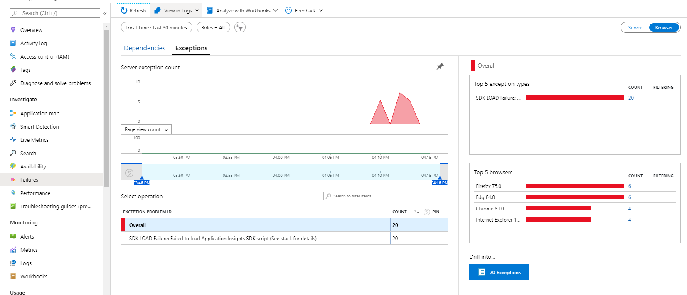
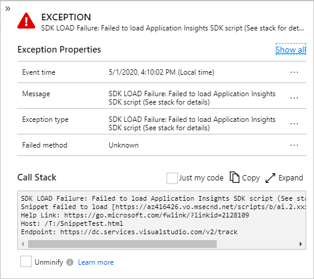

# Troubleshooting SDK load failure for JavaScript web apps

<!-- 
Editor Note: This link name above "SDK Load Failure" has a direct references by https://go.microsoft.com/fwlink/?linkid=2128109 which is embedded in the snippet and from the JavaScript Page. If you change this text you MUST also update these references.
-->

The SDK load failure exception is created and reported by the JavaScript snippet (v3 or later) when it detects that the SDK script failed to download or initialize. Simplistically, your end users' client (browser) was unable to download the Application Insights SDK, or initialize from the identified hosting page and therefore no telemetry or events will be reported.



> [!NOTE]
> This exception is supported on all major browsers that support the fetch() API or XMLHttpRequest. This excludes IE 8 and below, so you will not get this type of exception reported from those browsers (unless your environment includes a fetch polyfill).



The stack details include the basic information with the URLs being used by the end user.

| Name                      | Description                                                                                                  |
|---------------------------|--------------------------------------------------------------------------------------------------------------|
| &lt;CDN&nbsp;Endpoint&gt; | The URL that was used (and failed) to download the SDK.                                                      |
| &lt;Help&nbsp;Link&gt;    | A URL that links to troubleshooting documentation (this page).                                              |
| &lt;Host&nbsp;URL&gt;     | The complete URL of the page that the end user was using.                                                    |
| &lt;Endpoint&nbsp;URL&gt; | The URL that was used to report the exception, this value may be helpful in identifying whether the hosting page was accessed from the public internet or a private cloud.

The most common reasons for this exception to occur:

- Intermittent network connectivity failure.
- Application Insights CDN outage.
- SDK failed to initialize after loading the script.
- Application Insights JavaScript CDN has been blocked.

[Intermittent network connectivity failure](#intermittent-network-connectivity-failure) is the most common reason for this exception, especially in mobile roaming scenarios where the users lose network connectivity intermittently.

The following sections will describe how to troubleshoot each potential root cause of this error.

> [!NOTE]
> Several of the troubleshooting steps assume that your application has direct control of the Snippet &lt;script /&gt; tag and it's configuration that are returned as part of the hosting HTML page. If you don't then those identified steps will not apply for your scenario.

## Intermittent network connectivity failure

**If the user is experiencing intermittent network connectivity failures, then there are fewer possible solutions and they will generally resolve themselves over a short period of time.** For example, if the user reloads your site (refreshes the page)  the files will (eventually) get downloaded and cached locally until an updated version is released.

> [!NOTE]
> If this exception is persistent and is occurring across many of your users (diagnosed by a rapid and sustained level of this exception being reported) along with a reduction in normal client telemetry, then intermittent network connectivity issues is _not-likely_ to be the true cause of the problem and you should continue diagnosing with the other known possible issues.

With this situation hosting the SDK on your own CDN is unlikely to provide or reduce the occurrences of this exception, as your own CDN will be affected by the same issue.

The same is also true when using the SDK via NPM packages solution. However, from the end users perspective when this occurs your entire application fails to load/initialize (rather than _just_ the telemetry SDK - which they don't see visually), so they will most likely refresh your site until is loads completely.

You can also try to use [NPM packages](#use-npm-packages-to-embed-the-application-insight-sdk) to embed the Application Insights SDK.

To minimize intermittent network connectivity failure, we have implemented Cache-Control headers on all of the CDN files so that once the end user's browser has downloaded the current version of the SDK it will not need to download again and the browser will reuse the previously obtained copy (see [how caching works](https://docs.microsoft.com/azure/cdn/cdn-how-caching-works)). If the caching check fails or there has been a new release, then your end user's browser will need to download the updated version. So you may see a background level of _"noise"_ in the check failure scenario or a temporary spike when a new release occurs and is made generally available (deployed to the CDN).
 
## Application Insights CDN outage

You can confirm if there is an Application Insights CDN outage by attempting to access the CDN endpoint directly from the browser (for example, https://az416426.vo.msecnd.net/scripts/b/ai.2.min.js) from a different location than your end users' probably from your own development machine (assuming that your organization has not blocked this domain).

If you confirm there is an outage, you can [create a new support ticket](https://azure.microsoft.com/support/create-ticket/) or try changing the URL used to download the SDK.

### Change the CDN endpoint
  
As the snippet and its configuration are returned by your application as part of each generated page, you can change the snippet `src` configuration to use a different URL for the SDK. By using this approach, you could bypass the CDN blocked issue as the new URL should not be blocked.

Current Application Insights JavaScript SDK CDN endpoints
- https://az416426.vo.msecnd.net/scripts/b/ai.2.min.js
- https://js.monitor.azure.com/scripts/b/ai.2.min.js

> [!NOTE]
> The https://js.monitor.azure.com/ endpoint is an alias that allows us to switch between CDN providers within approximately 5 minutes, without the need for you to change any config. This is to enable us to fix detected CDN related issues more rapidly if a CDN provider is having regional or global issues without requiring everyone to adjust their settings.

## SDK failed to initialize after loading the script

When the SDK fails to initialize, the &lt;script /&gt; was successfully downloaded from the CDN but it fails during initialization. This can be because of missing or invalid dependencies or some form of JavaScript exception.

The first thing to check is whether the SDK was successfully downloaded, if the script was NOT downloaded then this scenario is __not__ the cause of the SDK load failure exception.

Quick check: Using a browser that supports developer tools (F12), validate on the network tab that the script defined in the ```src``` snippet configuration was downloaded with a response code of 200 (success) or a 304 (not changed). You could also use a tool like fiddler to review the network traffic.

The sections below includes different reporting options, it will recommend either creating a support ticket or raising an issue on GitHub.

 Basic reporting rules:

- If the issue is only affecting a small number of users and a specific or subset of browser version(s) (check the details on the reported exception), then it's likely an end user or environment only issue, which will probably require your application to provide additional `polyfill` implementations. For these, [file an issue on GitHub](https://github.com/Microsoft/ApplicationInsights-JS/issues).
- If this issue is affecting your entire application and all of your users are affected, then it's probably a release related issue and therefore you should [create a new support ticket](https://azure.microsoft.com/support/create-ticket/).

### JavaScript exceptions

First lets check for JavaScript exceptions, using a browser that supports developer tools (F12) load the page and review if any exceptions occurred.

If there are exceptions being reported in the SDK script (for example ai.2.min.js), then this may indicate that the configuration passed into the SDK contains unexpected or missing required configuration or a faulty release has been deployed to the CDN.

To check for faulty configuration, change the configuration passed into the snippet (if not already) so that it only includes your instrumentation key as a string value.

> src: "https://az416426.vo.msecnd.net/scripts/b/ai.2.min.js",<br />
> cfg:{<br />
> instrumentationKey: "INSTRUMENTATION_KEY"<br />
> }});<br />

If when using this minimal configuration you are still seeing a JavaScript exception in the SDK script, [create a new support ticket](https://azure.microsoft.com/support/create-ticket/) as this will require the faulty build to be rolled back as it's probably an issue with a newly deployed version.

If the exception disappears, then the issue is likely caused by a type mismatch or unexpected value. Start adding your configuration options back one-by-one and test until the exception occurs again. Then check the documentation for the item causing the issue. If the documentation is unclear or you need assistance, [file an issue on GitHub](https://github.com/Microsoft/ApplicationInsights-JS/issues).

If your configuration was previously deployed and working but just started reporting this exception, then it may be an issue with a newly deployed version, check whether it is affecting only a small set of your users / browser and either [file an issue on GitHub](https://github.com/Microsoft/ApplicationInsights-JS/issues) or  [create a new support ticket](https://azure.microsoft.com/support/create-ticket/).

### Enable console debugging

Assuming there are no exceptions being thrown the next step is to enabling console debugging by adding the `loggingLevelConsole` setting to the configuration, this will send all initialization errors and warnings to the browsers console (normally available via the developer tools (F12)). Any reported errors should be self-explanatory and if you need further assistance [file an issue on GitHub](https://github.com/Microsoft/ApplicationInsights-JS/issues).

> cfg:{<br />
> instrumentationKey: "INSTRUMENTATION_KEY",<br />
> loggingLevelConsole: 2<br />
> }});<br />

> [!NOTE]
> During initialization the SDK performs some basic checks for known major dependencies. If these are not provided by the current runtime it will report the failures out as warning messages to the console, but only if the `loggingLevelConsole` is greater than zero.

If it still fails to initialize, try enabling the ```enableDebug``` configuration setting. This will cause all internal errors to be thrown as an exception (which will cause telemetry to be lost). As this is a developer only setting it will probably get noisy with exceptions getting thrown as part of some internal checks, so you will need to review each exception to determine which issue is causing the SDK to fail. Use the non-minified version of the script (note the extension below it's ".js" and not ".min.js") otherwise the exceptions will be unreadable.

> [!WARNING]
> This is a developer only setting and should NEVER be enabled in a full production environment as you will lose telemetry.

> src: "https://az416426.vo.msecnd.net/scripts/b/ai.2.js",<br />
> cfg:{<br />
> instrumentationKey: "INSTRUMENTATION_KEY",<br />
> enableDebug: true<br />
> }});<br />

If this still does not provide any insights, you should [file an issue on GitHub](https://github.com/Microsoft/ApplicationInsights-JS/issues) with the details and an example site if you have one. Include the browser version, operating system, and JS framework details to help identify the issue.

## The Application Insights JavaScript CDN has been blocked

The CDN being blocked is possible when an Application Insights JavaScript SDK CDN endpoint has been reported and/or identified as being unsafe. When this occurs, it will cause the endpoint to be publicly block-listed and consumers of these lists will begin to block all access.

To resolve, it requires the owner of the CDN endpoint to work with the block-listing entity that has marked the endpoint as unsafe so that it can be removed from the relevant list.

Check if the CDN endpoint has been identified as unsafe.
- [Google Transparency Report](https://transparencyreport.google.com/safe-browsing/search)
- [VirusTotal](https://www.virustotal.com/gui/home/url)
- [Sucuri SiteCheck](https://sitecheck.sucuri.net/)

Depending on the frequency that the application, firewall, or environment update their local copies of these lists, it may take a considerable amount of time and/or require manual intervention by end users or corporate IT departments to force an update or explicitly allow the CDN endpoints to resolve the issue.

If the CDN endpoint is identified as unsafe, [create a support ticket](https://azure.microsoft.com/support/create-ticket/) to ensure that the issue is resolved as soon as possible.

To *potentially* bypass this issue more rapidly, you can [change the SDK CDN endpoint](#change-the-cdn-endpoint).

### Application Insights JavaScript CDN is blocked (by end user - blocked by browser; installed blocker; personal firewall)

Check if your end users have:

- Installed a browser plug-in (typically some form of ad, malware, or popup blocker).
- Blocked (or not allowed) the Application Insights CDN endpoints in their browser or proxy.
- Configured a firewall rule that is causing the CDN domain for the SDK to be blocked (or the DNS entry to not be resolved).

If they have configured any of these options, you will need to work with them (or provide documentation) to allow the CDN endpoints.

It is possible that the plug-in they have installed is using the public blocklist. If that is not the case, then it's most likely some other manually configured solution or it's using a private domain blocklist.

#### Add exceptions for CDN endpoints

Work with your end users or provide documentation informing them that they should allow scripts from the Application Insights CDN endpoints to be downloaded by including them in their browser's plug-in or firewall rule exception list (will vary based on the end user's environment).

Here is an example of how to configure [Chrome to allow or block access to websites.](https://support.google.com/chrome/a/answer/7532419?hl=en)

### Application Insights CDN is blocked (by corporate firewall)

If your end users are on a corporate network, then it's most likely their firewall solution and that their IT department has implemented some form of internet filtering system. In this case, you will need to work with them to allow the necessary rules for your end users.

#### Add exceptions for CDN endpoints for corporations

  This is similar to [adding exceptions for end users](#add-exceptions-for-cdn-endpoints), but you will need to work with the company's IT department to have them configure the Application Insights CDN endpoints to be downloaded by including (or removing) them in any domain block-listing or allow-listing services.

  > [!WARNING]
  > If your corporate user is using a [private cloud](https://azure.microsoft.com/overview/what-is-a-private-cloud/) and they cannot enable any form of exception to provide their internal users with public access for the CDN endpoints then you will need to use the [Application Insights NPM packages](https://www.npmjs.com/package/applicationinsights) or host the Application Insights SDK on your own CDN.  

### Additional troubleshooting for blocked CDN

> [!NOTE]
> If your users are using a [private cloud](https://azure.microsoft.com/overview/what-is-a-private-cloud/) and they do not have access to the public internet you will need to host the SDK on your own CDN or use NPM packages.

#### Host the SDK on your own CDN

 Rather than your end users downloading the Application Insights SDK from the public CDN you could host the Application Insights SDK from your own CDN endpoint. It is recommended that you use a specific version (ai.2.#.#.min.js) so that it's easier to identify which version you are using. Also update it on a regular basis to the current version (ai.2.min.js) so you can leverage any bug fixes and new features that become available.

#### Use NPM packages to embed the Application Insight SDK

Rather than using the snippet and public CDN endpoints you could use the [NPM packages](https://www.npmjs.com/package/applicationinsights) to include the SDK as part of your own JavaScript files. The SDK will become just another package within your own scripts.

> [!NOTE]
> It is recommended that when using NPM packages you should also use some form of [JavaScript bundler](https://www.bing.com/search?q=javascript+bundler) to assist with code splitting and minification.

As with the snippet, it is also possible that your own scripts (with or without using the SDK NPM packages) could be affected by the same blocking issues listed here, so depending on your application, your users, and your framework you may want to consider implementing something similar to the logic in the snippet to detect and report these issues.


## Next steps 
- [Get additional help by filing an issue on GitHub](https://github.com/Microsoft/ApplicationInsights-JS/issues)
- [Monitor web page usage](javascript.md)