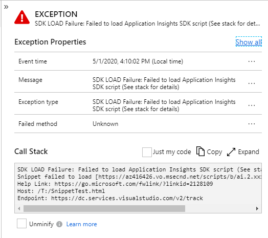

# Troubleshooting and Q and A for Application Insights for JavaScript web apps
Questions or problems with [Application Insights for web pages][javascript]? Here are some tips.

## SDK Load Failure

__SDK Load Failure: Failed to load Application Insights SDK script (see stack for details)__

This reported browser exception is created and reported by the snippet (v3 or later) when it detects that the primary SDK script either failed to download or failed to initialize. Simplistically, this means that your end-users client (browser) was unable to download the Application Insights SDK and/or initialize from the identified hosting page and therefore no telemetry or events (other than this exception) will be reported.

> [!NOTE]
> This exception is supported on all major browsers that support the fetch() API or XMLHttpRequest, this therefore explicitly excludes IE 8 and below, so you will not get this type of exception reported from those browsers (unless your environment includes a fetch polyfill).

**What does this exception mean?**

There are many possible reasons for this exception to be reported, we will cover some of the known issues as well the details to diagnose the root cause of the problem.

The stack details includes the basic information with the URLs being used by the end-user and is formatted as below

> SDK LOAD Failure: Failed to load Application Insights SDK script (See stack for details) 
> Snippet failed to load [__&lt;CDN Endpoint&gt;__] -- Telemetry is disabled 
> Help Link: __&lt;Help Link&gt;__ 
> Host: __&lt;Host URL&gt;__ 
> Endpoint: __&lt;Endpoint URL&gt;__ 

| 
Name
 | Description
|----------------------|------------
| &lt;CDN Endpoint&gt; | This is the complete URL that was used (and failed) to download the SDK
| &lt;Help Link&gt;    | A help link URL that links to this page
| &lt;Host URL&gt;     | The complete URL of the page that the end-user was using
| &lt;Endpoint URL&gt; | This is the URL that was used to report the exception, this value may be helpful in identifying whether the hosting page was accessed from the public internet or a private cloud.

### Why did this exception occur?

There are many possible reasons for this exception to be reported, and the most common ones are described below with links to corresponding troubleshooting steps.

> [!NOTE]
> Several of the Troubleshooting steps assume that your application has direct control of the Snippet &lt;script /&gt; tag and it's configuration that is returned as part of the hosting HTML page. If you don't then those identified steps will not apply for your scenario.

### The Application Insights JS CDN has been blocked

While this is typically NOT the cause for this exception, we recommend you rule it out first since there are limited options for you or your end-users and may require immediate external assistance.

#### Troubleshooting

- [Check if the CDN is blacklisted](#cdn-blacklisted)
- [Change the URL used to download the SDK](#change-the-cdn-endpoint)
- [Host the SDK on you own CDN](#host-sdk)
- [Use NPM packages to embed the Application Insights SDK](#use-npm).

### Intermittent network connectivity failure

This is the most common reason for seeing this exception, though it may seem largely out of the developers control. It's especially common in a mobile roaming scenario where the user looses network connectivity intermittently.

To minimize this we have implemented Cache-Control headers on all of the CDN files so that once the end-users browser has downloaded the current version of the SDK they should not need to re-download the entire file again and instead it will re-use the previously obtained copy (see [How caching works](https://docs.microsoft.com/en-us/azure/cdn/cdn-how-caching-works)). If the caching check fails or there has been a new release then your end-users browser will need and download the updated version, so you may see a background level of _"noise"_ in the check failure scenario or a temporary spike when a new release occurs and is made generally available (deployed to the CDN). 

If this exception is persistent and is occurring across many of your users (diagnosed by a rapid and sustained level of this exception being reported) along with a reduction in normal client telemetry, then intermittent network connectivity issues is _not-likely_ to be the true cause of the problem and you should continue diagnosing with the other known possible issues below.

#### Troubleshooting

- [Intermittent Network failure](#intermittent-network-failure)
- [Use NPM packages to embed the Application Insights SDK](#use-npm).

> [!NOTE]
> Due to the caching headers on the CDN files and depending on how often and when your users access your site, not all of them will attempt to download the newer version at the same point in time, so reports may be staggered.

### Application Insights JS CDN is blocked (by End-User - blacklisted by browser; installed blocker; Personal firewall)

Check if your end-users have installed a browser plug-in (typically some form of Ad/Malware/Popup blocker); blocked (or not white-listed) the Application Insights CDN endpoint in their browser or proxy; or configured a firewall rule which is causing the CDN domain for the SDK to be blocked (or the DNS entry to not be resolved), if they have any of these configured you will need to work with them (or provide documentation) to allow the CDN endpoints.

It is also possible that the plug-in they have installed is using the [public blacklist](#cdn-blacklisted), which is why that option is listed first, if you get here then it's most likely some other manually configured solution or it's using a private blacklist.

#### Troubleshooting

- [Add exceptions for CDN endpoints](#add-exceptions-for-cdn-endpoints)
- [Check if CDN has been blacklisted](#cdn-blacklisted)
- [Host the SDK on you own CDN](#host-sdk)
- [Use NPM packages to embed the Application Insights SDK](#use-npm).

> [!NOTE] 
> For this exception to be reported, they would not be blocking the reporting endpoint (otherwise you would not see the exception).

### Application Insights CDN is blocked (by Corporate firewall)

If your end-users are on a corporate network then they are most likely behind some form of firewall solution and it's likely that their IT department has implemented some form of internet filtering system. In this case you will need to work with them to allow the necessary rules for your end-users.

#### Troubleshooting

- [Add exceptions for CDN endpoints for corporations](#corporate-exceptions-for-cdn-endpoints)
- [Check if CDN has been blacklisted](#cdn-blacklisted)
- [Host the SDK on you own CDN](#host-sdk)
- [Use NPM packages to embed the Application Insights SDK](#use-npm).

> [!NOTE]
> For this exception to be reported, they would not be blocking the reporting endpoint (otherwise you would not see the exception).

### Application Insights CDN outage

You can confirm this scenario by simply attempting to access the CDN endpoint directly from the browser (eg. https://az416426.vo.msecnd.net/scripts/b/ai.2.min.js) from a different location to that of your end-users (probably from you own development machine -- assuming that your organization has not blocked this domain).

#### Troubleshooting

- [Create a support ticket](https://azure.microsoft.com/en-us/support/create-ticket/) with details of the outage and the CDN endpoint that is experiencing the issue. 
- [Change the URL used to download the SDK](#change-the-cdn-endpoint)

>

> -------------------------------------------
> <h3 style="text-align: center"><b>SDK Load Failure: Troubleshooting steps</b></h3>
>
> ### Intermittent Network Failure
>
>> If the user is experiencing intermittent network connectivity failures, then there are fewer possible solutions and they will generally resolve themselves over a short period of time. For example, if the end-user simple reloads your site the files will (eventually) get downloaded and once this occurs they should be cached locally until an updated version is released.
>>
>> With this situation [Hosting the SDK on you own CDN](#host-sdk) is unlikely to provide or reduce this occurrences, as your own CDN will be affect by the same issue.
>>
>> The same is also true when [using the SDK via NPM packages](#use-npm) solution, however, from the end-users perspective when this occurs your entire application fails to load / initialize (rather than _just_ just the telemetry SDK -- which they don't see visually), so they will most likely refresh your site until is loads completely.
>>
> -------------------------------------------
> ### Add Exceptions for CDN endpoints
>
>> Work with your end-users or provide documentation informing them that they should allow scripts from the Application Insights CDN endpoints to be downloaded by including them in their browsers plug-in or firewall rule exception list, this will vary based on the end-users environment.
>>
>> Here is an example of how this may be configured within [Chrome to allow or block access to websites](https://support.google.com/chrome/a/answer/7532419?hl=en)
> -------------------------------------------
> ### Corporate Exceptions for CDN endpoints
>
>> This is similar to [adding exceptions for end-users](add-exceptions-for-cdn-endpoints), but you will need to work with your end-users IT department to have them configure the Application Insights CDN endpoints to be downloaded by including (or removing) them in any black or white list.
>>
>> __Special Note:__ If the your corporate user is using a [private cloud](https://azure.microsoft.com/overview/what-is-a-private-cloud/) and they cannot enable any form of exception to provide their internal users with public access for the CDN endpoints then you will need to [use the NPM packages](#use-npm) or [host the Application Insights SDK on your own CDN](#host-sdk).
> -------------------------------------------
> ### Use NPM
> 
>> Rather than using the snippet and public CDN endpoints you could can use the NPM packages to include the SDK as part of your own JavaScript files. With this approach the SDK will become just another package within your own scripts. Note: It is recommended that when using this approach, you should also use some form of [javascript bundler](https://www.bing.com/search?q=javascript+bundler) to assist with code splitting and minification.
>>
>> As with the snippet, it is also possible that your own scripts (with or without using the SDK NPM packages) could be affected by the same blocking issues listed here, so depending on your application; users and framework you may want to consider implementing something similar to logic in the snippet to detect and report these issues.
>>
>> Note: You will need to use this approach (or [Host the SDK on you own CDN](#host-sdk)) if your users are using a [private cloud](https://azure.microsoft.com/overview/what-is-a-private-cloud/) as they most likely will not have access to the public internet.
> -------------------------------------------
> ### Host SDK
> 
>> Rather than your end-users downloading the Application Insights SDK from the public CDN you could host the Application Insights SDK from your own CDN endpoint. If using this approach it is recommended that you use a specific version (ai.2.#.#.min.js) so that it's easier to identify which version you are using, it is also recommended that update it on a regular basis to the current version (ai.2.min.js) so you can leverage any bug fixes and new features that become available.
>>
>> Note: You will need to use this approach (or [Use NPM packages](#use-npm)) if your users are using a [private cloud](https://azure.microsoft.com/overview/what-is-a-private-cloud/) as they most likely will not have access to the public internet.
> -------------------------------------------
> ### CDN Blacklisted
> 
>> This situation is possible when an Application Insights JS SDK CDN endpoint has been reported and/or identified as being unsafe for some reason. When this occurs it will cause the endpoint to be publicly blacklisted and consumers of these blacklists will begin to block all access.
Resolving this requires the owner of the CDN endpoint to work with the blacklisting entity that has marked the endpoint as unsafe so that it can be removed from the relevant list. 
>> 
>> Check if the CDN endpoint has been identified as unsafe.
>> - [Google Transparency Report](https://transparencyreport.google.com/safe-browsing/search)
>> - [VirusTotal](https://www.virustotal.com/gui/home/url)
>> - [Sucuri SiteCheck](https://sitecheck.sucuri.net/)
>> 
>> Depending on the frequency that the application; firewall or environment update their local copies of these blacklists, it may take a considerable amount of time and/or require manual intervention by end-users or corporate IT departments to force an update or explicitly whitelist the CDN endpoints to resolve the issue. 
>>
>> If the CDN endpoint is identified as unsafe please [create a support ticket](#create-a-support-ticket) with the required details to ensure that the issue is resolved as soon as possible. 
>>
>> You may also want to consider [changing the SDK CDN endpoint](#change-the-cdn-endpoint) to _potentially_ bypass this issue more rapidly.
> -------------------------------------------
> ### Change the CDN endpoint
>
>> As the snippet and it's configuration is returned by your application as part of each generated page, you can change the snippet `src` configuration to use a different URL for the SDK. By using approach you could bypass the [CDN Blacklisted](#cdn-blacklisted) issue as the new URL should not be blocked.
>>
>> Current Application Insights JavaScript SDK CDN endpoints
>> - https://az416426.vo.msecnd.net/scripts/b/ai.2.min.js
>> - https://js.monitor.azure/com/scripts/b/ai.2.min.js
>>
>> __Note:__ The https://js.monitor.azure/ endpoint is an alias that allows us to switch between CDN providers within approximately 5 minutes, without the need for you to change any config. This is to enable us to fix detected CDN related issues more rapidly if a CDN provider is having regional or global issues without requiring everyone to adjust their settings.
>>
> ---
> ### Create a support ticket
> 
>> Use the Azure Support portal to [create a new support ticket](https://azure.microsoft.com/en-us/support/create-ticket/) with details of the outage.
>>
>> __Please include__ :-
>>>  1. If the detected failure is caused by blacklisting from a public Anti-virus or blacklist provider, please include details of the provider. This will help in reducing the time required to get the issue resolved;
>>>  2. Checks / Validations that you have already performed;
>>>  3. The timeframe(s) of the reported issues;
>>>  4. The Expected SDK version # to be downloaded;
>>>  5. Stack details from the reported exception (as it includes the CDN endpoint, the hosting page URL and the endpoint used to report the exception);
> ---

## Get help

* [File an issue on GitHub](https://github.com/Microsoft/ApplicationInsights-JS/issues)

<!--Link references-->

[javascript]: javascript.md
