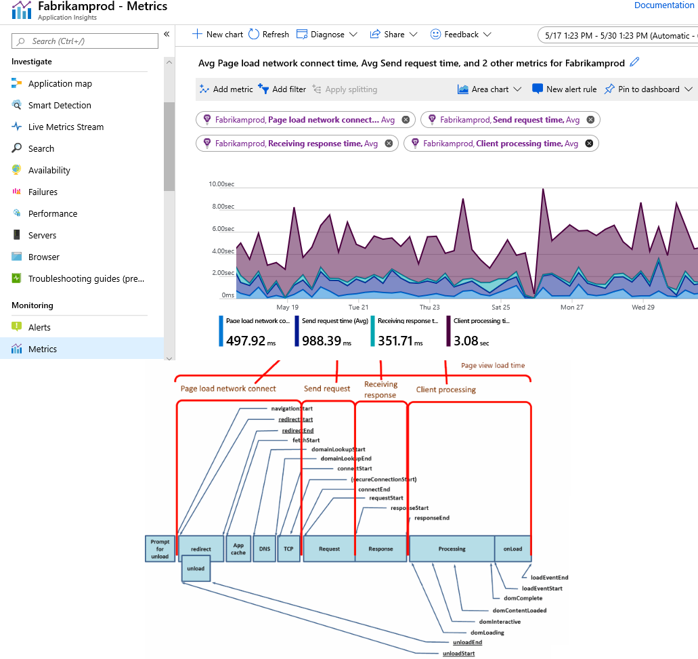
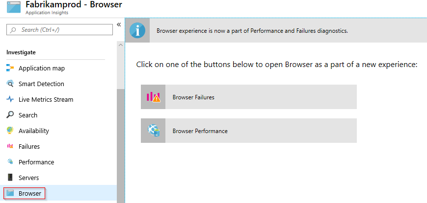
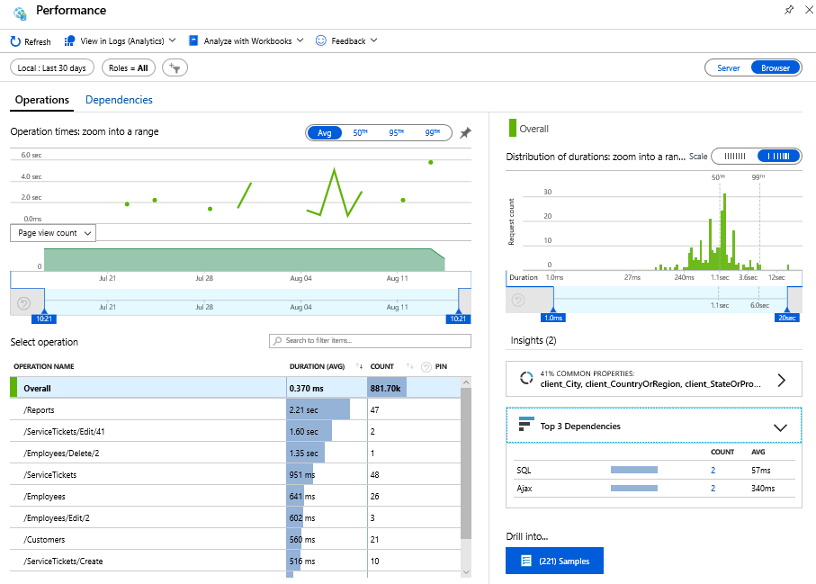
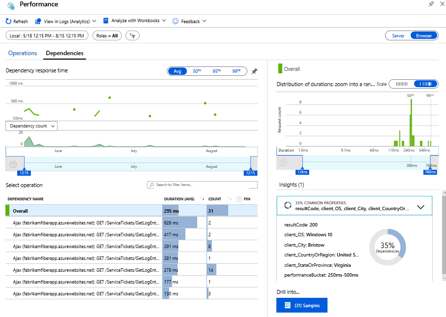

# Application Insights for web pages

Find out about the performance and usage of your web page or app. If you add [Application Insights](app-insights-overview.md) to your page script, you get timings of page loads and AJAX calls, counts, and details of browser exceptions and AJAX failures, as well as users and session counts. All these can be segmented by page, client OS and browser version, geo location, and other dimensions. You can set alerts on failure counts or slow page loading. And by inserting trace calls in your JavaScript code, you can track how the different features of your web page application are used.

Application Insights can be used with any web pages - you just add a short piece of JavaScript. If your web service is [Java](java-get-started.md) or [ASP.NET](asp-net.md), you can use the server-side SDKs in conjunction with the client-side JavaScript SDK to get an end-to-end understanding of your app's performance.

## Adding the Javascript SDK

1. First you need an Application Insights resource. If you don't already have a resource and instrumentation key, follow the [create a new resource instructions](create-new-resource.md).
2. Copy the instrumentation key from the resource where you want your JavaScript telemetry to be sent.
3. Add the Application Insights JavaScript SDK to your web page or app via one of the following two options:
    * [npm Setup](#npm-based-setup)
    * [JavaScript Snippet](#snippet-based-setup)

> [!IMPORTANT]
> You only need to use one of the methods below for adding the Application Insights JavaScript SDK to your application. If you use the npm based setup, don't use the snippet based setup. The same goes for the reverse scenario when using the snippet based approach, don't also use the npm based setup. 

### npm based setup

```js
import { ApplicationInsights } from '@microsoft/applicationinsights-web'

const appInsights = new ApplicationInsights({ config: {
  instrumentationKey: 'YOUR_INSTRUMENTATION_KEY_GOES_HERE'
  /* ...Other Configuration Options... */
} });
appInsights.loadAppInsights();
appInsights.trackPageView(); // Manually call trackPageView to establish the current user/session/pageview
```

### Snippet based setup

If your app does not use npm, you can directly instrument your webpages with Application Insights by pasting this snippet at the top of each your pages. Preferably, it should be the first script in your `<head>` section so that it can monitor any potential issues with all of your dependencies. If you are using Blazor Server App, add the snippet at the top of the file `_Host.cshtml` in the `<head>` section.

```html
<script type="text/javascript">
var sdkInstance="appInsightsSDK";window[sdkInstance]="appInsights";var aiName=window[sdkInstance],aisdk=window[aiName]||function(e){function n(e){t[e]=function(){var n=arguments;t.queue.push(function(){t[e].apply(t,n)})}}var t={config:e};t.initialize=!0;var i=document,a=window;setTimeout(function(){var n=i.createElement("script");n.src=e.url||"https://az416426.vo.msecnd.net/scripts/b/ai.2.min.js",i.getElementsByTagName("script")[0].parentNode.appendChild(n)});try{t.cookie=i.cookie}catch(e){}t.queue=[],t.version=2;for(var r=["Event","PageView","Exception","Trace","DependencyData","Metric","PageViewPerformance"];r.length;)n("track"+r.pop());n("startTrackPage"),n("stopTrackPage");var s="Track"+r[0];if(n("start"+s),n("stop"+s),n("addTelemetryInitializer"),n("setAuthenticatedUserContext"),n("clearAuthenticatedUserContext"),n("flush"),t.SeverityLevel={Verbose:0,Information:1,Warning:2,Error:3,Critical:4},!(!0===e.disableExceptionTracking||e.extensionConfig&&e.extensionConfig.ApplicationInsightsAnalytics&&!0===e.extensionConfig.ApplicationInsightsAnalytics.disableExceptionTracking)){n("_"+(r="onerror"));var o=a[r];a[r]=function(e,n,i,a,s){var c=o&&o(e,n,i,a,s);return!0!==c&&t["_"+r]({message:e,url:n,lineNumber:i,columnNumber:a,error:s}),c},e.autoExceptionInstrumented=!0}return t}(
{
  instrumentationKey:"INSTRUMENTATION_KEY"
}
);window[aiName]=aisdk,aisdk.queue&&0===aisdk.queue.length&&aisdk.trackPageView({});
</script>
```

### Sending telemetry to the Azure portal

By default the Application Insights JavaScript SDK autocollects a number of telemetry items that are helpful in determining the health of your application and the underlying user experience. These include:

- **Uncaught exceptions** in your app, including information on
	- Stack trace
	- Exception details and message accompanying the error
	- Line & column number of error
	- URL where error was raised
- **Network Dependency Requests** made by your app **XHR** and **Fetch** (fetch collection is disabled by default) requests, include information on
	- Url of dependency source
	- Command & Method used to request the dependency
	- Duration of the request
	- Result code and success status of the request
	- ID (if any) of user making the request
	- Correlation context (if any) where request is made
- **User information** (for example, Location, network, IP)
- **Device information** (for example, Browser, OS, version, language, resolution, model)
- **Session information**

### Telemetry initializers
Telemetry initializers are used to modify the contents of collected telemetry before being sent from the user's browser. They can also be used to prevent certain telemetry from being sent, by returning `false`. Multiple telemetry initializers can be added to your Application Insights instance, and they are executed in order of adding them.

The input argument to `addTelemetryInitializer` is a callback that takes a [`ITelemetryItem`](https://github.com/microsoft/ApplicationInsights-JS/blob/master/API-reference.md#addTelemetryInitializer) as an argument and returns a `boolean` or `void`. If returning `false`, the telemetry item is not sent, else it proceeds to the next telemetry initializer, if any, or is sent to the telemetry collection endpoint.

An example of using telemetry initializers:
```ts
var telemetryInitializer = (envelope) => {
  envelope.data.someField = 'This item passed through my telemetry initializer';
};
appInsights.addTelemetryInitializer(telemetryInitializer);
appInsights.trackTrace({message: 'This message will use a telemetry initializer'});

appInsights.addTelemetryInitializer(() => false); // Nothing is sent after this is executed
appInsights.trackTrace({message: 'this message will not be sent'}); // Not sent
```
## Configuration
Most configuration fields are named such that they can be defaulted to false. All fields are optional except for `instrumentationKey`.

| Name | Default | Description |
|------|---------|-------------|
| instrumentationKey | null | **Required**<br>Instrumentation key that you obtained from the Azure portal. |
| accountId | null | An optional account ID, if your app groups users into accounts. No spaces, commas, semicolons, equals, or vertical bars |
| sessionRenewalMs | 1800000 | A session is logged if the user is inactive for this amount of time in milliseconds. Default is 30 minutes |
| sessionExpirationMs | 86400000 | A session is logged if it has continued for this amount of time in milliseconds. Default is 24 hours |
| maxBatchSizeInBytes | 10000 | Max size of telemetry batch. If a batch exceeds this limit, it is immediately sent and a new batch is started |
| maxBatchInterval | 15000 | How long to batch telemetry for before sending (milliseconds) |
| disableExceptionTracking | false | If true, exceptions are no autocollected. Default is false. |
| disableTelemetry | false | If true, telemetry is not collected or sent. Default is false. |
| enableDebug | false | If true, **internal** debugging data is thrown as an exception **instead** of being logged, regardless of SDK logging settings. Default is false. <br>***Note:*** Enabling this setting will result in dropped telemetry whenever an internal error occurs. This can be useful for quickly identifying issues with your configuration or usage of the SDK. If you do not want to lose telemetry while debugging, consider using `consoleLoggingLevel` or `telemetryLoggingLevel` instead of `enableDebug`. |
| loggingLevelConsole | 0 | Logs **internal** Application Insights errors to console. <br>0: off, <br>1: Critical errors only, <br>2: Everything (errors & warnings) |
| loggingLevelTelemetry | 1 | Sends **internal** Application Insights errors as telemetry. <br>0: off, <br>1: Critical errors only, <br>2: Everything (errors & warnings) |
| diagnosticLogInterval | 10000 | (internal) Polling interval (in ms) for internal logging queue |
| samplingPercentage | 100 | Percentage of events that will be sent. Default is 100, meaning all events are sent. Set this if you wish to preserve your data cap for large-scale applications. |
| autoTrackPageVisitTime | false | If true, on a pageview, the previous instrumented page's view time is tracked and sent as telemetry and a new timer is started for the current pageview. Default is false. |
| disableAjaxTracking | false | If true, Ajax calls are not autocollected. Default is false. |
| disableFetchTracking | true | If true, Fetch requests are not autocollected. Default is true |
| overridePageViewDuration | false | If true, default behavior of trackPageView is changed to record end of page view duration interval when trackPageView is called. If false and no custom duration is provided to trackPageView, the page view performance is calculated using the navigation timing API. Default is false. |
| maxAjaxCallsPerView | 500 | Default 500 - controls how many Ajax calls will be monitored per page view. Set to -1 to monitor all (unlimited) Ajax calls on the page. |
| disableDataLossAnalysis | true | If false, internal telemetry sender buffers will be checked at startup for items not yet sent. |
| disableCorrelationHeaders | false | If false, the SDK will add two headers ('Request-Id' and 'Request-Context') to all dependency requests to correlate them with corresponding requests on the server side. Default is false. |
| correlationHeaderExcludedDomains |  | Disable correlation headers for specific domains |
| correlationHeaderDomains |  | Enable correlation headers for specific domains |
| disableFlushOnBeforeUnload | false | Default false. If true, flush method will not be called when onBeforeUnload event triggers |
| enableSessionStorageBuffer | true | Default true. If true, the buffer with all unsent telemetry is stored in session storage. The buffer is restored on page load |
| isCookieUseDisabled | false | Default false. If true, the SDK will not store or read any data from cookies.|
| cookieDomain | null | Custom cookie domain. This is helpful if you want to share Application Insights cookies across subdomains. |
| isRetryDisabled | false | Default false. If false, retry on 206 (partial success), 408 (timeout), 429 (too many requests), 500 (internal server error), 503 (service unavailable), and 0 (offline, only if detected) |
| isStorageUseDisabled | false | If true, the SDK will not store or read any data from local and session storage. Default is false. |
| isBeaconApiDisabled | true | If false, the SDK will send all telemetry using the [Beacon API](https://www.w3.org/TR/beacon) |
| onunloadDisableBeacon | false | Default false. when tab is closed, the SDK will send all remaining telemetry using the [Beacon API](https://www.w3.org/TR/beacon) |
| sdkExtension | null | Sets the sdk extension name. Only alphabetic characters are allowed. The extension name is added as a prefix to the 'ai.internal.sdkVersion' tag (for example, 'ext_javascript:2.0.0'). Default is null. |
| isBrowserLinkTrackingEnabled | false | Default is false. If true, the SDK will track all [Browser Link](https://docs.microsoft.com/aspnet/core/client-side/using-browserlink) requests. |
| appId | null | AppId is used for the correlation between AJAX dependencies happening on the client-side with the server-side requests. When Beacon API is enabled, it cannot be used automatically, but can be set manually in the configuration. Default is null |
| enableCorsCorrelation | false | If true, the SDK will add two headers ('Request-Id' and 'Request-Context') to all CORS requests to correlate outgoing AJAX dependencies with corresponding requests on the server side. Default is false |
| namePrefix | undefined | An optional value that will be used as name postfix for localStorage and cookie name.
| enableAutoRouteTracking | false | Automatically track route changes in Single Page Applications (SPA). If true, each route change will send a new Pageview to Application Insights. Hash route changes (`example.com/foo#bar`) are also recorded as new page views.
| enableRequestHeaderTracking | false | If true, AJAX & Fetch request headers is tracked, default is false.
| enableResponseHeaderTracking | false | If true, AJAX & Fetch request's response headers is tracked, default is false.
| distributedTracingMode | `DistributedTracingModes.AI` | Sets the distributed tracing mode. If AI_AND_W3C mode or W3C mode is set, W3C trace context headers (traceparent/tracestate) will be generated and included in all outgoing requests. AI_AND_W3C is provided for back-compatibility with any legacy Application Insights instrumented services.

## Single Page Applications

By default, this SDK will **not** handle state-based route changing that occurs in single page applications. To enable automatic route change tracking for your single page application, you can add `enableAutoRouteTracking: true` to your setup configuration.

Currently, we offer a separate [React plugin](#react-extensions) which you can initialize with this SDK. It will also accomplish route change tracking for you, as well as collect [other React specific telemetry](https://github.com/microsoft/ApplicationInsights-JS/blob/17ef50442f73fd02a758fbd74134933d92607ecf/extensions/applicationinsights-react-js/README.md).

## React extensions

| Extensions |
|---------------|
| [React](https://github.com/microsoft/ApplicationInsights-JS/blob/17ef50442f73fd02a758fbd74134933d92607ecf/extensions/applicationinsights-react-js/README.md)|
| [React Native](https://github.com/microsoft/ApplicationInsights-JS/blob/17ef50442f73fd02a758fbd74134933d92607ecf/extensions/applicationinsights-react-native/README.md)|

## Explore browser/client-side data

Browser/client-side data can be viewed by going to **Metrics** and adding individual metrics you are interested in: 



You can also view your data from the JavaScript SDK via the Browser experience in the portal.

Select **Browser** and then choose **Failures** or **Performance**.



### Performance 



### Dependencies



### Analytics 

To query your telemetry collected by the JavaScript SDK, select the **View in Logs (Analytics)** button. By adding a `where` statement of `client_Type == "Browser"`, you will only see data from the JavaScript SDK and any server-side telemetry collected by other SDKs will be excluded.
 
```kusto
// average pageView duration by name
let timeGrain=5m;
let dataset=pageViews
// additional filters can be applied here
| where timestamp > ago(1d)
| where client_Type == "Browser" ;
// calculate average pageView duration for all pageViews
dataset
| summarize avg(duration) by bin(timestamp, timeGrain)
| extend pageView='Overall'
// render result in a chart
| render timechart
```

### Source Map Support

The minified callstack of your exception telemetry can be unminified in the Azure portal. All existing integrations on the Exception Details panel will work with the newly unminified callstack. Drag and drop source map unminifying supports all existing and future JS SDKs (+Node.JS), so you do not need to upgrade your SDK version. To view your unminified callstack,
1. Select an Exception Telemetry item in the Azure portal to view its "End-to-end transaction details"
2. Identify which source maps correspond to this call stack. The source map must match a stack frame's source file, but suffixed with `.map`
3. Drag and drop the source maps onto the call stack in the Azure portal


### Application Insights Web Basic

For a lightweight experience, you can instead install the basic version of Application Insights
```
npm i --save @microsoft/applicationinsights-web-basic
```
This version comes with the bare minimum number of features and functionalities and relies on you to build it up as you see fit. For example, it performs no autocollection (uncaught exceptions, AJAX, etc.). The APIs to send certain telemetry types, like `trackTrace`, `trackException`, etc., are not included in this version, so you will need to provide your own wrapper. The only API that is available is `track`. A [sample](https://github.com/Azure-Samples/applicationinsights-web-sample1/blob/master/testlightsku.html) is located here.

## Examples

For runnable examples, see [Application Insights Javascript SDK Samples](https://github.com/topics/applicationinsights-js-demo)

## Upgrading from the old Version of Application Insights

Breaking changes in the SDK V2 version:
- To allow for better API signatures, some of the API calls such as trackPageView, trackException have been updated. Running in IE8 or lower versions of the browser is not supported.
- Telemetry envelope has field name and structure changes due to data schema updates.
- Moved `context.operation` to `context.telemetryTrace`. Some fields were also changed (`operation.id` --> `telemetryTrace.traceID`)
  - If you want to manually refresh the current pageview ID (for example, in SPA apps) this can be done with `appInsights.properties.context.telemetryTrace.traceID = Util.newId()`

If you're using the current application insights PRODUCTION SDK (1.0.20) and want to see if the new SDK works in runtime, update the URL depending on your current SDK loading scenario.

- Download via CDN scenario: Update the code snippet that you currently use to point to the following URL:
   ```
   "https://az416426.vo.msecnd.net/scripts/b/ai.2.min.js"
   ```

- npm scenario: Call `downloadAndSetup` to download the full ApplicationInsights script from CDN and initialize it with instrumentation key:

   ```ts
   appInsights.downloadAndSetup({
     instrumentationKey: "xxxxxxxx-xxxx-xxxx-xxxx-xxxxxxxx",
     url: "https://az416426.vo.msecnd.net/scripts/b/ai.2.min.js"
     });
   ```

Test in internal environment to verify monitoring telemetry is working as expected. If all works, update your API signatures appropriately to SDK V2 version and deploy in your production environments.

## SDK performance/overhead

At just 25 KB gzipped, and taking only ~15 ms to initialize, Application Insights adds a negligible amount of loadtime to your website. By using the snippet, minimal components of the library are quickly loaded. In the meantime, the full script is downloaded in the background.

While the script is downloading from the CDN, all tracking of your page is queued. Once the downloaded script finishes asynchronously initializing, all events that were queued are tracked. As a result, you will not lose any telemetry during the entire life cycle of your page. This setup process provides your page with a seamless analytics system, invisible to your users.

> Summary:
> - **25 KB** gzipped
> - **15 ms** overall initialization time
> - **Zero** tracking missed during life cycle of page

## Browser support

 |  |  |  | 
--- | --- | --- | --- | --- |
Chrome Latest ✔ |  Firefox Latest ✔ | IE 9+ & Edge ✔ | Opera Latest ✔ | Safari Latest ✔ |

## Open-source SDK

The Application Insights JavaScript SDK is open-source to view the source code or to contribute to the project visit the [official GitHub repository](https://github.com/Microsoft/ApplicationInsights-JS).

## <a name="next"></a> Next steps
* [Track usage](usage-overview.md)
* [Custom events and metrics](api-custom-events-metrics.md)
* [Build-measure-learn](usage-overview.md)

