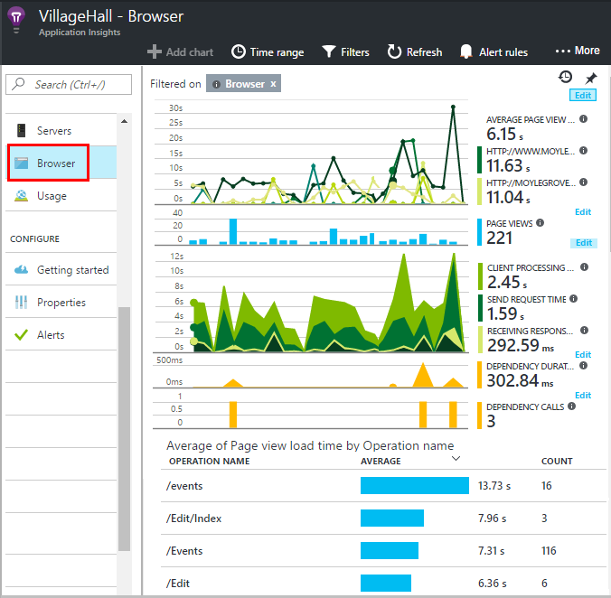
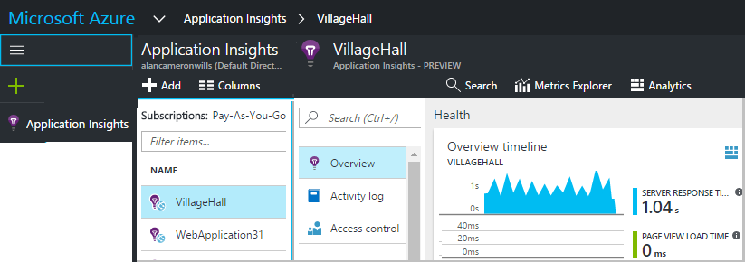
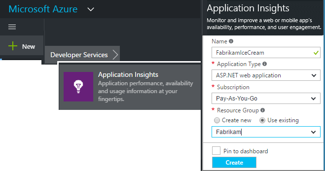
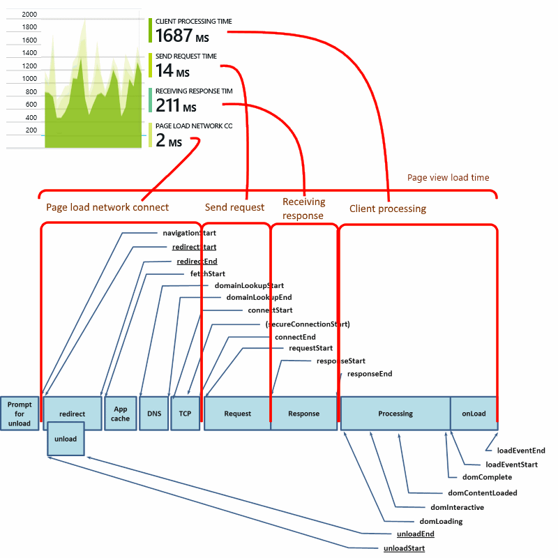
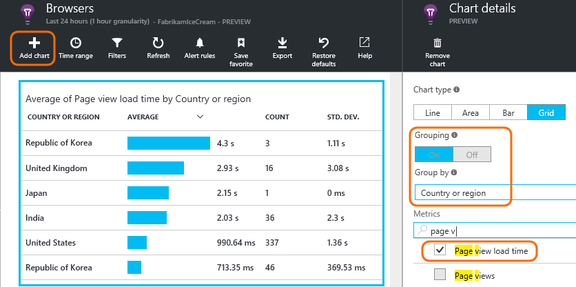
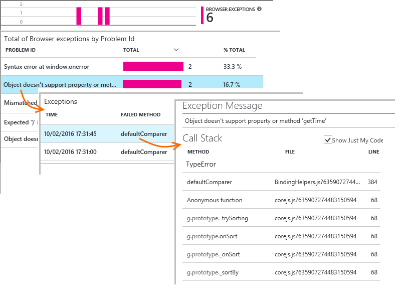
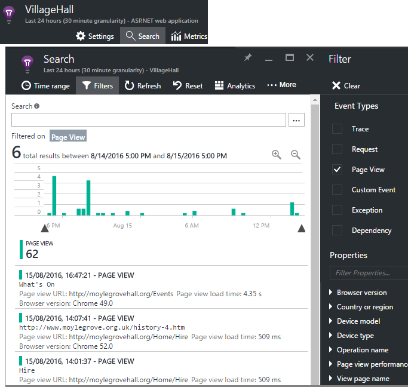

# Application Insights for web pages
Find out about the performance and usage of your web page or app. If you add [Application Insights](app-insights-overview.md) to your page script, you get timings of page loads and AJAX calls, counts and details of browser exceptions and AJAX failures, as well as users and session counts. All these can be segmented by page, client OS and browser version, geo location, and other dimensions. You can set alerts on failure counts or slow page loading. And by inserting trace calls in your JavaScript code, you can track how the different features of your web page application are used.

Application Insights can be used with any web pages - you just add a short piece of JavaScript. If your web service is [Java](java-get-started.md) or [ASP.NET](asp-net.md), you can integrate telemetry from your server and clients.



You need a subscription to [Microsoft Azure](https://azure.com). If your team has an organizational subscription, ask the owner to add your Microsoft Account to it.

## Set up Application Insights for your web page
Add the loader code snippet to your web pages, as follows.

### Open or create Application Insights resource
The Application Insights resource is where data about your page's performance and usage is displayed. 

Sign into [Azure portal](https://portal.azure.com).

If you already set up monitoring for the server side of your app, you already have a resource:



If you don't have one, create it:



*Questions already?* [More about creating a resource](create-new-resource.md ).

### Add the SDK script to your app or web pages

```HTML
<!-- 
To collect user behavior analytics about your application, 
insert the following script into each page you want to track.
Place this code immediately before the closing </head> tag,
and before any other scripts. Your first data will appear 
automatically in just a few seconds.
-->
<script type="text/javascript">
var sdkInstance="appInsightsSDK";window[sdkInstance]="appInsights";var aiName=window[sdkInstance],aisdk=window[aiName]||function(e){
  function n(e){t[e]=function(){var n=arguments;t.queue.push(function(){t[e].apply(t,n)})}}var t={config:e};t.initialize=!0;var i=document,a=window;setTimeout(function(){var n=i.createElement("script");n.src=e.url||"https://az416426.vo.msecnd.net/next/ai.2.min.js",i.getElementsByTagName("script")[0].parentNode.appendChild(n)});try{t.cookie=i.cookie}catch(e){}t.queue=[],t.version=2;for(var r=["Event","PageView","Exception","Trace","DependencyData","Metric","PageViewPerformance"];r.length;)n("track"+r.pop());n("startTrackPage"),n("stopTrackPage");var s="Track"+r[0];if(n("start"+s),n("stop"+s),n("setAuthenticatedUserContext"),n("clearAuthenticatedUserContext"),n("flush"),!(!0===e.disableExceptionTracking||e.extensionConfig&&e.extensionConfig.ApplicationInsightsAnalytics&&!0===e.extensionConfig.ApplicationInsightsAnalytics.disableExceptionTracking)){n("_"+(r="onerror"));var o=a[r];a[r]=function(e,n,i,a,s){var c=o&&o(e,n,i,a,s);return!0!==c&&t["_"+r]({message:e,url:n,lineNumber:i,columnNumber:a,error:s}),c},e.autoExceptionInstrumented=!0}return t
  }({
      instrumentationKey:"<your instrumentation key>"
  });

window[aiName]=aisdk,aisdk.queue&&0===aisdk.queue.length&&aisdk.trackPageView({});
</script>
```

Insert the script just before the `</head>` tag of every page you want to track. If your website has a master page, you can put the script there. For example:

* In an ASP.NET MVC project, you'd put it in `View\Shared\_Layout.cshtml`
* In a SharePoint site, on the control panel, open [Site Settings / Master Page](sharepoint.md).

The script contains the instrumentation key that directs the data to your Application Insights resource. 

([Deeper explanation of the script.](https://apmtips.com/blog/2015/03/18/javascript-snippet-explained/))

## Detailed configuration
There are several [parameters](https://github.com/Microsoft/ApplicationInsights-JS/blob/master/API-reference.md#config) you can set, though in most cases, you shouldn't need to. For example, you can disable or limit the number of Ajax calls reported per page view (to reduce traffic). Or you can set debug mode to have telemetry move rapidly through the pipeline without being batched.

To set these parameters, look for this line in the code snippet, and add more comma-separated items after it:

    })({
      instrumentationKey: "..."
      // Insert here
    });

For a complete list of configuration parameters, please see the [GitHub Page](https://github.com/microsoft/applicationinsights-js#configuration). Some available parameters include:

    // Send telemetry immediately without batching.
    // Remember to remove this when no longer required, as it
    // can affect browser performance.
    enableDebug: boolean,

    // Don't log browser exceptions.
    disableExceptionTracking: boolean,

    // Set false to enable autocollection of [Fetch requests](https://developer.mozilla.org/en-US/docs/Web/API/Fetch_API) (disabled by default)
    disableFetchTracking: boolean, // default is true
    
    // Don't log ajax calls.
    disableAjaxTracking: boolean,

    // Limit number of Ajax calls logged, to reduce traffic.
    maxAjaxCallsPerView: 10, // default is 500
    
    // Time page load up to execution of first trackPageView().
    overridePageViewDuration: boolean,

    // Set dynamically for an authenticated user.
    accountId: string,
    

## <a name="run"></a>Run your app
Run your web app, use it a while to generate telemetry, and wait a few seconds. You can either run it using the **F5** key on your development machine, or publish it and let users play with it.

If you want to check the telemetry that a web app is sending to Application Insights, use your browser's debugging tools (**F12** on many browsers). Data is sent to dc.services.visualstudio.com.

## Explore your browser performance data
Open the Browser blade to show aggregated performance data from your users' browsers.


No data yet? Click **Refresh** at the top of the page. Still nothing? See [Troubleshooting](troubleshoot-faq.md).

The Browser blade is a [Metrics Explorer blade](metrics-explorer.md) with preset filters and chart selections. You can edit the time range, filters, and chart configuration if you want, and save the result as a favorite. Click **Restore defaults** to get back to the original blade configuration.

## Page load performance
At the top is a segmented chart of page load times. The total height of the chart represents the average time to load and display pages from your app in your users' browsers. The time is measured from when the browser sends the initial HTTP request until all synchronous load events have been processed, including layout and running scripts. It doesn't include asynchronous tasks such as loading web parts from AJAX calls.

The chart segments the total page load time into the [standard timings defined by W3C](https://www.w3.org/TR/navigation-timing/#processing-model). 



Note that the *network connect* time is often lower than you might expect, because it's an average over all requests from the browser to the server. Many individual requests have a connect time of 0 because there is already an active connection to the server.

### Slow loading?
Slow page loads are a major source of dissatisfaction for your users. If the chart indicates slow page loads, it's easy to do some diagnostic research.

The chart shows the average of all page loads in your app. To see if the problem is confined to particular pages, look further down the blade, where there's a grid segmented by page URL:


Notice the page view count and standard deviation. If the page count is very low, then the issue isn't affecting users much. A high standard deviation (comparable to the average itself) indicates a lot of variation between individual measurements.

**Zoom in on one URL and one page view.** Click any page name to see a blade of browser charts filtered just to that URL; and then on an instance of a page view.


Click `...` for a full list of properties for that event, or inspect the Ajax calls and related events. Slow Ajax calls affect the overall page load time if they are synchronous. Related events include server requests for the same URL (if you've set up Application Insights on your web server).

**Page performance over time.** Back at the Browsers blade, change the Page View Load Time grid into a line chart to see if there were peaks at particular times:


**Segment by other dimensions.** Maybe your pages are slower to load on a particular browser, client OS, or user locality? Add a new chart and experiment with the **Group-by** dimension.



## AJAX Performance
Make sure any AJAX calls in your web pages are performing well. They are often used to fill parts of your page asynchronously. Although the overall page might load promptly, your users could be frustrated by staring at blank web parts, waiting for data to appear in them.

AJAX calls made from your web page are shown on the Browsers blade as dependencies.

There are summary charts in the upper part of the blade:


and detailed grids lower down:


Click any row for specific details.

> [!NOTE]
> If you delete the Browsers filter on the blade, both server and AJAX dependencies are included in these charts. Click Restore Defaults to reconfigure the filter.
> 
> 

**To drill into failed Ajax calls** scroll down to the Dependency failures grid, and then click a row to see specific instances.


Click `...` for the full telemetry for an Ajax call.

### No Ajax calls reported?
Ajax calls include any HTTP/HTTPS  calls made from the script of your web page. If you don't see them reported, check that the code snippet doesn't set the `disableAjaxTracking` or `maxAjaxCallsPerView` [parameters](https://github.com/Microsoft/ApplicationInsights-JS/blob/master/API-reference.md#config).

## Browser exceptions
On the Browsers blade, there's an exceptions summary chart, and a grid of exception types further down the blade.



If you don't see browser exceptions reported, check that the code snippet doesn't set the `disableExceptionTracking` [parameter](https://github.com/Microsoft/ApplicationInsights-JS/blob/master/API-reference.md#config).

## Inspect individual page view events

Usually page view telemetry is analyzed by Application Insights and you see only cumulative reports, averaged over all your users. But for debugging purposes, you can also look at individual page view events.

In the Diagnostic Search blade, set Filters to Page View.



Select any event to see more detail. In the details page, click "..." to see even more detail.

> [!NOTE]
> If you use [Search](diagnostic-search.md), notice that you have to match whole words: "Abou" and "bout" do not match "About".
> 
> 

You can also use the powerful [Log Analytics query language](https://docs.microsoft.com/azure/application-insights/app-insights-analytics-tour) to search page views.

### Page view properties
* **Page view duration** 
  
  * By default, the time it takes to load the page, from client request to full load (including auxiliary files but excluding asynchronous tasks such as Ajax calls). 
  * If you set `overridePageViewDuration` in the [page configuration](#detailed-configuration), the interval between client request to execution of the first `trackPageView`. If you moved trackPageView from its usual position after the initialization of the script, it will reflect a different value.
  * If `overridePageViewDuration` is set and a duration argument is provided in the `trackPageView()` call, then the argument value is used instead. 

## Custom page counts
By default, a page count occurs each time a new page loads into the client browser.  But you might want to count additional page views. For example, a page might display its content in tabs and you want to count a page when the user switches tabs. Or JavaScript code in the page might load new content without changing the browser's URL.

Insert a JavaScript call like this at the appropriate point in your client code:

    appInsights.trackPageView(myPageName);

The page name can contain the same characters as a URL, but anything after "#" or "?" is ignored.

## Usage tracking
Want to find out what your users do with your app?

* [Learn about the user behavior analytics tools](usage-overview.md)
* [Learn about custom events and metrics API](api-custom-events-metrics.md).

## <a name="video"></a> Video


> [!VIDEO https://channel9.msdn.com/events/Connect/2016/100/player]


## <a name="next"></a> Next steps
* [Track usage](usage-overview.md)
* [Custom events and metrics](api-custom-events-metrics.md)
* [Build-measure-learn](usage-overview.md)

