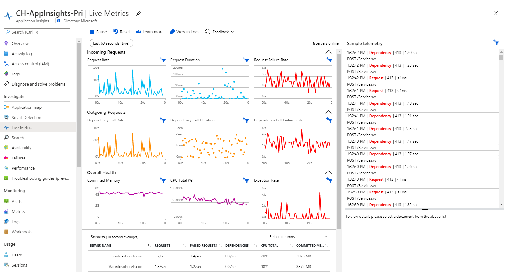
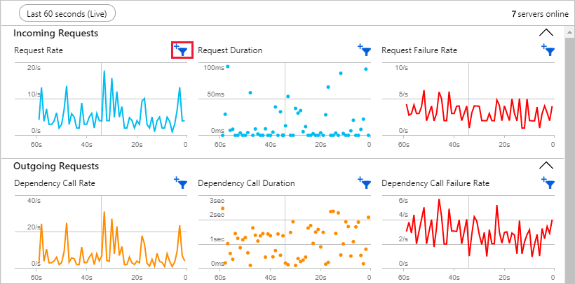
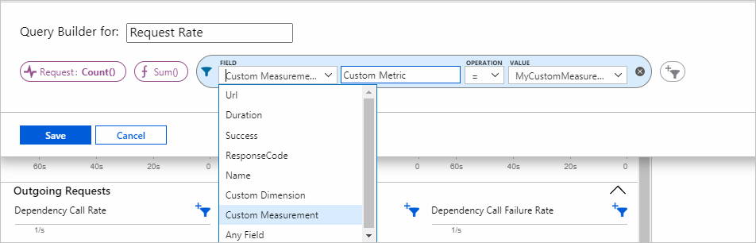
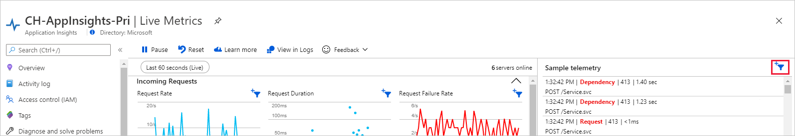
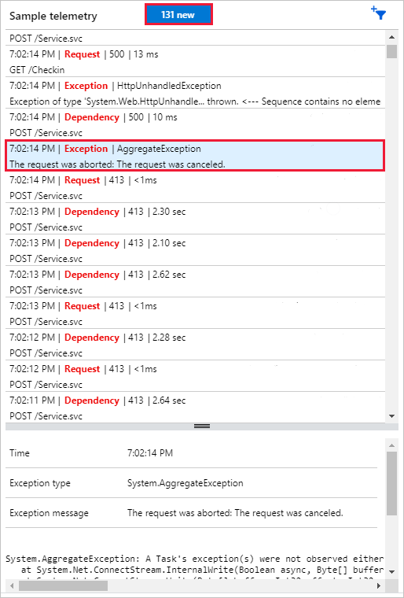
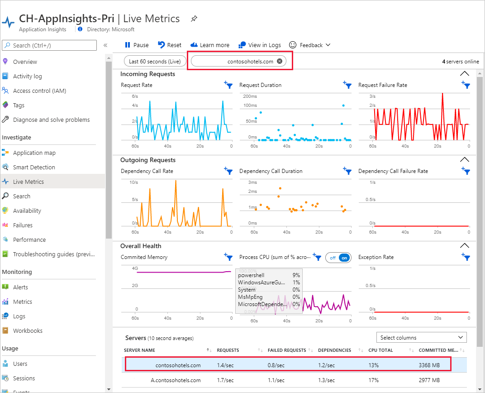
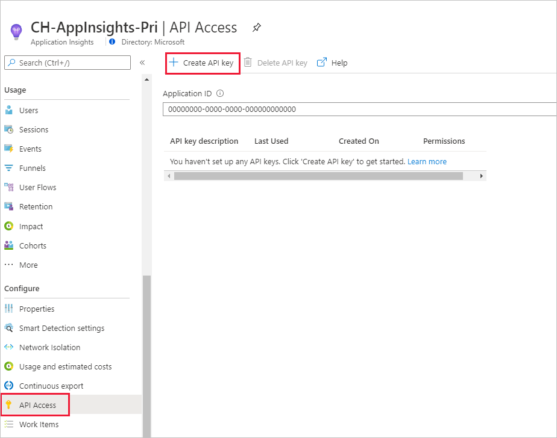
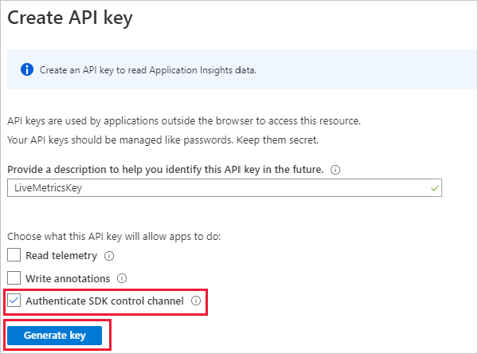

# Live Metrics Stream: Monitor & Diagnose with 1-second latency

Monitor your live, in-production web application by using Live Metrics Stream (also known as QuickPulse) from [Application Insights](./app-insights-overview.md). Select and filter metrics and performance counters to watch in real time, without any disturbance to your service. Inspect stack traces from sample failed requests and exceptions. Together with [Profiler](./profiler.md) and [Snapshot debugger](./snapshot-debugger.md), Live Metrics Stream provides a powerful and non-invasive diagnostic tool for your live web site.

With Live Metrics Stream, you can:

* Validate a fix while it is released, by watching performance and failure counts.
* Watch the effect of test loads, and diagnose issues live.
* Focus on particular test sessions or filter out known issues, by selecting and filtering the metrics you want to watch.
* Get exception traces as they happen.
* Experiment with filters to find the most relevant KPIs.
* Monitor any Windows performance counter live.
* Easily identify a server that is having issues, and filter all the KPI/live feed to just that server.



Live Metrics are currently supported for ASP.NET, ASP.NET Core, Azure Functions, Java, and Node.js apps.

## Get started

1. Follow language specific guidelines to enable Live Metrics.
   * [ASP.NET](./asp-net.md) - Live Metrics is enabled by default.
   * [ASP.NET Core](./asp-net-core.md)- Live Metrics is enabled by default.
   * [.NET/.NET Core Console/Worker](./worker-service.md)- Live Metrics is enabled by default.
   * [.NET Applications - Enable using code](#enable-livemetrics-using-code-for-any-net-application).
   * [Node.js](./nodejs.md#live-metrics)

2. In the [Azure portal](https://portal.azure.com), open the Application Insights resource for your app, and then open Live Stream.

3. [Secure the control channel](#secure-the-control-channel) if you might use sensitive data such as customer names in your filters.

### Enable LiveMetrics using code for any .NET application

Even though LiveMetrics is enabled by default when onboarding using recommended instructions for .NET Applications, the following shows how to setup Live Metrics
manually.

1. Install the NuGet package [Microsoft.ApplicationInsights.PerfCounterCollector](https://www.nuget.org/packages/Microsoft.ApplicationInsights.PerfCounterCollector)
2. The following sample console app code shows setting up Live Metrics.

```csharp
using Microsoft.ApplicationInsights;
using Microsoft.ApplicationInsights.Extensibility;
using Microsoft.ApplicationInsights.Extensibility.PerfCounterCollector.QuickPulse;
using System;
using System.Threading.Tasks;

namespace LiveMetricsDemo
{
    class Program
    {
        static void Main(string[] args)
        {
            // Create a TelemetryConfiguration instance.
            TelemetryConfiguration config = TelemetryConfiguration.CreateDefault();
            config.InstrumentationKey = "INSTRUMENTATION-KEY-HERE";
            QuickPulseTelemetryProcessor quickPulseProcessor = null;
            config.DefaultTelemetrySink.TelemetryProcessorChainBuilder
                .Use((next) =>
                {
                    quickPulseProcessor = new QuickPulseTelemetryProcessor(next);
                    return quickPulseProcessor;
                })
                .Build();

            var quickPulseModule = new QuickPulseTelemetryModule();

            // Secure the control channel.
            // This is optional, but recommended.
            quickPulseModule.AuthenticationApiKey = "YOUR-API-KEY-HERE";
            quickPulseModule.Initialize(config);
            quickPulseModule.RegisterTelemetryProcessor(quickPulseProcessor);

            // Create a TelemetryClient instance. It is important
            // to use the same TelemetryConfiguration here as the one
            // used to setup Live Metrics.
            TelemetryClient client = new TelemetryClient(config);

            // This sample runs indefinitely. Replace with actual application logic.
            while (true)
            {
                // Send dependency and request telemetry.
                // These will be shown in Live Metrics stream.
                // CPU/Memory Performance counter is also shown
                // automatically without any additional steps.
                client.TrackDependency("My dependency", "target", "http://sample",
                    DateTimeOffset.Now, TimeSpan.FromMilliseconds(300), true);
                client.TrackRequest("My Request", DateTimeOffset.Now,
                    TimeSpan.FromMilliseconds(230), "200", true);
                Task.Delay(1000).Wait();
            }
        }
    }
}
```

While the above sample is for a console app, the same code can be used in any .NET applications. If any other TelemetryModules are enabled which auto-collects telemetry, it is important to ensure the same configuration used for initializing those modules is used for Live Metrics module as well.

## How does Live Metrics Stream differ from Metrics Explorer and Analytics?

| |Live Stream | Metrics Explorer and Analytics |
|---|---|---|
|**Latency**|Data displayed within one second|Aggregated over minutes|
|**No retention**|Data persists while it's on the chart, and is then discarded|[Data retained for 90 days](./data-retention-privacy.md#how-long-is-the-data-kept)|
|**On demand**|Data is only streamed while the Live Metrics pane is open |Data is sent whenever the SDK is installed and enabled|
|**Free**|There is no charge for Live Stream data|Subject to [pricing](./pricing.md)
|**Sampling**|All selected metrics and counters are transmitted. Failures and stack traces are sampled. |Events may be [sampled](./api-filtering-sampling.md)|
|**Control channel**|Filter control signals are sent to the SDK. We recommend you secure this channel.|Communication is one way, to the portal|

## Select and filter your metrics

(Available with ASP.NET, ASP.NET Core, and Azure Functions (v2).)

You can monitor custom KPI live by applying arbitrary filters on any Application Insights telemetry from the portal. Click the filter control that shows when you mouse-over any of the charts. The following chart is plotting a custom Request count KPI with filters on URL and Duration attributes. Validate your filters with the Stream Preview section that shows a live feed of telemetry that matches the criteria you have specified at any point in time.



You can monitor a value different from Count. The options depend on the type of stream, which could be any Application Insights telemetry: requests, dependencies, exceptions, traces, events, or metrics. It can be your own [custom measurement](./api-custom-events-metrics.md#properties):



In addition to Application Insights telemetry, you can also monitor any Windows performance counter by selecting that from the stream options, and providing the name of the performance counter.

Live metrics are aggregated at two points: locally on each server, and then across all servers. You can change the default at either by selecting other options in the respective drop-downs.

## Sample Telemetry: Custom Live Diagnostic Events
By default, the live feed of events shows samples of failed requests and dependency calls, exceptions, events, and traces. Click the filter icon to see the applied criteria at any point in time.



As with metrics, you can specify any arbitrary criteria to any of the Application Insights telemetry types. In this example, we are selecting specific request failures, and events.


> [!NOTE]
> Currently, for Exception message-based criteria, use the outermost exception message. In the preceding example, to filter out the benign exception with inner exception message (follows the "<--" delimiter) "The client disconnected." use a message not-contains "Error reading request content" criteria.

See the details of an item in the live feed by clicking it. You can pause the feed either by clicking **Pause** or simply scrolling down, or clicking an item. Live feed will resume after you scroll back to the top, or by clicking the counter of items collected while it was paused.



## Filter by server instance

If you want to monitor a particular server role instance, you can filter by server. To filter select the server name under *Servers*.



## Secure the control channel

> [!NOTE]
> Currently, you can only set up an authenticated channel using code based monitoring and cannot authenticate servers using codeless attach.

The custom filters criteria you specify in Live Metrics portal are sent back to the Live Metrics component in the Application Insights SDK. The filters could potentially contain sensitive information such as customerIDs. You can make the channel secure with a secret API key in addition to the instrumentation key.

### Create an API Key




### Add API key to Configuration

### ASP.NET

In the applicationinsights.config file, add the AuthenticationApiKey to the QuickPulseTelemetryModule:

```XML
<Add Type="Microsoft.ApplicationInsights.Extensibility.PerfCounterCollector.QuickPulse.QuickPulseTelemetryModule, Microsoft.AI.PerfCounterCollector">
      <AuthenticationApiKey>YOUR-API-KEY-HERE</AuthenticationApiKey>
</Add>
```

### ASP.NET Core

For [ASP.NET Core](./asp-net-core.md) applications, follow the instructions below.

Modify `ConfigureServices` of your Startup.cs file as follows:

Add the following namespace.

```csharp
using Microsoft.ApplicationInsights.Extensibility.PerfCounterCollector.QuickPulse;
```

Then modify `ConfigureServices` method as below.

```csharp
public void ConfigureServices(IServiceCollection services)
{
    // existing code which include services.AddApplicationInsightsTelemetry() to enable Application Insights.
    services.ConfigureTelemetryModule<QuickPulseTelemetryModule> ((module, o) => module.AuthenticationApiKey = "YOUR-API-KEY-HERE");
}
```

More information on configuring ASP.NET Core applications can be found in our guidance on [configuring telemetry modules in ASP.NET Core](./asp-net-core.md#configuring-or-removing-default-telemetrymodules).

### WorkerService

For [WorkerService](./worker-service.md) applications, follow the instructions below.

Add the following namespace.

```csharp
using Microsoft.ApplicationInsights.Extensibility.PerfCounterCollector.QuickPulse;
```

Next, add the following line before the call `services.AddApplicationInsightsTelemetryWorkerService`.

```csharp
    services.ConfigureTelemetryModule<QuickPulseTelemetryModule> ((module, o) => module.AuthenticationApiKey = "YOUR-API-KEY-HERE");
```

More information on configuring WorkerService applications can be found in our guidance on [configuring telemetry modules in WorkerServices](./worker-service.md#configuring-or-removing-default-telemetrymodules).

### Azure Function Apps

For Azure Function Apps (v2), securing the channel with an API key can be accomplished with an environment variable.

Create an API key from within your Application Insights resource and go to **Settings > Configuration** for your Function App. Select **New application setting** and enter a name of `APPINSIGHTS_QUICKPULSEAUTHAPIKEY` and a value that corresponds to your API key.

However, if you recognize and trust all the connected servers, you can try the custom filters without the authenticated channel. This option is available for six months. This override is required once every new session, or when a new server comes online.


>[!NOTE]
>We strongly recommend that you set up the authenticated channel before entering potentially sensitive information like CustomerID in the filter criteria.
>

## Supported features table

| Language                         | Basic Metrics       | Performance metrics | Custom filtering    | Sample telemetry    | CPU split by process |
|----------------------------------|:--------------------|:--------------------|:--------------------|:--------------------|:---------------------|
| .NET Framework                   | Supported (V2.7.2+) | Supported (V2.7.2+) | Supported (V2.7.2+) | Supported (V2.7.2+) | Supported (V2.7.2+)  |
| .NET Core (target=.NET Framework)| Supported (V2.4.1+) | Supported (V2.4.1+) | Supported (V2.4.1+) | Supported (V2.4.1+) | Supported (V2.4.1+)  |
| .NET Core (target=.NET Core)     | Supported (V2.4.1+) | Supported*          | Supported (V2.4.1+) | Supported (V2.4.1+) | **Not Supported**    |
| Azure Functions v2               | Supported           | Supported           | Supported           | Supported           | **Not Supported**    |
| Java                             | Supported (V2.0.0+) | Supported (V2.0.0+) | **Not Supported**   | **Not Supported**   | **Not Supported**    |
| Node.js                          | Supported (V1.3.0+) | Supported (V1.3.0+) | **Not Supported**   | Supported (V1.3.0+) | **Not Supported**    |

Basic metrics include request, dependency, and exception rate. Performance metrics (performance counters) include memory and CPU. Sample telemetry shows a stream of detailed information for failed requests and dependencies, exceptions, events, and traces.

 \* PerfCounters support varies slightly across versions of .NET Core that do not target the .NET Framework:

- PerfCounters metrics are supported when running in Azure App Service for Windows. (AspNetCore SDK Version 2.4.1 or higher)
- PerfCounters are supported when app is running in ANY Windows machines (VM or Cloud Service or On-prem etc.) (AspNetCore SDK Version 2.7.1 or higher), but for apps targeting .NET Core 2.0 or higher.
- PerfCounters are supported when app is running ANYWHERE (Linux, Windows, app service for Linux, containers, etc.) in the latest versions (i.e. AspNetCore SDK Version 2.8.0 or higher), but only for apps targeting .NET Core 2.0 or higher.

## Troubleshooting

Live Metrics Stream uses different IP addresses than other Application Insights telemetry. Make sure [those IP addresses](./ip-addresses.md) are open in your firewall. Also check the [outgoing ports for Live Metrics Stream](./ip-addresses.md#outgoing-ports) are open in the firewall of your servers.

## Next steps

* [Monitoring usage with Application Insights](./usage-overview.md)
* [Using Diagnostic Search](./diagnostic-search.md)
* [Profiler](./profiler.md)
* [Snapshot debugger](./snapshot-debugger.md)
