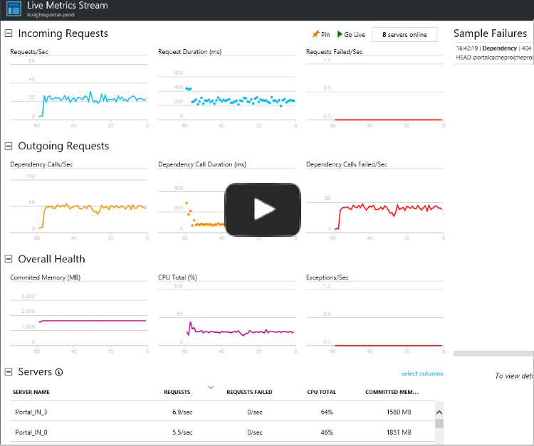
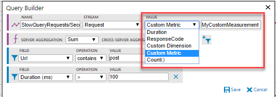
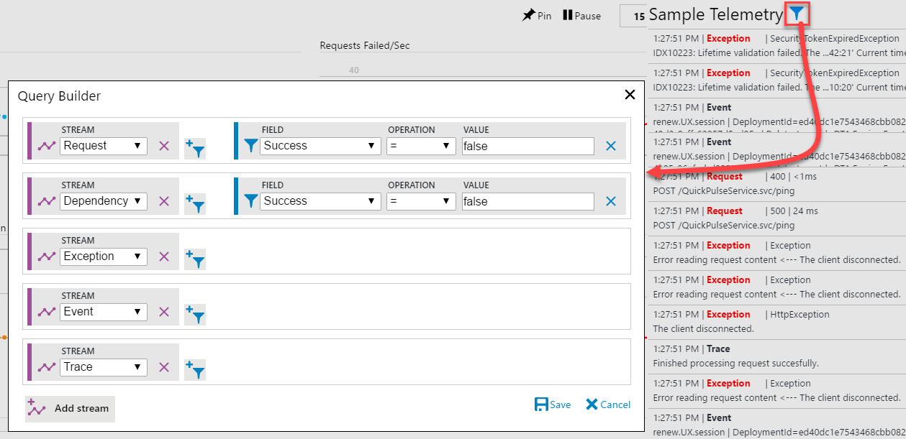
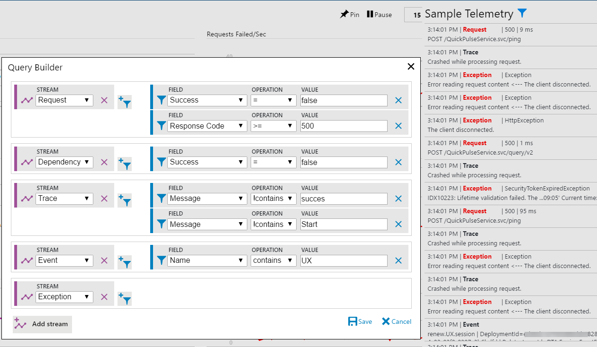
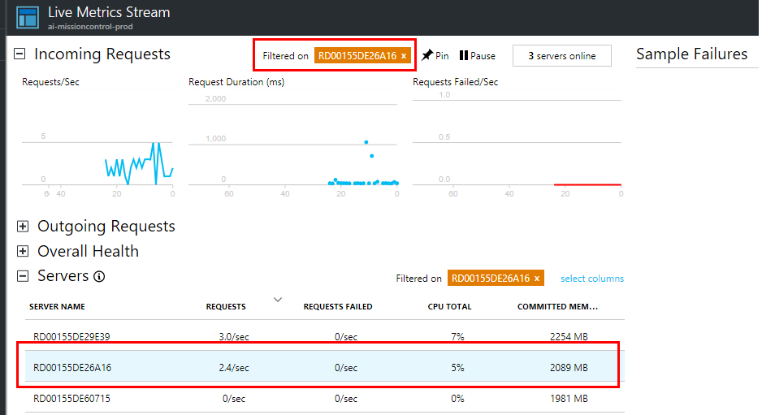
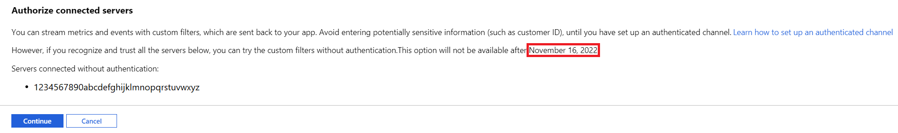

# Live Metrics Stream: Monitor & Diagnose with 1-second latency

Probe the beating heart of your live, in-production web application by using Live Metrics Stream from [Application Insights](../../azure-monitor/app/app-insights-overview.md). Select and filter metrics and performance counters to watch in real time, without any disturbance to your service. Inspect stack traces from sample failed requests and exceptions. Together with [Profiler](../../azure-monitor/app/profiler.md), [Snapshot debugger](../../azure-monitor/app/snapshot-debugger.md). Live Metrics Stream provides a powerful and non-invasive diagnostic tool for your live web site.

With Live Metrics Stream, you can:

* Validate a fix while it is released, by watching performance and failure counts.
* Watch the effect of test loads, and diagnose issues live.
* Focus on particular test sessions or filter out known issues, by selecting and filtering the metrics you want to watch.
* Get exception traces as they happen.
* Experiment with filters to find the most relevant KPIs.
* Monitor any Windows performance counter live.
* Easily identify a server that is having issues, and filter all the KPI/live feed to just that server.

[](https://www.youtube.com/watch?v=zqfHf1Oi5PY)

Live Metrics are currently supported for ASP.NET, ASP.NET Core, Azure Functions, Java, and Node.js apps.

## Get started

1. If you haven't yet [install Application Insights](../../azure-monitor/azure-monitor-app-hub.yml) in your web app, do that now.
2. In addition to the standard Application Insights packages [Microsoft.ApplicationInsights.PerfCounterCollector](https://www.nuget.org/packages/Microsoft.ApplicationInsights.PerfCounterCollector/) is required to enable Live Metrics stream.
3. **Update to the latest version** of the Application Insights package. In Visual Studio, right-click your project and choose **Manage Nuget packages**. Open the **Updates** tab, and select all the Microsoft.ApplicationInsights.* packages.

    Redeploy your app.

3. In the [Azure portal](https://portal.azure.com), open the Application Insights resource for your app, and then open Live Stream.

4. [Secure the control channel](#secure-the-control-channel) if you might use sensitive data such as customer names in your filters.

### No data? Check your server firewall

Check the [outgoing ports for Live Metrics Stream](../../azure-monitor/app/ip-addresses.md#outgoing-ports) are open in the firewall of your servers.

## How does Live Metrics Stream differ from Metrics Explorer and Analytics?

| |Live Stream | Metrics Explorer and Analytics |
|---|---|---|
|Latency|Data displayed within one second|Aggregated over minutes|
|No retention|Data persists while it's on the chart, and is then discarded|[Data retained for 90 days](../../azure-monitor/app/data-retention-privacy.md#how-long-is-the-data-kept)|
|On demand|Data is streamed while you open Live Metrics|Data is sent whenever the SDK is installed and enabled|
|Free|There is no charge for Live Stream data|Subject to [pricing](../../azure-monitor/app/pricing.md)
|Sampling|All selected metrics and counters are transmitted. Failures and stack traces are sampled. TelemetryProcessors are not applied.|Events may be [sampled](../../azure-monitor/app/api-filtering-sampling.md)|
|Control channel|Filter control signals are sent to the SDK. We recommend you secure this channel.|Communication is one way, to the portal|

## Select and filter your metrics

(Available with ASP.NET, ASP.NET Core, and Azure Functions (v2).)

You can monitor custom KPI live by applying arbitrary filters on any Application Insights telemetry from the portal. Click the filter control that shows when you mouse-over any of the charts. The following chart is plotting a custom Request count KPI with filters on URL and Duration attributes. Validate your filters with the Stream Preview section that shows a live feed of telemetry that matches the criteria you have specified at any point in time.


You can monitor a value different from Count. The options depend on the type of stream, which could be any Application Insights telemetry: requests, dependencies, exceptions, traces, events, or metrics. It can be your own [custom measurement](../../azure-monitor/app/api-custom-events-metrics.md#properties):



In addition to Application Insights telemetry, you can also monitor any Windows performance counter by selecting that from the stream options, and providing the name of the performance counter.

Live metrics are aggregated at two points: locally on each server, and then across all servers. You can change the default at either by selecting other options in the respective drop-downs.

## Sample Telemetry: Custom Live Diagnostic Events
By default, the live feed of events shows samples of failed requests and dependency calls, exceptions, events, and traces. Click the filter icon to see the applied criteria at any point in time. 



As with metrics, you can specify any arbitrary criteria to any of the Application Insights telemetry types. In this example, we are selecting specific request failures, traces, and events. We are also selecting all exceptions and dependency failures.



Note: Currently, for Exception message-based criteria, use the outermost exception message. In the preceding example, to filter out the benign exception with inner exception message (follows the "<--" delimiter) "The client disconnected." use a message not-contains "Error reading request content" criteria.

See the details of an item in the live feed by clicking it. You can pause the feed either by clicking **Pause** or simply scrolling down, or clicking an item. Live feed will resume after you scroll back to the top, or by clicking the counter of items collected while it was paused.


## Filter by server instance

If you want to monitor a particular server role instance, you can filter by server.



## Secure the control channel
The custom filters criteria you specify are sent back to the Live Metrics component in the Application Insights SDK. The filters could potentially contain sensitive information such as customerIDs. You can make the channel secure with a secret API key in addition to the instrumentation key.
### Create an API Key


### Add API key to Configuration

### Classic ASP.NET

In the applicationinsights.config file, add the AuthenticationApiKey to the QuickPulseTelemetryModule:
``` XML

<Add Type="Microsoft.ApplicationInsights.Extensibility.PerfCounterCollector.QuickPulse.QuickPulseTelemetryModule, Microsoft.AI.PerfCounterCollector">
      <AuthenticationApiKey>YOUR-API-KEY-HERE</AuthenticationApiKey>
</Add>

```
Or in code, set it on the QuickPulseTelemetryModule:

```csharp
using Microsoft.ApplicationInsights.Extensibility.PerfCounterCollector.QuickPulse;
using Microsoft.ApplicationInsights.Extensibility;

             TelemetryConfiguration configuration = new TelemetryConfiguration();
            configuration.InstrumentationKey = "YOUR-IKEY-HERE";

            QuickPulseTelemetryProcessor processor = null;

            configuration.TelemetryProcessorChainBuilder
                .Use((next) =>
                {
                    processor = new QuickPulseTelemetryProcessor(next);
                    return processor;
                })
                        .Build();

            var QuickPulse = new QuickPulseTelemetryModule()
            {

                AuthenticationApiKey = "YOUR-API-KEY"
            };
            QuickPulse.Initialize(configuration);
            QuickPulse.RegisterTelemetryProcessor(processor);
            foreach (var telemetryProcessor in configuration.TelemetryProcessors)
                {
                if (telemetryProcessor is ITelemetryModule telemetryModule)
                    {
                    telemetryModule.Initialize(configuration);
                    }
                }

```

### Azure Function Apps

For Azure Function Apps (v2), securing the channel with an API key can be accomplished with an environment variable.

Create an API key from within your Application Insights resource and go to **Application Settings** for your Function App. Select **add new setting** and enter a name of `APPINSIGHTS_QUICKPULSEAUTHAPIKEY` and a value that corresponds to your API key.

### ASP.NET Core (Requires Application Insights ASP.NET Core SDK 2.3.0 or greater)

Modify your startup.cs file as follows:

First add

```csharp
using Microsoft.ApplicationInsights.Extensibility.PerfCounterCollector.QuickPulse;
```

Then within the ConfigureServices method add:

```csharp
services.ConfigureTelemetryModule<QuickPulseTelemetryModule> ((module, o) => module.AuthenticationApiKey = "YOUR-API-KEY-HERE");
```

However, if you recognize and trust all the connected servers, you can try the custom filters without the authenticated channel. This option is available for six months. This override is required once every new session, or when a new server comes online.



>[!NOTE]
>We strongly recommend that you set up the authenticated channel before entering potentially sensitive information like CustomerID in the filter criteria.
>

## Supported features table

| Language                         | Basic Metrics       | Performance metrics | Custom filtering    | Sample telemetry    | CPU split by process |
|----------------------------------|:--------------------|:--------------------|:--------------------|:--------------------|:---------------------|
| .NET                             | Supported (V2.7.2+) | Supported (V2.7.2+) | Supported (V2.7.2+) | Supported (V2.7.2+) | Supported (V2.7.2+)  |
| .NET Core (target=.NET Framework)| Supported (V2.4.1+) | Supported (V2.4.1+) | Supported (V2.4.1+) | Supported (V2.4.1+) | Supported (V2.4.1+)  |
| .NET Core (target=.NET Core)     | Supported (V2.4.1+) | Supported*          | Supported (V2.4.1+) | Supported (V2.4.1+) | **Not Supported**    |
| Azure Functions v2               | Supported           | Supported           | Supported           | Supported           | **Not Supported**    |
| Java                             | Supported (V2.0.0+) | Supported (V2.0.0+) | **Not Supported**   | **Not Supported**   | **Not Supported**    |
| Node.js                          | Supported (V1.3.0+) | Supported (V1.3.0+) | **Not Supported**   | Supported (V1.3.0+) | **Not Supported**    |

Basic metrics include request, dependency, and exception rate. Performance metrics (performance counters) include memory and CPU. Sample telemetry shows a stream of detailed information for failed requests and dependencies, exceptions, events, and traces.

 \* PerfCounters support varies slightly across versions of .NET Core that do not target the .NET Framework:

- PerfCounters metrics are supported when running in Azure App Service for Windows. (AspNetCore SDK Version 2.4.1 or higher)
- PerfCounters are supported when app is running in ANY Windows machines (VM or Cloud Service or On-prem etc.) (AspNetCore SDK Version 2.7.1 or higher), but for apps targeting .NET Core 2.0 or higher.
- PerfCounters are supported when app is running ANYWHERE (Linux, Windows, app service for Linux, containers, etc.) in the latest beta (i.e AspNetCore SDK Version 2.8.0-beta1 or higher), but for apps targeting .NET Core 2.0 or higher.

By default Live Metrics is disabled in the Node.js SDK. To enable Live Metrics, add `setSendLiveMetrics(true)` to your [configuration methods](https://github.com/Microsoft/ApplicationInsights-node.js#configuration) as you initialize the SDK.

## Troubleshooting

No data? If your application is in a protected network: Live Metrics Stream uses different IP addresses than other Application Insights telemetry. Make sure [those IP addresses](../../azure-monitor/app/ip-addresses.md) are open in your firewall.

## Next steps
* [Monitoring usage with Application Insights](../../azure-monitor/app/usage-overview.md)
* [Using Diagnostic Search](../../azure-monitor/app/diagnostic-search.md)
* [Profiler](../../azure-monitor/app/profiler.md)
* [Snapshot debugger](../../azure-monitor/app/snapshot-debugger.md)
