# Exploring Metrics in Application Insights
Metrics in [Application Insights][start] are measured values and counts of events that are sent in telemetry from your application. They help you detect performance issues and watch trends in how your application is being used. There's a wide range of standard metrics, and you can also create your own custom metrics and events.

> [!NOTE]
> This article describes the classic metrics explorer experience which is currently deprecated and will eventually be retired. We recommend checking out the new experience which is described in [this article](../platform/metrics-charts.md).

Metrics and event counts are displayed in charts of aggregated values such as sums, averages, or counts.

Here's a sample set of charts:

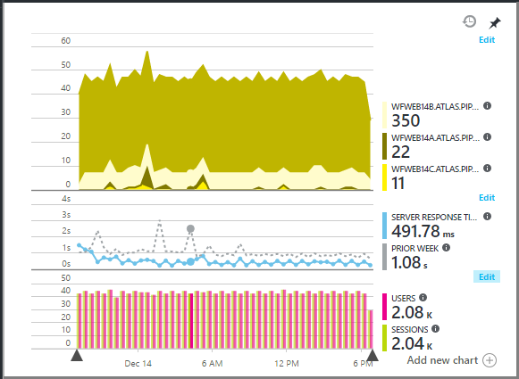

You find metrics charts everywhere in the Application Insights portal. In most cases, they can be customized, and you can add more charts to the blade. From the Overview blade, click through to more detailed charts (which have titles such as "Servers"), or click **Metrics Explorer** to open a new blade where you can create custom charts.

## Time range
You can change the Time range covered by the charts or grids on any blade.

If you're expecting some data that hasn't appeared yet, click Refresh. Charts refresh themselves at intervals, but the intervals are longer for larger time ranges. It can take a while for data to come through the analysis pipeline onto a chart.

To zoom into part of a chart, drag over it:

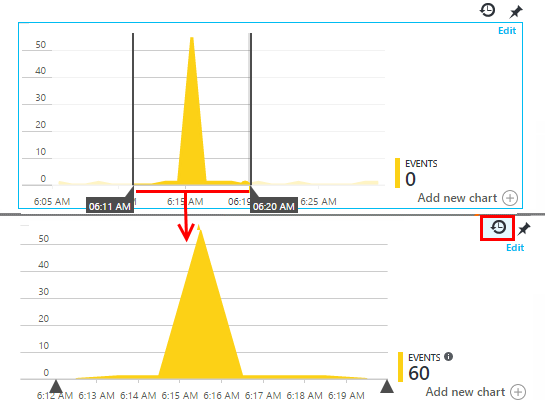

Click the Undo Zoom button to restore it.

## Granularity and point values
Hover your mouse over the chart to display the values of the metrics at that point.

The value of the metric at a particular point is aggregated over the preceding sampling interval.

The sampling interval or "granularity" is shown at the top of the blade.

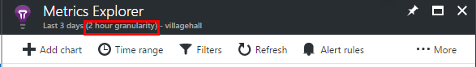

You can adjust the granularity in the Time range blade:

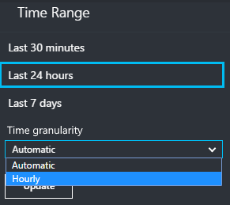

The granularities available depend on the time range you select. The explicit granularities are alternatives to the "automatic" granularity for the time range.

## Editing charts and grids
To add a new chart to the blade:

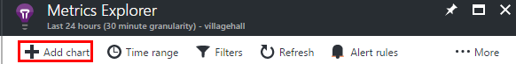

Select **Edit** on an existing or new chart to edit what it shows:

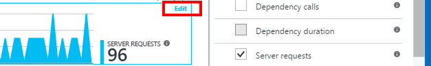

You can display more than one metric on a chart, though there are restrictions about the combinations that can be displayed together. As soon as you choose one metric, some of the others are disabled.

If you coded [custom metrics][track] into your app (calls to TrackMetric and TrackEvent) they will be listed here.

## Segment your data
You can split a metric by property - for example, to compare page views on clients with different operating systems.

Select a chart or grid, switch on grouping and pick a property to group by:

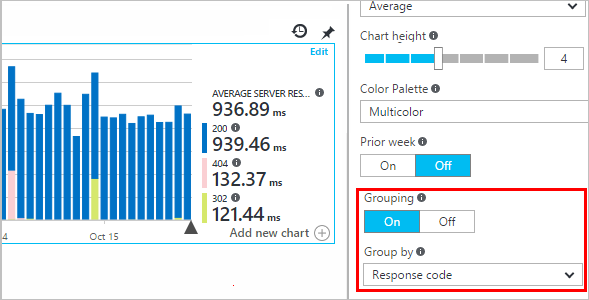

> [!NOTE]
> When you use grouping, the Area and Bar chart types provide a stacked display. This is suitable where the Aggregation method is Sum. But where the aggregation type is Average, choose the Line or Grid display types.
>
>

If you coded [custom metrics][track] into your app and they include property values, you'll be able to select the property in the list.

Is the chart too small for segmented data? Adjust its height:

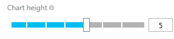

## Aggregation types
The legend at the side by default usually shows the aggregated value over the period of the chart. If you hover over the chart, it shows the value at that point.

Each data point on the chart is an aggregate of the data values received in the preceding sampling interval or "granularity". The granularity is shown at the top of the blade, and varies with the overall timescale of the chart.

Metrics can be aggregated in different ways:

* **Count** is a count of the events received in the sampling interval. It is used for events such as requests. Variations in the height of the chart indicates variations in the rate at which the events occur. But note that the numeric value changes when you change the sampling interval.
* **Sum** adds up the values of all the data points received over the sampling interval, or the period of the chart.
* **Average** divides the Sum by the number of data points received over the interval.
* **Unique** counts are used for counts of users and accounts. Over the sampling interval, or over the period of the chart, the figure shows the count of different users seen in that time.
* **%** - percentage versions of each aggregation are used only with segmented charts. The total always adds up to 100%, and the chart shows the relative contribution of different components of a total.

    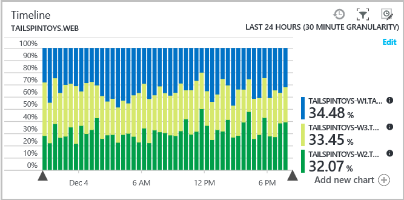

### Change the aggregation type

The default method for each metric is shown when you create a new chart or when all metrics are deselected:

## Pin Y-axis 
By default a chart shows Y axis values starting from zero till maximum values in the data range, to give a visual representation of quantum of the values. But in some cases more than the quantum it might be interesting to visually inspect minor changes in values. For customizations like this use the Y-axis range editing feature to pin the Y-axis minimum or maximum value at desired place.
Click on "Advanced Settings" check box to bring up the Y-axis range Settings

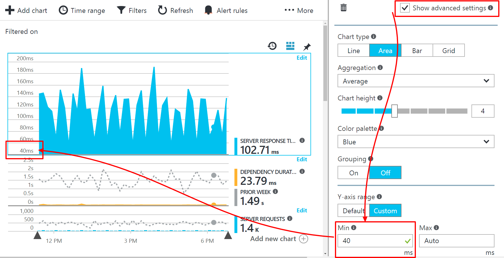

## Filter your data
To see just the metrics for a selected set of property values:

If you don't select any values for a particular property, it's the same as selecting them all: there is no filter on that property.

Notice the counts of events alongside each property value. When you select values of one property, the counts alongside other property values are adjusted.

Filters apply to all the charts on a blade. If you want different filters applied to different charts, create and save different metrics blades. If you want, you can pin charts from different blades to the dashboard, so that you can see them alongside each other.

### Remove bot and web test traffic
Use the filter **Real or synthetic traffic** and check **Real**.

You can also filter by **Source of synthetic traffic**.

### To add properties to the filter list
Would you like to filter telemetry on a category of your own choosing? For example, maybe you divide up your users into different categories, and you would like segment your data by these categories.

[Create your own property](../../azure-monitor/app/api-custom-events-metrics.md#properties). Set it in a [Telemetry Initializer](../../azure-monitor/app/api-custom-events-metrics.md#defaults) to have it appear in all telemetry - including the standard telemetry sent by different SDK modules.

## Edit the chart type
Notice that you can switch between grids and graphs:

## Save your metrics blade
When you've created some charts, save them as a favorite. You can choose whether to share it with other team members, if you use an organizational account.

To see the blade again, **go to the overview blade** and open Favorites:

If you chose Relative time range when you saved, the blade will be updated with the latest metrics. If you chose Absolute time range, it will show the same data every time.

## Reset the blade
If you edit a blade but then you'd like to get back to the original saved set, just click Reset.

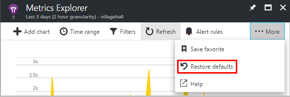

## Live metrics stream

For a much more immediate view of your telemetry, open [Live Stream](live-stream.md). Most metrics take a few minutes to appear, because of the process of aggregation. By contrast, live metrics are optimized for low latency. 

## Set alerts
To be notified by email of unusual values of any metric, add an alert. You can choose either to send the email to the account administrators, or to specific email addresses.

[Learn more about alerts][alerts].

## Continuous Export
If you want data continuously exported so that you can process it externally, consider using [Continuous export](../../azure-monitor/app/export-telemetry.md).

### Power BI
If you want even richer views of your data, you can [export to Power BI](https://blogs.msdn.com/b/powerbi/archive/2015/11/04/explore-your-application-insights-data-with-power-bi.aspx).

## Analytics
[Analytics](../../azure-monitor/app/analytics.md) is a more versatile way to analyze your telemetry using a powerful query language. Use it if you want to combine or compute results from metrics, or perform an in-depth exploration of your app's recent performance. 

From a metric chart, you can click the Analytics icon to get directly to the equivalent Analytics query.

## Troubleshooting
*I don't see any data on my chart.*

* Filters apply to all the charts on the blade. Make sure that, while you're focusing on one chart, you didn't set a filter that excludes all the data on another.

    If you want to set different filters on different charts, create them in different blades, save them as separate favorites. If you want, you can pin them to the dashboard so that you can see them alongside each other.
* If you group a chart by a property that is not defined on the metric, then there will be nothing on the chart. Try clearing 'group by', or choose a different grouping property.
* Performance data (CPU, IO rate, and so on) is available for Java web services, Windows desktop apps, [IIS web apps and services if you install status monitor](../../azure-monitor/app/monitor-performance-live-website-now.md), and [Azure Cloud Services](../../azure-monitor/app/app-insights-overview.md). It isn't available for Azure websites.

## Video

> [!VIDEO https://channel9.msdn.com/events/Connect/2016/112/player]

## Next steps
* [Monitoring usage with Application Insights](../../azure-monitor/app/usage-overview.md)
* [Using Diagnostic Search](../../azure-monitor/app/diagnostic-search.md)

<!--Link references-->

[alerts]: ../../azure-monitor/app/alerts.md
[start]: ../../azure-monitor/app/app-insights-overview.md
[track]: ../../azure-monitor/app/api-custom-events-metrics.md
