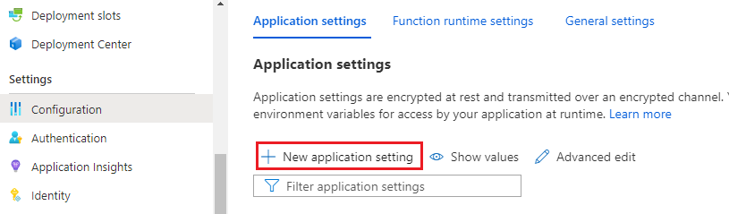

# Monitor Azure Functions with Azure Monitor Application Insights

[Azure Functions](../../azure-functions/functions-overview.md) offers built-in integration with Application Insights to monitor functions. For languages other than .NET and .NET Core, other language-specific workers/extensions are needed to get the full benefits of distributed tracing.

Application Insights collects log, performance, and error data and automatically detects performance anomalies. Application Insights includes powerful analytics tools to help you diagnose issues and understand how your functions are used. When you have visibility into your application data, you can continually improve performance and usability. You can even use Application Insights during local function app project development.

The required Application Insights instrumentation is built into Azure Functions. All you need is a valid connection string to connect your function app to an Application Insights resource. The connection string should be added to your application settings when your function app resource is created in Azure. If your function app doesn't already have a connection string, you can set it manually. For more information, see [Monitor executions in Azure Functions](../../azure-functions/functions-monitoring.md?tabs=cmd) and [Connection strings](sdk-connection-string.md).

[!INCLUDE [azure-monitor-log-analytics-rebrand](../../../includes/azure-monitor-instrumentation-key-deprecation.md)]

For a list of supported auto-instrumentation scenarios, see [Supported environments, languages, and resource providers](codeless-overview.md#supported-environments-languages-and-resource-providers).

## Distributed tracing for Java applications (preview)

This feature is currently in public preview for Java Azure Functions for both Windows and Linux.

> [!Note]
> This feature used to have an 8- to 9-second cold startup implication, which has been reduced to less than 1 second. If you were an early adopter of this feature (for example, prior to February 2023), review the "Troubleshooting" section to update to the current version and benefit from the new faster startup.

To view more data from your Java-based Azure Functions applications than is [collected by default](../../azure-functions/functions-monitoring.md?tabs=cmd), enable the [Application Insights Java 3.x agent](./java-in-process-agent.md). This agent allows Application Insights to automatically collect and correlate dependencies, logs, and metrics from popular libraries and Azure SDKs. This telemetry is in addition to the request telemetry already captured by Functions.

By using the application map and having a more complete view of end-to-end transactions, you can better diagnose issues. You have a topological view of how systems interact along with data on average performance and error rates. You also have more data for end-to-end diagnostics. You can use the application map to easily find the root cause of reliability issues and performance bottlenecks on a per-request basis.

For more advanced use cases, you can modify telemetry by adding spans, updating span status, and adding span attributes. You can also send custom telemetry by using standard APIs.

### Enable distributed tracing for Java function apps

1. **Option 1**: On the function app **Overview** pane, go to **Application Insights**. Under **Collection Level**, select **Recommended**.

    > [!div class="mx-imgBorder"]
    > 

2. **Option 2**: On the function app **Overview** pane, go to **Configuration**. Under **Application settings**, select **New application setting**.

    > [!div class="mx-imgBorder"]
    > 

    Add an application setting with the following values and select **Save**.

    ```
    APPLICATIONINSIGHTS_ENABLE_AGENT: true
    ```

### Troubleshooting

Your Java functions might have slow startup times if you adopted this feature before February 2023. Follow the steps to fix the issue.

#### Windows

1. Check to see if the following settings exist and remove them:

    ```
    XDT_MicrosoftApplicationInsights_Java -> 1
    ApplicationInsightsAgent_EXTENSION_VERSION -> ~2
    ```

1. Enable the latest version by adding this setting:
    
    ```
    APPLICATIONINSIGHTS_ENABLE_AGENT: true
    ```

#### Linux Dedicated/Premium

1. Check to see if the following settings exist and remove them:

    ```
    ApplicationInsightsAgent_EXTENSION_VERSION -> ~3
    ```

1. Enable the latest version by adding this setting:
    
    ```
    APPLICATIONINSIGHTS_ENABLE_AGENT: true
    ```

> [!NOTE]
> If the latest version of the Application Insights Java agent isn't available in Azure Functions, upload it manually by following [these instructions](https://github.com/Azure/azure-functions-java-worker/wiki/Distributed-Tracing-for-Java-Azure-Functions#customize-distribute-agent).

[!INCLUDE [azure-monitor-app-insights-test-connectivity](../../../includes/azure-monitor-app-insights-test-connectivity.md)]

## Distributed tracing for Python function apps

To collect custom telemetry from services such as Redis, Memcached, and MongoDB, use the [OpenCensus Python extension](https://github.com/census-ecosystem/opencensus-python-extensions-azure) and [log your telemetry](../../azure-functions/functions-reference-python.md?tabs=azurecli-linux%2capplication-level#log-custom-telemetry). You can find the list of supported services in this [GitHub folder](https://github.com/census-instrumentation/opencensus-python/tree/master/contrib).

## Next steps

* Read more instructions and information about [monitoring Azure Functions](../../azure-functions/functions-monitoring.md).
* Get an overview of [distributed tracing](./distributed-tracing.md).
* See what [Application Map](./app-map.md?tabs=net) can do for your business.
* Read about [requests and dependencies for Java apps](./java-in-process-agent.md).
* Learn more about [Azure Monitor](../overview.md) and [Application Insights](./app-insights-overview.md).
