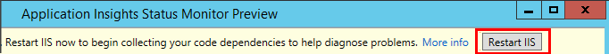

# Instrument web apps at runtime with Application Insights Codeless Attach

You can instrument a live web app with Azure Application Insights, without having to modify or redeploy your code. You need a [Microsoft Azure](https://azure.com) subscription.

Status Monitor is used to instrument a .NET application hosted in IIS either on-premises or in a VM.

- If your app is deployed into Azure VM or Azure virtual machine scale set, follow [these instructions](azure-vm-vmss-apps.md).
- If your app is deployed into Azure app services, follow [these instructions](azure-web-apps.md).
- If your app is deployed in an Azure VM, you can switch on Application Insights monitoring from the Azure control panel.
- (There are also separate articles about instrumenting [Azure Cloud Services](../../azure-monitor/app/cloudservices.md).)


You have a choice of two routes to apply Application Insights to your .NET web applications:

* **Build time:** [Add the Application Insights SDK][greenbrown] to your web app code.
* **Run time:** Instrument your web app on the server, as described below, without rebuilding and redeploying the code.

> [!NOTE]
> If you use build time instrumentation, run time instrumention will not work even if it is turned on.

Here's a summary of what you get by each route:

|  | Build time | Run time |
| --- | --- | --- |
| Requests & exceptions |Yes |Yes |
| [More detailed exceptions](../../azure-monitor/app/asp-net-exceptions.md) | |Yes |
| [Dependency diagnostics](../../azure-monitor/app/asp-net-dependencies.md) |On .NET 4.6+, but less detail |Yes, full detail: result codes, SQL command text, HTTP verb|
| [System performance counters](../../azure-monitor/app/performance-counters.md) |Yes |Yes |
| [API for custom telemetry][api] |Yes |No |
| [Trace log integration](../../azure-monitor/app/asp-net-trace-logs.md) |Yes |No |
| [Page view & user data](../../azure-monitor/app/javascript.md) |Yes |No |
| Need to rebuild code |Yes | No |


## Monitor a live IIS web app

If your app is hosted on an IIS server, enable Application Insights by using Status Monitor.

1. On your IIS web server, sign in with administrator credentials.
2. If Application Insights Status Monitor is not already installed, [download and run the installer](#download)
3. In Status Monitor, select the installed web application or website that you want to monitor. Sign in with your Azure credentials.

    Configure the resource where you want to see the results in the Application Insights portal. (Normally, it's best to create a new resource. Select an existing resource if you already have [web tests][availability] or [client monitoring][client] for this app.) 

    

4. Restart IIS.

    

    Your web service is interrupted for a short while.

## Customize monitoring options

Enabling Application Insights adds DLLs and ApplicationInsights.config to your web app. You can [edit the .config file](../../azure-monitor/app/configuration-with-applicationinsights-config.md) to change some of the options.

## When you re-publish your app, re-enable Application Insights

Before you re-publish your app, consider [adding Application Insights to the code in Visual Studio][greenbrown]. You'll get more detailed telemetry and the ability to write custom telemetry.

If you want to re-publish without adding Application Insights to the code, be aware that the deployment process may delete the DLLs and ApplicationInsights.config from the published web site. Therefore:

1. If you edited ApplicationInsights.config, take a copy of it before you re-publish your app.
2. Republish your app.
3. Re-enable Application Insights monitoring. (Use the appropriate method: either the Azure web app control panel, or the Status Monitor on an IIS host.)
4. Reinstate any edits you performed on the .config file.


## <a name="troubleshoot"></a>Troubleshooting

### Confirm a valid installation 

These are some steps that you can perform to confirm that your installation was successful.

- Confirm that the applicationInsights.config file is present in the target app directory and contains your ikey.

- If you suspect that data is missing you can run a simple query in [Analytics](../log-query/get-started-portal.md) to list all the cloud roles currently sending telemetry.
  ```Kusto
  union * | summarize count() by cloud_RoleName, cloud_RoleInstance
  ```

- If you need to confirm that Application Insights is successfully attached you can run [Sysinternals Handle](https://docs.microsoft.com/sysinternals/downloads/handle) in a command window to confirm that applicationinsights.dll has been loaded by IIS.
  ```cmd
  handle.exe /p w3wp.exe
  ```


### Can't connect? No telemetry?

* Open [the necessary outgoing ports](../../azure-monitor/app/ip-addresses.md#outgoing-ports) in your server's firewall to allow Status Monitor to work.

### Unable to login

* If Status Monitor cannot login, do a command line install instead. Status Monitor attempts to login to collect your ikey, but you can provide this manually using the command:

```powershell
Import-Module 'C:\Program Files\Microsoft Application Insights\Status Monitor\PowerShell\Microsoft.Diagnostics.Agent.StatusMonitor.PowerShell.dll'
Start-ApplicationInsightsMonitoring -Name appName -InstrumentationKey 00000000-000-000-000-0000000
```

### Could not load file or assembly 'System.Diagnostics.DiagnosticSource'

You may get this error after enabling Application Insights. This is because the installer replaces this dll in your bin directory.
To fix update your web.config:

```xml
<dependentAssembly>
    <assemblyIdentity name="System.Diagnostics.DiagnosticSource" publicKeyToken="cc7b13ffcd2ddd51"/>
    <bindingRedirect oldVersion="0.0.0.0-4.*.*.*" newVersion="4.0.2.1"/>
</dependentAssembly>
```

We are tracking this issue [here](https://github.com/Microsoft/ApplicationInsights-Home/issues/301).


### Application diagnostic messages

* Open Status Monitor and select your application on left pane. Check if there are any diagnostics messages for this application in the "Configuration notifications" section:

  
  
### Detailed logs

* By default Status Monitor will output diagnostic logs at: `C:\Program Files\Microsoft Application Insights\Status Monitor\diagnostics.log`

* To output verbose logs, modify the config file: `C:\Program Files\Microsoft Application Insights\Status Monitor\Microsoft.Diagnostics.Agent.StatusMonitor.exe.config` and add `<add key="TraceLevel" value="All" />` to the `appsettings`.
Then restart status monitor.

* As Status Monitor is a .NET application you can also enable [.net tracing by adding the appropriate diagnostics to the config file](https://docs.microsoft.com/dotnet/framework/configure-apps/file-schema/trace-debug/system-diagnostics-element). For example, in some scenarios it can be useful to see what's happening at the network level by [configuring network tracing](https://docs.microsoft.com/dotnet/framework/network-programming/how-to-configure-network-tracing)

### Insufficient permissions
  
* On the server, if you see a message about "insufficient permissions", try the following:
  * In IIS Manager, select your application pool, open **Advanced Settings**, and under **Process Model** note the identity.
  * In Computer management control panel, add this identity to the Performance Monitor Users group.

### Conflict with Systems Center Operations Manager

* If you have MMA/SCOM (Systems Center Operations Manager) installed on your server, some versions can conflict. Uninstall both SCOM and Status Monitor, and re-install the latest versions.

### Failed or incomplete installation

If Status Monitor fails during an installation, you could be left with an incomplete install that Status Monitor is unable to recover from. This will require a manual reset.

Delete any of these files found in your application directory:
- Any DLLs in your bin directory starting with either "Microsoft.AI." or "Microsoft.ApplicationInsights.".
- This DLL in your bin directory "Microsoft.Web.Infrastructure.dll"
- This DLL in your bin directory "System.Diagnostics.DiagnosticSource.dll"
- In your application directory remove "App_Data\packages"
- In your application directory remove "applicationinsights.config"


### Additional Troubleshooting

* See Additional [Troubleshooting][qna].

## System Requirements
OS support for Application Insights Status Monitor on Server:

* Windows Server 2008
* Windows Server 2008 R2
* Windows Server 2012
* Windows server 2012 R2
* Windows Server 2016

with latest SP and .NET Framework 4.5 (Status Monitor is built on this version of the framework)

On the client side: Windows 7, 8, 8.1 and 10, again with .NET Framework 4.5

IIS support is: IIS 7, 7.5, 8, 8.5
(IIS is required)

## Automation with PowerShell
You can start and stop monitoring by using PowerShell on your IIS server.

First import the Application Insights module:

`Import-Module 'C:\Program Files\Microsoft Application Insights\Status Monitor\PowerShell\Microsoft.Diagnostics.Agent.StatusMonitor.PowerShell.dll'`

Find out which apps are being monitored:

`Get-ApplicationInsightsMonitoringStatus [-Name appName]`

* `-Name` (Optional) The name of a web app.
* Displays the Application Insights monitoring status for each web app (or the named app) in this IIS server.
* Returns `ApplicationInsightsApplication` for each app:

  * `SdkState==EnabledAfterDeployment`: App is being monitored, and was instrumented at run time, either by the Status Monitor tool, or by `Start-ApplicationInsightsMonitoring`.
  * `SdkState==Disabled`: The app is not instrumented for Application Insights. Either it was never instrumented, or run-time monitoring was disabled with the Status Monitor tool or with `Stop-ApplicationInsightsMonitoring`.
  * `SdkState==EnabledByCodeInstrumentation`: The app was instrumented by adding the SDK to the source code. Its SDK cannot be updated or stopped.
  * `SdkVersion` shows the version in use for monitoring this app.
  * `LatestAvailableSdkVersion`shows the version currently available on the NuGet gallery. To upgrade the app to this version, use `Update-ApplicationInsightsMonitoring`.

`Start-ApplicationInsightsMonitoring -Name appName -InstrumentationKey 00000000-000-000-000-0000000`

* `-Name` The name of the app in IIS
* `-InstrumentationKey` The ikey of the Application Insights resource where you want the results to be displayed.
* This cmdlet only affects apps that are not already instrumented - that is, SdkState==NotInstrumented.

    The cmdlet does not affect an app that is already instrumented. It does not matter whether the app was instrumented at build time by adding the SDK to the code, or at run time by a previous use of this cmdlet.

    The SDK version used to instrument the app is the version that was most recently downloaded to this server.

    To download the latest version, use Update-ApplicationInsightsVersion.
* Returns `ApplicationInsightsApplication` on success. If it fails, it logs a trace to stderr.

          Name                      : Default Web Site/WebApp1
          InstrumentationKey        : 00000000-0000-0000-0000-000000000000
          ProfilerState             : ApplicationInsights
          SdkState                  : EnabledAfterDeployment
          SdkVersion                : 1.2.1
          LatestAvailableSdkVersion : 1.2.3

`Stop-ApplicationInsightsMonitoring [-Name appName | -All]`

* `-Name` The name of an app in IIS
* `-All` Stops monitoring all apps in this IIS server for which `SdkState==EnabledAfterDeployment`
* Stops monitoring the specified apps and removes instrumentation. It only works for apps that have been instrumented at run-time using the Status Monitoring tool or Start-ApplicationInsightsApplication. (`SdkState==EnabledAfterDeployment`)
* Returns ApplicationInsightsApplication.

`Update-ApplicationInsightsMonitoring -Name appName [-InstrumentationKey "0000000-0000-000-000-0000"`]

* `-Name`: The name of a web app in IIS.
* `-InstrumentationKey` (Optional.) Use this to change the resource to which the app's telemetry is sent.
* This cmdlet:
  * Upgrades the named app to the version of the SDK most recently downloaded to this machine. (Only works if `SdkState==EnabledAfterDeployment`)
  * If you provide an instrumentation key, the named app is reconfigured to send telemetry to the resource with that key. (Works if `SdkState != Disabled`)

`Update-ApplicationInsightsVersion`

* Downloads the latest Application Insights SDK to the server.

## <a name="questions"></a>Questions about Status Monitor

### What is Status Monitor?

A desktop application that you install in your IIS web server. It helps you instrument and configure web apps. 

### When do I use Status Monitor?

* To instrument any web app that is running on your IIS server - even if it is already running.
* To enable additional telemetry for web apps that have been [built with the Application Insights SDK](../../azure-monitor/app/asp-net.md) at compile time. 

### Can I close it after it runs?

Yes. After it has instrumented the websites you select, you can close it.

It doesn't collect telemetry by itself. It just configures the web apps and sets some permissions.

### What does Status Monitor do?

When you select a web app for Status Monitor to instrument:

* Downloads and places the Application Insights assemblies and ApplicationInsights.config file in the web app's binaries folder.
* Enables CLR profiling to collect dependency calls.

### What version of Application Insights SDK does Status Monitor install?

As of now, Status Monitor can only install Application Insights SDK versions 2.3 or 2.4. 

The Application Insights SDK Version 2.4 is the [last version to support .NET 4.0](https://github.com/microsoft/ApplicationInsights-dotnet/releases/tag/v2.5.0-beta1) which was [EOL January 2016](https://devblogs.microsoft.com/dotnet/support-ending-for-the-net-framework-4-4-5-and-4-5-1/). Therefore, as of now Status Monitor can be used to instrument a .NET 4.0 application. 

### Do I need to run Status Monitor whenever I update the app?

Not if you redeploy incrementally. 

If you select the 'delete existing files' option in the publish process, you would need to re-run Status Monitor to configure Application Insights.

### What telemetry is collected?

For applications that you instrument only at run-time by using Status Monitor:

* HTTP requests
* Calls to dependencies
* Exceptions
* Performance counters

For applications already instrumented at compile time:

 * Process counters.
 * Dependency calls (.NET 4.5); return values in dependency calls (.NET 4.6).
 * Exception stack trace values.

[Learn more](https://apmtips.com/blog/2016/11/18/how-application-insights-status-monitor-not-monitors-dependencies/)

## Video

> [!VIDEO https://channel9.msdn.com/events/Connect/2016/100/player]

## <a name="download"></a>Download Status Monitor

- Use the new [PowerShell Module](https://docs.microsoft.com/azure/azure-monitor/app/status-monitor-v2-overview)
- Download and run the [Status Monitor installer](https://go.microsoft.com/fwlink/?LinkId=506648)
- Or run [Web Platform Installer](https://www.microsoft.com/web/downloads/platform.aspx) and search in it for Application Insights Status Monitor.

## <a name="next"></a>Next steps

View your telemetry:

* [Explore metrics](../../azure-monitor/app/metrics-explorer.md) to monitor performance and usage
* [Search events and logs][diagnostic] to diagnose problems
* [Analytics](../../azure-monitor/app/analytics.md) for more advanced queries

Add more telemetry:

* [Create web tests][availability] to make sure your site stays live.
* [Add web client telemetry][usage] to see exceptions from web page code and to let you insert trace calls.
* [Add Application Insights SDK to your code][greenbrown] so that you can insert trace and log calls

<!--Link references-->

[api]: ../../azure-monitor/app/api-custom-events-metrics.md
[availability]: monitor-web-app-availability.md
[client]: ../../azure-monitor/app/javascript.md
[diagnostic]: ../../azure-monitor/app/diagnostic-search.md
[greenbrown]: ../../azure-monitor/app/asp-net.md
[qna]: ../../azure-monitor/app/troubleshoot-faq.md
[roles]: ../../azure-monitor/app/resources-roles-access-control.md
[usage]: ../../azure-monitor/app/javascript.md
