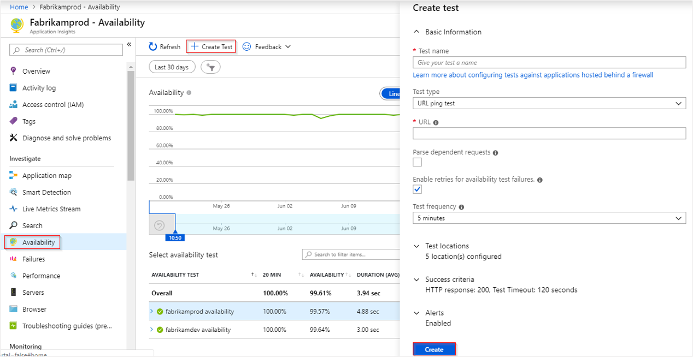
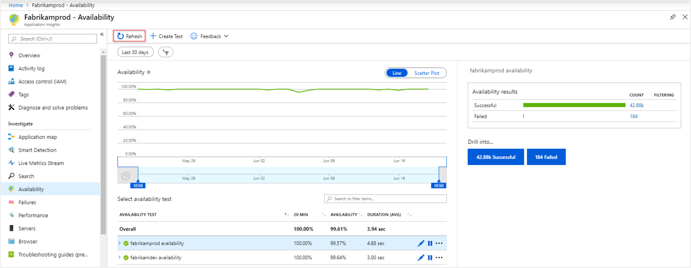
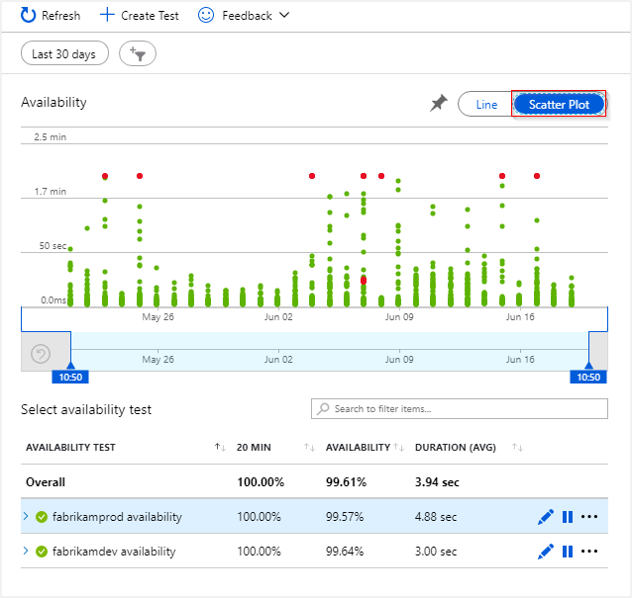
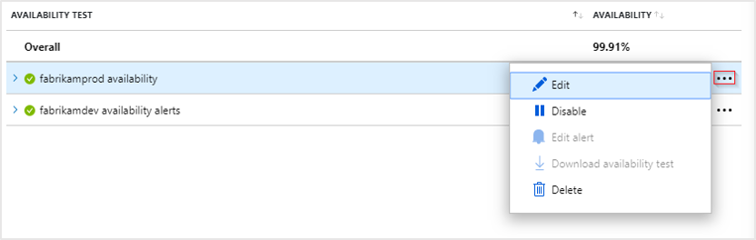
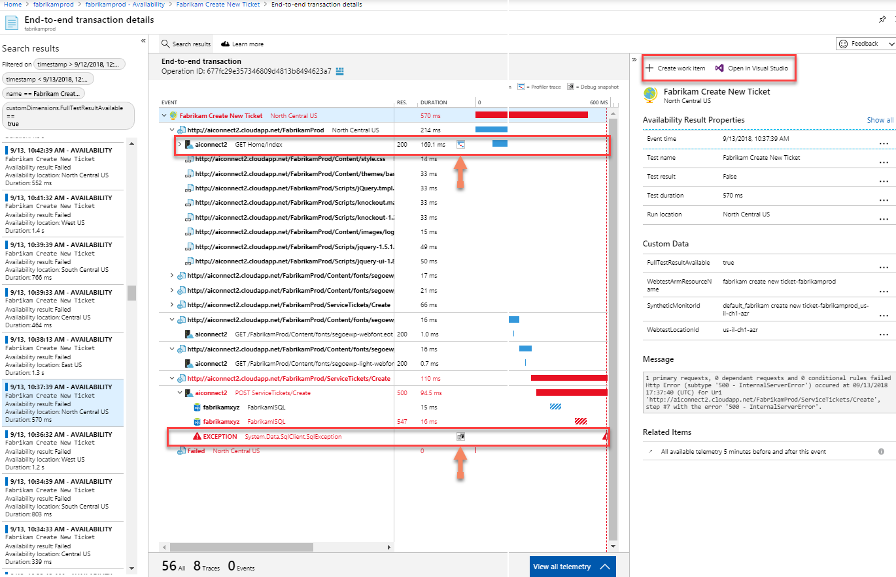
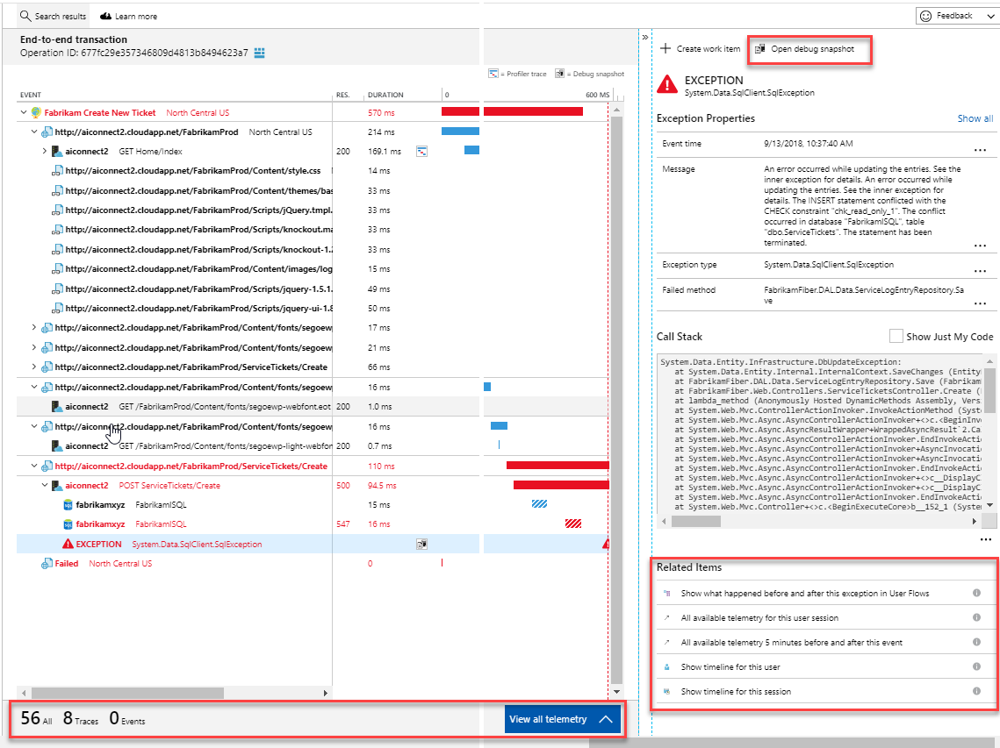

# Monitor the availability of any website

After you've deployed your web app/website, you can set up recurring tests to monitor availability and responsiveness. [Azure Application Insights](../../azure-monitor/app/app-insights-overview.md) sends web requests to your application at regular intervals from points around the world. It can alert you if your application isn't responding, or if it responds too slowly.

You can set up availability tests for any HTTP or HTTPS endpoint that is accessible from the public internet. You don't have to make any changes to the website you're testing. In fact, it doesn't even have to be a site you own. You can test the availability of a REST API that your service depends on.

### Types of availability tests:

There are three types of availability tests:

* [URL ping test](#create-a-url-ping-test): a simple test that you can create in the Azure portal.
* [Multi-step web test](availability-multistep.md): A recording of a sequence of web requests, which can be played back to test more complex scenarios. Multi-step web tests are created in Visual Studio Enterprise and uploaded to the portal for execution.
* [Custom Track Availability Tests](https://docs.microsoft.com/dotnet/api/microsoft.applicationinsights.telemetryclient.trackavailability?view=azure-dotnet): The `TrackAvailability()` method can be used to create your own custom availability tests.

**You can create up to 100 availability tests per Application Insights resource.**

## Create an Application Insights resource

In order to create an availability test, you first need to create an Application Insights resource. If you have already created a resource, proceed to the next section to [create a URL Ping test](#create-a-url-ping-test).

From the Azure portal, select **Create a resource** > **Developer Tools** > **Application Insights** and [create an Application Insights resource](create-new-resource.md).

## Create a URL ping test

The name "URL ping test" is a bit of a misnomer. To be clear, this test is not making any use of ICMP (Internet Control Message Protocol) to check your site's availability. Instead it uses more advanced HTTP request functionality to validate whether an endpoint is responding. It also measures the performance associated with that response,  and adds the ability to set custom success criteria coupled with more advanced features like parsing dependent requests, and allowing for retries.

To create your first availability request, open the Availability pane and select **Create Test**.

### Create a test

|Setting| Explanation
|----|----|----|
|**URL** |  The URL can be any web page you want to test, but it must be visible from the public internet. The URL can include a query string. So, for example, you can exercise your database a little. If the URL resolves to a redirect, we follow it up to 10 redirects.|
|**Parse dependent requests**| Test requests images, scripts, style files, and other files that are part of the web page under test. The recorded response time includes the time taken to get these files. The test fails if any of these resources cannot be successfully downloaded within the timeout for the whole test. If the option is not checked, the test only requests the file at the URL you specified. Enabling this option results in a stricter check. The test could fail for cases, which may not be noticeable when manually browsing the site.
|**Enable retries**|when the test fails, it is retried after a short interval. A failure is reported only if three successive attempts fail. Subsequent tests are then performed at the usual test frequency. Retry is temporarily suspended until the next success. This rule is applied independently at each test location. **We recommend this option**. On average, about 80% of failures disappear on retry.|
|**Test frequency**| Sets how often the test is run from each test location. With a default frequency of five minutes and five test locations, your site is tested on average every minute.|
|**Test locations**| Are the places from where our servers send web requests to your URL. **Our minimum number of recommended test locations is five** in order to insure that you can distinguish problems in your website from network issues. You can select up to 16 locations.

**If your URL is not visible from the public internet, you can choose to selectively open up your firewall to allow only the test transactions through**. To learn more about the firewall exceptions for our availability test agents, consult the [IP address guide](https://docs.microsoft.com/azure/azure-monitor/app/ip-addresses#availability-tests).

> [!NOTE]
> We strongly recommend testing from multiple locations with **a minimum of five locations**. This is to prevent false alarms that may result from transient issues with a specific location. In addition we have found that the optimal configuration is to have the **number of test locations be equal to the alert location threshold + 2**.

### Success criteria

|Setting| Explanation
|----|----|----|
| **Test timeout** |Decrease this value to be alerted about slow responses. The test is counted as a failure if the responses from your site have not been received within this period. If you selected **Parse dependent requests**, then all the images, style files, scripts, and other dependent resources must have been received within this period.|
| **HTTP response** | The returned status code that is counted as a success. 200 is the code that indicates that a normal web page has been returned.|
| **Content match** | A string, like "Welcome!" We test that an exact case-sensitive match occurs in every response. It must be a plain string, without wildcards. Don't forget that if your page content changes you might have to update it. **Only English characters are supported with content match** |

### Alerts

|Setting| Explanation
|----|----|----|
|**Near-realtime (Preview)** | We recommend using Near-realtime alerts. Configuring this type of alert is done after your availability test is created.  |
|**Classic** | We no longer recommended using classic alerts for new availability tests.|
|**Alert location threshold**|We recommend a minimum of 3/5 locations. The optimal relationship between alert location threshold and the number of test locations is **alert location threshold** = **number of test locations - 2, with a minimum of five test locations.**|

## See your availability test results

Availability test results can be visualized with both line and scatter plot views.

After a few minutes, click **Refresh** to see your test results.

The scatterplot view shows samples of the test results that have diagnostic test-step detail in them. The test engine stores diagnostic detail for tests that have failures. For successful tests, diagnostic details are stored for a subset of the executions. Hover over any of the green/red dots to see the test, test name, and location.

Select a particular test, location, or reduce the time period to see more results around the time period of interest. Use Search Explorer to see results from all executions, or use Analytics queries to run custom reports on this data.

## Inspect and edit tests

To edit, temporarily disable, or delete a test click the ellipses next to a test name. It may take up to 20 minutes for configuration changes to propagate to all test agents after a change is made.

You might want to disable availability tests or the alert rules associated with them while you are performing maintenance on your service.

## If you see failures

Click a red dot.

From an availability test result, you can see the transaction details across all components. Here you can:

* Inspect the response received from your server.
* Diagnose failure with correlated server-side telemetry collected while processing the failed availability test.
* Log an issue or work item in Git or Azure Boards to track the problem. The bug will contain a link to this event.
* Open the web test result in Visual Studio.

Learn more about the end to end transaction diagnostics experience [here](../../azure-monitor/app/transaction-diagnostics.md).

Click on the exception row to see the details of the server-side exception that caused the synthetic availability test to fail. You can also get the [debug snapshot](../../azure-monitor/app/snapshot-debugger.md) for richer code level diagnostics.

In addition to the raw results, you can also view two key Availability metrics in [Metrics Explorer](https://docs.microsoft.com/azure/azure-monitor/platform/metrics-getting-started):

1. Availability: Percentage of the tests that were successful, across all test executions.
2. Test Duration: Average test duration across all test executions.

## Automation

* [Use PowerShell scripts to set up an availability test](../../azure-monitor/app/powershell.md#add-an-availability-test) automatically.
* Set up a [webhook](../../azure-monitor/platform/alerts-webhooks.md) that is called when an alert is raised.

## Troubleshooting

Dedicated [troubleshooting article](troubleshoot-availability.md).

## Next steps

* [Availability Alerts](availability-alerts.md)
* [Multi-step web tests](availability-multistep.md)

