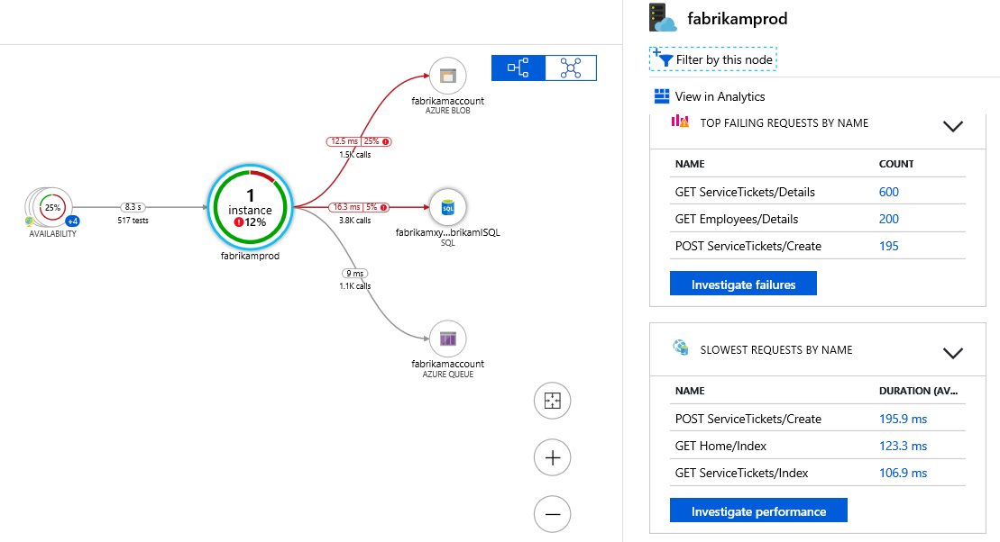
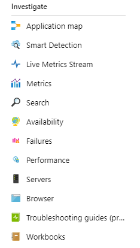

# Monitor your Node.js services and apps with Application Insights

[Azure Application Insights](../../azure-monitor/app/app-insights-overview.md) monitors your backend services and components after deployment, to help you discover and rapidly diagnose performance and other issues. You can use Application Insights for Node.js services that are hosted in your datacenter, in Azure VMs and web apps, and even in other public clouds.

To receive, store, and explore your monitoring data, include the SDK in your code, and then set up a corresponding Application Insights resource in Azure. The SDK sends data to that resource for further analysis and exploration.

The Node.js SDK can automatically monitor incoming and outgoing HTTP requests, exceptions, and some system metrics. Beginning in version 0.20, the SDK also can monitor some common third-party packages, like MongoDB, MySQL, and Redis. All events related to an incoming HTTP request are correlated for faster troubleshooting.

You can use the TelemetryClient API to manually instrument and monitor additional aspects of your app and system. We describe the TelemetryClient API in more detail later in this article.

## Get started

Complete the following tasks to set up monitoring for an app or service.

### Prerequisites

Before you begin, make sure that you have an Azure subscription, or [get a new one for free][azure-free-offer]. If your organization already has an Azure subscription, an administrator can follow [these instructions][add-aad-user] to add you to it.

[azure-free-offer]: https://azure.microsoft.com/free/
[add-aad-user]: https://docs.microsoft.com/azure/active-directory/active-directory-users-create-azure-portal


### <a name="resource"></a> Set up an Application Insights resource


1. Sign in to the [Azure portal][portal].
2. Select **Create a resource** > **Developer tools** > **Application Insights**. The resource includes an endpoint for receiving telemetry data, storage for this data, saved reports and dashboards, rule and alert configuration, and more.

3. On the resource creation page, in the **Application Type** box, select **Node.js Application**. The app type determines the default dashboards and reports that are created. (Any Application Insights resource can collect data from any language and platform.)

### <a name="sdk"></a> Set up the Node.js SDK

Include the SDK in your app, so it can gather data. 

1. Copy your resource's Instrumentation Key (also called an *ikey*) from the Azure portal. Application Insights uses the ikey to map data to your Azure resource. Before the SDK can use your ikey, you must specify the ikey in an environment variable or in your code.  

   

2. Add the Node.js SDK library to your app's dependencies via package.json. From the root folder of your app, run:

   ```bash
   npm install applicationinsights --save
   ```

3. Explicitly load the library in your code. Because the SDK injects instrumentation into many other libraries, load the library as early as possible, even before other `require` statements. 

   At the top of your first .js file, add the following code. The `setup` method configures the ikey (and thus, the Azure resource) to be used by default for all tracked items.

   ```javascript
   const appInsights = require("applicationinsights");
   appInsights.setup("<instrumentation_key>");
   appInsights.start();
   ```
   
   You also can provide an ikey via the environment variable APPINSIGHTS\_INSTRUMENTATIONKEY, instead of passing it manually to  `setup()` or `new appInsights.TelemetryClient()`. This practice lets you keep ikeys out of committed source code, and you can specify different ikeys for different environments.

   For additional configuration options, see the following sections.

   You can try the SDK without sending telemetry by setting `appInsights.defaultClient.config.disableAppInsights = true`.

### <a name="monitor"></a> Monitor your app

The SDK automatically gathers telemetry about the Node.js runtime and about some common third-party modules. Use your application to generate some of this data.

Then, in the [Azure portal][portal] go to the Application Insights resource that you created earlier. In the **Overview timeline**, look for your first few data points. To see more detailed data, select different components in the charts.

To view the topology that is discovered for your app, select the **Application map** button. Select components in the map to see more details.



To learn more about your app, and to troubleshoot problems, in the **INVESTIGATE** section, select the other views that are available.



#### No data?

Because the SDK batches data for submission, there might be a delay before items are displayed in the portal. If you don't see data in your resource, try some of the following fixes:

* Continue to use the application. Take more actions to generate more telemetry.
* Click **Refresh** in the portal resource view. Charts periodically refresh on their own, but manually refreshing forces them to refresh immediately.
* Verify that [required outgoing ports](../../azure-monitor/app/ip-addresses.md) are open.
* Use [Search](../../azure-monitor/app/diagnostic-search.md) to look for specific events.
* Check the [FAQ][FAQ].


## SDK configuration

The SDK's configuration methods and default values are listed in the following code example.

To fully correlate events in a service, be sure to set `.setAutoDependencyCorrelation(true)`. With this option set, the SDK can track context across asynchronous callbacks in Node.js.

```javascript
const appInsights = require("applicationinsights");
appInsights.setup("<instrumentation_key>")
    .setAutoDependencyCorrelation(true)
    .setAutoCollectRequests(true)
    .setAutoCollectPerformance(true)
    .setAutoCollectExceptions(true)
    .setAutoCollectDependencies(true)
    .setAutoCollectConsole(true)
    .setUseDiskRetryCaching(true)
    .start();
```

## TelemetryClient API

For a full description of the TelemetryClient API, see [Application Insights API for custom events and metrics](../../azure-monitor/app/api-custom-events-metrics.md).

You can track any request, event, metric, or exception by using the Application Insights Node.js SDK. The following code example demonstrates some of the APIs that you can use:

```javascript
let appInsights = require("applicationinsights");
appInsights.setup().start(); // assuming ikey is in env var
let client = appInsights.defaultClient;

client.trackEvent({name: "my custom event", properties: {customProperty: "custom property value"}});
client.trackException({exception: new Error("handled exceptions can be logged with this method")});
client.trackMetric({name: "custom metric", value: 3});
client.trackTrace({message: "trace message"});
client.trackDependency({target:"http://dbname", name:"select customers proc", data:"SELECT * FROM Customers", duration:231, resultCode:0, success: true, dependencyTypeName: "ZSQL"});
client.trackRequest({name:"GET /customers", url:"http://myserver/customers", duration:309, resultCode:200, success:true});

let http = require("http");
http.createServer( (req, res) => {
  client.trackNodeHttpRequest({request: req, response: res}); // Place at the beginning of your request handler
});
```

### Track your dependencies

Use the following code to track your dependencies:

```javascript
let appInsights = require("applicationinsights");
let client = appInsights.defaultClient;

var success = false;
let startTime = Date.now();
// Execute dependency call here...
let duration = Date.now() - startTime;
success = true;

client.trackDependency({dependencyTypeName: "dependency name", name: "command name", duration: duration, success: success});
```

### Add a custom property to all events

Use the following code to add a custom property to all events:

```javascript
appInsights.defaultClient.commonProperties = {
	environment: process.env.SOME_ENV_VARIABLE
};
```

### Track HTTP GET requests

Use the following code to track HTTP GET requests:

```javascript
var server = http.createServer((req, res) => {
	if ( req.method === "GET" ) {
			appInsights.defaultClient.trackNodeHttpRequest({request: req, response: res});
	}
	// Other work here...
	res.end();
});
```

### Track server startup time

Use the following code to track server startup time:

```javascript
let start = Date.now();
server.on("listening", () => {
	let duration = Date.now() - start;
	appInsights.defaultClient.trackMetric({name: "server startup time", value: duration});
});
```

## Next steps

* [Monitor your telemetry in the portal](../../azure-monitor/app/overview-dashboard.md)
* [Write Analytics queries over your telemetry](../../azure-monitor/log-query/get-started-portal.md)

<!--references-->

[portal]: https://portal.azure.com/
[FAQ]: ../../azure-monitor/app/troubleshoot-faq.md

