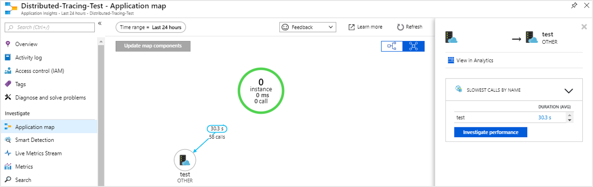
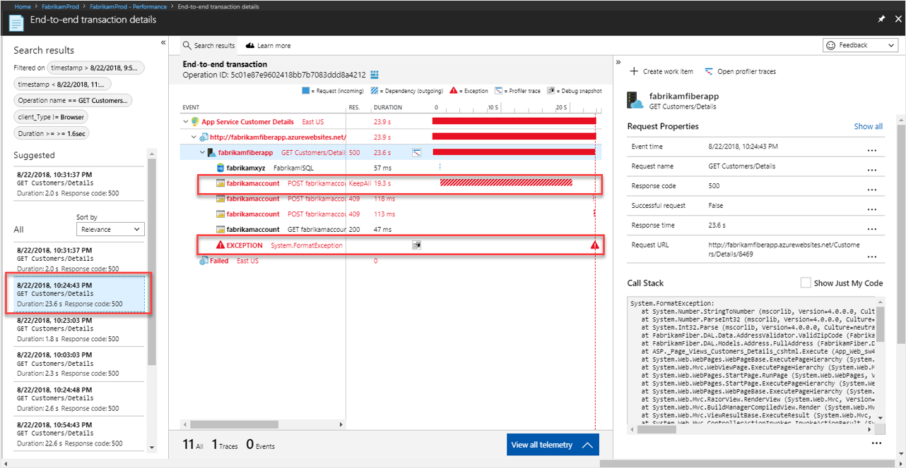

# Collect distributed traces from Go (Preview)

Application Insights now supports distributed tracing of Go applications through integration with [OpenCensus](https://opencensus.io) and our new [local forwarder](./opencensus-local-forwarder.md). This article will walk you step-by-step through the process of setting up OpenCensus for Go and getting your trace data to Application Insights.

## Prerequisites

- You need an Azure Subscription.
- Go should be installed, this article uses the version 1.11 [Go Download](https://golang.org/dl/).
- Follow the instructions to install the [local forwarder as a Windows service](./opencensus-local-forwarder.md).

If you don't have an Azure subscription, create a [free](https://azure.microsoft.com/free/) account before you begin.

## Sign in to the Azure portal

Sign in to the [Azure portal](https://portal.azure.com/).

## Create Application Insights resource

First you have to create an Application Insights resource which will generate an instrumentation key (ikey). The ikey is then used to configure the local forwarder to send distributed traces from your OpenCensus instrumented application, to Application Insights.   

1. Select **Create a resource** > **Developer Tools** > **Application Insights**.

   

   A configuration box appears; use the following table to fill out the input fields.

    | Settings        | Value           | Description  |
   | ------------- |:-------------|:-----|
   | **Name**      | Globally Unique Value | Name that identifies the app you are monitoring |
   | **Application Type** | General | Type of app you are monitoring |
   | **Resource Group**     | myResourceGroup      | Name for the new resource group to host App Insights data |
   | **Location** | East US | Choose a location near you, or near where your app is hosted |

2. Click **Create**.

## Configure local forwarder

1. Select **Overview** > **Essentials** > Copy your application's **Instrumentation Key**.

   

2. Edit your `LocalForwarder.config` file and add your instrumentation key. If you followed the instructions in the [pre-requisite](./opencensus-local-forwarder.md) the file is located at `C:\LF-WindowsServiceHost`

    ```xml
      <OpenCensusToApplicationInsights>
        <!--
          Instrumentation key to track telemetry to.
          -->
        <InstrumentationKey>{enter-instrumentation-key}</InstrumentationKey>
      </OpenCensusToApplicationInsights>
    
      <!-- Describes aspects of processing Application Insights telemetry-->
      <ApplicationInsights>
        <LiveMetricsStreamInstrumentationKey>{enter-instrumentation-key}</LiveMetricsStreamInstrumentationKey>
      </ApplicationInsights>
    </LocalForwarderConfiguration>
    ```

3. Restart the application **Local Forwarder** service.

## OpenCensus Go packages

1. Install the Open Census packages for Go from the command line:

    ```go
    go get -u go.opencensus.io
    go get -u contrib.go.opencensus.io/exporter/ocagent
    ```

2. Add the following code to a .go file and then build and run. (This example is derived from the official OpenCensus guidance with added code that facilitates the integration with the local forwarder)

     ```go
        // Copyright 2018, OpenCensus Authors
        //
        // Licensed under the Apache License, Version 2.0 (the "License");
        // you may not use this file except in compliance with the License.
        // You may obtain a copy of the License at
        //
        //     https://www.apache.org/licenses/LICENSE-2.0
        //
        // Unless required by applicable law or agreed to in writing, software
        // distributed under the License is distributed on an "AS IS" BASIS,
        // WITHOUT WARRANTIES OR CONDITIONS OF ANY KIND, either express or implied.
        // See the License for the specific language governing permissions and
        // limitations under the License.
        package main
        
        import (
        
        	"bytes"
        	"fmt"
        	"log"
        	"net/http"
        	os "os"
            
        	ocagent "contrib.go.opencensus.io/exporter/ocagent"
        	"go.opencensus.io/plugin/ochttp"
        	"go.opencensus.io/plugin/ochttp/propagation/tracecontext"
        	"go.opencensus.io/trace"
        
        )
        
        func main() {
        	// Register stats and trace exporters to export the collected data.
        	serviceName := os.Getenv("SERVICE_NAME")
        	if len(serviceName) == 0 {
        		serviceName = "go-app"
        	}
        	fmt.Printf(serviceName)
        	agentEndpoint := os.Getenv("OCAGENT_TRACE_EXPORTER_ENDPOINT")

        	if len(agentEndpoint) == 0 {
        		agentEndpoint = fmt.Sprintf("%s:%d", ocagent.DefaultAgentHost, ocagent.DefaultAgentPort)
        	}
        
        	fmt.Printf(agentEndpoint)
        	exporter, err := ocagent.NewExporter(ocagent.WithInsecure(), ocagent.WithServiceName(serviceName), ocagent.WithAddress(agentEndpoint))
        
        	if err != nil {
        		log.Printf("Failed to create the agent exporter: %v", err)
        	}
        
        	trace.RegisterExporter(exporter)
        
        	trace.ApplyConfig(trace.Config{DefaultSampler: trace.AlwaysSample()})
        
        	client := &http.Client{Transport: &ochttp.Transport{Propagation: &tracecontext.HTTPFormat{}}}
        
        	http.HandleFunc("/", func(w http.ResponseWriter, req *http.Request) {
        		fmt.Fprintf(w, "hello world")
        
        		var jsonStr = []byte(`[ { "url": "http://blank.org", "arguments": [] } ]`)
        		r, _ := http.NewRequest("POST", "http://blank.org", bytes.NewBuffer(jsonStr))
        		r.Header.Set("Content-Type", "application/json")
        
        		// Propagate the trace header info in the outgoing requests.
        		r = r.WithContext(req.Context())
        		resp, err := client.Do(r)
        		if err != nil {
        			log.Println(err)
        		} else {
        			// TODO: handle response
        			resp.Body.Close()
        		}
        	})
        
        	http.HandleFunc("/call_blank", func(w http.ResponseWriter, req *http.Request) {
        		fmt.Fprintf(w, "hello world")
        
        		r, _ := http.NewRequest("GET", "http://blank.org", nil)

        		// Propagate the trace header info in the outgoing requests.
        		r = r.WithContext(req.Context())
        		resp, err := client.Do(r)
        
        		if err != nil {
        			log.Println(err)
        		} else {
        			// TODO: handle response
        			resp.Body.Close()
        		}        
        	})
        
        	log.Fatal(http.ListenAndServe(":50030", &ochttp.Handler{Propagation: &tracecontext.HTTPFormat{}}))
        
        }
     ```

3. Once the simple go app is running navigate to `http://localhost:50030`. Each refresh of the browser will generate the text "hello world" accompanied by corresponding span data that is picked up by the local forwarder.

4. To confirm that the **local forwarder** is picking up the traces check the `LocalForwarder.config` file. If you followed the steps in the [prerequisite](https://docs.microsoft.com/azure/application-insights/local-forwarder), it will be located in `C:\LF-WindowsServiceHost`.

    In the image below of the log file, you can see that prior to running the second script where we added an exporter `OpenCensus input BatchesReceived` was 0. Once we started running the updated script `BatchesReceived` incremented equal to the number of values we entered:
    
    

## Start monitoring in the Azure portal

1. You can now reopen the Application Insights **Overview** page in the Azure portal, to view details about your currently running application. Select **Live Metric Stream**.

   

2. If you run the second Go app again and start refreshing the browser for `http://localhost:50030`, you will see live trace data as it arrives in Application Insights from the local forwarder service.

   

3. Navigate back to the **Overview** page and select **Application Map** for a visual layout of the dependency relationships and call timing between your application components.

    

    Since we were only tracing one method call, our application map isn't as interesting. But application map can scale to visualize far more distributed applications:

   

4. Select **Investigate Performance** to perform detailed performance analysis and determine the root cause of slow performance.

    

5. Selecting **Samples** and then clicking on any of the samples that appear in the right-hand pane will launch the end-to-end transaction details experience. While our sample app will just show us a single event, a more complex application would allow you to explore the end-to-end transaction down to level of an individual event's call stack.

     

## OpenCensus trace for Go

We only covered the basics of integrating OpenCensus for Go with the local forwarder and Application Insights. The [official OpenCensus Go usage guidance](https://godoc.org/go.opencensus.io) covers more advanced topics.

## Next steps

* [Application map](./../../azure-monitor/app/app-map.md)
* [End-to-end performance monitoring](./../../azure-monitor/learn/tutorial-performance.md)
