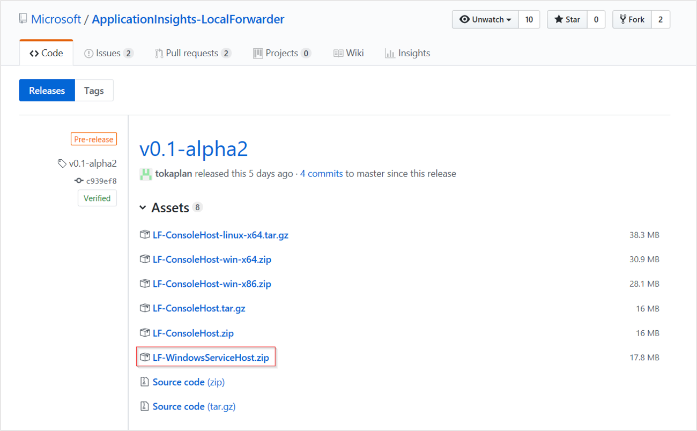
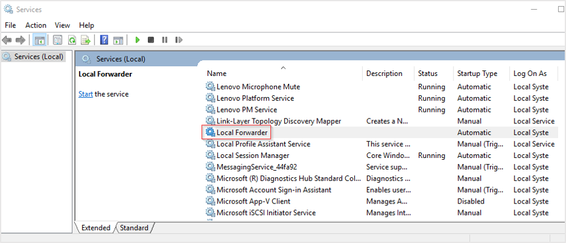

# Local forwarder (Preview)

Local forwarder is an agent that collects Application Insights or [OpenCensus](https://opencensus.io/) telemetry from a variety of SDKs and routes it to Application Insights. It's capable of running under Windows and Linux. You may also be able to run it under macOS, but that is not officially supported at this time.

## Running local forwarder

Local forwarder is an [open source project on GitHub](https://github.com/Microsoft/ApplicationInsights-LocalForwarder/releases). There are a variety of ways to run local forwarder on multiple platforms.

### Windows

#### Windows Service

The easiest way of running local forwarder under Windows is by installing it as a Windows Service. The release comes with a Windows Service executable (*WindowsServiceHost/Microsoft.LocalForwarder.WindowsServiceHost.exe*) which can be easily registered with the operating system.

> [!NOTE]
> The local forwarder service requires a minimum of .NET Framework 4.7. If you do not have .NET Framework 4.7 the service will install, but it won't start. To access the lastest version of the .NET Framework **[visit the .NET Framework download page](
https://www.microsoft.com/net/download/dotnet-framework-runtime/net472?utm_source=getdotnet&utm_medium=referral)**.

1. Download the LF.WindowsServiceHost.zip file from the [local forwarder release page](https://github.com/Microsoft/ApplicationInsights-LocalForwarder/releases) on GitHub.

    

2. In this example for ease of demonstration, we will just extract the .zip file to the path `C:\LF-WindowsServiceHost`.

    To register the service and configure it to start at system boot run the following from the command line as Administrator:

    ```
    sc create "Local Forwarder" binpath="C:\LF-WindowsServiceHost\Microsoft.LocalForwarder.WindowsServiceHost.exe" start=auto
    ```
    
    You should receive a response of:
    
    `[SC] CreateService SUCCESS`
    
    To examine your new service via the Services GUI type ``services.msc``
        
     

3. **Right-click** the new local forwarder and select **Start**. Your service will now enter a running state.

4. By default the service is created without any recovery actions. You can **right-click** and select **Properties** > **Recovery** to configure automatic responses to a service failure.

    Or if you prefer to set automatic recovery options programmatically for when failures occur, you can use:

    ```
    sc failure "Local Forwarder" reset= 432000 actions= restart/1000/restart/1000/restart/1000
    ```

5. In the same location as your ``Microsoft.LocalForwarder.WindowsServiceHost.exe`` file, which in this example is ``C:\LF-WindowsServiceHost`` there is a file called ``LocalForwarder.config``. This is an xml based file that allows you to adjust the configuration of your localforwader and specify the instrumentation key of the Application Insights resource you want your distributed tracing data forwarded. 

    After editing the ``LocalForwarder.config`` file to add your instrumentation key, be sure to restart the **Local Forwarder Service** to allow your changes to take effect.
    
6. To confirm that your desired settings are in place and that the local forwarder is listening for trace data as expected check the ``LocalForwarder.log`` file. You should see results similar to the image below at the bottom of the file:

    

#### Console application

For certain use cases, it might be beneficial to run local forwarder as a console application. The release comes with the following executable versions of the console host:
* a framework-dependent .NET Core binary */ConsoleHost/publish/Microsoft.LocalForwarder.ConsoleHost.dll*. Running this binary requires a .NET Core runtime to be installed; refer to this download [page](https://www.microsoft.com/net/download/dotnet-core/2.1) for details.
  ```batchfile
  E:\uncdrop\ConsoleHost\publish>dotnet Microsoft.LocalForwarder.ConsoleHost.dll
  ```
* a self-contained .NET Core set of binaries for x86 and x64 platforms. These don't require .NET Core runtime to run. */ConsoleHost/win-x86/publish/Microsoft.LocalForwarder.ConsoleHost.exe*, */ConsoleHost/win-x64/publish/Microsoft.LocalForwarder.ConsoleHost.exe*.
  ```batchfile
  E:\uncdrop\ConsoleHost\win-x86\publish>Microsoft.LocalForwarder.ConsoleHost.exe
  E:\uncdrop\ConsoleHost\win-x64\publish>Microsoft.LocalForwarder.ConsoleHost.exe
  ```

### Linux

As with Windows, the release comes with the following executable versions of the console host:
* a framework-dependent .NET Core binary */ConsoleHost/publish/Microsoft.LocalForwarder.ConsoleHost.dll*. Running this binary requires a .NET Core runtime to be installed; refer to this download [page](https://www.microsoft.com/net/download/dotnet-core/2.1) for details.

```batchfile
dotnet Microsoft.LocalForwarder.ConsoleHost.dll
```

* a self-contained .NET Core set of binaries for linux-64. This one doesn't require .NET Core runtime to run. */ConsoleHost/linux-x64/publish/Microsoft.LocalForwarder.ConsoleHost*.

```batchfile
user@machine:~/ConsoleHost/linux-x64/publish$ sudo chmod +x Microsoft.LocalForwarder.ConsoleHost
user@machine:~/ConsoleHost/linux-x64/publish$ ./Microsoft.LocalForwarder.ConsoleHost
```

Many Linux users will want to run local forwarder as a daemon. Linux systems come with a variety of solutions for service management, like Upstart, sysv, or systemd. Whatever your particular version is, you can use it to run local forwarder in a way that is most appropriate for your scenario.

As an example, let's create a daemon service using systemd. We'll use the framework-dependent version, but the same can be done for a self-contained one as well.

* create the following service file named *localforwarder.service* and place it into */lib/systemd/system*.
This sample assumes your user name is SAMPLE_USER and you've copied local forwarder framework-dependent binaries (from */ConsoleHost/publish*) to */home/SAMPLE_USER/LOCALFORWARDER_DIR*.

```
# localforwarder.service
# Place this file into /lib/systemd/system/
# Use 'systemctl enable localforwarder' to start the service automatically on each boot
# Use 'systemctl start localforwarder' to start the service immediately

[Unit]
Description=Local Forwarder service
After=network.target
StartLimitIntervalSec=0

[Service]
Type=simple
Restart=always
RestartSec=1
User=SAMPLE_USER
WorkingDirectory=/home/SAMPLE_USER/LOCALFORWARDER_DIR
ExecStart=/usr/bin/env dotnet /home/SAMPLE_USER/LOCALFORWARDER_DIR/Microsoft.LocalForwarder.ConsoleHost.dll noninteractive

[Install]
WantedBy=multi-user.target
```

* Run the following command to instruct systemd to start local forwarder on every boot

```
systemctl enable localforwarder
```

* Run the following command to instruct systemd to start local forwarder immediately

```
systemctl start localforwarder
```

* Monitor the service by inspecting **.log* files in the /home/SAMPLE_USER/LOCALFORWARDER_DIR directory.

### Mac
Local forwarder may work with macOS, but it is currently not officially supported.

### Self-hosting
Local forwarder is also distributed as a .NET Standard NuGet package, allowing you to host it inside your own .NET application.

```C#
using Library;
...
Host host = new Host();

// see section below on configuring local forwarder
string configuration = ...;
    
host.Run(config, TimeSpan.FromSeconds(5));
...
host.Stop();
```

## Configuring local forwarder

* When running one of local forwarder's own hosts (Console Host or Windows Service Host), you will find **LocalForwarder.config** placed next to the binary.
* When self-hosting the local forwarder NuGet, the configuration of the same format must be provided in code (see section on self-hosting). For the configuration syntax, check the [LocalForwarder.config](https://github.com/Microsoft/ApplicationInsights-LocalForwarder/blob/master/src/ConsoleHost/LocalForwarder.config) in the GitHub repository. 

> [!NOTE]
> Configuration may change from release to release, so pay attention to which version you're using.

## Monitoring local forwarder

Traces are written out to the file system next to the executable that runs local forwarder (look for **.log* files). You can place a file with a name of *NLog.config* next to the executable to provide your own configuration in place of the default one. See [documentation](https://github.com/NLog/NLog/wiki/Configuration-file#configuration-file-format) for the description of the format.

If no configuration file is provided (which is the default), Local forwarder will use the default configuration, which can be found [here](https://github.com/Microsoft/ApplicationInsights-LocalForwarder/blob/master/src/Common/NLog.config).

## Next steps

* [Open Census](https://opencensus.io/)
