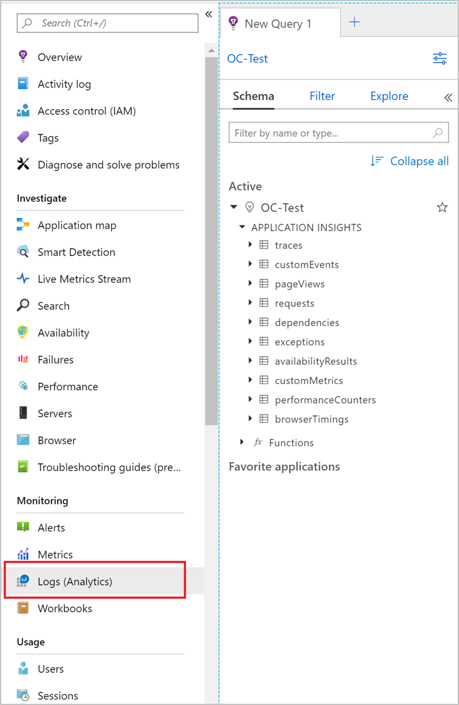

# Set up Azure Monitor for your Python application

Azure Monitor supports distributed tracing, metric collection, and logging of Python applications.

Microsoft's supported solution for tracking and exporting data for your Python applications is through the [OpenCensus Python SDK](#introducing-opencensus-python-sdk) via the [Azure Monitor exporters](#instrument-with-opencensus-python-sdk-with-azure-monitor-exporters).

Microsoft doesn't recommend using any other telemetry SDKs for Python as a telemetry solution because they're unsupported.

OpenCensus is converging into [OpenTelemetry](https://opentelemetry.io/). We continue to recommend OpenCensus while OpenTelemetry gradually matures.

> [!NOTE]
> A preview [OpenTelemetry-based Python offering](opentelemetry-enable.md?tabs=python) is available. To learn more, see the [OpenTelemetry overview](opentelemetry-overview.md).

## Prerequisites

You need an Azure subscription. If you don't have an Azure subscription, create a [free account](https://azure.microsoft.com/free/) before you begin.

[!INCLUDE [azure-monitor-log-analytics-rebrand](../../../includes/azure-monitor-instrumentation-key-deprecation.md)]

## Introducing OpenCensus Python SDK

[OpenCensus](https://opencensus.io) is a set of open-source libraries to allow collection of distributed tracing, metrics, and logging telemetry. By using [Azure Monitor exporters](https://github.com/census-instrumentation/opencensus-python/tree/master/contrib/opencensus-ext-azure), you can send this collected telemetry to Application Insights. This article walks you through the process of setting up OpenCensus and Azure Monitor exporters for Python to send your monitoring data to Azure Monitor.

## Instrument with OpenCensus Python SDK with Azure Monitor exporters

Install the OpenCensus Azure Monitor exporters:

```console
python -m pip install opencensus-ext-azure
```

The SDK uses three Azure Monitor exporters to send different types of telemetry to Azure Monitor. They're `trace`, `metrics`, and `logs`. For more information on these telemetry types, see the [Data platform overview](../data-platform.md). Use the following instructions to send these telemetry types via the three exporters.

## Telemetry type mappings

OpenCensus maps the following exporters to the types of telemetry that you see in Azure Monitor.

| Pillar of observability | Telemetry type in Azure Monitor    | Explanation                                         |
|-------------------------|------------------------------------|-----------------------------------------------------|
| Logs                    | Traces,  exceptions,  customEvents   | Log telemetry,  exception telemetry,  event telemetry |
| Metrics                 | customMetrics,  performanceCounters | Custom metrics  performance counters                |
| Tracing                 | Requests  dependencies             | Incoming requests,  outgoing requests                |

### Logs

1. First, let's generate some local log data.

    ```python

    import logging

    logger = logging.getLogger(__name__)

    def main():
        """Generate random log data."""
        for num in range(5):
            logger.warning(f"Log Entry - {num}")

    if __name__ == "__main__":
        main()
    ```

1. A log entry is emitted for each number in the range.

    ```output
    Log Entry - 0
    Log Entry - 1
    Log Entry - 2
    Log Entry - 3
    Log Entry - 4
    ```

1. We want to see this log data to Azure Monitor. You can specify it in an environment variable, `APPLICATIONINSIGHTS_CONNECTION_STRING`. You may also pass the connection_string directly into the `AzureLogHandler`, but connection strings shouldn't be added to version control.

   ```shell
   APPLICATIONINSIGHTS_CONNECTION_STRING=<appinsights-connection-string>
   ```

   We recommend using the connection string to instantiate the exporters that are used to send telemetry to Application Insights. Modify your code from the previous step based on the following code sample:

   ```python
   import logging
   from opencensus.ext.azure.log_exporter import AzureLogHandler

   logger = logging.getLogger(__name__)
   logger.addHandler(AzureLogHandler())

   # Alternatively manually pass in the connection_string
   # logger.addHandler(AzureLogHandler(connection_string=<appinsights-connection-string>))

   """Generate random log data."""
   for num in range(5):
       logger.warning(f"Log Entry - {num}")
   ```

1. The exporter sends log data to Azure Monitor. You can find the data under `traces`.

    In this context, `traces` isn't the same as `tracing`. Here, `traces` refers to the type of telemetry that you see in Azure Monitor when you utilize `AzureLogHandler`. But `tracing` refers to a concept in OpenCensus and relates to [distributed tracing](./distributed-tracing.md).

    > [!NOTE]
    > The root logger is configured with the level of `warning`. That means any logs that you send that have less severity are ignored, and in turn, won't be sent to Azure Monitor. For more information, see [Logging documentation](https://docs.python.org/3/library/logging.html#logging.Logger.setLevel).

1. You can also add custom properties to your log messages in the `extra` keyword argument by using the `custom_dimensions` field. These properties appear as key-value pairs in `customDimensions` in Azure Monitor.
    > [!NOTE]
    > For this feature to work, you need to pass a dictionary to the `custom_dimensions` field. If you pass arguments of any other type, the logger ignores them.

    ```python
    import logging

    from opencensus.ext.azure.log_exporter import AzureLogHandler

    logger = logging.getLogger(__name__)
    logger.addHandler(AzureLogHandler())
    # Alternatively manually pass in the connection_string
    # logger.addHandler(AzureLogHandler(connection_string=<appinsights-connection-string>))

    properties = {'custom_dimensions': {'key_1': 'value_1', 'key_2': 'value_2'}}

    # Use properties in logging statements
    logger.warning('action', extra=properties)
    ```

> [!NOTE]
> As part of using Application Insights instrumentation, we collect and send diagnostic data to Microsoft. This data helps us run and improve Application Insights. You have the option to disable non-essential data collection. To learn more, see [Statsbeat in Application Insights](./statsbeat.md).

#### Configure logging for Django applications

You can configure logging explicitly in your application code like the preceding for your Django applications, or you can specify it in Django's logging configuration. This code can go into whatever file you use for Django site's settings configuration, typically `settings.py`.

For information on how to configure Django settings, see [Django settings](https://docs.djangoproject.com/en/4.0/topics/settings/). For more information on how to configure logging, see [Django logging](https://docs.djangoproject.com/en/4.0/topics/logging/).

```json
LOGGING = {
    "handlers": {
        "azure": {
            "level": "DEBUG",
            "class": "opencensus.ext.azure.log_exporter.AzureLogHandler",
            "connection_string": "<appinsights-connection-string>",
        },
        "console": {
            "level": "DEBUG",
            "class": "logging.StreamHandler",
            "stream": sys.stdout,
        },
      },
    "loggers": {
        "logger_name": {"handlers": ["azure", "console"]},
    },
}
```

Be sure you use the logger with the same name as the one specified in your configuration.

```python
# views.py

import logging
from django.shortcuts import request

logger = logging.getLogger("logger_name")
logger.warning("this will be tracked")

```

#### Send exceptions

OpenCensus Python doesn't automatically track and send `exception` telemetry. It's sent through `AzureLogHandler` by using exceptions through the Python logging library. You can add custom properties like you do with normal logging.

```python
import logging

from opencensus.ext.azure.log_exporter import AzureLogHandler

logger = logging.getLogger(__name__)
logger.addHandler(AzureLogHandler())
# Alternatively, manually pass in the connection_string
# logger.addHandler(AzureLogHandler(connection_string=<appinsights-connection-string>))

properties = {'custom_dimensions': {'key_1': 'value_1', 'key_2': 'value_2'}}

# Use properties in exception logs
try:
    result = 1 / 0  # generate a ZeroDivisionError
except Exception:
    logger.exception('Captured an exception.', extra=properties)
```

Because you must log exceptions explicitly, it's up to you how to log unhandled exceptions. OpenCensus doesn't place restrictions on how to do this logging, but you must explicitly log exception telemetry.

#### Send events

You can send `customEvent` telemetry in exactly the same way that you send `trace` telemetry, except by using `AzureEventHandler` instead.

```python
import logging
from opencensus.ext.azure.log_exporter import AzureEventHandler

logger = logging.getLogger(__name__)
logger.addHandler(AzureLogHandler())
# Alternatively manually pass in the connection_string
# logger.addHandler(AzureLogHandler(connection_string=<appinsights-connection-string>))

logger.setLevel(logging.INFO)
logger.info('Hello, World!')
```

#### Sampling

For information on sampling in OpenCensus, see [Sampling in OpenCensus](sampling.md#configuring-fixed-rate-sampling-for-opencensus-python-applications).

#### Log correlation

For information on how to enrich your logs with trace context data, see OpenCensus Python [logs integration](./correlation.md#log-correlation).

#### Modify telemetry

For information on how to modify tracked telemetry before it's sent to Azure Monitor, see OpenCensus Python [telemetry processors](./api-filtering-sampling.md#opencensus-python-telemetry-processors).

### Metrics

OpenCensus.stats supports four aggregation methods but provides partial support for Azure Monitor:

- **Count**: The count of the number of measurement points. The value is cumulative, can only increase, and resets to 0 on restart.
- **Sum**: A sum up of the measurement points. The value is cumulative, can only increase, and resets to 0 on restart.
- **LastValue**: Keeps the last recorded value and drops everything else.
- **Distribution**: The Azure exporter doesn't support the histogram distribution of the measurement points.

### Count aggregation example

1. First, let's generate some local metric data. We create a metric to track the number of times the user selects the **Enter** key.

    ```python

    from datetime import datetime
    from opencensus.stats import aggregation as aggregation_module
    from opencensus.stats import measure as measure_module
    from opencensus.stats import stats as stats_module
    from opencensus.stats import view as view_module
    from opencensus.tags import tag_map as tag_map_module

    stats = stats_module.stats
    view_manager = stats.view_manager
    stats_recorder = stats.stats_recorder

    prompt_measure = measure_module.MeasureInt("prompts",
                                               "number of prompts",
                                               "prompts")
    prompt_view = view_module.View("prompt view",
                                   "number of prompts",
                                   [],
                                   prompt_measure,
                                   aggregation_module.CountAggregation())
    view_manager.register_view(prompt_view)
    mmap = stats_recorder.new_measurement_map()
    tmap = tag_map_module.TagMap()

    def main():
        for _ in range(4):
            mmap.measure_int_put(prompt_measure, 1)
            mmap.record(tmap)
            metrics = list(mmap.measure_to_view_map.get_metrics(datetime.utcnow()))
            print(metrics[0].time_series[0].points[0])

    if __name__ == "__main__":
        main()
    ```

1. Metrics are created to track many times. With each entry, the value is incremented and the metric information appears in the console. The information includes the current value and the current time stamp when the metric was updated.

    ```output
    Point(value=ValueLong(5), timestamp=2019-10-09 20:58:04.930426)
    Point(value=ValueLong(6), timestamp=2019-10-09 20:58:05.170167)
    Point(value=ValueLong(7), timestamp=2019-10-09 20:58:05.438614)
    Point(value=ValueLong(7), timestamp=2019-10-09 20:58:05.834216)
    ```

1. Entering values is helpful for demonstration purposes, but we want to emit the metric data to Azure Monitor. Pass your connection string directly into the exporter. Or you can specify it in an environment variable, `APPLICATIONINSIGHTS_CONNECTION_STRING`. We recommend using the connection string to instantiate the exporters that are used to send telemetry to Application Insights. Modify your code from the previous step based on the following code sample:

    ```python
    from datetime import datetime
    from opencensus.ext.azure import metrics_exporter
    from opencensus.stats import aggregation as aggregation_module
    from opencensus.stats import measure as measure_module
    from opencensus.stats import stats as stats_module
    from opencensus.stats import view as view_module
    from opencensus.tags import tag_map as tag_map_module

    stats = stats_module.stats
    view_manager = stats.view_manager
    stats_recorder = stats.stats_recorder

    prompt_measure = measure_module.MeasureInt("prompts",
                                               "number of prompts",
                                               "prompts")
    prompt_view = view_module.View("prompt view",
                                   "number of prompts",
                                   [],
                                   prompt_measure,
                                   aggregation_module.CountAggregation())
    view_manager.register_view(prompt_view)
    mmap = stats_recorder.new_measurement_map()
    tmap = tag_map_module.TagMap()

    exporter = metrics_exporter.new_metrics_exporter()
    # Alternatively manually pass in the connection_string
    # exporter = metrics_exporter.new_metrics_exporter(connection_string='<appinsights-connection-string>')

    view_manager.register_exporter(exporter)

    def main():
        for _ in range(10):
            input("Press enter.")
            mmap.measure_int_put(prompt_measure, 1)
            mmap.record(tmap)
            metrics = list(mmap.measure_to_view_map.get_metrics(datetime.utcnow()))
            print(metrics[0].time_series[0].points[0])

    if __name__ == "__main__":
        main()
    ```

1. The exporter sends metric data to Azure Monitor at a fixed interval. You must set this value to 60 seconds as Application Insights backend assumes aggregation of metrics points on a 60-second time interval. We're tracking a single metric, so this metric data, with whatever value and time stamp it contains, is sent every interval. The data is cumulative, can only increase, and resets to 0 on restart.

   You can find the data under `customMetrics`, but the `customMetrics` properties `valueCount`, `valueSum`, `valueMin`, `valueMax`, and `valueStdDev` aren't effectively used.

### Set custom dimensions in metrics

The OpenCensus Python SDK allows you to add custom dimensions to your metrics telemetry by using `tags`, which are like a dictionary of key-value pairs.

1. Insert the tags that you want to use into the tag map. The tag map acts like a sort of "pool" of all available tags you can use.

    ```python
    ...
    tmap = tag_map_module.TagMap()
    tmap.insert("url", "http://example.com")
    ...
    ```

1. For a specific `View`, specify the tags you want to use when you're recording metrics with that view via the tag key.

    ```python
    ...
    prompt_view = view_module.View("prompt view",
                                "number of prompts",
                                ["url"], # <-- A sequence of tag keys used to specify which tag key/value to use from the tag map
                                prompt_measure,
                                aggregation_module.CountAggregation())
    ...
    ```

1. Be sure to use the tag map when you're recording in the measurement map. The tag keys that are specified in the `View` must be found in the tag map used to record.

    ```python
    ...
    mmap = stats_recorder.new_measurement_map()
    mmap.measure_int_put(prompt_measure, 1)
    mmap.record(tmap) # <-- pass the tag map in here
    ...
    ```

1. Under the `customMetrics` table, all metric records emitted by using `prompt_view` have custom dimensions `{"url":"http://example.com"}`.

1. To produce tags with different values by using the same keys, create new tag maps for them.

    ```python
    ...
    tmap = tag_map_module.TagMap()
    tmap2 = tag_map_module.TagMap()
    tmap.insert("url", "http://example.com")
    tmap2.insert("url", "https://www.wikipedia.org/wiki/")
    ...
    ```

#### Performance counters

By default, the metrics exporter sends a set of performance counters to Azure Monitor. You can disable this capability by setting the `enable_standard_metrics` flag to `False` in the constructor of the metrics exporter.

```python
...
exporter = metrics_exporter.new_metrics_exporter(
  enable_standard_metrics=False,
  )
...
```

The following performance counters are currently sent:

- Available Memory (bytes)
- CPU Processor Time (percentage)
- Incoming Request Rate (per second)
- Incoming Request Average Execution Time (milliseconds)
- Process CPU Usage (percentage)
- Process Private Bytes (bytes)

You should be able to see these metrics in `performanceCounters`. For more information, see [Performance counters](./performance-counters.md).

#### Modify telemetry

For information on how to modify tracked telemetry before it's sent to Azure Monitor, see OpenCensus Python [telemetry processors](./api-filtering-sampling.md#opencensus-python-telemetry-processors).

### Tracing

> [!NOTE]
> In OpenCensus, `tracing` refers to [distributed tracing](./distributed-tracing.md). The `AzureExporter` parameter sends `requests` and `dependency` telemetry to Azure Monitor.

1. First, let's generate some trace data locally. In Python IDLE, or your editor of choice, enter the following code:

    ```python
    from opencensus.trace.samplers import ProbabilitySampler
    from opencensus.trace.tracer import Tracer

    tracer = Tracer(sampler=ProbabilitySampler(1.0))

    def main():
        with tracer.span(name="test") as span:
            for value in range(5):
                print(value)


    if __name__ == "__main__":
        main()
    ```

1. With each entry, the value is printed to the shell. The OpenCensus Python module generates a corresponding piece of `SpanData`. The OpenCensus project defines a [trace as a tree of spans](https://opencensus.io/core-concepts/tracing/).
    
    ```output
    0
    [SpanData(name='test', context=SpanContext(trace_id=8aa41bc469f1a705aed1bdb20c342603, span_id=None, trace_options=TraceOptions(enabled=True), tracestate=None), span_id='15ac5123ac1f6847', parent_span_id=None, attributes=BoundedDict({}, maxlen=32), start_time='2019-06-27T18:21:22.805429Z', end_time='2019-06-27T18:21:44.933405Z', child_span_count=0, stack_trace=None, annotations=BoundedList([], maxlen=32), message_events=BoundedList([], maxlen=128), links=BoundedList([], maxlen=32), status=None, same_process_as_parent_span=None, span_kind=0)]
    1
    [SpanData(name='test', context=SpanContext(trace_id=8aa41bc469f1a705aed1bdb20c342603, span_id=None, trace_options=TraceOptions(enabled=True), tracestate=None), span_id='2e512f846ba342de', parent_span_id=None, attributes=BoundedDict({}, maxlen=32), start_time='2019-06-27T18:21:44.933405Z', end_time='2019-06-27T18:21:46.156787Z', child_span_count=0, stack_trace=None, annotations=BoundedList([], maxlen=32), message_events=BoundedList([], maxlen=128), links=BoundedList([], maxlen=32), status=None, same_process_as_parent_span=None, span_kind=0)]
    2
    [SpanData(name='test', context=SpanContext(trace_id=8aa41bc469f1a705aed1bdb20c342603, span_id=None, trace_options=TraceOptions(enabled=True), tracestate=None), span_id='f3f9f9ee6db4740a', parent_span_id=None, attributes=BoundedDict({}, maxlen=32), start_time='2019-06-27T18:21:46.157732Z', end_time='2019-06-27T18:21:47.269583Z', child_span_count=0, stack_trace=None, annotations=BoundedList([], maxlen=32), message_events=BoundedList([], maxlen=128), links=BoundedList([], maxlen=32), status=None, same_process_as_parent_span=None, span_kind=0)]
    ```

1. Viewing the output is helpful for demonstration purposes, but we want to emit `SpanData` to Azure Monitor. Pass your connection string directly into the exporter. Or you can specify it in an environment variable, `APPLICATIONINSIGHTS_CONNECTION_STRING`. We recommend using the connection string to instantiate the exporters that are used to send telemetry to Application Insights. Modify your code from the previous step based on the following code sample:

    ```python
    from opencensus.ext.azure.trace_exporter import AzureExporter
    from opencensus.trace.samplers import ProbabilitySampler
    from opencensus.trace.tracer import Tracer

    tracer = Tracer(
        exporter=AzureExporter(),
        sampler=ProbabilitySampler(1.0),
    )
    # Alternatively manually pass in the connection_string
    # exporter = AzureExporter(
    #   connection_string='<appinsights-connection-string>',
    #   ...
    # )
    
    def main():
        with tracer.span(name="test") as span:
            for value in range(5):
                print(value)

    if __name__ == "__main__":
        main()
    ```

1. Now when you run the Python script, only the value is being printed in the shell. The created `SpanData` is sent to Azure Monitor. You can find the emitted span data under `dependencies`.

   For more information about outgoing requests, see OpenCensus Python [dependencies](./opencensus-python-dependency.md). For more information on incoming requests, see OpenCensus Python [requests](./opencensus-python-request.md).

#### Sampling

For information on sampling in OpenCensus, see [Sampling in OpenCensus](sampling.md#configuring-fixed-rate-sampling-for-opencensus-python-applications).

#### Trace correlation

For more information on telemetry correlation in your trace data, see OpenCensus Python [telemetry correlation](./correlation.md#telemetry-correlation-in-opencensus-python).

#### Modify telemetry

For more information on how to modify tracked telemetry before it's sent to Azure Monitor, see OpenCensus Python [telemetry processors](./api-filtering-sampling.md#opencensus-python-telemetry-processors).

## Configure Azure Monitor exporters

As shown, there are three different Azure Monitor exporters that support OpenCensus. Each one sends different types of telemetry to Azure Monitor. To see what types of telemetry each exporter sends, see the following table.

Each exporter accepts the same arguments for configuration, passed through the constructors. You can see information about each one here:

|Exporter telemetry|Description|
|:---|:---|
`connection_string`| The connection string used to connect to your Azure Monitor resource. Takes priority over `instrumentation_key`.|
`credential`| Credential class used by Azure Active Directory authentication. See the "Authentication" section that follows.|
`enable_standard_metrics`| Used for `AzureMetricsExporter`. Signals the exporter to send [performance counter](../essentials/app-insights-metrics.md#performance-counters) metrics automatically to Azure Monitor. Defaults to `True`.|
`export_interval`| Used to specify the frequency in seconds of exporting. Defaults to `15s`. For metrics, you MUST set it to 60 seconds or else your metric aggregations don't make sense in the metrics explorer.|
`grace_period`| Used to specify the timeout for shutdown of exporters in seconds. Defaults to `5s`.|
`instrumentation_key`| The instrumentation key used to connect to your Azure Monitor resource.|
`logging_sampling_rate`| Used for `AzureLogHandler` and `AzureEventHandler`. Provides a sampling rate [0,1.0] for exporting logs/events. Defaults to `1.0`.|
`max_batch_size`| Specifies the maximum size of telemetry that's exported at once.|
`proxies`| Specifies a sequence of proxies to use for sending data to Azure Monitor. For more information, see [proxies](https://requests.readthedocs.io/en/latest/user/advanced/#proxies).|
`storage_path`| A path to where the local storage folder exists (unsent telemetry). As of `opencensus-ext-azure` v1.0.3, the default path is the OS temp directory + `opencensus-python` + `your-ikey`. Prior to v1.0.3, the default path is `$USER` + `.opencensus` + `.azure` + `python-file-name`.|
`timeout`| Specifies the networking timeout to send telemetry to the ingestion service in seconds. Defaults to `10s`.|

## Integrate with Azure Functions

To capture custom telemetry in Azure Functions environments, use the OpenCensus Python Azure Functions [extension](https://github.com/census-ecosystem/opencensus-python-extensions-azure/tree/main/extensions/functions#opencensus-python-azure-functions-extension). For more information, see the [Azure Functions Python developer guide](../../azure-functions/functions-reference-python.md#log-custom-telemetry).

## Authentication (preview)

> [!NOTE]
> The authentication feature is available starting from `opencensus-ext-azure` v1.1b0.

Each of the Azure Monitor exporters supports configuration of securely sending telemetry payloads via OAuth authentication with Azure Active Directory. For more information, see the [Authentication documentation](./azure-ad-authentication.md).

## View your data with queries

You can view the telemetry data that was sent from your application through the **Logs (Analytics)** tab.



In the list under **Active**:

- For telemetry sent with the Azure Monitor trace exporter, incoming requests appear under `requests`. Outgoing or in-process requests appear under `dependencies`.
- For telemetry sent with the Azure Monitor metrics exporter, sent metrics appear under `customMetrics`.
- For telemetry sent with the Azure Monitor logs exporter, logs appear under `traces`. Exceptions appear under `exceptions`.

For more information about how to use queries and logs, see [Logs in Azure Monitor](../logs/data-platform-logs.md).

## Learn more about OpenCensus for Python

* [OpenCensus Python on GitHub](https://github.com/census-instrumentation/opencensus-python)
* [Customization](https://github.com/census-instrumentation/opencensus-python/blob/master/README.rst#customization)
* [Azure Monitor exporters on GitHub](https://github.com/census-instrumentation/opencensus-python/tree/master/contrib/opencensus-ext-azure)
* [OpenCensus integrations](https://github.com/census-instrumentation/opencensus-python#extensions)
* [Azure Monitor sample applications](https://github.com/Azure-Samples/azure-monitor-opencensus-python/tree/master/azure_monitor)

## Troubleshooting

[!INCLUDE [azure-monitor-app-insights-test-connectivity](../../../includes/azure-monitor-app-insights-test-connectivity.md)]

## Release Notes

For the latest release notes, see [Python Azure Monitor Exporter](https://github.com/census-instrumentation/opencensus-python/blob/master/contrib/opencensus-ext-azure/CHANGELOG.md)

Our [Service Updates](https://azure.microsoft.com/updates/?service=application-insights) also summarize major Application Insights improvements.

## Next steps

* [Tracking incoming requests](./opencensus-python-dependency.md)
* [Tracking outgoing requests](./opencensus-python-request.md)
* [Application map](./app-map.md)
* [End-to-end performance monitoring](../app/tutorial-performance.md)

### Alerts

* [Availability overview](./availability-overview.md): Create tests to make sure your site is visible on the web.
* [Smart diagnostics](../alerts/proactive-diagnostics.md): These tests run automatically, so you don't have to do anything to set them up. They tell you if your app has an unusual rate of failed requests.
* [Metric alerts](../alerts/alerts-log.md): Set alerts to warn you if a metric crosses a threshold. You can set them on custom metrics that you code into your app.
