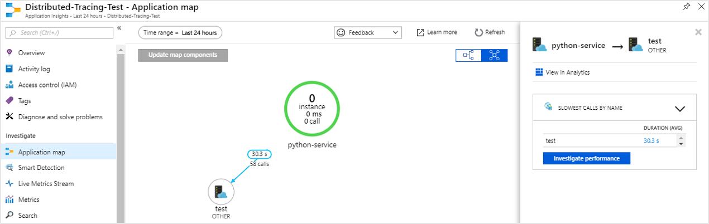
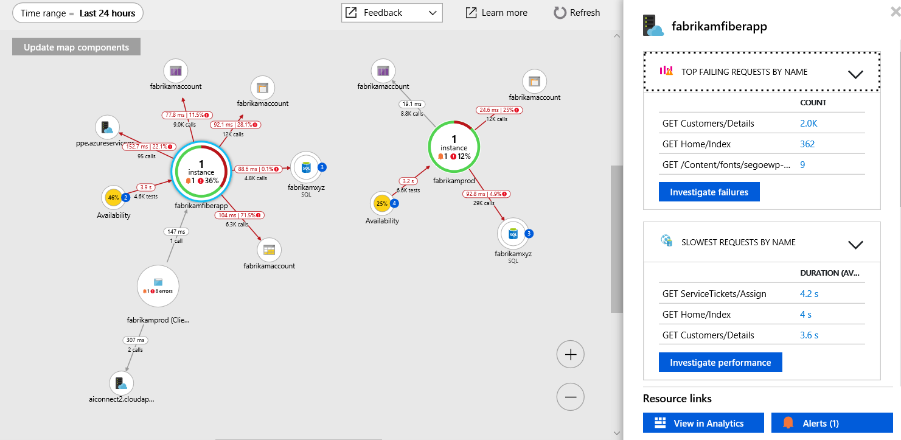

# Collect distributed traces from Python (Preview)

Application Insights now supports distributed tracing of Python applications through integration with [OpenCensus](https://opencensus.io). This article will walk you step-by-step through the process of setting up OpenCensus for Python and getting your monitoring data to Application Insights.

## Prerequisites

- You need an Azure Subscription.
- Python should be installed, this article uses [Python 3.7.0](https://www.python.org/downloads/), though earlier versions will likely work with minor adjustment.

If you don't have an Azure subscription, create a [free](https://azure.microsoft.com/free/) account before you begin.

## Sign in to the Azure portal

Sign in to the [Azure portal](https://portal.azure.com/).

## Create Application Insights resource

First you have to create an Application Insights resource, which will generate an instrumentation key(ikey). The ikey is then used to configure the OpenCensus SDK to send telemetry data to Application Insights.

1. Select **Create a resource** > **Developer Tools** > **Application Insights**.

   

   A configuration box appears; use the following table to fill out the input fields.

    | Settings        | Value           | Description  |
   | ------------- |:-------------|:-----|
   | **Name**      | Globally Unique Value | Name that identifies the app you are monitoring |
   | **Resource Group**     | myResourceGroup      | Name for the new resource group to host App Insights data |
   | **Location** | East US | Choose a location near you, or near where your app is hosted |

2. Click **Create**.

## Install OpenCensus Azure Monitor Exporters

1. Install the OpenCensus Azure Monitor Exporters:

    ```console
    python -m pip install opencensus-ext-azure
    ```

    > [!NOTE]
    > `python -m pip install opencensus-ext-azure` assumes that you have a PATH environment variable set for your Python installation. If you have not configured this, you would need to give the full directory path to where your Python executable is located which would result in a command like: `C:\Users\Administrator\AppData\Local\Programs\Python\Python37-32\python.exe -m pip install opencensus-ext-azure`.

2. First let's generate some trace data locally. In Python IDLE, or your editor of choice, enter the following code:

    ```python
    from opencensus.trace.samplers import ProbabilitySampler
    from opencensus.trace.tracer import Tracer

    tracer = Tracer(sampler=ProbabilitySampler(1.0))

    def valuePrompt():
        with tracer.span(name="test") as span:
            line = input("Enter a value: ")
            print(line)

    def main():
        while True:
            valuePrompt()

    if __name__ == "__main__":
        main()
    ```

3. Running the code will repeatedly prompt you to enter a value. With each entry, the value will be printed to the shell, and a corresponding piece of **SpanData** will be generated by the OpenCensus Python Module. The OpenCensus project defines a [_trace as a tree of spans_](https://opencensus.io/core-concepts/tracing/).
    
    ```
    Enter a value: 4
    4
    [SpanData(name='test', context=SpanContext(trace_id=8aa41bc469f1a705aed1bdb20c342603, span_id=None, trace_options=TraceOptions(enabled=True), tracestate=None), span_id='15ac5123ac1f6847', parent_span_id=None, attributes=BoundedDict({}, maxlen=32), start_time='2019-06-27T18:21:22.805429Z', end_time='2019-06-27T18:21:44.933405Z', child_span_count=0, stack_trace=None, annotations=BoundedList([], maxlen=32), message_events=BoundedList([], maxlen=128), links=BoundedList([], maxlen=32), status=None, same_process_as_parent_span=None, span_kind=0)]
    Enter a value: 25
    25
    [SpanData(name='test', context=SpanContext(trace_id=8aa41bc469f1a705aed1bdb20c342603, span_id=None, trace_options=TraceOptions(enabled=True), tracestate=None), span_id='2e512f846ba342de', parent_span_id=None, attributes=BoundedDict({}, maxlen=32), start_time='2019-06-27T18:21:44.933405Z', end_time='2019-06-27T18:21:46.156787Z', child_span_count=0, stack_trace=None, annotations=BoundedList([], maxlen=32), message_events=BoundedList([], maxlen=128), links=BoundedList([], maxlen=32), status=None, same_process_as_parent_span=None, span_kind=0)]
    Enter a value: 100
    100
    [SpanData(name='test', context=SpanContext(trace_id=8aa41bc469f1a705aed1bdb20c342603, span_id=None, trace_options=TraceOptions(enabled=True), tracestate=None), span_id='f3f9f9ee6db4740a', parent_span_id=None, attributes=BoundedDict({}, maxlen=32), start_time='2019-06-27T18:21:46.157732Z', end_time='2019-06-27T18:21:47.269583Z', child_span_count=0, stack_trace=None, annotations=BoundedList([], maxlen=32), message_events=BoundedList([], maxlen=128), links=BoundedList([], maxlen=32), status=None, same_process_as_parent_span=None, span_kind=0)]
    ```

4. While helpful for demonstration purposes, ultimately we want to emit the SpanData to Application Insights. Modify your code from the previous step based on the following code sample:

    ```python
    from opencensus.ext.azure.trace_exporter import AzureExporter
    from opencensus.trace.samplers import ProbabilitySampler
    from opencensus.trace.tracer import Tracer
    
    # TODO: replace the all-zero GUID with your instrumentation key.
    tracer = Tracer(
        exporter=AzureExporter(
            instrumentation_key='00000000-0000-0000-0000-000000000000',
        ),
        sampler=ProbabilitySampler(1.0),
    )

    def valuePrompt():
        with tracer.span(name="test") as span:
            line = input("Enter a value: ")
            print(line)

    def main():
        while True:
            valuePrompt()

    if __name__ == "__main__":
        main()
    ```
5. Now when you run the Python script, you should still be prompted to enter values, but now only the value is being printed in the shell.

## Start monitoring in the Azure portal

1. You can now reopen the Application Insights **Overview** page in the Azure portal, to view details about your currently running application. Select **Live Metric Stream**.

   

2. Navigate back to the **Overview** page and select **Application Map** for a visual layout of the dependency relationships and call timing between your application components.

    

    Since we were only tracing one method call, our application map isn't as interesting. But application map can scale to visualize far more distributed applications:

   

3. Select **Investigate Performance** to perform detailed performance analysis and determine the root cause of slow performance.

    

4. Selecting **Samples** and then clicking on any of the samples that appear in the right-hand pane will launch the end-to-end transaction details experience. While our sample app will just show us a single event, a more complex application would allow you to explore the end-to-end transaction down to level of an individual event's call stack.

     

## OpenCensus for Python

* [Customization](https://github.com/census-instrumentation/opencensus-python/blob/master/README.rst#customization)
* [Flask Integration](https://github.com/census-instrumentation/opencensus-python/tree/master/contrib/opencensus-ext-flask)
* [Django Integration](https://github.com/census-instrumentation/opencensus-python/tree/master/contrib/opencensus-ext-django)
* [MySQL Integration](https://github.com/census-instrumentation/opencensus-python/tree/master/contrib/opencensus-ext-mysql)
* [PostgreSQL](https://github.com/census-instrumentation/opencensus-python/tree/master/contrib/opencensus-ext-postgresql)

## Next steps

* [OpenCensus Python on GitHub](https://github.com/census-instrumentation/opencensus-python)
* [Application map](./../../azure-monitor/app/app-map.md)
* [End-to-end performance monitoring](./../../azure-monitor/learn/tutorial-performance.md)