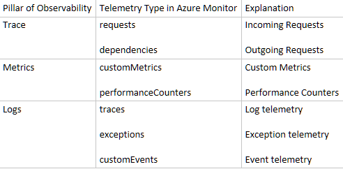
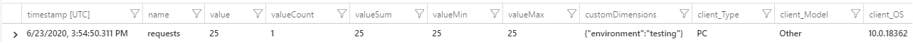
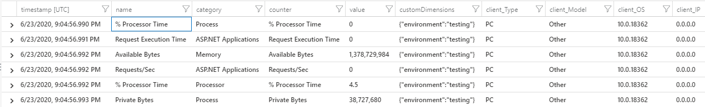
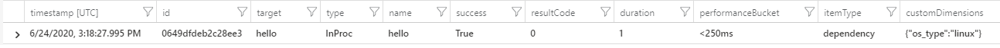
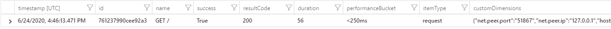

# Set up Azure Monitor for your Python application (Preview)

Azure Monitor supports distributed tracing, metric collection and logging of Python applications through integration with [OpenTelemetry](https://opentelemetry.io). This article will walk you through the process of setting up OpenTelemetry for Python and sending your monitoring data to Azure Monitor.

> [!NOTE]
> OpenTelemetry Azure Monitor Python SDK is still in preview. This means the API surface and features that are outlined below are subject to change. We do not recommend using this SDK for production until it goes into GA.

## Prerequisites

- An Azure subscription. If you don't have an Azure subscription, create a [free account](https://azure.microsoft.com/free/) before you begin.
- Python installation. This article uses [Python 3.8.0](https://www.python.org/downloads/), though earlier versions will likely work with minor changes. The SDK only supports Python v3.4 and above.
- Create an Application Insights [resource](./create-new-resource.md). You will be assigned your own instrumentation key (ikey) for your resource.

## Instrument with OpenTelemetry Azure Monitor Python SDK

Install the OpenTelemetry Azure Monitor SDK:

```console
python -m pip install opentelemetry-azure-monitor
```

> [!NOTE]
> The `python -m pip install opentelemetry-azure-monitor` command assumes that you have a `PATH` environment variable set for your Python installation. If you haven't configured this variable, you need to give the full directory path to where your Python executable is located. The result is a command like this: `C:\Users\Administrator\AppData\Local\Programs\Python\Python38\python.exe -m pip install opentelemetry-azure-monitor`.

The SDK uses three Azure Monitor exporters to send different types of telemetry to Azure Monitor: trace, metrics, and logs. For more information on these telemetry types, see [the data platform overview](../platform/data-platform). Use the following instructions to send these telemetry types via the three exporters.

> [!NOTE]
> The logging exporter is not implemented in preview mode.

## Telemetry type mappings

OpenTelemetry follows the [three pillars of observability](https://www.oreilly.com/library/view/distributed-systems-observability/9781492033431/ch04.html), which encompasses all the types of telemetry that is possible to be tracked. Below is a table representing the three pillars and how they map to Azure Monitor telemetry types.



## Metrics

The SDK provides mechanisms to record and send metric telemetry to Azure Monitor through the `AzureMonitorMetricsExporter`. Use this exporter if you want to track logic that provides value if pre-aggregated over a certain time interval and/or you want to have a meaningful way of representing your aggregated data.

### Recording/exporting

#### Synchronous metric instruments

1. Let's take a look at a simple example that records and tracks how many requests are being sent to an application.

```python
from opentelemetry import metrics
from opentelemetry.sdk.metrics import Counter, MeterProvider

from azure_monitor import AzureMonitorMetricsExporter

# Setting the global MeterProvider indicates you are using OpenTelemetry
metrics.set_meter_provider(MeterProvider())
# The meter is responsible for recording metrics
meter = metrics.get_meter(__name__)
# The exporter is used to send the metrics to Azure Monitor
exporter = AzureMonitorMetricsExporter(
    connection_string="InstrumentationKey=<INSTRUMENTATION KEY HERE>"
)
# start_pipeline starts the recording/exporting cycle
# Pass in a meter, exporter and time interval
metrics.get_meter_provider().start_pipeline(meter, exporter, 5)

# Create the counter metric using the meter
requests_counter = meter.create_metric(
    name="requests",
    description="number of requests",
    unit="1",
    value_type=int,
    metric_type=Counter,
)
# You can provide custom dimensions to your metrics by labels
testing_labels = {"environment": "testing"}
requests_counter.add(25, testing_labels)

# The pipeline runs until the main program terminates, use this to prolong the running program
input("Metrics will be printed soon. Press a key to finish...\n")
```

1. You will get telemetry to appear in Azure Monitor (after a few minutes) in the `customMetrics` table like below.



1. Below is a list of fields to construct a metric instrument and what they mean.
    1. `name` - The name of the metric instrument.
    1. `description` - A description for the metric instrument.
    1. `unit` - Specifies what unit is used for the underlying metric being recorded.
    1. `value_type` - The type of value (int or float) that is used for this metric.
    1. `metric_type` - The type of metric instrument used. You can see all metric instrument types [here](https://github.com/open-telemetry/opentelemetry-specification/blob/master/specification/metrics/api.md#metric-instruments).

#### Asynchronous metric instruments (Observers)

1. The example above used a `Counter` metric instrument, used for synchronous recording of a sum. Observers are instruments used to record metrics asynchronously using a callback. Here is an example of it's usage below.

```python
import psutil
from opentelemetry import metrics
from opentelemetry.sdk.metrics import MeterProvider, UpDownSumObserver

from azure_monitor import AzureMonitorMetricsExporter

# Setting the global MeterProvider indicates you are using OpenTelemetry
metrics.set_meter_provider(MeterProvider())
# The meter is responsible for recording metrics
meter = metrics.get_meter(__name__)
# The exporter is used to send the metrics to Azure Monitor
exporter = AzureMonitorMetricsExporter(
    connection_string="InstrumentationKey=<INSTRUMENTATION KEY HERE>"
)
# start_pipeline starts the recording/exporting cycle
# Pass in a meter, exporter and time interval
metrics.get_meter_provider().start_pipeline(meter, exporter, 2)

# Callback to gather cpu usage
def get_cpu_usage_callback(observer):
    for (number, percent) in enumerate(psutil.cpu_percent(percpu=True)):
        labels = {"cpu_number": str(number)}
        observer.observe(percent, labels)  # you must call this line

# Use the meter to register an Observer instrument
meter.register_observer(
    callback=get_cpu_usage_callback,
    name="cpu_percent",
    description="per-cpu usage",
    unit="1",
    value_type=float,
    observer_type=UpDownSumObserver,
)

# The pipeline runs until the main program terminates, use this to prolong the running program
input("Metrics will be printed soon. Press a key to finish...\n")
```

1. Below is a list of fields to construct an observer metric instrument and what they mean.
    1. `callback` - The callback function used to record.
    2. `name` - The name of the observer metric instrument.
    3. `description` - A description for the observer metric instrument.
    4. `unit` - Specifies what unit is used for the underlying metric being recorded.
    5. `value_type` - The type of value (int or float) that is used for this metric.
    6. `observer_type` - The type of observer metric instrument used. You can see all metric instrument types [here](https://github.com/open-telemetry/opentelemetry-specification/blob/master/specification/metrics/api.md#metric-instruments).

### Performance counters

1. The SDK can automatically collect performance counters, which will appear under the `performanceCounters` table in Azure Monitor.

```python
from opentelemetry import metrics, trace
from opentelemetry.sdk.metrics import MeterProvider
from opentelemetry.sdk.trace import TracerProvider

from azure_monitor import AzureMonitorMetricsExporter
from azure_monitor.sdk.auto_collection import (
    AutoCollection,
    AzureMetricsSpanProcessor,
)

# Add Span Processor to get metrics about traces
trace.set_tracer_provider(TracerProvider())
span_processor = AzureMetricsSpanProcessor()
trace.get_tracer_provider().add_span_processor(span_processor)

metrics.set_meter_provider(MeterProvider())
meter = metrics.get_meter(__name__)
exporter = AzureMonitorMetricsExporter(
    connection_string="InstrumentationKey=<INSTRUMENTATION KEY HERE>"
)

testing_label_set = {"environment": "testing"}

# Automatically collect performance counters
auto_collection = AutoCollection(
    meter=meter, labels=testing_label_set, span_processor=span_processor
)

metrics.get_meter_provider().start_pipeline(meter, exporter, 2)

input("Press any key to exit...")
```

1. You will get telemetry to appear in Azure Monitor (after a few minutes) in the `performanceCounters` table like below.



2. The list of performance counters can be found below.
    - Available Memory (bytes)
    - CPU Processor Time (percentage)
    - Incoming Request Rate (per second)
    - Incoming Request Average Execution Time (milliseconds)
    - Process CPU Usage (percentage)
    - Process Private Bytes (bytes)

## Distributed Tracing

> [!NOTE]
> `Tracing` here refers to [distributed tracing](./distributed-tracing). The `AzureExporter` sends `requests` and `dependency` telemetry to Azure Monitor.

The SDK provides mechanisms to track incoming/outgoing request telemetry to Azure Monitor through the `AzureMonitorSpanExporter`. Use this exporter if you want want to create a distributed trace of your application. Distributed tracing is used to profile and monitor your applications and its dependencies.

### In-Process tracing (InProc)

1. Below is an example of how you can create a simple in-process trace within a single application. The spans generated from this will be labeled "IN-PROC", meaning they represent logic that occurs within the same application. Spans are a mechanism used by OpenTelemetry that represents a single logical operation within a trace. You can read more about it [here](https://github.com/open-telemetry/opentelemetry-specification/blob/master/specification/trace/api.md#span).

```python
from opentelemetry import trace
from opentelemetry.sdk.trace import TracerProvider
from opentelemetry.sdk.trace.export import BatchExportSpanProcessor

from azure_monitor import AzureMonitorSpanExporter

# Setting the global TracerProvider indicates you are using OpenTelemetry
trace.set_tracer_provider(TracerProvider())
# The tracer is the mechanism used to generate spans
tracer = trace.get_tracer(__name__)
# The exporter sends the telemetry to Azure Monitor
exporter = AzureMonitorSpanExporter(
    connection_string="InstrumentationKey=<INSTRUMENTATION KEY HERE>"
)
# SpanProcessor is responsible for executing the tracing workflow
span_processor = BatchExportSpanProcessor(exporter)
trace.get_tracer_provider().add_span_processor(span_processor)

# You can start and use a span via a context manager
# Any logic done within this context is encapsulated within the span
with tracer.start_as_current_span("hello"):
    print("Hello, World!")

input("Press any key to exit...")
```

1. You will get telemetry to appear in Azure Monitor (after a few minutes) in the `dependencies` table like below.



### Dependency tracking with integrations

You can trace your applications interactions with other systems and libraries using integrations. OpenTelemetry supports a wide variety of popular Python libraries and have integrations for them to automatically track these dependencies. You can find the list of supported integrations [here](https://github.com/open-telemetry/opentelemetry-python/tree/master/ext).

In order to track dependencies using a specific library, you must install the corresponding integration and instrument your application directly with the instrumentor.

#### Requests integration

Below is an example of an application instrumenting with the `requests` [integration](https://github.com/open-telemetry/opentelemetry-python/tree/master/ext/opentelemetry-ext-requests). This will be used to automatically track dependency calls using the Python [requests](https://requests.readthedocs.io/en/master/) library.
You must first install the requests integration:

```console
python -m pip install opentelemetry-ext-requests
```

```python
import requests
from opentelemetry import trace
from opentelemetry.ext.requests import RequestsInstrumentor
from opentelemetry.sdk.trace import TracerProvider
from opentelemetry.sdk.trace.export import BatchExportSpanProcessor

from azure_monitor import AzureMonitorSpanExporter

trace.set_tracer_provider(TracerProvider())
tracer = trace.get_tracer(__name__)
RequestsInstrumentor().instrument() # This line instruments your application
exporter = AzureMonitorSpanExporter(
    connection_string="InstrumentationKey=<INSTRUMENTATION KEY HERE>"
)
span_processor = BatchExportSpanProcessor(exporter)
trace.get_tracer_provider().add_span_processor(span_processor)

with tracer.start_as_current_span("parent"):
    response = requests.get("https://azure.microsoft.com/", timeout=5)

input("Press any key to exit...")
```

1. You will get telemetry to appear in Azure Monitor (after a few minutes) in the `dependencies` table like below. If you scroll to the right, notice how the `operation_id` is the same between the two entries. This means they are part of the same trace (since the request was made within the span).

1. 

#### Flask integration

Below is an example of an application instrumenting with the `flask` [integration](https://github.com/open-telemetry/opentelemetry-python/tree/master/ext/opentelemetry-ext-flask). This will be used to automatically track dependency calls using the Python [flask](https://flask.palletsprojects.com/en/1.1.x/) library.
You must first install the flask integration:

```console
python -m pip install opentelemetry-ext-requests
```

```python
from opentelemetry import trace
from opentelemetry.ext.flask import FlaskInstrumentor
from opentelemetry.sdk.trace import TracerProvider
from opentelemetry.sdk.trace.export import BatchExportSpanProcessor

import flask
from azure_monitor import AzureMonitorSpanExporter

trace.set_tracer_provider(TracerProvider())
tracer = trace.get_tracer(__name__)
exporter = AzureMonitorSpanExporter(
    connection_string="InstrumentationKey=<INSTRUMENTATION KEY HERE>"
)
span_processor = BatchExportSpanProcessor(exporter)
trace.get_tracer_provider().add_span_processor(span_processor)

app = flask.Flask(__name__)
FlaskInstrumentor().instrument_app(app) # This line instruments your flask app


@app.route("/")
def hello():
    return "hello"


if __name__ == "__main__":
    app.run(host="localhost", port=8080, threaded=True)
```

1. You will get telemetry to appear in Azure Monitor (after a few minutes) in the `requests` table like below. Since hitting the `flask` endpoint is an **incoming request**, it appears in `requests` rather than `dependencies` for outgoing requests.

1. 

## Configuration

There are many ways to configure the OpenTelemetry Azure Monitor SDK and its exporters. 

### Sampling

The SDK provides mechanisms in which you can sample the telemetry that you send to Azure Monitor. Only **fixed-rate sampling** is provided by the SDK, and is only supported for `tracing` and `logging`. This means that metric telemetry is the only type in which sampling can NOT be configured. The metrics exporter will always send all the telemetry that it tracks.

#### Fixed rate sampling for tracing

You may specify a `Sampler` as part of your `TracerProvider` configuration. If no explicit sampler is provided, the sampling rate will be `1.0` by default, meaning all your tracked telemetry will be sent. You can specify a `StaticSampler` which always makes the same sampling decision (ALWAYS_ON or ALWAYS_OFF). A `ProbabilitySampler` can be used to if want to specify a sampling rate between 0.0 and 1.0 inclusive, as shown below.

```python
from opentelemetry import trace
from opentelemetry.trace.sampling import ProbabilitySampler
from opentelemetry.sdk.trace import TracerProvider
from opentelemetry.sdk.trace.export import BatchExportSpanProcessor

from azure_monitor import AzureMonitorSpanExporter

exporter = AzureMonitorSpanExporter(
    connection_string="InstrumentationKey=<INSTRUMENTATION KEY HERE>"
)
trace.set_tracer_provider(
    TracerProvider(sampler=ProbabilitySampler(0.5)) # Sampler here
)
tracer = trace.get_tracer(__name__)
span_processor = BatchExportSpanProcessor(exporter)
trace.get_tracer_provider().add_span_processor(span_processor)

for x in range(10):
    with tracer.start_as_current_span("hello"):
        print("Hello, World!")

input("Press any key to exit...")
```

### Modify telemetry

The SDK provides a mechanism in which you can modify the tracked telemetry before it is sent to Azure Monitor via telemetry processors. Telemetry processors are simply callback functions that are called right before export. The callback function must accept an [envelope](https://github.com/microsoft/opentelemetry-azure-monitor-python/blob/master/azure_monitor/src/azure_monitor/protocol.py#L109) data type as its parameter. To filter out telemetry from being exported, you can set the callback function to return `False` instead of `True`. You can also add multiple telemetry processors to the exporter, they will simply be executed in the order that they weer added. You can see the schema for Azure Monitor data types in the envelopes [here](https://github.com/microsoft/opentelemetry-azure-monitor-python/blob/master/azure_monitor/src/azure_monitor/protocol.py).

> [!NOTE]
> You can modify the `cloud_RoleName` by changing the `ai.cloud.role` attribute in the `tags` field.

```python
def callback_function(envelope):
    envelope.tags['ai.cloud.role'] = 'new_role_name.py'
```

The below example is for 

```python
# Example for trace exporter
from opentelemetry import trace
from opentelemetry.sdk.trace import TracerProvider
from opentelemetry.sdk.trace.export import BatchExportSpanProcessor

from azure_monitor import AzureMonitorSpanExporter


# Callback function to add os_type: linux to span properties
def callback_function(envelope):
    envelope.data.base_data.properties["os_type"] = "linux"
    return True


exporter = AzureMonitorSpanExporter(
    connection_string="InstrumentationKey=<INSTRUMENTATION KEY HERE>"
)
# Add the callback function as a telemetry processor
exporter.add_telemetry_processor(callback_function)

trace.set_tracer_provider(TracerProvider())
tracer = trace.get_tracer(__name__)
span_processor = BatchExportSpanProcessor(exporter)
trace.get_tracer_provider().add_span_processor(span_processor)

with tracer.start_as_current_span("hello"):
    print("Hello, World!")

input("Press any key to exit...")
```

### Configure Azure Monitor Exporters

As shown above, there are three different Azure Monitor exporters that the SDK has, each responsible for sending different types of telemetry to Azure Monitor. Although different in telemetry use cases, each exporter accepts the same arguments for configuration, passed through the constructors. You can see details about each below.

1. `connection_string` - The connection string used to connect to your Azure Monitor resource. Takes priority over `instrumentation_key`.
2. `instrumentation_key` - The instrumentation key used to connect to your Azure Monitor resource.
3. `proxies` - Specifies a sequence of proxies to use for sending data to Azure Monitor. See [proxies](https://requests.readthedocs.io/en/master/user/advanced/#proxies) for more details.
4. `storage_path` - A path to where the local storage folder exists (unsent telemetry). The default path is the os temp directory + `opentelemetry-python` + `your-ikey`.

## View your data with queries

You can view the telemetry data that was sent from your application through the **Logs (Analytics)** tab.


In the list under **Active**:

- For telemetry sent with the Azure Monitor trace exporter, incoming requests appear under `requests`. Outgoing or in-process requests appear under `dependencies`.
- For telemetry sent with the Azure Monitor metrics exporter, sent metrics appear under `customMetrics`. Performance counters appear under `performanceCounters`.

For more detailed information about how to use queries and logs, see [Logs in Azure Monitor](https://docs.microsoft.com/azure/azure-monitor/platform/data-platform-logs).

## Learn more about OpenCensus for Python

* [OpenTelemetry Azure Monitor SDK on Github](https://github.com/microsoft/opentelemetry-azure-monitor-python)
* [OpenTelemetry Python on GitHub](https://github.com/open-telemetry/opentelemetry-python)
* [Azure Monitor Sample Applications](https://github.com/Azure-Samples/azure-monitor-opentelemetry-python)

## Next steps

* [Application map](./../../azure-monitor/app/app-map.md)
* [End-to-end performance monitoring](./../../azure-monitor/learn/tutorial-performance.md)

### Alerts

* [Availability tests](../../azure-monitor/app/monitor-web-app-availability.md): Create tests to make sure your site is visible on the web.
* [Smart diagnostics](../../azure-monitor/app/proactive-diagnostics.md): These tests run automatically, so you don't have to do anything to set them up. They tell you if your app has an unusual rate of failed requests.
* [Metric alerts](../../azure-monitor/platform/alerts-log.md): Set alerts to warn you if a metric crosses a threshold. You can set them on custom metrics that you code into your app.
