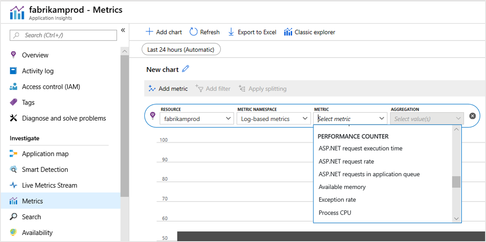
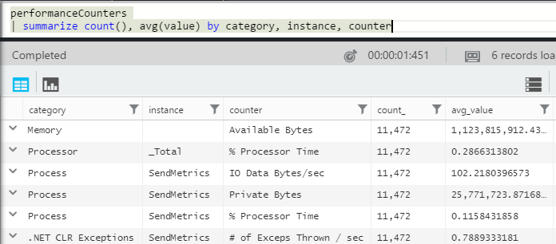
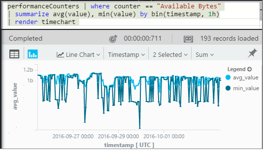
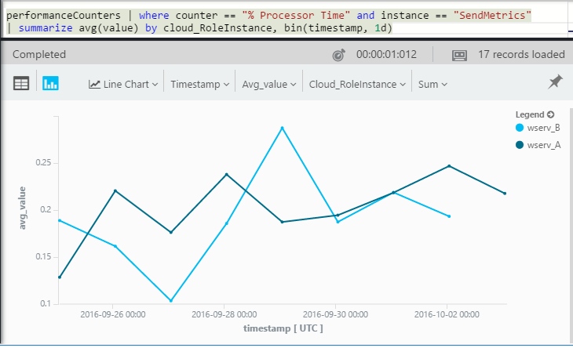

# System performance counters in Application Insights

Windows provides a wide variety of [performance counters](https://docs.microsoft.com/windows/desktop/PerfCtrs/about-performance-counters) such as CPU occupancy, memory, disk, and network usage. You can also define your own performance counters. As long as your application is running under IIS on an on-premises host, or virtual machine to which you have administrative access.

## View counters

The Metrics pane shows the default set of performance counters.



The current default counters that are collected for .NET web applications are:

         - % Process\\Processor Time
         - % Process\\Processor Time Normalized
         - Memory\\Available Bytes
         - ASP.NET Requests/Sec
         - .NET CLR Exceptions Thrown / sec
         - ASP.NET ApplicationsRequest Execution Time
         - Process\\Private Bytes
         - Process\\IO Data Bytes/sec
         - ASP.NET Applications\\Requests In Application Queue
         - Processor(_Total)\\% Processor Time

To see all your most useful charts in one place, create a [dashboard](../../azure-monitor/app/app-insights-dashboards.md) and pin them to it.

## Add counters

If the performance counter you want isn't included in the list of metrics, you can add it.

1. Find out what counters are available in your server by using this PowerShell command on the local server:
   
    `Get-Counter -ListSet *`
   
    (See [`Get-Counter`](https://technet.microsoft.com/library/hh849685.aspx).)
2. Open ApplicationInsights.config.
   
   * If you added Application Insights to your app during development, edit ApplicationInsights.config in your project, and then redeploy it to your servers.
   * If you used Status Monitor to instrument a web app at runtime, find ApplicationInsights.config in the root directory of the app in IIS. Update it there in each server instance.
3. Edit the performance collector directive:
   
```XML
   
    <Add Type="Microsoft.ApplicationInsights.Extensibility.PerfCounterCollector.PerformanceCollectorModule, Microsoft.AI.PerfCounterCollector">
      <Counters>
        <Add PerformanceCounter="\Objects\Processes"/>
        <Add PerformanceCounter="\Sales(photo)\# Items Sold" ReportAs="Photo sales"/>
      </Counters>
    </Add>

```

You can capture both standard counters and those you've implemented yourself. `\Objects\Processes` is an example of a standard counter that is available on all Windows systems. `\Sales(photo)\# Items Sold` is an example of a custom counter that might be implemented in a web service. 

The format is `\Category(instance)\Counter"`, or for categories that don't have instances, just `\Category\Counter`.

`ReportAs` is required for counter names that do not match `[a-zA-Z()/-_ \.]+` - that is, they contain characters that are not in the following sets: letters, round brackets, forward slash, hyphen, underscore, space, dot.

If you specify an instance, it will be collected as a dimension "CounterInstanceName" of the reported metric.

### Collecting performance counters in code
To collect system performance counters and send them to Application Insights, you can adapt the snippet below:


``` C#

    var perfCollectorModule = new PerformanceCollectorModule();
    perfCollectorModule.Counters.Add(new PerformanceCounterCollectionRequest(
      @"\.NET CLR Memory([replace-with-application-process-name])\# GC Handles", "GC Handles")));
    perfCollectorModule.Initialize(TelemetryConfiguration.Active);
```
Or you can do the same thing with custom metrics you created:

``` C#
    var perfCollectorModule = new PerformanceCollectorModule();
    perfCollectorModule.Counters.Add(new PerformanceCounterCollectionRequest(
      @"\Sales(photo)\# Items Sold", "Photo sales"));
    perfCollectorModule.Initialize(TelemetryConfiguration.Active);
```

## Performance counters in Analytics
You can search and display performance counter reports in [Analytics](../../azure-monitor/app/analytics.md).

The **performanceCounters** schema exposes the `category`, `counter` name, and `instance` name of each performance counter.  In the telemetry for each application, you'll see only the counters for that application. For example, to see what counters are available: 



('Instance' here refers to the performance counter instance,  not the role, or server machine instance. The performance counter instance name typically segments counters such as processor time by the name of the process or application.)

To get a chart of available memory over the recent period: 



Like other telemetry, **performanceCounters** also has a column `cloud_RoleInstance` that indicates the identity of the host server instance on which your app is running. For example, to compare the performance of your app on the different machines: 



## ASP.NET and Application Insights counts
*What's the difference between the Exception rate and Exceptions metrics?*

* *Exception rate* is a system performance counter. The CLR counts all the handled and unhandled exceptions that are thrown, and divides the total in a sampling interval by the length of the interval. The Application Insights SDK collects this result and sends it to the portal.

* *Exceptions* is a count of the TrackException reports received by the portal in the sampling interval of the chart. It includes only the handled exceptions where you have written TrackException calls in your code, and doesn't include all [unhandled exceptions](../../azure-monitor/app/asp-net-exceptions.md). 

## Performance counters in ASP.NET Core applications
Performance counters are supported only if the application is targeting the full .NET Framework. There is no ability to collect Performance counters for .NET Core applications.

## Alerts
Like other metrics, you can [set an alert](../../azure-monitor/app/alerts.md) to warn you if a performance counter goes outside a limit you specify. Open the Alerts pane and click Add Alert.

## <a name="next"></a>Next steps
* [Dependency tracking](../../azure-monitor/app/asp-net-dependencies.md)
* [Exception tracking](../../azure-monitor/app/asp-net-exceptions.md)

