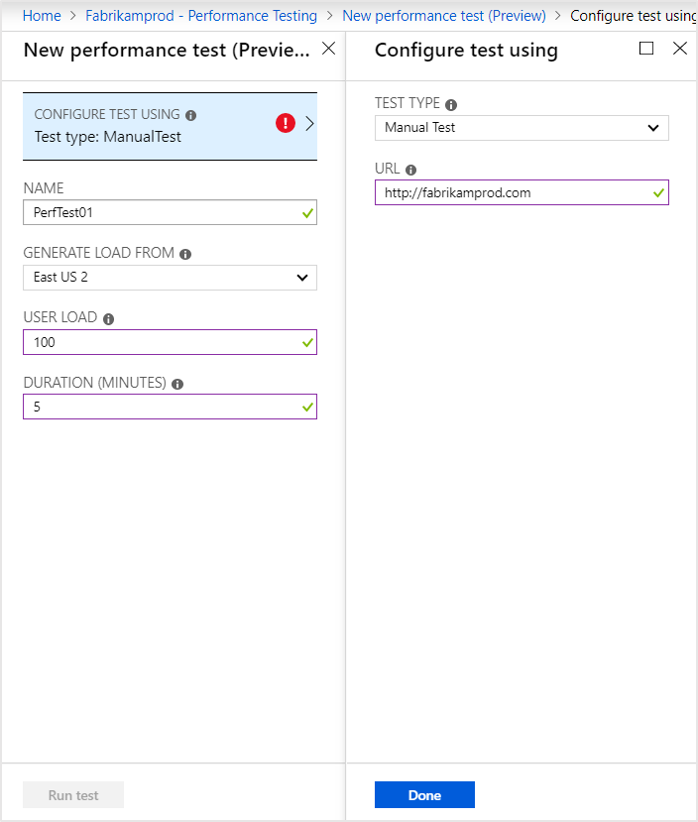
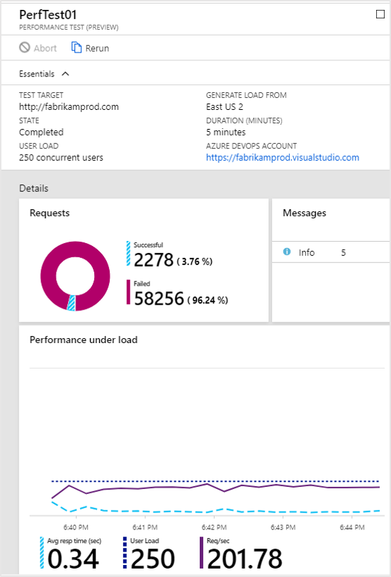
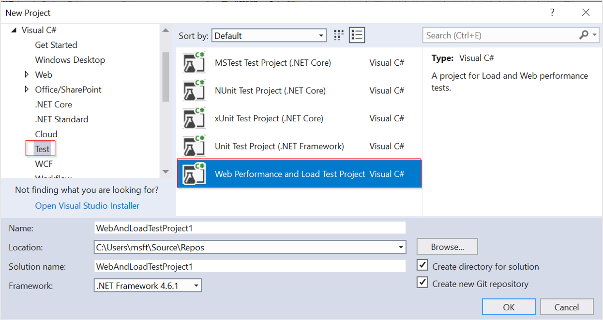

# Performance testing

> [!NOTE]
> The cloud-based load testing service has been deprecated. More information about the deprecation, the service availability, and alternative services can be found [here](https://docs.microsoft.com/azure/devops/test/load-test/overview?view=azure-devops).

Application Insights allows you to generate load tests for your websites. Like [availability tests](monitor-web-app-availability.md), you can send either basic requests or [multi-step requests](availability-multistep.md) from Azure test agents around the world. Performance tests allow you to simulate up to 20,000 simultaneous users for up to 60 minutes.

## Create an Application Insights resource

In order to create a performance test, you first need to create an Application Insights resource. If you have already created a resource proceed to the next section.

From the Azure portal, select **Create a resource** > **Developer Tools** > **Application Insights** and create an Application Insights resource.

## Configure performance testing

If this is your first time creating performance test select **Set Organization** and choose an Azure DevOps organization to be the source for your performance tests.

Under **Configure**, go to **Performance Testing** and click **New** to create a test.

To create a basic performance test, select a test type of **Manual Test** and fill out the desired settings for your test.

|Setting| Max value
|----------|------------|
| User Load | 20,000 |
| Duration (Minutes)  | 60 |  

After your test is created, click **Run test**.

Once the test is complete, you will see results that look similar to the results below:

## Configure Visual Studio web test

Application Insights advanced performance testing capabilities are built on top of Visual Studio performance and load test projects.

## Next steps

* [Multi-step web tests](availability-multistep.md)
* [Url ping tests](monitor-web-app-availability.md)