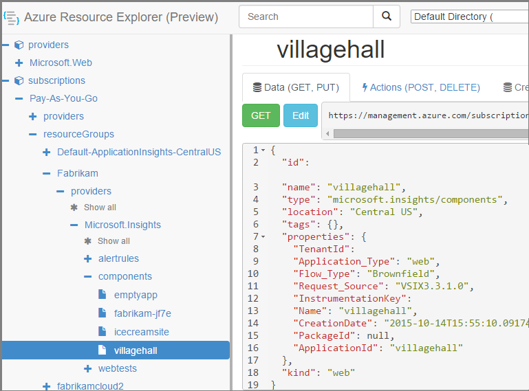

#  Create Application Insights resources using PowerShell

[!INCLUDE [updated-for-az](../../../includes/updated-for-az.md)]

This article shows you how to automate the creation and update of [Application Insights](../../azure-monitor/app/app-insights-overview.md) resources automatically by using Azure Resource Management. You might, for example, do so as part of a build process. Along with the basic Application Insights resource, you can create [availability web tests](../../azure-monitor/app/monitor-web-app-availability.md), set up [alerts](../../azure-monitor/app/alerts.md), set the [pricing scheme](pricing.md), and create other Azure resources.

The key to creating these resources is JSON templates for [Azure Resource Manager](../../azure-resource-manager/manage-resources-powershell.md). In a nutshell, the procedure is: download the JSON definitions of existing resources; parameterize certain values such as names; and then run the template whenever you want to create a new resource. You can package several resources together, to create them all in one go - for example, an app monitor with availability tests, alerts, and storage for continuous export. There are some subtleties to some of the parameterizations, which we'll explain here.

## One-time setup
If you haven't used PowerShell with your Azure subscription before:

Install the Azure Powershell module on the machine where you want to run the scripts:

1. Install [Microsoft Web Platform Installer (v5 or higher)](https://www.microsoft.com/web/downloads/platform.aspx).
2. Use it to install Microsoft Azure Powershell.

## Create an Azure Resource Manager template
Create a new .json file - let's call it `template1.json` in this example. Copy this content into it:

```JSON
    {
        "$schema": "https://schema.management.azure.com/schemas/2015-01-01/deploymentTemplate.json#",
        "contentVersion": "1.0.0.0",
        "parameters": {
            "appName": {
                "type": "string",
                "metadata": {
                    "description": "Enter the application name."
                }
            },
            "appType": {
                "type": "string",
                "defaultValue": "web",
                "allowedValues": [
                    "web",
                    "java",
                    "other"
                ],
                "metadata": {
                    "description": "Enter the application type."
                }
            },
            "appLocation": {
                "type": "string",
                "defaultValue": "East US",
                "allowedValues": [
                    "South Central US",
                    "West Europe",
                    "East US",
                    "North Europe"
                ],
                "metadata": {
                    "description": "Enter the application location."
                }
            },
            "priceCode": {
                "type": "int",
                "defaultValue": 1,
                "allowedValues": [
                    1,
                    2
                ],
                "metadata": {
                    "description": "1 = Per GB (Basic), 2 = Per Node (Enterprise)"
                }
            },
            "dailyQuota": {
                "type": "int",
                "defaultValue": 100,
                "minValue": 1,
                "metadata": {
                    "description": "Enter daily quota in GB."
                }
            },
            "dailyQuotaResetTime": {
                "type": "int",
                "defaultValue": 24,
                "metadata": {
                    "description": "Enter daily quota reset hour in UTC (0 to 23). Values outside the range will get a random reset hour."
                }
            },
            "warningThreshold": {
                "type": "int",
                "defaultValue": 90,
                "minValue": 1,
                "maxValue": 100,
                "metadata": {
                    "description": "Enter the % value of daily quota after which warning mail to be sent. "
                }
            }
        },
        "variables": {
            "priceArray": [
                "Basic",
                "Application Insights Enterprise"
            ],
            "pricePlan": "[take(variables('priceArray'),parameters('priceCode'))]",
            "billingplan": "[concat(parameters('appName'),'/', variables('pricePlan')[0])]"
        },
        "resources": [
            {
                "type": "microsoft.insights/components",
                "kind": "[parameters('appType')]",
                "name": "[parameters('appName')]",
                "apiVersion": "2014-04-01",
                "location": "[parameters('appLocation')]",
                "tags": {},
                "properties": {
                    "ApplicationId": "[parameters('appName')]"
                },
                "dependsOn": []
            },
            {
                "name": "[variables('billingplan')]",
                "type": "microsoft.insights/components/CurrentBillingFeatures",
                "location": "[parameters('appLocation')]",
                "apiVersion": "2015-05-01",
                "dependsOn": [
                    "[resourceId('microsoft.insights/components', parameters('appName'))]"
                ],
                "properties": {
                    "CurrentBillingFeatures": "[variables('pricePlan')]",
                    "DataVolumeCap": {
                        "Cap": "[parameters('dailyQuota')]",
                        "WarningThreshold": "[parameters('warningThreshold')]",
                        "ResetTime": "[parameters('dailyQuotaResetTime')]"
                    }
                }
            }
        ]
    }
```


## Create Application Insights resources
1. In PowerShell, sign in to Azure:
   
    `Connect-AzAccount`
2. Run a command like this:
   
    ```PS
   
        New-AzResourceGroupDeployment -ResourceGroupName Fabrikam `
               -TemplateFile .\template1.json `
               -appName myNewApp

    ``` 
   
   * `-ResourceGroupName` is the group where you want to create the new resources.
   * `-TemplateFile` must occur before the custom parameters.
   * `-appName` The name of the resource to create.

You can add other parameters - you'll find their descriptions in the parameters section of the template.

## To get the instrumentation key
After creating an application resource, you'll want the instrumentation key: 

```PS
    $resource = Find-AzResource -ResourceNameEquals "<YOUR APP NAME>" -ResourceType "Microsoft.Insights/components"
    $details = Get-AzResource -ResourceId $resource.ResourceId
    $ikey = $details.Properties.InstrumentationKey
```


<a id="price"></a>
## Set the price plan

You can set the [price plan](pricing.md).

To create an app resource with the Enterprise price plan, using the template above:

```PS
        New-AzResourceGroupDeployment -ResourceGroupName Fabrikam `
               -TemplateFile .\template1.json `
               -priceCode 2 `
               -appName myNewApp
```

|priceCode|plan|
|---|---|
|1|Basic|
|2|Enterprise|

* If you only want to use the default Basic price plan, you can omit the CurrentBillingFeatures resource from the template.
* If you want to change the price plan after the component resource has been created, you can use a template that omits the "microsoft.insights/components" resource. Also, omit the `dependsOn` node from the billing resource. 

To verify the updated price plan, look at the **Usage and estimated costs page** blade in the browser. **Refresh the browser view** to make sure you see the latest state.


## Add a metric alert

To set up a metric alert at the same time as your app resource, merge code like this into the template file:

```JSON
{
    parameters: { ... // existing parameters ...
            "responseTime": {
              "type": "int",
              "defaultValue": 3,
              "minValue": 1,
              "metadata": {
                "description": "Enter response time threshold in seconds."
              }
    },
    variables: { ... // existing variables ...
      // Alert names must be unique within resource group.
      "responseAlertName": "[concat('ResponseTime-', toLower(parameters('appName')))]"
    }, 
    resources: { ... // existing resources ...
     {
      //
      // Metric alert on response time
      //
      "name": "[variables('responseAlertName')]",
      "type": "Microsoft.Insights/alertrules",
      "apiVersion": "2014-04-01",
      "location": "[parameters('appLocation')]",
      // Ensure this resource is created after the app resource:
      "dependsOn": [
        "[resourceId('Microsoft.Insights/components', parameters('appName'))]"
      ],
      "tags": {
        "[concat('hidden-link:', resourceId('Microsoft.Insights/components', parameters('appName')))]": "Resource"
      },
      "properties": {
        "name": "[variables('responseAlertName')]",
        "description": "response time alert",
        "isEnabled": true,
        "condition": {
          "$type": "Microsoft.WindowsAzure.Management.Monitoring.Alerts.Models.ThresholdRuleCondition, Microsoft.WindowsAzure.Management.Mon.Client",
          "odata.type": "Microsoft.Azure.Management.Insights.Models.ThresholdRuleCondition",
          "dataSource": {
            "$type": "Microsoft.WindowsAzure.Management.Monitoring.Alerts.Models.RuleMetricDataSource, Microsoft.WindowsAzure.Management.Mon.Client",
            "odata.type": "Microsoft.Azure.Management.Insights.Models.RuleMetricDataSource",
            "resourceUri": "[resourceId('microsoft.insights/components', parameters('appName'))]",
            "metricName": "request.duration"
          },
          "threshold": "[parameters('responseTime')]", //seconds
          "windowSize": "PT15M" // Take action if changed state for 15 minutes
        },
        "actions": [
          {
            "$type": "Microsoft.WindowsAzure.Management.Monitoring.Alerts.Models.RuleEmailAction, Microsoft.WindowsAzure.Management.Mon.Client",
            "odata.type": "Microsoft.Azure.Management.Insights.Models.RuleEmailAction",
            "sendToServiceOwners": true,
            "customEmails": []
          }
        ]
      }
    }
}
```

When you invoke the template, you can optionally add this parameter:

    `-responseTime 2`

You can of course parameterize other fields. 

To find out the type names and configuration details of other alert rules, create a rule manually and then inspect it in [Azure Resource Manager](https://resources.azure.com/). 


## Add an availability test

This example is for a ping test (to test a single page).  

**There are two parts** in an availability test: the test itself, and the alert that notifies you of failures.

Merge the following code into the template file that creates the app.

```JSON
{
    parameters: { ... // existing parameters here ...
      "pingURL": { "type": "string" },
      "pingText": { "type": "string" , defaultValue: ""}
    },
    variables: { ... // existing variables here ...
      "pingTestName":"[concat('PingTest-', toLower(parameters('appName')))]",
      "pingAlertRuleName": "[concat('PingAlert-', toLower(parameters('appName')), '-', subscription().subscriptionId)]"
    },
    resources: { ... // existing resources here ...
    { //
      // Availability test: part 1 configures the test
      //
      "name": "[variables('pingTestName')]",
      "type": "Microsoft.Insights/webtests",
      "apiVersion": "2014-04-01",
      "location": "[parameters('appLocation')]",
      // Ensure this is created after the app resource:
      "dependsOn": [
        "[resourceId('Microsoft.Insights/components', parameters('appName'))]"
      ],
      "tags": {
        "[concat('hidden-link:', resourceId('Microsoft.Insights/components', parameters('appName')))]": "Resource"
      },
      "properties": {
        "Name": "[variables('pingTestName')]",
        "Description": "Basic ping test",
        "Enabled": true,
        "Frequency": 900, // 15 minutes
        "Timeout": 120, // 2 minutes
        "Kind": "ping", // single URL test
        "RetryEnabled": true,
        "Locations": [
          {
            "Id": "us-va-ash-azr"
          },
          {
            "Id": "emea-nl-ams-azr"
          },
          {
            "Id": "apac-jp-kaw-edge"
          }
        ],
        "Configuration": {
          "WebTest": "[concat('<WebTest   Name=\"', variables('pingTestName'), '\"   Enabled=\"True\"         CssProjectStructure=\"\"    CssIteration=\"\"  Timeout=\"120\"  WorkItemIds=\"\"         xmlns=\"http://microsoft.com/schemas/VisualStudio/TeamTest/2010\"         Description=\"\"  CredentialUserName=\"\"  CredentialPassword=\"\"         PreAuthenticate=\"True\"  Proxy=\"default\"  StopOnError=\"False\"         RecordedResultFile=\"\"  ResultsLocale=\"\">  <Items>  <Request Method=\"GET\"    Version=\"1.1\"  Url=\"', parameters('Url'),   '\" ThinkTime=\"0\"  Timeout=\"300\" ParseDependentRequests=\"True\"         FollowRedirects=\"True\" RecordResult=\"True\" Cache=\"False\"         ResponseTimeGoal=\"0\"  Encoding=\"utf-8\"  ExpectedHttpStatusCode=\"200\"         ExpectedResponseUrl=\"\" ReportingName=\"\" IgnoreHttpStatusCode=\"False\" />        </Items>  <ValidationRules> <ValidationRule  Classname=\"Microsoft.VisualStudio.TestTools.WebTesting.Rules.ValidationRuleFindText, Microsoft.VisualStudio.QualityTools.WebTestFramework, Version=10.0.0.0, Culture=neutral, PublicKeyToken=b03f5f7f11d50a3a\" DisplayName=\"Find Text\"         Description=\"Verifies the existence of the specified text in the response.\"         Level=\"High\"  ExecutionOrder=\"BeforeDependents\">  <RuleParameters>        <RuleParameter Name=\"FindText\" Value=\"',   parameters('pingText'), '\" />  <RuleParameter Name=\"IgnoreCase\" Value=\"False\" />  <RuleParameter Name=\"UseRegularExpression\" Value=\"False\" />  <RuleParameter Name=\"PassIfTextFound\" Value=\"True\" />  </RuleParameters> </ValidationRule>  </ValidationRules>  </WebTest>')]"
        },
        "SyntheticMonitorId": "[variables('pingTestName')]"
      }
    },

    {
      //
      // Availability test: part 2, the alert rule
      //
      "name": "[variables('pingAlertRuleName')]",
      "type": "Microsoft.Insights/alertrules",
      "apiVersion": "2014-04-01",
      "location": "[parameters('appLocation')]", 
      "dependsOn": [
        "[resourceId('Microsoft.Insights/webtests', variables('pingTestName'))]"
      ],
      "tags": {
        "[concat('hidden-link:', resourceId('Microsoft.Insights/components', parameters('appName')))]": "Resource",
        "[concat('hidden-link:', resourceId('Microsoft.Insights/webtests', variables('pingTestName')))]": "Resource"
      },
      "properties": {
        "name": "[variables('pingAlertRuleName')]",
        "description": "alert for web test",
        "isEnabled": true,
        "condition": {
          "$type": "Microsoft.WindowsAzure.Management.Monitoring.Alerts.Models.LocationThresholdRuleCondition, Microsoft.WindowsAzure.Management.Mon.Client",
          "odata.type": "Microsoft.Azure.Management.Insights.Models.LocationThresholdRuleCondition",
          "dataSource": {
            "$type": "Microsoft.WindowsAzure.Management.Monitoring.Alerts.Models.RuleMetricDataSource, Microsoft.WindowsAzure.Management.Mon.Client",
            "odata.type": "Microsoft.Azure.Management.Insights.Models.RuleMetricDataSource",
            "resourceUri": "[resourceId('microsoft.insights/webtests', variables('pingTestName'))]",
            "metricName": "GSMT_AvRaW"
          },
          "windowSize": "PT15M", // Take action if changed state for 15 minutes
          "failedLocationCount": 2
        },
        "actions": [
          {
            "$type": "Microsoft.WindowsAzure.Management.Monitoring.Alerts.Models.RuleEmailAction, Microsoft.WindowsAzure.Management.Mon.Client",
            "odata.type": "Microsoft.Azure.Management.Insights.Models.RuleEmailAction",
            "sendToServiceOwners": true,
            "customEmails": []
          }
        ]
      }
    }
}
```

To discover the codes for other test locations, or to automate the creation of more complex web tests, create an example manually and then parameterize the code from [Azure Resource Manager](https://resources.azure.com/).

## Add more resources

To automate the creation of any other resource of any kind, create an example manually, and then copy and parameterize its code from [Azure Resource Manager](https://resources.azure.com/). 

1. Open [Azure Resource Manager](https://resources.azure.com/). Navigate down through `subscriptions/resourceGroups/<your resource group>/providers/Microsoft.Insights/components`, to your application resource. 
   
    
   
    *Components* are the basic Application Insights resources for displaying applications. There are separate resources for the associated alert rules and availability web tests.
2. Copy the JSON of the component into the appropriate place in `template1.json`.
3. Delete these properties:
   
   * `id`
   * `InstrumentationKey`
   * `CreationDate`
   * `TenantId`
4. Open the webtests and alertrules sections and copy the JSON for individual items into your template. (Don't copy from the webtests or alertrules nodes: go into the items under them.)
   
    Each web test has an associated alert rule, so you have to copy both of them.
   
    You can also include alerts on metrics. [Metric names](powershell-alerts.md#metric-names).
5. Insert this line in each resource:
   
    `"apiVersion": "2015-05-01",`

### Parameterize the template
Now you have to replace the specific names with parameters. To [parameterize a template](../../azure-resource-manager/resource-group-authoring-templates.md), you write expressions using a [set of helper functions](../../azure-resource-manager/resource-group-template-functions.md). 

You can't parameterize just part of a string, so use `concat()` to build strings.

Here are examples of the substitutions you'll want to make. There are several occurrences of each substitution. You might need others in your template. These examples use the parameters and variables we defined at the top of the template.

| find | replace with |
| --- | --- |
| `"hidden-link:/subscriptions/.../../components/MyAppName"` |`"[concat('hidden-link:',`<br/>`resourceId('microsoft.insights/components',` <br/> `parameters('appName')))]"` |
| `"/subscriptions/.../../alertrules/myAlertName-myAppName-subsId",` |`"[resourceId('Microsoft.Insights/alertrules', variables('alertRuleName'))]",` |
| `"/subscriptions/.../../webtests/myTestName-myAppName",` |`"[resourceId('Microsoft.Insights/webtests', parameters('webTestName'))]",` |
| `"myWebTest-myAppName"` |`"[variables(testName)]"'` |
| `"myTestName-myAppName-subsId"` |`"[variables('alertRuleName')]"` |
| `"myAppName"` |`"[parameters('appName')]"` |
| `"myappname"` (lower case) |`"[toLower(parameters('appName'))]"` |
| `"<WebTest Name=\"myWebTest\" ...`<br/>`Url=\"http://fabrikam.com/home\" ...>"` |`[concat('<WebTest Name=\"',` <br/> `parameters('webTestName'),` <br/> `'\" ... Url=\"', parameters('Url'),` <br/> `'\"...>')]"`<br/>Delete Guid and Id. |

### Set dependencies between the resources
Azure should set up the resources in strict order. To make sure one setup completes before the next begins, add dependency lines:

* In the availability test resource:
  
    `"dependsOn": ["[resourceId('Microsoft.Insights/components', parameters('appName'))]"],`
* In the alert resource for an availability test:
  
    `"dependsOn": ["[resourceId('Microsoft.Insights/webtests', variables('testName'))]"],`


## Next steps
Other automation articles:

* [Create an Application Insights resource](powershell-script-create-resource.md) - quick method without using a template.
* [Set up Alerts](powershell-alerts.md)
* [Create web tests](https://azure.microsoft.com/blog/creating-a-web-test-alert-programmatically-with-application-insights/)
* [Send Azure Diagnostics to Application Insights](powershell-azure-diagnostics.md)
* [Deploy to Azure from GitHub](https://blogs.msdn.com/b/webdev/archive/2015/09/16/deploy-to-azure-from-github-with-application-insights.aspx)
* [Create release annotations](https://github.com/Microsoft/ApplicationInsights-Home/blob/master/API/CreateReleaseAnnotation.ps1)
