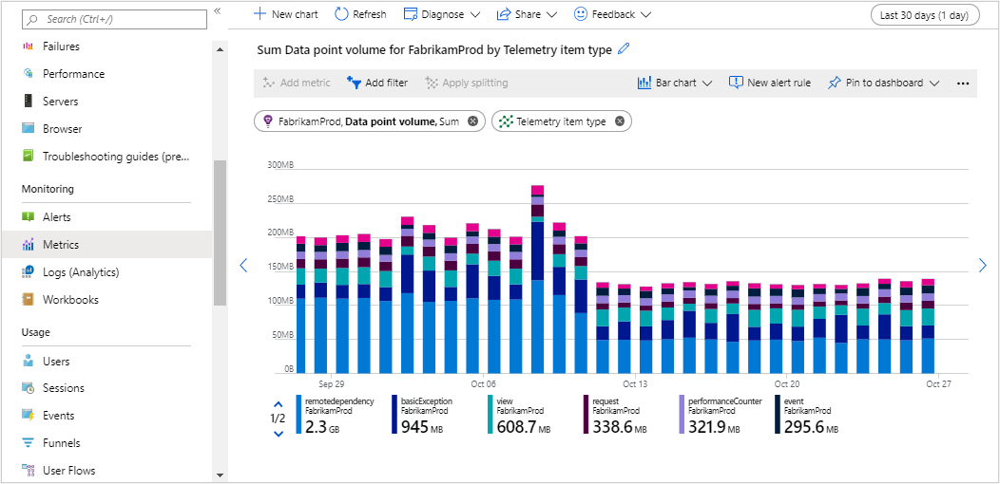

# Manage usage and costs for Application Insights

> [!NOTE]
> This article describes how to understand and control your costs for Application Insights.  A related article, [Monitoring usage and estimated costs](https://docs.microsoft.com/azure/azure-monitor/platform/usage-estimated-costs) describes how to view usage and estimated costs across multiple Azure monitoring features for different pricing models.

Application Insights is designed to get everything you need to monitor the availability, performance, and usage of your web applications, whether they're hosted on Azure or on-premises. Application Insights supports popular languages and frameworks, such as .NET, Java, and Node.js, and integrates with DevOps processes and tools like Azure DevOps, Jira, and PagerDuty. It's important to understand what determines the costs of monitoring your applications. In this article, we review what drives your application monitoring costs and how you can proactively monitor and control them.

If you have questions about how pricing works for Application Insights, you can post a question in our [Microsoft Q&A question page](https://docs.microsoft.com/answers/topics/azure-monitor.html).

## Pricing model

The pricing for [Azure Application Insights][start] is a **Pay-As-You-Go** model based on data volume ingested and optionally for longer data retention. Each Application Insights resource is charged as a separate service and contributes to the bill for your Azure subscription. Data volume is measured as the size of the uncompressed JSON data package that's received by Application Insights from your application. There is no data volume charge for using the [Live Metrics Stream](../../azure-monitor/app/live-stream.md).

[Multi-step web tests](../../azure-monitor/app/availability-multistep.md) incur an additional charge. Multi-step web tests are web tests that perform a sequence of actions. There's no separate charge for *ping tests* of a single page. Telemetry from ping tests and multi-step tests is charged the same as other telemetry from your app.

The Application Insights option to [Enable alerting on custom metric dimensions](https://docs.microsoft.com/azure/azure-monitor/app/pre-aggregated-metrics-log-metrics#custom-metrics-dimensions-and-pre-aggregation) can also generate in additional costs because this can result in the creation of additional pre-aggregation metrics. [Learn more](https://docs.microsoft.com/azure/azure-monitor/app/pre-aggregated-metrics-log-metrics) about log-based and pre-aggregated metrics in Application Insights and about [pricing](https://azure.microsoft.com/pricing/details/monitor/) for Azure Monitor custom metrics.

### Workspace-based Application Insights

For Application Insights resources which send their data to a Log Analytics workspace, called [workspace-based Application Insights resources](create-workspace-resource.md), the billing for data ingestion and retention is done by the workspace where the Application Insights data is located. This enables customers to leverage all options of the Log Analytics [pricing model](https://docs.microsoft.com/azure/azure-monitor/platform/manage-cost-storage#pricing-model) that includes Capacity Reservations in addition to Pay-As-You-Go. Log Analytics also has more options for data retention, including [retention by data type](https://docs.microsoft.com/azure/azure-monitor/platform/manage-cost-storage#retention-by-data-type). Application Insights data types in the workspace receive 90 days of retention without charges. Usage of web tests and enabling alerting on custom metric dimensions is still reported through Application Insights. Learn how to track data ingestion and retention costs in Log Analytics using the [Usage and estimated costs](https://docs.microsoft.com/azure/azure-monitor/platform/manage-cost-storage#understand-your-usage-and-estimate-costs), [Azure Cost Management + Billing](https://docs.microsoft.com/azure/azure-monitor/platform/manage-cost-storage#viewing-log-analytics-usage-on-your-azure-bill) and [Log Analytics queries](#data-volume-for-workspace-based-application-insights-resources). 

## Estimating the costs to manage your application

If you're not yet using Application Insights, you can use the [Azure Monitor pricing calculator](https://azure.microsoft.com/pricing/calculator/?service=monitor) to estimate the cost of using Application Insights. Start by entering "Azure Monitor" in the Search box, and clicking on the resulting Azure Monitor tile. Scroll down the page to Azure Monitor, and select Application Insights from the Type dropdown.  Here you can enter the number of GB of data you expect to collect per month, so the question is how much data will Application Insights collect monitoring your application.

There are two approaches to address this: use of default monitoring and adaptive sampling, which is available in the ASP.NET SDK, or estimate your likely data ingestion based on what other similar customers have seen.

### Data collection when using sampling

With the ASP.NET SDK's [adaptive sampling](sampling.md#adaptive-sampling), the data volume is adjusted automatically to keep within a specified maximum rate of traffic for default Application Insights monitoring. If the application produces a low amount of telemetry, such as when debugging or due to low usage, items won't be dropped by the sampling processor as long as volume is below the configured events per second level. For a high volume application, with the default threshold of five events per second, adaptive sampling will limit the number of daily events to 432,000. Using a typical average event size of 1 KB, this corresponds to 13.4 GB of telemetry per 31-day month per node hosting your application (since the sampling is done local to each node.) 

For SDKs that don't support adaptive sampling, you can employ [ingestion sampling](https://docs.microsoft.com/azure/azure-monitor/app/sampling#ingestion-sampling), which samples when the data is received by Application Insights based on a percentage of data to retain, or [fixed-rate sampling for ASP.NET, ASP.NET Core, and Java websites](sampling.md#fixed-rate-sampling) to reduce the traffic sent from your web server and web browsers

### Learn from what similar customers collect

In the Azure Monitoring Pricing calculator for Application Insights, if you enable the "Estimate data volume based on application activity" functionality, you can provide inputs about your application (requests per month and page views per month, in case you will collect client-side telemetry), and then the calculator will tell you the median and 90th percentile amount of data collected by similar applications. These applications span the range of Application Insights configuration (e.g some have default [sampling](../../azure-monitor/app/sampling.md), some have no sampling etc.), so you still have the control to reduce the volume of data you ingest far below the median level using sampling. But this is a starting point to understand what other, similar customers are seeing.

## Understand your usage and estimate costs

Application Insights makes it easy to understand what your costs are likely to be based on recent usage patterns. To get started, in the Azure portal, for the Application Insights resource, go to the **Usage and estimated costs** page:


A. Review your data volume for the month. This includes all the data that's received and retained (after any [sampling](../../azure-monitor/app/sampling.md)) from your server and client apps, and from availability tests.  
B. A separate charge is made for [multi-step web tests](../../azure-monitor/app/availability-multistep.md). (This doesn't include simple availability tests, which are included in the data volume charge.)  
C. View data volume trends for the past month.  
D. Enable data ingestion [sampling](../../azure-monitor/app/sampling.md).
E. Set the daily data volume cap.  

(Note that all prices displayed in screenshots in this article are for example purposes only. For current prices in your currency and region, see [Application Insights pricing][pricing].)

To investigate your Application Insights usage more deeply, open the **Metrics** page, add the metric named "Data point volume", and then select the *Apply splitting* option to split the data by "Telemetry item type".

Application Insights charges are added to your Azure bill. You can see details of your Azure bill in the **Cost Management + Billing** section of the Azure portal, or in the [Azure billing portal](https://account.windowsazure.com/Subscriptions).  [See below](https://docs.microsoft.com/azure/azure-monitor/app/pricing#viewing-application-insights-usage-on-your-azure-bill) for details on using this for Application Insights. 


### Using data volume metrics
<a id="understanding-ingested-data-volume"></a>

To learn more about your data volumes, selecting **Metrics** for your Application Insights resource, add a new chart. For the chart metric, under **Log-based metrics**, select **Data point volume**. Click **Apply splitting**, and select group by **`Telemetryitem` type**.



### Queries to understand data volume details

There are two approaches to investigating data volumes for Application Insights. The first uses aggregated information in the `systemEvents` table, and the second uses the `_BilledSize` property, which is available on each ingested event. `systemEvents` will not have data size information for [workspace-based-application-insights](#data-volume-for-workspace-based-application-insights-resources).

#### Using aggregated data volume information

For instance, you can use the `systemEvents` table to see the data volume ingested in the last 24 hours with the query:

```kusto
systemEvents
| where timestamp >= ago(24h)
| where type == "Billing"
| extend BillingTelemetryType = tostring(dimensions["BillingTelemetryType"])
| extend BillingTelemetrySizeInBytes = todouble(measurements["BillingTelemetrySize"])
| summarize sum(BillingTelemetrySizeInBytes)
```

Or to see a chart of data volume (in bytes) by data type for the last 30 days, you can use:

```kusto
systemEvents
| where timestamp >= startofday(ago(30d))
| where type == "Billing"
| extend BillingTelemetryType = tostring(dimensions["BillingTelemetryType"])
| extend BillingTelemetrySizeInBytes = todouble(measurements["BillingTelemetrySize"])
| summarize sum(BillingTelemetrySizeInBytes) by BillingTelemetryType, bin(timestamp, 1d) | render barchart  
```

Note that this query can be used in an [Azure Log Alert](https://docs.microsoft.com/azure/azure-monitor/platform/alerts-unified-log) to set up alerting on data volumes.  

To learn more about your telemetry data changes, we can get the count of events by type using the query:

```kusto
systemEvents
| where timestamp >= startofday(ago(30d))
| where type == "Billing"
| extend BillingTelemetryType = tostring(dimensions["BillingTelemetryType"])
| summarize count() by BillingTelemetryType, bin(timestamp, 1d)
| render barchart  
```

#### Using data size per event information

To learn more details about the source of your data volumes, you can use the `_BilledSize` property that is present on each ingested event.

For example, to look at which operations generate the most data volume in the last 30 days, we can sum `_BilledSize` for all dependency events:

```kusto
dependencies
| where timestamp >= startofday(ago(30d))
| summarize sum(_BilledSize) by operation_Name
| render barchart  
```

#### Data volume for workspace-based Application Insights resources

To look at the data volume trends for all of the [workspace-based Application Insights resources](create-workspace-resource.md) in a workspace for the last week, go to the Log Analytics workspace and run the query:

```kusto
union (AppAvailabilityResults),
      (AppBrowserTimings),
      (AppDependencies),
      (AppExceptions),
      (AppEvents),
      (AppMetrics),
      (AppPageViews),
      (AppPerformanceCounters),
      (AppRequests),
      (AppSystemEvents),
      (AppTraces)
| where TimeGenerated >= startofday(ago(7d) and TimeGenerated < startofday(now())
| summarize sum(_BilledSize) by _ResourceId, bin(TimeGenerated, 1d)
| render areachart
```

To query the data volume trends by type for a specific workspace-based Application Insights resource, in the Log Analytics workspace use:

```kusto
union (AppAvailabilityResults),
      (AppBrowserTimings),
      (AppDependencies),
      (AppExceptions),
      (AppEvents),
      (AppMetrics),
      (AppPageViews),
      (AppPerformanceCounters),
      (AppRequests),
      (AppSystemEvents),
      (AppTraces)
| where TimeGenerated >= startofday(ago(7d) and TimeGenerated < startofday(now())
| where _ResourceId contains "<myAppInsightsResourceName>"
| summarize sum(_BilledSize) by Type, bin(TimeGenerated, 1d)
| render areachart
```

## Viewing Application Insights usage on your Azure bill

Azure provides a great deal of useful functionality in the [Azure Cost Management + Billing](https://docs.microsoft.com/azure/cost-management/quick-acm-cost-analysis?toc=/azure/billing/TOC.json) hub. For instance, the "Cost analysis" functionality enables you to view your spends for Azure resources. Adding a filter by resource type (to microsoft.insights/components for Application Insights) will allow you to track your spending. Then for "Group by" select "Meter category" or "Meter".  For Application Insights resources on the current pricing plans, most usage will show up as Log Analytics for the Meter category since there is a single logs backend for all Azure Monitor components. 

More understanding of your usage can be gained by [downloading your usage from the Azure portal](https://docs.microsoft.com/azure/billing/billing-download-azure-invoice-daily-usage-date#download-usage-in-azure-portal).
In the downloaded spreadsheet, you can see usage per Azure resource per day. In this Excel spreadsheet, usage from your Application Insights resources can be found by first filtering on the "Meter Category" column to show "Application Insights" and "Log Analytics", and then adding a filter on the "Instance ID" column which is "contains microsoft.insights/components".  Most Application Insights usage is reported on meters with the Meter Category of Log Analytics, since there is a single logs backend for all Azure Monitor components.  Only Application Insights resources on legacy pricing tiers and multi-step web tests are reported with a Meter Category of Application Insights.  The usage is shown in the "Consumed Quantity" column and the unit for each entry is shown in the "Unit of Measure" column.  More details are available to help you [understand your Microsoft Azure bill](https://docs.microsoft.com/azure/billing/billing-understand-your-bill).

## Managing your data volume

The volume of data you send can be managed using the following techniques:

* **Sampling**: You can use sampling to reduce the amount of telemetry that's sent from your server and client apps, with minimal distortion of metrics. Sampling is the primary tool you can use to tune the amount of data you send. Learn more about [sampling features](../../azure-monitor/app/sampling.md).

* **Limit Ajax calls**: You can [limit the number of Ajax calls that can be reported](../../azure-monitor/app/javascript.md#configuration) in every page view, or switch off Ajax reporting.

* **Disable unneeded modules**: [Edit ApplicationInsights.config](../../azure-monitor/app/configuration-with-applicationinsights-config.md) to turn off collection modules that you don't need. For example, you might decide that performance counters or dependency data are inessential.

* **Pre-aggregate metrics**: If you put calls to TrackMetric in your app, you can reduce traffic by using the overload that accepts your calculation of the average and standard deviation of a batch of measurements. Or, you can use a [pre-aggregating package](https://www.myget.org/gallery/applicationinsights-sdk-labs).
 
* **Daily cap**: When you create an Application Insights resource in the Azure portal, the daily cap is set to 100 GB/day. When you create an Application Insights resource in Visual Studio, the default is small (only 32.3 MB/day). The daily cap default is set to facilitate testing. It's intended that the user will raise the daily cap before deploying the app into production. 

    The maximum cap is 1,000 GB/day unless you request a higher maximum for a high-traffic application.
    
    Warning emails about the daily cap are sent to account that are members of these roles for your Application Insights resource: "ServiceAdmin", "AccountAdmin", "CoAdmin", "Owner".

    Use care when you set the daily cap. Your intent should be to *never hit the daily cap*. If you hit the daily cap, you lose data for the remainder of the day, and you can't monitor your application. To change the daily cap, use the **Daily volume cap** option. You can access this option in the **Usage and estimated costs** pane (this is described in more detail later in the article).
    
    We've removed the restriction on some subscription types that have credit that couldn't be used for Application Insights. Previously, if the subscription has a spending limit, the daily cap dialog has instructions to remove the spending limit and enable the daily cap to be raised beyond 32.3 MB/day.
    
* **Throttling**: Throttling limits the data rate to 32,000 events per second, averaged over 1 minute per instrumentation key. The volume of data that your app sends is assessed every minute. If it exceeds the per-second rate averaged over the minute, the server refuses some requests. The SDK buffers the data and then tries to resend it. It spreads out a surge over several minutes. If your app consistently sends data at more than the throttling rate, some data will be dropped. (The ASP.NET, Java, and JavaScript SDKs try to resend data this way; other SDKs might simply drop throttled data.) If throttling occurs, a notification warning alerts you that this has occurred.

## Manage your maximum daily data volume

You can use the daily volume cap to limit the data collected. However, if the cap is met, a loss of all telemetry sent from your application for the remainder of the day occurs. It is *not advisable* to have your application hit the daily cap. You can't track the health and performance of your application after it reaches the daily cap.

Instead of using the daily volume cap, use [sampling](../../azure-monitor/app/sampling.md) to tune the data volume to the level you want. Then, use the daily cap only as a "last resort" in case your application unexpectedly begins to send much higher volumes of telemetry.

### Identify what daily data limit to define

Review Application Insights Usage and estimated costs to understand the data ingestion trend and what is the daily volume cap to define. It should be considered with care, since you won't be able to monitor your resources after the limit is reached.

### Set the Daily Cap

To change the daily cap, in the **Configure** section of your Application Insights resource, in the **Usage and estimated costs** page, select  **Daily Cap**.


To [change the daily cap via Azure Resource Manager](../../azure-monitor/app/powershell.md), the property to change is the `dailyQuota`.  Via Azure Resource Manager you can also set the `dailyQuotaResetTime` and the daily cap's `warningThreshold`.

### Create alerts for the Daily Cap

The Application Insights Daily Cap creates an event in the Azure activity log when the ingested data volumes reaches the warning level or the daily cap level.  You can [create an alert based on these activity log events](https://docs.microsoft.com/azure/azure-monitor/platform/alerts-activity-log#create-with-the-azure-portal). The signal names for these events are:

* Application Insights component daily cap warning threshold reached

* Application Insights component daily cap reached

## Sampling
[Sampling](../../azure-monitor/app/sampling.md) is a method of reducing the rate at which telemetry is sent to your app, while retaining the ability to find related events during diagnostic searches. You also retain correct event counts.

Sampling is an effective way to reduce charges and stay within your monthly quota. The sampling algorithm retains related items of telemetry so, for example, when you use Search, you can find the request related to a particular exception. The algorithm also retains correct counts so you see the correct values in Metric Explorer for request rates, exception rates, and other counts.

There are several forms of sampling.

* [Adaptive sampling](../../azure-monitor/app/sampling.md) is the default for the ASP.NET SDK. Adaptive sampling automatically adjusts to the volume of telemetry that your app sends. It operates automatically in the SDK in your web app so that telemetry traffic on the network is reduced. 
* *Ingestion sampling* is an alternative that operates at the point where telemetry from your app enters the Application Insights service. Ingestion sampling doesn't affect the volume of telemetry sent from your app, but it reduces the volume that's retained by the service. You can use ingestion sampling to reduce the quota that's used up by telemetry from browsers and other SDKs.

To set ingestion sampling, go to the  **Pricing** pane:


> [!WARNING]
> The **Data sampling** pane controls only the value of ingestion sampling. It doesn't reflect the sampling rate that's applied by the Application Insights SDK in your app. If the incoming telemetry has already been sampled in the SDK, ingestion sampling isn't applied.
>

To discover the actual sampling rate, no matter where it's been applied, use an [Analytics query](analytics.md). The query looks like this:

    requests | where timestamp > ago(1d)
    | summarize 100/avg(itemCount) by bin(timestamp, 1h)
    | render areachart

In each retained record, `itemCount` indicates the number of original records that it represents. It's equal to 1 + the number of previous discarded records.

## Change the data retention period

The default retention for Application Insights resources is 90 days. Different retention periods can be selected for each Application Insights resource. The full set of available retention periods is 30, 60, 90, 120, 180, 270, 365, 550 or 730 days. [Learn more](https://azure.microsoft.com/pricing/details/monitor/) about pricing for longer data retention. 

To change the retention, from your Application Insights resource, go to the **Usage and Estimated Costs** page and select the **Data Retention** option:


When the retention is lowered, there is a several day grace period before the oldest data is removed.

The retention can also be [set programatically using PowerShell](powershell.md#set-the-data-retention) using the `retentionInDays` parameter. If you set the data retention to 30 days, you can trigger an immediate purge of older data using the `immediatePurgeDataOn30Days` parameter, which may be useful for compliance-related scenarios. This purge functionality is only exposed via Azure Resource Manager and should be used with extreme care. The daily reset time for the data volume cap can be configured using Azure Resource Manager to set the `dailyQuotaResetTime` parameter.

## Data transfer charges using Application Insights

Sending data to Application Insights might incur data bandwidth charges. As described in the [Azure Bandwidth pricing page](https://azure.microsoft.com/pricing/details/bandwidth/), data transfer between Azure services located in two regions charged as outbound data transfer at the normal rate. Inbound data transfer is free. However, this charge is very small (few %) compared to the costs for Application Insights log data ingestion. Consequently controlling costs for Log Analytics needs to focus on your ingested data volume, and we have guidance to help understand that [here](https://docs.microsoft.com/azure/azure-monitor/app/pricing#managing-your-data-volume).

## Limits summary

[!INCLUDE [application-insights-limits](../../../includes/application-insights-limits.md)]

## Disable daily cap e-mails

To disable the daily volume cap e-mails, under the **Configure** section of your Application Insights resource, in the **Usage and estimated costs** pane, select  **Daily Cap**. There are settings to send e-mail when the cap is reached, as well as when an adjustable warning level has been reached. If you wish to disable all daily cap volume-related emails, uncheck both boxes.

## Legacy Enterprise (Per Node) pricing tier

For early adopters of Azure Application Insights, there are still two possible pricing tiers: Basic and Enterprise. The Basic pricing tier is the same as described above and is the default tier. It includes all Enterprise tier features, at no additional cost. The Basic tier bills primarily on the volume of data that's ingested.

> [!NOTE]
> These legacy pricing tiers have been renamed. The Enterprise pricing tier is now called **Per Node** and the Basic pricing tier is now called **Per GB**. These new names are used below and in the Azure portal.  

The Per Node (formerly Enterprise) tier has a per-node charge, and each node receives a daily data allowance. In the Per Node pricing tier, you are charged for data ingested above the included allowance. If you are using Operations Management Suite, you should choose the Per Node tier.

For current prices in your currency and region, see [Application Insights pricing](https://azure.microsoft.com/pricing/details/application-insights/).

> [!NOTE]
> In April 2018, we [introduced](https://azure.microsoft.com/blog/introducing-a-new-way-to-purchase-azure-monitoring-services/) a new pricing model for Azure monitoring. This model adopts a simple "pay-as-you-go" model across the complete portfolio of monitoring services. Learn more about the [new pricing model](https://docs.microsoft.com/azure/monitoring-and-diagnostics/monitoring-usage-and-estimated-costs), how to [assess the impact of moving to this model](https://docs.microsoft.com/azure/monitoring-and-diagnostics/monitoring-usage-and-estimated-costs#understanding-your-azure-monitor-costs) based on your usage patterns, and [how to opt into the new model](https://docs.microsoft.com/azure/monitoring-and-diagnostics/monitoring-usage-and-estimated-costs#azure-monitor-pricing-model)

### Per Node tier and Operations Management Suite subscription entitlements

Customers who purchase Operations Management Suite E1 and E2 can get Application Insights Per Node as an additional component at no additional cost as [previously announced](https://blogs.technet.microsoft.com/msoms/2017/05/19/azure-application-insights-enterprise-as-part-of-operations-management-suite-subscription/). Specifically, each unit of Operations Management Suite E1 and E2 includes an entitlement to one node of the Application Insights Per Node tier. Each Application Insights node includes up to 200 MB of data ingested per day (separate from Log Analytics data ingestion), with 90-day data retention at no additional cost. The tier is described in more detailed later in the article.

Because this tier is applicable only to customers with an Operations Management Suite subscription, customers who don't have an Operations Management Suite subscription don't see an option to select this tier.

> [!NOTE]
> To ensure that you get this entitlement, your Application Insights resources must be in the Per Node pricing tier. This entitlement applies only as nodes. Application Insights resources in the Per GB tier don't realize any benefit. 
> This entitlement isn't visible in the estimated costs shown in the **Usage and estimated cost** pane. Also, if you move a subscription to the new Azure monitoring pricing model in April 2018, the Per GB tier is the only tier available. Moving a subscription to the new Azure monitoring pricing model isn't advisable if you have an Operations Management Suite subscription.

### How the Per Node tier works

* You pay for each node that sends telemetry for any apps in the Per Node tier.
  * A *node* is a physical or virtual server machine or a platform-as-a-service role instance that hosts your app.
  * Development machines, client browsers, and mobile devices do not count as nodes.
  * If your app has several components that send telemetry, such as a web service and a back-end worker, the components are counted separately.
  * [Live Metrics Stream](../../azure-monitor/app/live-stream.md) data isn't counted for pricing purposes. In a subscription, your charges are per node, not per app. If you have five nodes that send telemetry for 12 apps, the charge is for five nodes.
* Although charges are quoted per month, you're charged only for any hour in which a node sends telemetry from an app. The hourly charge is the quoted monthly charge divided by 744 (the number of hours in a 31-day month).
* A data volume allocation of 200 MB per day is given for each node that's detected (with hourly granularity). Unused data allocation isn't carried over from one day to the next.
  * If you choose the Per Node pricing tier, each subscription gets a daily allowance of data based on the number of nodes that send telemetry to the Application Insights resources in that subscription. So, if you have five nodes that send data all day, you'll have a pooled allowance of 1 GB applied to all Application Insights resources in that subscription. It doesn't matter if certain nodes send more data than other nodes because the included data is shared across all nodes. If on a given day, the Application Insights resources receive more data than is included in the daily data allocation for this subscription, the per-GB overage data charges apply. 
  * The daily data allowance is calculated as the number of hours in the day (using UTC) that each node sends telemetry divided by 24 multiplied by 200 MB. So, if you have four nodes that send telemetry during 15 of the 24 hours in the day, the included data for that day would be ((4 &#215; 15) / 24) &#215; 200 MB = 500 MB. At the price of 2.30 USD per GB for data overage, the charge would be 1.15 USD if the nodes send 1 GB of data that day.
  * The Per Node tier daily allowance isn't shared with applications for which you have chosen the Per GB tier. Unused allowance isn't carried over from day-to-day.

### Examples of how to determine distinct node count

| Scenario                               | Total daily node count |
|:---------------------------------------|:----------------:|
| 1 application using 3 Azure App Service instances and 1 virtual server | 4 |
| 3 applications running on 2 VMs; the Application Insights resources for these applications are in the same subscription and in the Per Node tier | 2 | 
| 4 applications whose Applications Insights resources are in the same subscription; each application running 2 instances during 16 off-peak hours, and 4 instances during 8 peak hours | 13.33 |
| Cloud services with 1 Worker Role and 1 Web Role, each running 2 instances | 4 | 
| A 5-node Azure Service Fabric cluster running 50 microservices; each microservice running 3 instances | 5|

* The precise node counting depends on which Application Insights SDK your application is using. 
  * In SDK versions 2.2 and later, both the Application Insights [Core SDK](https://www.nuget.org/packages/Microsoft.ApplicationInsights/) and the [Web SDK](https://www.nuget.org/packages/Microsoft.ApplicationInsights.Web/) report each application host as a node. Examples are the computer name for physical server and VM hosts or the instance name for cloud services.  The only exception is an application that uses only the [.NET Core](https://dotnet.github.io/) and the Application Insights Core SDK. In that case, only one node is reported for all hosts because the host name isn't available.
  * For earlier versions of the SDK, the [Web SDK](https://www.nuget.org/packages/Microsoft.ApplicationInsights.Web/) behaves like the newer SDK versions, but the [Core SDK](https://www.nuget.org/packages/Microsoft.ApplicationInsights/) reports only one node, regardless of the number of application hosts.
  * If your application uses the SDK to set **roleInstance** to a custom value, by default, that same value is used to determine node count.
  * If you're using a new SDK version with an app that runs from client machines or mobile devices, the node count might return a number that's large (because of the large number of client machines or mobile devices).

## Automation

You can write a script to set the pricing tier by using Azure Resource Management. [Learn how](powershell.md#price).

## Next steps

* [Sampling](../../azure-monitor/app/sampling.md)

[api]: app-insights-api-custom-events-metrics.md
[apiproperties]: app-insights-api-custom-events-metrics.md#properties
[start]: ../../azure-monitor/app/app-insights-overview.md
[pricing]: https://azure.microsoft.com/pricing/details/application-insights/
[pricing]: https://azure.microsoft.com/pricing/details/application-insights/