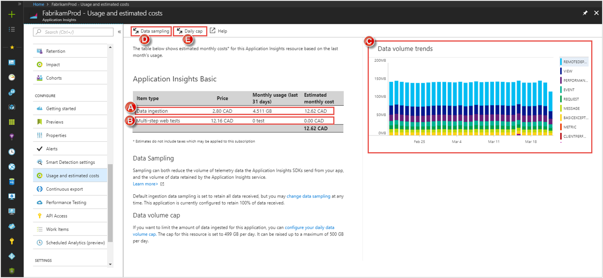
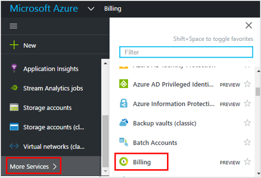
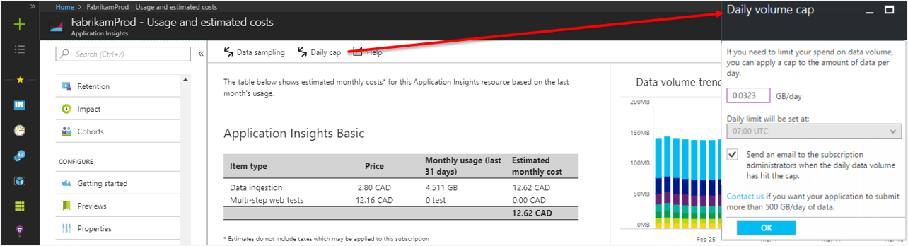
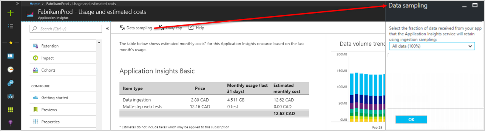

# Manage usage and costs for Application Insights

> [!NOTE]
> This article describes how to analyze data usage Application Insights.  Refer to the following articles for related information.
> - [Monitoring usage and estimated costs](../../monitoring-and-diagnostics/monitoring-usage-and-estimated-costs.md) describes how to view usage and estimated costs across multiple Azure monitoring features for different pricing models. It also describes how to change your pricing model.

If you have questions about how pricing works for Application Insights, you can post a question in our [forum](https://social.msdn.microsoft.com/Forums/en-US/home?forum=ApplicationInsights).

## Pricing model

Pricing for [Azure Application Insights][start] is based on data volume ingested. Each Application Insights resource is charged as a separate service and contributes to the bill for your Azure subscription.

### Data volume details

* Data volume is the number of bytes of telemetry received by Application Insights. Data volume is measured as the size of the uncompressed JSON data package that's received by Application Insights from your application. For [tabular data imported to Analytics](https://docs.microsoft.com/azure/application-insights/app-insights-analytics-import), data volume is measured as the uncompressed size of files that are sent to Application Insights.
* Your application's data volume charges are now reported on a new billing meter named **Data Ingestion** as of April 2018. This new meter is shared across monitoring technologies such as Applications Insights and Log Analytics and is currently under the service name **Log Analytics**. 
* [Live Metrics Stream](../../azure-monitor/app/live-stream.md) data isn't counted for pricing purposes.

> [!NOTE]
> All prices displayed in screenshots in this article are for example purposes only. For current prices in your currency and region, see [Application Insights pricing][pricing].

### Multi-step web tests

[Multi-step web tests](../../azure-monitor/app/availability-multistep.md) incur an additional charge. Multi-step web tests are web tests that perform a sequence of actions.

There's no separate charge for *ping tests* of a single page. Telemetry from ping tests and multi-step tests is charged the same as other telemetry from your app.

## Review usage and estimate costs

Application Insights makes it easy to understand what your costs are likely to be based on recent usage patterns. To get started, in the Azure portal, for the Application Insights resource, go to the **Usage and estimated costs** page:

A. Review your data volume for the month. This includes all the data that's received and retained (after any [sampling](../../azure-monitor/app/sampling.md)) from your server and client apps, and from availability tests.  
B. A separate charge is made for [multi-step web tests](../../azure-monitor/app/availability-multistep.md). (This doesn't include simple availability tests, which are included in the data volume charge.)  
C. View data volume trends for the past month.  
D. Enable data ingestion [sampling](../../azure-monitor/app/sampling.md).   
E. Set the daily data volume cap.  

To investigate your Application Insights usage more deeply, open the **Metrics** page, add the metric named "Data point volume", and then select the *Apply splitting* option to split the data by "Telemetry item type". 

Application Insights charges are added to your Azure bill. You can see details of your Azure bill in the **Billing** section of the Azure portal, or in the [Azure billing portal](https://account.windowsazure.com/Subscriptions). 

## Data rate
The volume of data you send is limited in three ways:

* **Sampling**: You can use sampling to reduce the amount of telemetry that's sent from your server and client apps, with minimal distortion of metrics. Sampling is the primary tool you can use to tune the amount of data you send. Learn more about [sampling features](../../azure-monitor/app/sampling.md). 
* **Daily cap**: When you create an Application Insights resource in the Azure portal, the daily cap is set to 100 GB/day. When you create an Application Insights resource in Visual Studio, the default is small (only 32.3 MB/day). The daily cap default is set to facilitate testing. It's intended that the user will raise the daily cap before deploying the app into production. 

    The maximum cap is 1,000 GB/day unless you request a higher maximum for a high-traffic application. 

    Use care when you set the daily cap. Your intent should be to *never hit the daily cap*. If you hit the daily cap, you lose data for the remainder of the day, and you can't monitor your application. To change the daily cap, use the **Daily volume cap** option. You can access this option in the **Usage and estimated costs** pane (this is described in more detail later in the article).
    We've removed the restriction on some subscription types that have credit that couldn't be used for Application Insights. Previously, if the subscription has a spending limit, the daily cap dialog has instructions to remove the spending limit and enable the daily cap to be raised beyond 32.3 MB/day.
* **Throttling**: Throttling limits the data rate to 32,000 events per second, averaged over 1 minute per instrumentation key.

*What happens if my app exceeds the throttling rate?*

* The volume of data that your app sends is assessed every minute. If it exceeds the per-second rate averaged over the minute, the server refuses some requests. The SDK buffers the data and then tries to resend it. It spreads out a surge over several minutes. If your app consistently sends data at more than the throttling rate, some data will be dropped. (The ASP.NET, Java, and JavaScript SDKs try to resend data this way; other SDKs might simply drop throttled data.) If throttling occurs, a notification warning alerts you that this has occurred.

*How do I know how much data my app is sending?*

You can use one of the following options to see how much data your app is sending:

* Go to the **Usage and estimated cost** pane to see the daily data volume chart. 
* In Metrics Explorer, add a new chart. For the chart metric, select **Data point volume**. Turn on **Grouping**, and then group by **Data type**.

## Reduce your data rate
Here are some things you can do to reduce your data volume:

* Use [Sampling](../../azure-monitor/app/sampling.md). This technology reduces your data rate without skewing your metrics. You don't lose the ability to navigate between related items in Search. In server apps, sampling operates automatically.
* [Limit the number of Ajax calls that can be reported](../../azure-monitor/app/javascript.md#detailed-configuration) in every page view, or switch off Ajax reporting.
* [Edit ApplicationInsights.config](../../azure-monitor/app/configuration-with-applicationinsights-config.md) to turn off collection modules that you don't need. For example, you might decide that performance counters or dependency data are inessential.
* Split your telemetry among separate instrumentation keys. 
* Pre-aggregate metrics. If you put calls to TrackMetric in your app, you can reduce traffic by using the overload that accepts your calculation of the average and standard deviation of a batch of measurements. Or, you can use a [pre-aggregating package](https://www.myget.org/gallery/applicationinsights-sdk-labs).

## Manage the maximum daily data volume

You can use the daily volume cap to limit the data collected. However, if the cap is met, a loss of all telemetry sent from your application for the remainder of the day occurs. It is *not advisable* to have your application hit the daily cap. You can't track the health and performance of your application after it reaches the daily cap.

Instead of using the daily volume cap, use [sampling](../../azure-monitor/app/sampling.md) to tune the data volume to the level you want. Then, use the daily cap only as a "last resort" in case your application unexpectedly begins to send much higher volumes of telemetry.

To change the daily cap, in the **Configure** section of your Application Insights resource, in the **Usage and estimated costs** pane, select  **Daily Cap**.

## Sampling
[Sampling](../../azure-monitor/app/sampling.md) is a method of reducing the rate at which telemetry is sent to your app, while retaining the ability to find related events during diagnostic searches. You also retain correct event counts.

Sampling is an effective way to reduce charges and stay within your monthly quota. The sampling algorithm retains related items of telemetry so, for example, when you use Search, you can find the request related to a particular exception. The algorithm also retains correct counts so you see the correct values in Metric Explorer for request rates, exception rates, and other counts.

There are several forms of sampling.

* [Adaptive sampling](../../azure-monitor/app/sampling.md) is the default for the ASP.NET SDK. Adaptive sampling automatically adjusts to the volume of telemetry that your app sends. It operates automatically in the SDK in your web app so that telemetry traffic on the network is reduced. 
* *Ingestion sampling* is an alternative that operates at the point where telemetry from your app enters the Application Insights service. Ingestion sampling doesn't affect the volume of telemetry sent from your app, but it reduces the volume that's retained by the service. You can use ingestion sampling to reduce the quota that's used up by telemetry from browsers and other SDKs.

To set ingestion sampling, go to the  **Pricing** pane:

> [!WARNING]
> The **Data sampling** pane controls only the value of ingestion sampling. It doesn't reflect the sampling rate that's applied by the Application Insights SDK in your app. If the incoming telemetry has already been sampled in the SDK, ingestion sampling isn't applied.
>

To discover the actual sampling rate, no matter where it's been applied, use an [Analytics query](analytics.md). The query looks like this:

    requests | where timestamp > ago(1d)
    | summarize 100/avg(itemCount) by bin(timestamp, 1h)
    | render areachart

In each retained record, `itemCount` indicates the number of original records that it represents. It's equal to 1 + the number of previous discarded records. 

## Limits summary

[!INCLUDE [application-insights-limits](../../../includes/application-insights-limits.md)]

## Disable daily cap e-mails

To disable the daily volume cap e-mails, under the **Configure** section of your Application Insights resource, in the **Usage and estimated costs** pane, select  **Daily Cap**. There are settings to send e-mail when the cap is reached, as well as when an adjustable warning level has been reached. If you wish to disable all daily cap volume-related emails uncheck both boxes.

## Legacy Enterprise (Per Node) pricing tier

For early adopters of Azure Application Insights, there are still two possible pricing tiers: Basic and Enterprise. The Basic pricing tier is the same as described above and is the default tier. It includes all Enterprise tier features, at no additional cost. The Basic tier bills primarily on the volume of data that's ingested. 

> [!NOTE]
> These legacy pricing tiers have been renamed. The Enterprise pricing tier is now called **Per Node** and the Basic pricing tier is now called **Per GB**. These new names are used below and in the Azure portal.  

The Per Node (formerly Enterprise) tier has a per-node charge, and each node receives a daily data allowance. In the Per Node pricing tier, you are charged for data ingested above the included allowance. If you are using Operations Management Suite, you should choose the Per Node tier. 

For current prices in your currency and region, see [Application Insights pricing](https://azure.microsoft.com/pricing/details/application-insights/).

> [!NOTE]
> In April 2018, we [introduced](https://azure.microsoft.com/blog/introducing-a-new-way-to-purchase-azure-monitoring-services/) a new pricing model for Azure monitoring. This model adopts a simple "pay-as-you-go" model across the complete portfolio of monitoring services. Learn more about the [new pricing model](https://docs.microsoft.com/azure/monitoring-and-diagnostics/monitoring-usage-and-estimated-costs), how to [assess the impact of moving to this model](https://docs.microsoft.com/azure/monitoring-and-diagnostics/monitoring-usage-and-estimated-costs#assessing-the-impact-of-the-new-pricing-model) based on your usage patterns, and [how to opt into the new model](https://docs.microsoft.com/azure/monitoring-and-diagnostics/monitoring-usage-and-estimated-costs#moving-to-the-new-pricing-model)

### Per Node tier and Operations Management Suite subscription entitlements

Customers who purchase Operations Management Suite E1 and E2 can get Application Insights Per Node as an additional component at no additional cost as [previously announced](https://blogs.technet.microsoft.com/msoms/2017/05/19/azure-application-insights-enterprise-as-part-of-operations-management-suite-subscription/). Specifically, each unit of Operations Management Suite E1 and E2 includes an entitlement to one node of the Application Insights Per Node tier. Each Application Insights node includes up to 200 MB of data ingested per day (separate from Log Analytics data ingestion), with 90-day data retention at no additional cost. The tier is described in more detailed later in the article. 

Because this tier is applicable only to customers with an Operations Management Suite subscription, customers who don't have an Operations Management Suite subscription don't see an option to select this tier.

> [!NOTE]
> To ensure that you get this entitlement, your Application Insights resources must be in the Per Node pricing tier. This entitlement applies only as nodes. Application Insights resources in the Per GB tier don't realize any benefit. 
> This entitlement isn't visible in the estimated costs shown in the **Usage and estimated cost** pane. Also, if you move a subscription to the new Azure monitoring pricing model in April 2018, the Per GB tier is the only tier available. Moving a subscription to the new Azure monitoring pricing model isn't advisable if you have an Operations Management Suite subscription.

### How the Per Node tier works

* You pay for each node that sends telemetry for any apps in the Per Node tier.
  * A *node* is a physical or virtual server machine or a platform-as-a-service role instance that hosts your app.
  * Development machines, client browsers, and mobile devices do not count as nodes.
  * If your app has several components that send telemetry, such as a web service and a back-end worker, the components are counted separately.
  * [Live Metrics Stream](../../azure-monitor/app/live-stream.md) data isn't counted for pricing purposes. In a subscription, your charges are per node, not per app. If you have five nodes that send telemetry for 12 apps, the charge is for five nodes.
* Although charges are quoted per month, you're charged only for any hour in which a node sends telemetry from an app. The hourly charge is the quoted monthly charge divided by 744 (the number of hours in a 31-day month).
* A data volume allocation of 200 MB per day is given for each node that's detected (with hourly granularity). Unused data allocation isn't carried over from one day to the next.
  * If you choose the Per Node pricing tier, each subscription gets a daily allowance of data based on the number of nodes that send telemetry to the Application Insights resources in that subscription. So, if you have five nodes that send data all day, you'll have a pooled allowance of 1 GB applied to all Application Insights resources in that subscription. It doesn't matter if certain nodes send more data than other nodes because the included data is shared across all nodes. If on a given day, the Application Insights resources receive more data than is included in the daily data allocation for this subscription, the per-GB overage data charges apply. 
  * The daily data allowance is calculated as the number of hours in the day (using UTC) that each node sends telemetry divided by 24 multiplied by 200 MB. So, if you have four nodes that send telemetry during 15 of the 24 hours in the day, the included data for that day would be ((4 &#215; 15) / 24) &#215; 200 MB = 500 MB. At the price of 2.30 USD per GB for data overage, the charge would be 1.15 USD if the nodes send 1 GB of data that day.
  * The Per Node tier daily allowance isn't shared with applications for which you have chosen the Per GB tier. Unused allowance isn't carried over from day-to-day. 

### Examples of how to determine distinct node count

| Scenario                               | Total daily node count |
|:---------------------------------------|:----------------:|
| 1 application using 3 Azure App Service instances and 1 virtual server | 4 |
| 3 applications running on 2 VMs; the Application Insights resources for these applications are in the same subscription and in the Per Node tier | 2 | 
| 4 applications whose Applications Insights resources are in the same subscription; each application running 2 instances during 16 off-peak hours, and 4 instances during 8 peak hours | 13.33 | 
| Cloud services with 1 Worker Role and 1 Web Role, each running 2 instances | 4 | 
| A 5-node Azure Service Fabric cluster running 50 microservices; each microservice running 3 instances | 5|

* The precise node counting depends on which Application Insights SDK your application is using. 
  * In SDK versions 2.2 and later, both the Application Insights [Core SDK](https://www.nuget.org/packages/Microsoft.ApplicationInsights/) and the [Web SDK](https://www.nuget.org/packages/Microsoft.ApplicationInsights.Web/) report each application host as a node. Examples are the computer name for physical server and VM hosts or the instance name for cloud services.  The only exception is an application that uses only the [.NET Core](https://dotnet.github.io/) and the Application Insights Core SDK. In that case, only one node is reported for all hosts because the host name isn't available. 
  * For earlier versions of the SDK, the [Web SDK](https://www.nuget.org/packages/Microsoft.ApplicationInsights.Web/) behaves like the newer SDK versions, but the [Core SDK](https://www.nuget.org/packages/Microsoft.ApplicationInsights/) reports only one node, regardless of the number of application hosts. 
  * If your application uses the SDK to set **roleInstance** to a custom value, by default, that same value is used to determine node count. 
  * If you're using a new SDK version with an app that runs from client machines or mobile devices, the node count might return a number that's very large (because of the large number of client machines or mobile devices). 

## Automation

You can write a script to set the pricing tier by using Azure Resource Management. [Learn how](powershell.md#price).

## Next steps

* [Sampling](../../azure-monitor/app/sampling.md)

[api]: app-insights-api-custom-events-metrics.md
[apiproperties]: app-insights-api-custom-events-metrics.md#properties
[start]: ../../azure-monitor/app/app-insights-overview.md
[pricing]: https://azure.microsoft.com/pricing/details/application-insights/
