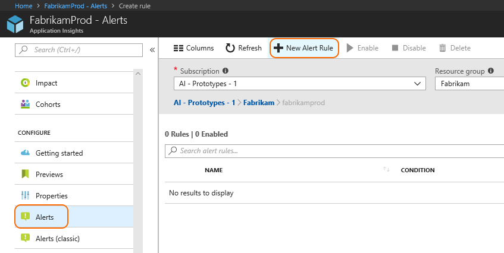
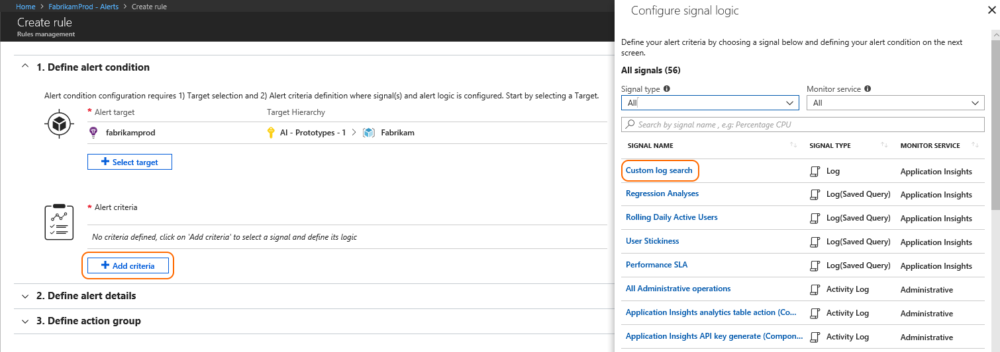
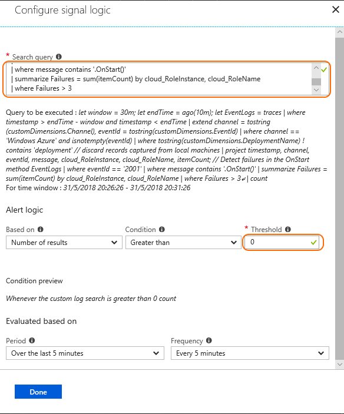
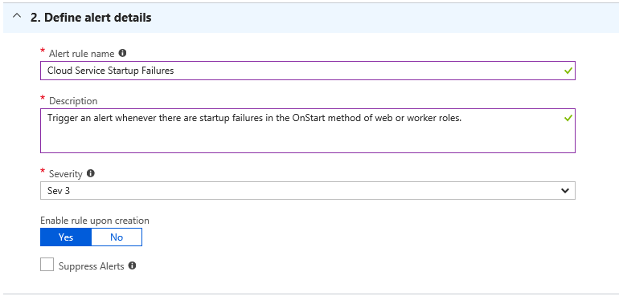

# Alert on issues in Azure Cloud Services using the Azure diagnostics integration with Azure Application Insights

In this article, we will describe how to set up alert rules that monitor for issues like startup failures, crashes, and role recycle loops in Azure Cloud Services (web and worker roles).

The method described in this article is based on the [Azure Diagnostics integration with Application Insights](https://azure.microsoft.com/blog/azure-diagnostics-integration-with-application-insights/), and the recently released [Log Alerts for Application Insights](https://azure.microsoft.com/blog/log-alerts-for-application-insights-preview/) capability.

## Define a base query

To get started, we will define a base query that retrieves the Windows Event Log events from the Windows Azure channel, which are captured into Application Insights as trace records.
These records can be used for detecting a variety of issues in Azure Cloud Services, like startup failures, runtime failures and recycle loops.

> [!NOTE]
> The base query below checks for issues in a time window of 30 minutes, and assumes a 10 minutes latency in ingesting the telemetry records. These defaults can be configured as you see fit.

```
let window = 30m;
let endTime = ago(10m);
let EventLogs = traces
| where timestamp > endTime - window and timestamp < endTime
| extend channel = tostring(customDimensions.Channel), eventId = tostring(customDimensions.EventId)
| where channel == 'Windows Azure' and isnotempty(eventId)
| where tostring(customDimensions.DeploymentName) !contains 'deployment' // discard records captured from local machines
| project timestamp, channel, eventId, message, cloud_RoleInstance, cloud_RoleName, itemCount;
```

## Check for specific event IDs

After retrieving the Windows Event Log events, specific issues can be detected by checking for their respective event ID and message properties (see examples below).
Simply combine the base query above with one of the queries below, and used that combined query when defining the log alert rule.

> [!NOTE]
> In the examples below, an issue will be detected if more than three events are found during the analyzed time window. This default can be configured to change the sensitivity of the alert rule.

```
// Detect failures in the OnStart method
EventLogs
| where eventId == '2001'
| where message contains '.OnStart()'
| summarize Failures = sum(itemCount) by cloud_RoleInstance, cloud_RoleName
| where Failures > 3
```

```
// Detect failures during runtime
EventLogs
| where eventId == '2001'
| where message contains '.Run()'
| summarize Failures = sum(itemCount) by cloud_RoleInstance, cloud_RoleName
| where Failures > 3
```

```
// Detect failures when running a startup task
EventLogs
| where eventId == '1000'
| summarize Failures = sum(itemCount) by cloud_RoleInstance, cloud_RoleName
| where Failures > 3
```

```
// Detect recycle loops
EventLogs
| where eventId == '1006'
| summarize Failures = sum(itemCount) by cloud_RoleInstance, cloud_RoleName
| where Failures > 3
```

## Create an alert

In the navigation menu within your Application Insights resource, go to **Alerts**, and then select **New Alert Rule**.



In the **Create rule** window, under the **Define alert condition** section, click on **Add criteria**, and then select **Custom log search**.



In the **Search query** box, paste the combined query you prepared in the previous step.

Then, continue to the **Threshold** box, and set its value to 0. You may optionally tweak the **Period** and Frequency **fields**.
Click **Done**.



Under the **Define alert details** section, provide a **Name** and **Description** to the alert rule, and set its **Severity**.
Also, make sure that the **Enable rule upon creation** button is set to **Yes**.



Under the **Define action group** section, you can select an existing **Action group** or create a new one.
You may choose to have the action group contain multiple actions of various types.


Once you've defined the Action group, confirm your changes and click **Create alert rule**.

## Next Steps

Learn more about automatically detecting:

[Failure anomalies](../../azure-monitor/app/proactive-failure-diagnostics.md)
[Memory Leaks](../../azure-monitor/app/proactive-potential-memory-leak.md)
[Performance anomalies](../../azure-monitor/app/proactive-performance-diagnostics.md)

