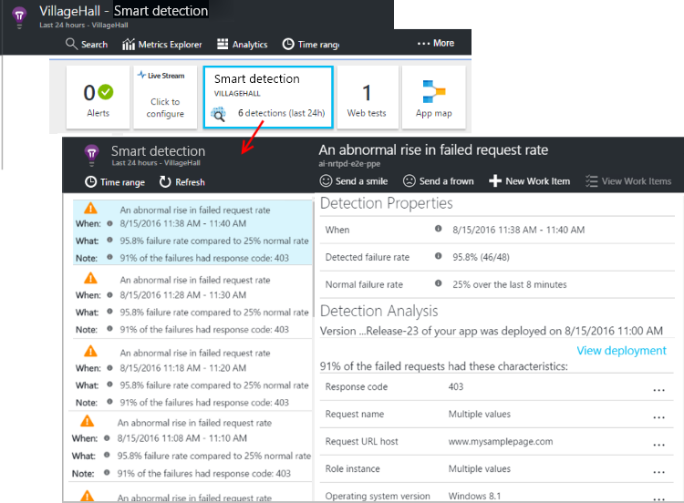

# Smart Detection in Application Insights
 Smart Detection automatically warns you of potential performance problems and failure anomalies in your web application. It performs proactive analysis of the telemetry that your app sends to [Application Insights](../../azure-monitor/app/app-insights-overview.md). If there is a sudden rise in failure rates, or abnormal patterns in client or server performance, you get an alert. This feature needs no configuration. It operates if your application sends enough telemetry.

You can access the detections issued by Smart Detection both from the emails you receive, and from the Smart Detection blade.

## Review your Smart Detections
You can discover detections in two ways:

* **You receive an email** from Application Insights. Here's a typical example:
  
    
  
    Click the big button to open more detail in the portal.
* **The Smart Detection blade** in Application Insights. Select **Smart Detection** under the **Investigate** menu to see a list of recent detections.

Select a detection to see its details.

## What problems are detected?
Smart Detection detects and notifies about a variety of issues, such as:

* [Smart detection - Failure Anomalies](../../azure-monitor/app/proactive-failure-diagnostics.md). We use machine learning to set the expected rate of failed requests for your app, correlating with load and other factors. If the failure rate goes outside the expected envelope, we send an alert.
* [Smart detection - Performance Anomalies](../../azure-monitor/app/proactive-performance-diagnostics.md). You get notifications if response time of an operation or dependency duration is slowing down compared to historical baseline or if we identify an anomalous pattern in response time or page load time.   
* General degradations and issues, like [Trace degradation](https://docs.microsoft.com/azure/azure-monitor/app/proactive-trace-severity), [Memory leak](https://docs.microsoft.com/azure/azure-monitor/app/proactive-potential-memory-leak), [Abnormal rise in Exception volume](https://docs.microsoft.com/azure/azure-monitor/app/proactive-exception-volume) and [Security anti-patterns](https://docs.microsoft.com/azure/azure-monitor/app/proactive-application-security-detection-pack).

(The help links in each notification take you to the relevant articles.)

## Smart Detection email notifications

All Smart Detection rules, except for rules marked as _preview_, are configured by default to send email notifications when detections are found.

Configuring email notifications for a specific Smart Detection rule can be done by opening the Smart Detection **Settings** blade and selecting the rule, which will open the **Edit rule** blade.

Alternatively, you can change the configuration using Azure Resource Manager templates. [See Manage Application Insights smart detection rules using Azure Resource Manager templates](https://docs.microsoft.com/azure/azure-monitor/app/proactive-arm-config) for more details.

## Video

> [!VIDEO https://channel9.msdn.com/events/Connect/2016/112/player]

## Next steps
These diagnostic tools help you inspect the telemetry from your app:

* [Metric explorer](../../azure-monitor/platform/metrics-charts.md)
* [Search explorer](../../azure-monitor/app/diagnostic-search.md)
* [Analytics - powerful query language](../../azure-monitor/log-query/get-started-portal.md)

Smart Detection is completely automatic. But maybe you'd like to set up some more alerts?

* [Manually configured metric alerts](../../azure-monitor/platform/alerts-log.md)
* [Availability web tests](../../azure-monitor/app/monitor-web-app-availability.md) 

