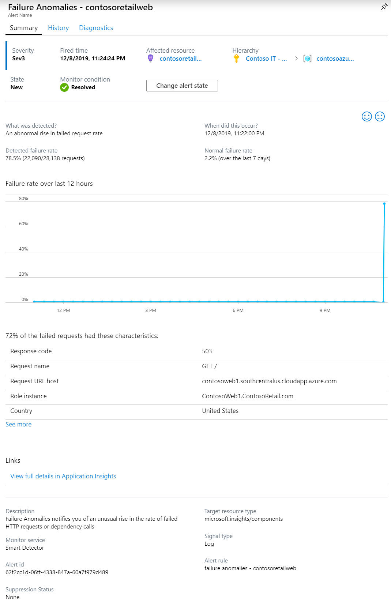
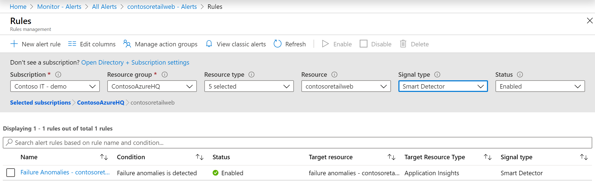
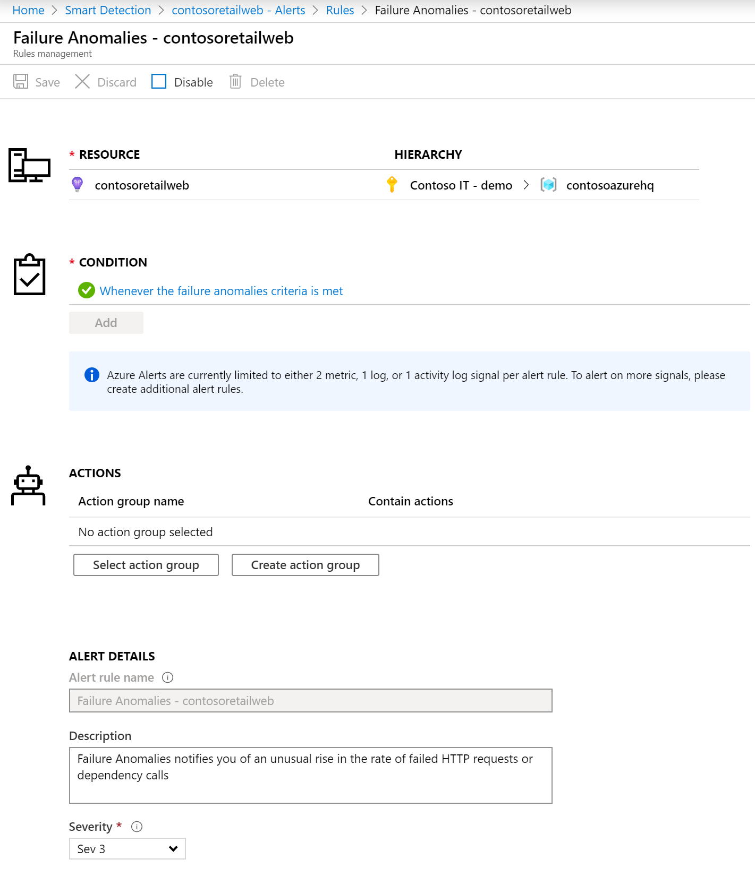
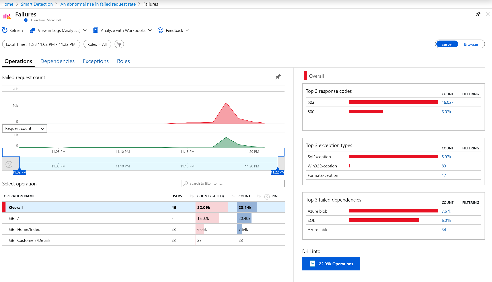
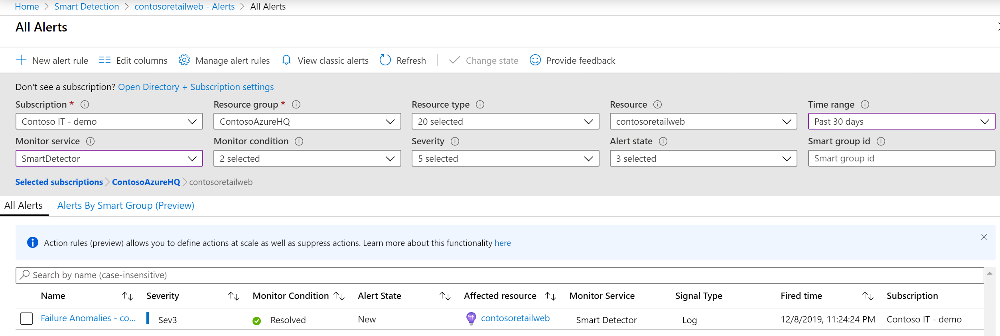

# Smart Detection - Failure Anomalies
[Application Insights](../../azure-monitor/app/app-insights-overview.md) automatically notifies you in near real time if your web app experiences an abnormal rise in the rate of failed requests. It detects an unusual rise in the rate of HTTP requests or dependency calls that are reported as failed. For requests, failed requests are usually those with response codes of 400 or higher. To help you triage and diagnose the problem, an analysis of the characteristics of the failures and related telemetry is provided in the notification. There are also links to the Application Insights portal for further diagnosis. The feature needs no set-up nor configuration, as it uses machine learning algorithms to predict the normal failure rate.

This feature works for any web app, hosted in the cloud or on your own servers, that generates request or dependency telemetry - for example, if you have a worker role that calls [TrackRequest()](../../azure-monitor/app/api-custom-events-metrics.md#trackrequest) or [TrackDependency()](../../azure-monitor/app/api-custom-events-metrics.md#trackdependency).

After setting up [Application Insights for your project](../../azure-monitor/app/app-insights-overview.md), and provided your app generates a certain minimum amount of telemetry, Smart Detection of failure anomalies takes 24 hours to learn the normal behavior of your app, before it is switched on and can send alerts.

Here's a sample alert.

> [!NOTE]
> By default, you get a shorter format mail than this example. But you can [switch to this detailed format](#configure-alerts).
>
>

Notice that it tells you:

* The failure rate compared to normal app behavior.
* How many users are affected - so you know how much to worry.
* A characteristic pattern associated with the failures. In this example, there's a particular response code, request name (operation) and app version. That immediately tells you where to start looking in your code. Other possibilities could be a specific browser or client operating system.
* The exception, log traces, and dependency failure (databases or other external components) that appear to be associated with the characterized failures.
* Links directly to relevant searches on the telemetry in Application Insights.

## Failure Anomalies v2
A new version of the Failure Anomalies alert rule is now available. This new version  is running on the new Azure alerting platform and introduces a variety of improvements over the existing version.

### What's new in this version?
- Faster detection of issues
- A richer set of actions - The alert rule is created with an associated [Action Group](https://docs.microsoft.com/azure/azure-monitor/platform/action-groups) named "Application Insights Smart Detection" that contains email and webhook actions, and can be extended to trigger additional actions when the alert fires.
- More focused notifications - Email notifications sent from this alert rule are now sent by default to users associated with the subscription's Monitoring Reader and Monitoring Contributor roles. More information on this is available [here](https://docs.microsoft.com/azure/azure-monitor/app/proactive-email-notification).
- Easier configuration via ARM templates - See example [here](https://docs.microsoft.com/azure/azure-monitor/app/proactive-arm-config).
- Common alert schema support - Notifications sent from this alert rule follow the [common alert schema](https://docs.microsoft.com/azure/azure-monitor/platform/alerts-common-schema).
- Unified email template - Email notifications from this alert rule have a consistent look & feel with other alert types. With this change, the option to get Failure Anomalies alerts with detailed diagnostics information is no longer available.

### How do I get the new version?
- Newly created Application Insights resources are now provisioned with the new version of the Failure Anomalies alert rule.
- Existing Application Insights resources with the classic version of the Failure Anomalies alert rule will get the new version once their hosting subscription is migrated to the new alerting platform as part of the [classic alerts retirement process](https://docs.microsoft.com/azure/azure-monitor/platform/monitoring-classic-retirement).

> [!NOTE]
> The new version of the Failure Anomalies alert rule remains free. In addition, email and webhook actions triggered by the associated "Application Insights Smart Detection" Action Group are free as well.
> 
> 

## Benefits of Smart Detection
Ordinary [metric alerts](../../azure-monitor/app/alerts.md) tell you there might be a problem. But Smart Detection starts the diagnostic work for you, performing a lot of the analysis you would otherwise have to do yourself. You get the results neatly packaged, helping you to get quickly to the root of the problem.

## How it works
Smart  Detection monitors the telemetry received from your app, and in particular the failure rates. This rule counts the number of requests for which the `Successful request` property is false, and the number of dependency calls for which the `Successful call` property is false. For requests, by default, `Successful request == (resultCode < 400)` (unless you have written custom code to [filter](../../azure-monitor/app/api-filtering-sampling.md#filtering) or generate your own [TrackRequest](../../azure-monitor/app/api-custom-events-metrics.md#trackrequest) calls). 

Your app's performance has a typical pattern of behavior. Some requests or dependency calls will be more prone to failure than others; and the overall failure rate may go up as load increases. Smart Detection uses machine learning to find these anomalies.

As telemetry comes into Application Insights from your web app, Smart Detection compares the current behavior with the patterns seen over the past few days. If an abnormal rise in failure rate is observed by comparison with previous performance, an analysis is triggered.

When an analysis is triggered, the service performs a cluster analysis on the failed request, to try to identify a pattern of values that characterize the failures. In the example above, the analysis has discovered that most failures are about a specific result code, request name, Server URL host, and role instance. By contrast, the analysis has discovered that the client operating system property is distributed over multiple values, and so it is not listed.

When your service is instrumented with these telemetry calls, the analyzer looks for an exception and a dependency failure that are associated with requests in the cluster it has identified, together with an example of any trace logs associated with those requests.

The resulting analysis is sent to you as alert, unless you have configured it not to.

Like the [alerts you set manually](../../azure-monitor/app/alerts.md), you can inspect the state of the alert and configure it in the Alerts blade of your Application Insights resource. But unlike other alerts, you don't need to set up or configure Smart Detection. If you want, you can disable it or change its target email addresses.

### Alert logic details

The alerts are triggered by our proprietary machine learning algorithm so we can't share the exact implementation details. With that said, we understand that you sometimes need to know more about how the underlying logic works. The primary factors that are evaluated to determine if an alert should be triggered are: 

* Analysis of the failure percentage of requests/dependencies in a rolling time window of 20 minutes.
* A comparison of the failure percentage of the last 20 minutes to the rate in the last 40 minutes and the past seven days, and looking for significant deviations that exceed X-times that standard deviation.
* Using an adaptive limit for the minimum failure percentage, which varies based on the app’s volume of requests/dependencies.

## Configure alerts
You can disable Smart Detection, change the email recipients, create a webhook, or opt in to more detailed alert messages.

Open the Alerts page. Failure Anomalies is included along with any alerts that you have set manually, and you can see whether it is currently in the alert state.

Click the alert to configure it.

Notice that you can disable Smart Detection, but you can't delete it (or create another one).

#### Detailed alerts
If you select "Get more detailed diagnostics" then the email will contain more diagnostic information. Sometimes you'll be able to diagnose the problem just from the data in the email.

There's a slight risk that the more detailed alert could contain sensitive information, because it includes exception and trace messages. However, this would only happen if your code could allow sensitive information into those messages.

## Triaging and diagnosing an alert
An alert indicates that an abnormal rise in the failed request rate was detected. It's likely that there is some problem with your app or its environment.

From the percentage of requests and number of users affected, you can decide how urgent the issue is. In the example above, the failure rate of 22.5% compares with a normal rate of 1%, indicates that something bad is going on. On the other hand, only 11 users were affected. If it were your app, you'd be able to assess how serious that is.

In many cases, you will be able to diagnose the problem quickly from the request name, exception, dependency failure and trace data provided.

There are some other clues. For example, the dependency failure rate in this example is the same as the exception rate (89.3%). This suggests that the exception arises directly from the dependency failure - giving you a clear idea of where to start looking in your code.

To investigate further, the links in each section will take you straight to a [search page](../../azure-monitor/app/diagnostic-search.md) filtered to the relevant requests, exception, dependency or traces. Or you can open the [Azure portal](https://portal.azure.com), navigate to the Application Insights resource for your app, and open the Failures blade.

In this example, clicking the 'View dependency failures details' link opens the Application Insights search blade. It shows the SQL statement that has an example of the root cause: NULLs were provided at mandatory fields and did not pass validation during the save operation.

## Review recent alerts

Click **Smart Detection** to get to the most recent alert:

## What's the difference ...
Smart Detection of failure anomalies complements other similar but distinct features of Application Insights.

* [Metric Alerts](../../azure-monitor/app/alerts.md) are set by you and can monitor a wide range of metrics such as CPU occupancy, request rates,  page load times, and so on. You can use them to warn you, for example, if you need to add more resources. By contrast, Smart Detection of failure anomalies covers a small range of critical metrics (currently only failed request rate), designed to notify you in near real time manner once your web app's failed request rate increases significantly compared to web app's normal behavior.

    Smart Detection automatically adjusts its threshold in response to prevailing conditions.

    Smart Detection starts the diagnostic work for you.
* [Smart Detection of performance anomalies](proactive-performance-diagnostics.md) also uses machine intelligence to discover unusual patterns in your metrics, and no configuration by you is required. But unlike Smart Detection of failure anomalies, the purpose of Smart  Detection of performance anomalies is to find segments of your usage manifold that might be badly served - for example, by specific pages on a specific type of browser. The analysis is performed daily, and if any result is found, it's likely to be much less urgent than an alert. By contrast, the analysis for failure anomalies is performed continuously on incoming telemetry, and you will be notified within minutes if server failure rates are greater than expected.

## If you receive a Smart Detection alert
*Why have I received this alert?*

* We detected an abnormal rise in failed requests rate compared to the normal baseline of the preceding period. After analysis of the failures and associated telemetry, we think that there is a problem that you should look into.

*Does the notification mean I definitely have a problem?*

* We try to alert on app disruption or degradation, but only you can fully understand the semantics and the impact on the app or users.

*So, you guys look at my data?*

* No. The service is entirely automatic. Only you get the notifications. Your data is [private](../../azure-monitor/app/data-retention-privacy.md).

*Do I have to subscribe to this alert?*

* No. Every application that sends request telemetry has the Smart Detection alert rule.

*Can I unsubscribe or get the notifications sent to my colleagues instead?*

* Yes, In Alert rules, click the Smart Detection rule to configure it. You can disable the alert, or change recipients for the alert.

*I lost the email. Where can I find the notifications in the portal?*

* In the Activity logs. In Azure, open the Application Insights resource for your app, then select Activity logs.

*Some of the alerts are about known issues and I do not want to receive them.*

* We have alert suppression on our backlog.

## Next steps
These diagnostic tools help you inspect the telemetry from your app:

* [Metric explorer](../../azure-monitor/app/metrics-explorer.md)
* [Search explorer](../../azure-monitor/app/diagnostic-search.md)
* [Analytics - powerful query language](../../azure-monitor/log-query/get-started-portal.md)

Smart detections are completely automatic. But maybe you'd like to set up some more alerts?

* [Manually configured metric alerts](../../azure-monitor/app/alerts.md)
* [Availability web tests](../../azure-monitor/app/monitor-web-app-availability.md)
