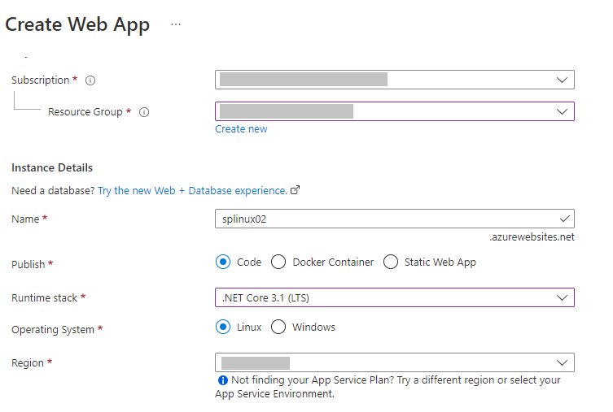
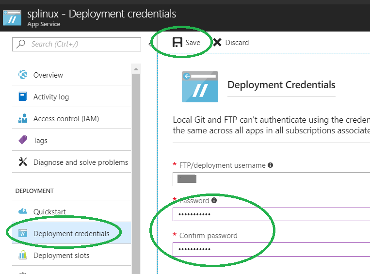
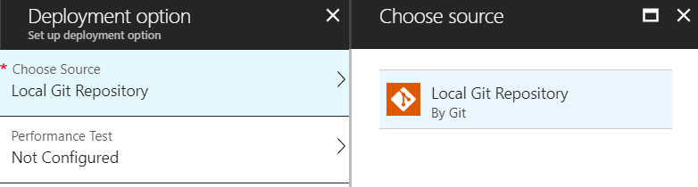

# Profile ASP.NET Core Azure Linux web apps with Application Insights Profiler

This feature is currently in preview.

Find out how much time is spent in each method of your live web application when using [Application Insights](../../azure-monitor/app/app-insights-overview.md). Application Insights Profiler is now available for ASP.NET Core web apps that are hosted in Linux on Azure App Service. This guide provides step-by-step instructions on how the Profiler traces can be collected for ASP.NET Core Linux web apps.

After you complete this walkthrough, your app can collect Profiler traces like the traces that are shown in the image. In this example, the Profiler trace indicates that a particular web request is slow because of time spent waiting. The *hot path* in the code that's slowing the app is marked by a flame icon. The **About** method in the **HomeController** section is slowing the web app because the method is calling the **Thread.Sleep** function.


## Prerequisites
The following instructions apply to all Windows, Linux, and Mac development environments:

* Install the [.NET Core SDK 2.1.2 or later](https://dotnet.microsoft.com/download/archives).
* Install Git by following the instructions at [Getting Started - Installing Git](https://git-scm.com/book/en/v2/Getting-Started-Installing-Git).

## Set up the project locally

1. Open a Command Prompt window on your machine. The following instructions work for all Windows, Linux, and Mac development environments.

1. Create an ASP.NET Core MVC web application:

    ```
    dotnet new mvc -n LinuxProfilerTest
    ```

1. Change the working directory to the root folder for the project.

1. Add the NuGet package to collect the Profiler traces:

    ```shell
    dotnet add package Microsoft.ApplicationInsights.Profiler.AspNetCore
    ```

1. Enable Application Insights in Program.cs:

    ```csharp
    public static IWebHostBuilder CreateWebHostBuilder(string[] args) =>
        WebHost.CreateDefaultBuilder(args)
            .UseApplicationInsights() // Add this line of code to Enable Application Insights
            .UseStartup<Startup>();
    ```
    
1. Enable Profiler in Startup.cs:

    ```csharp
    public void ConfigureServices(IServiceCollection services)
    {
        services.AddServiceProfiler(); // Add this line of code to Enable Profiler
        services.AddMvc().SetCompatibilityVersion(CompatibilityVersion.Version_2_1);
    }
    ```

1. Add a line of code in the **HomeController.cs** section to randomly delay a few seconds:

    ```csharp
        using System.Threading;
        ...

        public IActionResult About()
            {
                Random r = new Random();
                int delay = r.Next(5000, 10000);
                Thread.Sleep(delay);
                return View();
            }
    ```

1. Save and commit your changes to the local repository:

    ```
        git init
        git add .
        git commit -m "first commit"
    ```

## Create the Linux web app to host your project

1. Create the web app environment by using App Service on Linux:

    

2. Create the deployment credentials:

    > [!NOTE]
    > Record your password to use later when deploying your web app.

    

3. Choose the deployment options. Set up a local Git repository in the web app by following the instructions on the Azure portal. A Git repository is automatically created.

    

For more deployment options, see [this article](https://docs.microsoft.com/azure/app-service/containers/choose-deployment-type).

## Deploy your project

1. In your Command Prompt window, browse to the root folder for your project. Add a Git remote repository to point to the repository on App Service:

    ```
    git remote add azure https://<username>@<app_name>.scm.azurewebsites.net:443/<app_name>.git
    ```

    * Use the **username** that you used to create the deployment credentials.
    * Use the **app name** that you used to create the web app by using App Service on Linux.

2. Deploy the project by pushing the changes to Azure:

    ```
    git push azure master
    ```

You should see output similar to the following example:

    ```
    Counting objects: 9, done.
    Delta compression using up to 8 threads.
    Compressing objects: 100% (8/8), done.
    Writing objects: 100% (9/9), 1.78 KiB | 911.00 KiB/s, done.
    Total 9 (delta 3), reused 0 (delta 0)
    remote: Updating branch 'master'.
    remote: Updating submodules.
    remote: Preparing deployment for commit id 'd7369a99d7'.
    remote: Generating deployment script.
    remote: Running deployment command...
    remote: Handling ASP.NET Core Web Application deployment.
    remote: ......
    remote:   Restoring packages for /home/site/repository/EventPipeExampleLinux.csproj...
    remote: .
    remote:   Installing Newtonsoft.Json 10.0.3.
    remote:   Installing Microsoft.ApplicationInsights.Profiler.Core 1.1.0-LKG
    …

    ```

## Add Application Insights to monitor your web apps

1. [Create an Application Insights resource](./../../azure-monitor/app/create-new-resource.md ).

2. Copy the **iKey** value of the Application Insights resource and set the following settings in your web apps:

    ```
    APPINSIGHTS_INSTRUMENTATIONKEY: [YOUR_APPINSIGHTS_KEY]
    ```

    When the app settings are changed, the site automatically restarts. After the new settings are applied, the Profiler immediately runs for two minutes. The Profiler then runs for two minutes every hour.

3. Generate some traffic to your website. You can generate traffic by refreshing the site **About** page a few times.

4. Wait two to five minutes for the events to aggregate to Application Insights.

5. Browse to the Application Insights **Performance** pane in the Azure portal. You can view the Profiler traces at the bottom right of the pane.

    

## Known issues

### Profile Now button doesn't work for Linux Profiler
The Linux version of the App Insights profiler does not yet support on demand profiling using the profile now button.


## Next steps
If you use custom containers that are hosted by Azure App Service, follow the instructions in [
Enable Service Profiler for a containerized ASP.NET Core application](https://github.com/Microsoft/ApplicationInsights-Profiler-AspNetCore/tree/master/examples/EnableServiceProfilerForContainerApp) to enable Application Insights Profiler.

Report any issues or suggestions to the Application Insights GitHub repository:
[ApplicationInsights-Profiler-AspNetCore: Issues](https://github.com/Microsoft/ApplicationInsights-Profiler-AspNetCore/issues).
