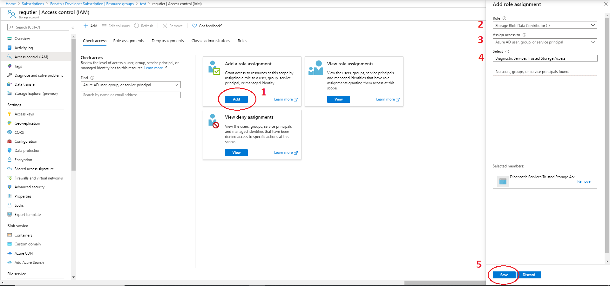
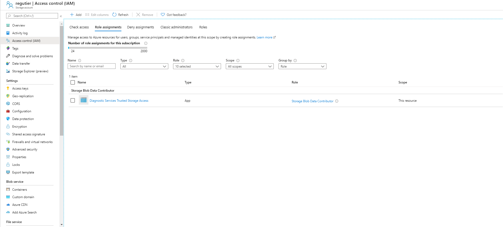
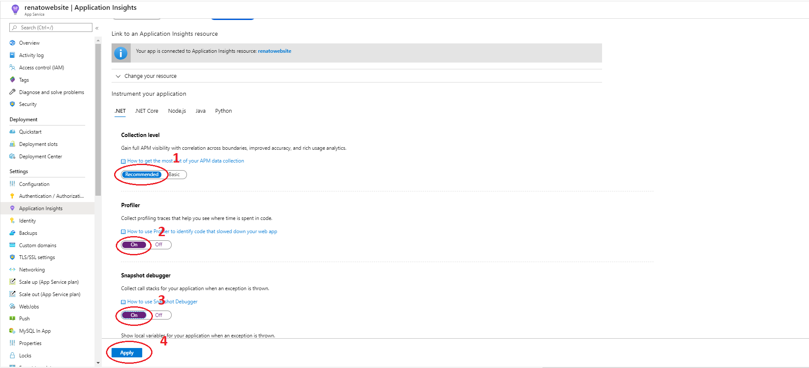

# Configure BYOS (Bring Your Own Storage) for Profiler & Snapshot Debugger

## What is Bring Your Own Storage (BYOS) and why I need it? 
In normal process when a customer’s application doesn’t have configured the capability of Bring Your Own Storage (BYOS), the data its written into the regional storage accounts of Diagnostic Services that compliant with multiple laws according to the location, one of them is General Data Protection Regulation (GDPR).

With Bring Your Own Storage, the data collected, by agents running in the customer’s VMs or App Service, its written into their own storage accounts, giving them the capability to control the data collected at their own peace. One thing to have in mind, is that the customer will take over of all the related costs of the storage account. 

## How does it will be accessed my Storage Account? 
The data its written into the customer’s storage account by agents running in the customer’s VMs (virtual machines) or App Service. The customer’s application contacts our service (Profiler/Debugger) when they want to upload data and we hand back a SAS (Shared Access Signature) token to a blob in their storage account. Later, when they want to analyze the data, the profiler/debugger service will reach back into that storage account to read the blob and write back the results of analysis. 
## What do I need to do to enable BYOS? 
Since our services need to securely connect to your storage account, the profiler/debugger service has a 1st party (multi-tenant) AAD (Azure Active Directory) application called “Diagnostic Services Trusted Storage Access” that its used to access customer storage accounts. The customer needs to grant the “Storage Blob Data Contributor” role to that AAD application in their storage account via the IAM UI, as show in the Figure 1.0. 

Steps: 
1. Click on the “Add” button in the “Add a role assignment” section 
2. Select “Storage Blob Data Contributor” role 
3. Select “Azure AD user, group, or service principal” in the “Assign access to” section 
4. Search & select “Diagnostic Services Trusted Storage Access” app 
5. Save changes

__
_Figure 1.0_ 

After you added the role, it will appear under the “Role assignments” section, like the below Figure 1.1. 
__
_Figure 1.1_ 

If you are also using Private Link, it is required one additional configuration to allow connection to our Trusted Microsoft Service from your Virtual Network. Please reference to the [Storage Network Security documentation](https://docs.microsoft.com/en-us/azure/storage/common/storage-network-security#trusted-microsoft-services).

## Prerequisites
* Make sure to create your Storage Account in the same location as your Application Insights Resource. Ex. If your Application Insights resource is in West US 2, your Storage Account must be also in West US 2. 
* Grant the “Storage Blob Contributor” role to the AAD (Azure Active Directory) application “Diagnostic Services Trusted Storage Access” in your storage account via the IAM UI.
* If Private Link enabled, configure additional setting to allow connection to our Trusted Microsoft Service from your Virtual Network. 

## Enablement process 
1. You have two options to configure BYOS for code level diagnostics (Profiler/Debugger): 
    a. Using the following CLI 
    ```powershell
    az monitor log-analytics {workspace} serviceprofiler {storage-account-id} create | update
    ```
    b. Using ARM (Azure Resource Manager) template 
    ```json
    { 
      "$schema": "https://schema.management.azure.com/schemas/deploymentTemplate.json#", 
      "contentVersion": "1.0.0.0", 
      "parameters": { 
        "applicationinsights_name": { 
          "type": "String" 
        }, 
        "storageaccount_name": { 
          "type": "String" 
        } 
      }, 
      "variables": {}, 
      "resources": [ 
        { 
          "type": "microsoft.insights/components", 
          "apiVersion": "2020-03-01-preview", 
          "location": "[resourcegroup().location]", 
          "name": "[parameters('applicationinsights_name')]", 
          "properties": {}, 
          "resources": [ 
            {
              "type": "linkedStorageAccounts", 
              "name": "serviceprofiler", 
              "apiVersion": "preview", 
              "properties": { 
                "linkedStorageAccount": "[resourceId('Microsoft.Storage/storageAccounts', parameters('storageaccount_name'))]" 
              }, 
              "dependsOn": [ 
                "[concat('Microsoft.Insights/components/', parameters('applicationinsights_name'))]" 
              ] 
            } 
          ] 
        } 
      ], 
      "outputs": {} 
    } 
    ```
2. Enable code level diagnostics (Profiler/Debugger) on the workload of interest through the Azure Portal. (App Service > Application Insights) 
__
_Figure 2.0_

## Troubleshooting 
*TODO* _List potential issues that a customer may face while creating their own BYOS_
* Try to create a storage account in a different location that the Application Insight resource to use; does the UI will let me create it? What error will I encounter

## FAQs
* If I have currently working Profiler and/or Snapshot and then I enabled BYOS, will my data be migrated into my Storage Account?
_No, it will not, as of now, we do not support migration data._

* Will BYOS work when Customer Managed Key was enabled? 
_Yes, to be precise, BYOS is a requisite to have profiler/debugger enabled with CMK (Customer Manager Keys)._

* Will BYOS work when Private Link was enabled? 
_Yes, to be precise, BYOS is a requisite to have profiler/debugger enabled with PL (Private Link)._

* Will BYOS work when, both, CMK and PL were enabled? 
_Yes, it can be possible._

* If I have enabled BYOS, can I go back using Diagnostic Services storage accounts to store my data collected? 
_Yes, you can, but keep in mind that, as of now, we do not support data migration from your BYOS._

* After enabling BYOS, will I take over of all the related costs of it? 
_Yes_