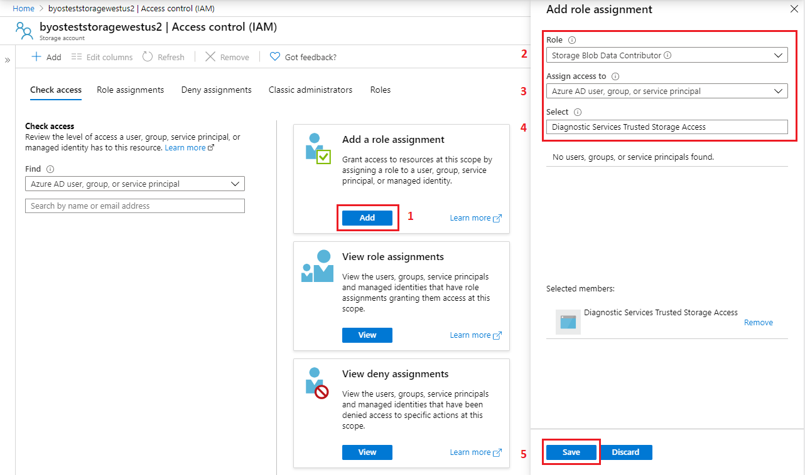
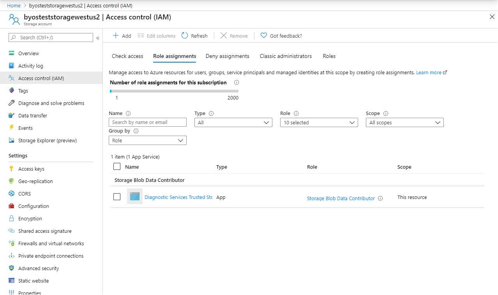

# Configure Bring Your Own Storage (BYOS) for Application Insights Profiler and Snapshot Debugger

## What is Bring Your Own Storage (BYOS) and why might I need it? 
When you use Application Insights Profiler or Snapshot Debugger, artifacts generated by your application are uploaded into Azure storage accounts over the public Internet. Those accounts are paid and controlled by Microsoft for processing and analysis. Microsoft controls the encryption-at-rest and lifetime management policies for those artifacts.

With Bring Your Own Storage, these artifacts are uploaded into a storage account that you control. That means you control the encryption-at-rest policy, the lifetime management policy and network access. You will, however, be responsible for the costs associated with that storage account.

> [!NOTE]
> If you are enabling Private Link, Bring Your Own Storage is a requirement. For more information about Private Link for Application Insights, [see the documentation.](https://docs.microsoft.com/azure/azure-monitor/platform/private-link-security)
>
> If you are enabling Customer-Managed Keys, Bring Your Own Storage is a requirement. For more information about Customer-Managed Keys for Application Insights, [see the documentation.](https://docs.microsoft.com/azure/azure-monitor/platform/customer-managed-keys).

## How will my storage account be accessed?
1. Agents running in your Virtual Machines or App Service will upload artifacts (profiles, snapshots, and symbols) to blob containers in your account. This process involves contacting the Application Insights Profiler or Snapshot Debugger service to obtain a SAS (Shared Access Signature) token to a new blob in your storage account.
1. The Application Insights Profiler or Snapshot Debugger service will analyze the incoming blob and write back the analysis results and log files into blob storage. Depending on available compute capacity, this process may occur anytime after upload.
1. When you view the profiler traces, or snapshot debugger analysis, the service will fetch the analysis results from blob storage.

## Prerequisites
* Make sure to create your Storage Account in the same location as your Application Insights Resource. Ex. If your Application Insights resource is in West US 2, your Storage Account must be also in West US 2. 
* Grant the "Storage Blob Data Contributor" role to the AAD application "Diagnostic Services Trusted Storage Access" in your storage account via the Access Control (IAM) UI.
* If Private Link enabled, configure the additional setting to allow connection to our Trusted Microsoft Service from your Virtual Network. 

## How to enable BYOS

### Create Storage Account
Create a brand-new Storage Account (if you don't have it) on the same location as your Application Insights resource.
If your Application Insights resource it's on `West US 2`, then, your Storage Account must be in `West US 2`.

### Grant Access to Diagnostic Services to your Storage Account
A BYOS storage account will be linked to an Application Insights resource. There may be only one storage account per Application Insights resource and both must be in the same location. You may use the same storage account with more than one Application Insights resource.

First, the Application Insights Profiler, and Snapshot Debugger service needs to be granted access to the storage account. To grant access, add the role `Storage Blob Data Contributor` to the AAD application named `Diagnostic Services Trusted Storage Access` via the Access Control (IAM) page in your storage account as shown in Figure 1.0. 

Steps: 
1. Click on the "Add" button in the "Add a role assignment" section 
1. Select "Storage Blob Data Contributor" role 
1. Select "Azure AD user, group, or service principal" in the "Assign access to" section 
1. Search & select "Diagnostic Services Trusted Storage Access" app 
1. Save changes

__
_Figure 1.0_ 

After you added the role, it will appear under the "Role assignments" section, like the below Figure 1.1. 
__
_Figure 1.1_ 

If you're also using Private Link, it's required one additional configuration to allow connection to our Trusted Microsoft Service from your Virtual Network. Refer to the [Storage Network Security documentation](https://docs.microsoft.com/azure/storage/common/storage-network-security#trusted-microsoft-services).

### Link your Storage Account with your Application Insights resource
To configure BYOS for code-level diagnostics (Profiler/Debugger), there are two options:

* Using Azure PowerShell Cmdlets
* Using Azure Command Line Interface (CLI)
* Using Azure Resource Manager template

#### Configure using Azure PowerShell Cmdlets

1. Make sure you have installed Az PowerShell 4.2.0 or greater.

    To install Azure PowerShell, refer to the [Official Azure PowerShell documentation](https://docs.microsoft.com/powershell/azure/install-az-ps).

1. Install the Application Insights PowerShell extension.
    ```powershell
    Install-Module -Name Az.ApplicationInsights -Force
    ```

1. Sign in with your Azure Account
    ```powershell
    Connect-AzAccount -Subscription "{subscription_id}"
    ```

    For more info of how to sign in, refer to the [Connect-AzAccount documentation](https://docs.microsoft.com/powershell/module/az.accounts/connect-azaccount).

1. Remove previous Storage Account linked to your Application Insights resource.

    Pattern:
    ```powershell
    $appInsights = Get-AzApplicationInsights -ResourceGroupName "{resource_group_name}" -Name "{storage_account_name}"
    Remove-AzApplicationInsightsLinkedStorageAccount -ResourceId $appInsights.Id
    ```

    Example:
    ```powershell
    $appInsights = Get-AzApplicationInsights -ResourceGroupName "byos-test" -Name "byos-test-westus2-ai"
    Remove-AzApplicationInsightsLinkedStorageAccount -ResourceId $appInsights.Id
    ```

1. Connect your Storage Account with your Application Insights resource.
    
    Pattern:
    ```powershell
    $storageAccount = Get-AzStorageAccount -ResourceGroupName "{resource_group_name}" -Name "{storage_account_name}"
    $appInsights = Get-AzApplicationInsights -ResourceGroupName "{resource_group_name}" -Name "{application_insights_name}"
    New-AzApplicationInsightsLinkedStorageAccount -ResourceId $appInsights.Id -LinkedStorageAccountResourceId $storageAccount.Id
    ```

    Example:
    ```powershell
    $storageAccount = Get-AzStorageAccount -ResourceGroupName "byos-test" -Name "byosteststoragewestus2"
    $appInsights = Get-AzApplicationInsights -ResourceGroupName "byos-test" -Name "byos-test-westus2-ai"
    New-AzApplicationInsightsLinkedStorageAccount -ResourceId $appInsights.Id -LinkedStorageAccountResourceId $storageAccount.Id
    ```

#### Configure using Azure CLI

1. Make sure you have installed Azure CLI.

    To install Azure CLI, refer to the [Official Azure CLI documentation](https://docs.microsoft.com/cli/azure/install-azure-cli).

1. Install the Application Insights CLI extension.
    ```powershell
    az extension add -n application-insights
    ```

1. Connect your Storage Account with your Application Insights resource.

    Pattern:
    ```powershell
    az monitor app-insights component linked-storage link --resource-group "{resource_group_name}" --app "{application_insights_name}" --storage-account "{storage_account_name}"
    ```
    
    Example:
    ```powershell
    az monitor app-insights component linked-storage link --resource-group "byos-test" --app "byos-test-westus2-ai" --storage-account "byosteststoragewestus2"
    ```
    
    Expected output:
    ```powershell
    {
      "id": "/subscriptions/{subscription}/resourcegroups/byos-test/providers/microsoft.insights/components/byos-test-westus2-ai/linkedstorageaccounts/serviceprofiler",
      "linkedStorageAccount": "/subscriptions/{subscription}/resourceGroups/byos-test/providers/Microsoft.Storage/storageAccounts/byosteststoragewestus2",
      "name": "serviceprofiler",
      "resourceGroup": "byos-test",
      "type": "microsoft.insights/components/linkedstorageaccounts"
    }
    ```

    > [!NOTE]
    > For performing updates on the linked Storage Accounts to your Application Insights resource, refer to the [Application Insights CLI documentation](https://docs.microsoft.com/cli/azure/ext/application-insights/monitor/app-insights/component/linked-storage).

#### Configure using Azure Resource Manager template

1. Create an Azure Resource Manager template file with the following content (byos.template.json).
    ```json
    {
      "$schema": "https://schema.management.azure.com/schemas/2019-04-01/deploymentTemplate.json#",
      "contentVersion": "1.0.0.0",
      "parameters": {
        "applicationinsights_name": {
          "type": "String"
        },
        "storageaccount_name": {
          "type": "String"
        }
      },
      "variables": {},
      "resources": [
        {
          "name": "[concat(parameters('applicationinsights_name'), '/serviceprofiler')]",
          "type": "Microsoft.Insights/components/linkedStorageAccounts",
          "apiVersion": "2020-03-01-preview",
          "properties": {
            "linkedStorageAccount": "[resourceId('Microsoft.Storage/storageAccounts', parameters('storageaccount_name'))]"
          }
        }
      ],
      "outputs": {}
    }
    ```

1. Run the following PowerShell command to deploy previous template (create Linked Storage Account).

    Pattern:
    ```powershell
    New-AzResourceGroupDeployment -ResourceGroupName "{your_resource_name}" -TemplateFile "{local_path_to_arm_template}"
    ```

    Example:
    ```powershell
    New-AzResourceGroupDeployment -ResourceGroupName "byos-test" -TemplateFile "D:\Docs\byos.template.json"
    ```

1. Provide the following parameters when prompted in the PowerShell console:
    
    |           Parameter           |                                Description                               |
    |-------------------------------|--------------------------------------------------------------------------|
    | application_insights_name     | The name of the Application Insights resource to enable BYOS.            |
    | storage_account_name          | The name of the Storage Account resource that you'll use as your BYOS. |
    
    Expected output:
    ```powershell
    Supply values for the following parameters:
    (Type !? for Help.)
    application_insights_name: byos-test-westus2-ai
    storage_account_name: byosteststoragewestus2
    
    DeploymentName          : byos.template
    ResourceGroupName       : byos-test
    ProvisioningState       : Succeeded
    Timestamp               : 4/16/2020 1:24:57 AM
    Mode                    : Incremental
    TemplateLink            :
    Parameters              :
                              Name                            Type                       Value
                              ==============================  =========================  ==========
                              application_insights_name        String                     byos-test-westus2-ai
                              storage_account_name             String                     byosteststoragewestus2
                              
    Outputs                 :
    DeploymentDebugLogLevel :
    ```

1. Enable code-level diagnostics (Profiler/Debugger) on the workload of interest through the Azure portal. (App Service > Application Insights) 
__
_Figure 2.0_

## Troubleshooting
### Template schema '{schema_uri}' isn't supported.
* Make sure that the `$schema` property of the template is valid. It must follow the following pattern:
`https://schema.management.azure.com/schemas/{schema_version}/deploymentTemplate.json#`
* Make sure that the `schema_version` of the template is within valid values: `2014-04-01-preview, 2015-01-01, 2018-05-01, 2019-04-01, 2019-08-01`.
    Error message:
    ```powershell
    New-AzResourceGroupDeployment : 11:53:49 AM - Error: Code=InvalidTemplate; Message=Deployment template validation failed: 'Template schema
    'https://schema.management.azure.com/schemas/2020-01-01/deploymentTemplate.json#' is not supported. Supported versions are
    '2014-04-01-preview,2015-01-01,2018-05-01,2019-04-01,2019-08-01'. Please see https://aka.ms/arm-template for usage details.'.
    ```

### No registered resource provider found for location '{location}'.
* Make sure that the `apiVersion` of the resource `microsoft.insights/components` is `2015-05-01`.
* Make sure that the `apiVersion` of the resource `linkedStorageAccount` is `2020-03-01-preview`.
    Error message:
    ```powershell
    New-AzResourceGroupDeployment : 6:18:03 PM - Resource microsoft.insights/components 'byos-test-westus2-ai' failed with message '{
      "error": {
        "code": "NoRegisteredProviderFound",
        "message": "No registered resource provider found for location 'westus2' and API version '2020-03-01-preview' for type 'components'. The supported api-versions are '2014-04-01,
    2014-08-01, 2014-12-01-preview, 2015-05-01, 2018-05-01-preview'. The supported locations are ', eastus, southcentralus, northeurope, westeurope, southeastasia, westus2, uksouth,
    canadacentral, centralindia, japaneast, australiaeast, koreacentral, francecentral, centralus, eastus2, eastasia, westus, southafricanorth, northcentralus, brazilsouth, switzerlandnorth,
    australiasoutheast'."
      }
    }'
    ```
### Storage account location should match AI component location.
* Make sure that the location of the Application Insights resource is the same as the Storage Account.
    Error message:
    ```powershell
    New-AzResourceGroupDeployment : 1:01:12 PM - Resource microsoft.insights/components/linkedStorageAccounts 'byos-test-centralus-ai/serviceprofiler' failed with message '{
      "error": {
        "code": "BadRequest",
        "message": "Storage account location should match AI component location",
        "innererror": {
          "trace": [
            "System.ArgumentException"
          ]
        }
      }
    }'
    ```

For general Profiler troubleshooting, refer to the [Profiler Troubleshoot documentation](profiler-troubleshooting.md).

For general Snapshot Debugger troubleshooting, refer to the [Snapshot Debugger Troubleshoot documentation](snapshot-debugger-troubleshoot.md). 

## FAQs
* If I have Profiler or Snapshot enabled, and then I enabled BYOS, will my data be migrated into my Storage Account?
    _No, it won't._

* Will BYOS work with Encryption at Rest and Customer-Managed Key?
    _Yes, to be precise, BYOS is a requisite to have profiler/debugger enabled with Customer-Manager Keys._

* Will BYOS work in an environment isolated from the Internet?
    _Yes. In fact, BYOS is a requirement for isolated network scenarios._

* Will BYOS work when, both, Customer-Managed Keys and Private Link were enabled? 
    _Yes, it can be possible._

* If I have enabled BYOS, can I go back using Diagnostic Services storage accounts to store my data collected? 
    _Yes, you can, but, right now we don't support data migration from your BYOS._

* After enabling BYOS, will I take over of all the related costs of it, which are Storage and Networking? 
    _Yes_