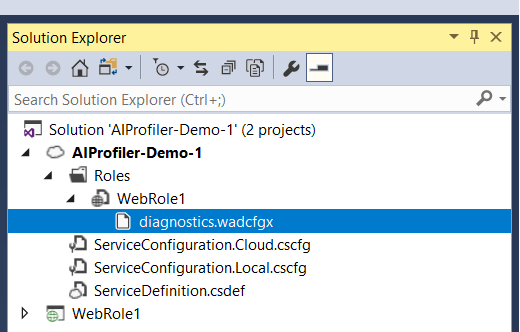

# Profile live Azure Cloud Services with Application Insights

You can also deploy Application Insights Profiler on these services:
* [Azure App Service](profiler.md?toc=/azure/azure-monitor/toc.json)
* [Azure Service Fabric applications](profiler-servicefabric.md?toc=/azure/azure-monitor/toc.json)
* [Azure Virtual Machines](profiler-vm.md?toc=/azure/azure-monitor/toc.json)

Application Insights Profiler is installed with the Azure Diagnostics extension. You just need to configure Azure Diagnostics to install Profiler and send profiles to your Application Insights resource.

## Enable Profiler for Azure Cloud Services
1. Check to make sure that you're using [.NET Framework 4.6.1](https://docs.microsoft.com/dotnet/framework/migration-guide/how-to-determine-which-versions-are-installed) or later. It's sufficient to confirm that the *ServiceConfiguration.\*.cscfg* files have an `osFamily` value of "5" or later.

1. Add [Application Insights SDK to Azure Cloud Services](../../azure-monitor/app/cloudservices.md?toc=/azure/azure-monitor/toc.json).

    **The bug in the profiler that ships in the WAD for Cloud Services has been fixed.** The latest version of WAD (1.12.2.0) for Cloud Services works with all recent versions of the App Insights SDK. Cloud Service hosts will upgrade WAD automatically, but it isn't immediate. To force an upgrade, you can redeploy your service or reboot the node.

1. Track requests with Application Insights:

    * For ASP.NET web roles, Application Insights can track the requests automatically.

    * For worker roles, [add code to track requests](profiler-trackrequests.md?toc=/azure/azure-monitor/toc.json).

1. Configure the Azure Diagnostics extension to enable Profiler:

    a. Locate the [Azure Diagnostics](https://docs.microsoft.com/azure/monitoring-and-diagnostics/azure-diagnostics) *diagnostics.wadcfgx* file for your application role, as shown here:  

        

      If you can't find the file, see [Set up diagnostics for Azure Cloud Services and Virtual Machines](https://docs.microsoft.com/azure/vs-azure-tools-diagnostics-for-cloud-services-and-virtual-machines).

    b. Add the following `SinksConfig` section as a child element of `WadCfg`:  

      ```xml
      <WadCfg>
        <DiagnosticMonitorConfiguration>...</DiagnosticMonitorConfiguration>
        <SinksConfig>
          <Sink name="MyApplicationInsightsProfiler">
            <!-- Replace with your own Application Insights instrumentation key. -->
            <ApplicationInsightsProfiler>00000000-0000-0000-0000-000000000000</ApplicationInsightsProfiler>
          </Sink>
        </SinksConfig>
      </WadCfg>
      ```

    > [!NOTE]
    > If the *diagnostics.wadcfgx* file also contains another sink of type ApplicationInsights, all three of the following instrumentation keys must match:  
    > * The key that's used by your application. 
    > * The key that's used by the ApplicationInsights sink. 
    > * The key that's used by the ApplicationInsightsProfiler sink. 
    >
    > You can find the actual instrumentation key value that's used by the `ApplicationInsights` sink in the     *ServiceConfiguration.\*.cscfg* files. 
    > After the Visual Studio 15.5 Azure SDK release, only the instrumentation keys that are used by the application and the ApplicationInsightsProfiler sink need to match each other.

1. Deploy your service with the new Diagnostics configuration, and Application Insights Profiler is configured to run on your service.
 
## Next steps

* Generate traffic to your application (for example, launch an [availability test](monitor-web-app-availability.md)). Then, wait 10 to 15 minutes for traces to start to be sent to the Application Insights instance.
* See [Profiler traces](profiler-overview.md?toc=/azure/azure-monitor/toc.json) in the Azure portal.
* To troubleshoot Profiler issues, see [Profiler troubleshooting](profiler-troubleshooting.md?toc=/azure/azure-monitor/toc.json).
