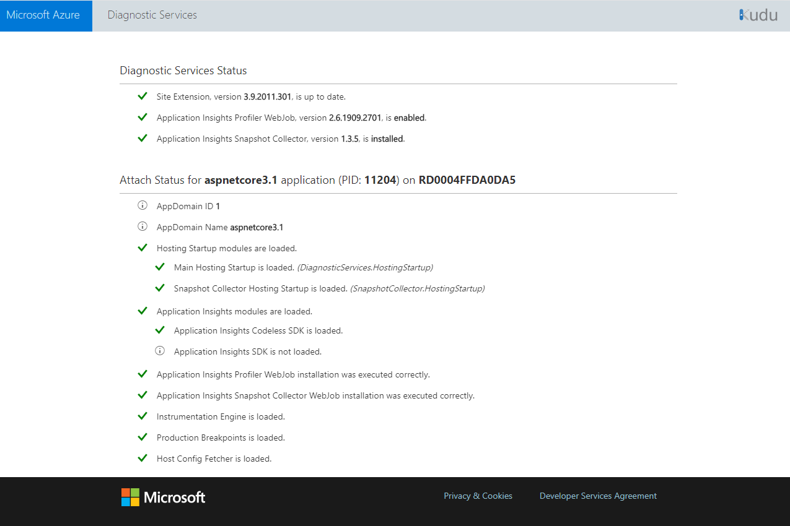

# Troubleshoot problems enabling or viewing Application Insights Profiler

## <a id="troubleshooting"></a>General troubleshooting

### Make sure you're using the appropriate Profiler Endpoint

Currently the only regions that require endpoint modifications are [Azure Government](../../azure-government/compare-azure-government-global-azure.md#application-insights) and [Azure China](/azure/china/resources-developer-guide).

|App Setting    | US Government Cloud | China Cloud |   
|---------------|---------------------|-------------|
|ApplicationInsightsProfilerEndpoint         | `https://profiler.monitor.azure.us`    | `https://profiler.monitor.azure.cn` |
|ApplicationInsightsEndpoint | `https://dc.applicationinsights.us` | `https://dc.applicationinsights.azure.cn` |

### Profiles are uploaded only if there are requests to your application while Profiler is running

Azure Application Insights Profiler collects data for two minutes each hour. It can also collect data when you select the **Profile Now** button in the **Configure Application Insights Profiler** pane.

> [!NOTE]
> The profiling data is uploaded only when it can be attached to a request that happened while Profiler was running. 

Profiler writes trace messages and custom events to your Application Insights resource. You can use these events to see how Profiler is running:

1. Search for trace messages and custom events sent by Profiler to your Application Insights resource. You can use this search string to find the relevant data:

    ```
    stopprofiler OR startprofiler OR upload OR ServiceProfilerSample
    ```
    The following image displays two examples of searches from two AI resources: 
    
   * At the left, the application isn't receiving requests while Profiler is running. The message explains that the upload was canceled because of no activity. 

   * At the right, Profiler started and sent custom events when it detected requests that happened while Profiler was running. If the `ServiceProfilerSample` custom event is displayed, it means that a profile was captured and its available in the **Application Insights Performance** pane.

     If no records are displayed, Profiler isn't running. To troubleshoot, see the troubleshooting sections for your specific app type later in this article.  

     ![Search Profiler telemetry][profiler-search-telemetry]

### Other things to check
* Make sure that your app is running on .NET Framework 4.6.
* If your web app is an ASP.NET Core application, it must be running at least ASP.NET Core 2.0.
* If the data you're trying to view is older than a couple of weeks, try limiting your time filter and try again. Traces are deleted after seven days.
* Make sure that proxies or a firewall haven't blocked access to https://gateway.azureserviceprofiler.net.
* Profiler isn't supported on free or shared app service plans. If you're using one of those plans, try scaling up to one of the basic plans and Profiler should start working.

### <a id="double-counting"></a>Double counting in parallel threads

In some cases, the total time metric in the stack viewer is more than the duration of the request.

This situation might occur when two or more parallel threads are associated with a request. In that case, the total thread time is more than the elapsed time.

One thread might be waiting on the other to be completed. The viewer tries to detect this situation and omits the uninteresting wait. In doing so, it errs on the side of displaying too much information rather than omit what might be critical information.

When you see parallel threads in your traces, determine which threads are waiting so that you can identify the hot path for the request.

Usually, the thread that quickly goes into a wait state is simply waiting on the other threads. Concentrate on the other threads, and ignore the time in the waiting threads.

### Error report in the profile viewer
Submit a support ticket in the portal. Be sure to include the correlation ID from the error message.

## Troubleshoot Profiler on Azure App Service

For Profiler to work properly:
* Your web app service plan must be Basic tier or higher.
* Your web app must have Application Insights enabled.
* Your web app must have the following app settings:

    |App Setting    | Value    |
    |---------------|----------|
    |APPINSIGHTS_INSTRUMENTATIONKEY         | iKey for your Application Insights resource    |
    |APPINSIGHTS_PROFILERFEATURE_VERSION | 1.0.0 |
    |DiagnosticServices_EXTENSION_VERSION | ~3 |


* The **ApplicationInsightsProfiler3** webjob must be running. To check the webjob:
   1. Go to [Kudu](/archive/blogs/cdndevs/the-kudu-debug-console-azure-websites-best-kept-secret).
   1. In the **Tools** menu, select **WebJobs Dashboard**.  
      The **WebJobs** pane opens. 
   
      ![Screenshot shows the WebJobs pane, which displays the name, status, and last run time of jobs.][profiler-webjob]   
   
   1. To view the details of the webjob, including the log, select the **ApplicationInsightsProfiler3** link.  
     The **Continuous WebJob Details** pane opens.

      ![Screenshot shows the Continuous WebJob Details pane.][profiler-webjob-log]

If Profiler isn't working for you, you can download the log and send it to our team for assistance, serviceprofilerhelp@microsoft.com.

### Check the Diagnostic Services site extension' Status Page
If Profiler was enabled through the [Application Insights pane](profiler.md) in the portal, it was enabled by the Diagnostic Services site extension.

> [!NOTE]
> Codeless installation of Application Insights Profiler follows the .NET Core support policy.
> For more information about supported runtimes, see [.NET Core Support Policy](https://dotnet.microsoft.com/platform/support/policy/dotnet-core).

You can check the Status Page of this extension by going to the following url:
`https://{site-name}.scm.azurewebsites.net/DiagnosticServices`

> [!NOTE]
> The domain of the Status Page link will vary depending on the cloud.
This domain will be the same as the Kudu management site for App Service.

This Status Page shows the installation state of the Profiler and Snapshot Collector agents. If there was an unexpected error, it will be displayed and show how to fix it.

You can use the Kudu management site for App Service to get the base url of this Status Page:
1. Open your App Service application in the Azure portal.
2. Select **Advanced Tools**, or search for **Kudu**.
3. Select **Go**.
4. Once you are on the Kudu management site, in the URL, **append the following `/DiagnosticServices` and press enter**.
 It will end like this: `https://<kudu-url>/DiagnosticServices`

It will display a Status Page similar like the below:

    
### Manual installation

When you configure Profiler, updates are made to the web app's settings. If your environment requires it, you can apply the updates manually. An example might be that your application is running in a Web Apps environment for PowerApps. To apply updates manually:

1. In the **Web App Control** pane, open **Settings**.

1. Set **.NET Framework version** to **v4.6**.

1. Set **Always On** to **On**.
1. Create these app settings:

    |App Setting    | Value    |
    |---------------|----------|
    |APPINSIGHTS_INSTRUMENTATIONKEY         | iKey for your Application Insights resource    |
    |APPINSIGHTS_PROFILERFEATURE_VERSION | 1.0.0 |
    |DiagnosticServices_EXTENSION_VERSION | ~3 |

### Too many active profiling sessions

You can enable Profiler on a maximum of four Web Apps that are running in the same service plan. If you've more than four, Profiler might throw a *Microsoft.ServiceProfiler.Exceptions.TooManyETWSessionException*. To solve it, move some web apps to a different service plan.

### Deployment error: Directory Not Empty 'D:\\home\\site\\wwwroot\\App_Data\\jobs'

If you're redeploying your web app to a Web Apps resource with Profiler enabled, you might see the following message:

*Directory Not Empty 'D:\\home\\site\\wwwroot\\App_Data\\jobs'*

This error occurs if you run Web Deploy from scripts or from the Azure Pipelines. The solution is to add the following deployment parameters to the Web Deploy task:

```
-skip:Directory='.*\\App_Data\\jobs\\continuous\\ApplicationInsightsProfiler.*' -skip:skipAction=Delete,objectname='dirPath',absolutepath='.*\\App_Data\\jobs\\continuous$' -skip:skipAction=Delete,objectname='dirPath',absolutepath='.*\\App_Data\\jobs$'  -skip:skipAction=Delete,objectname='dirPath',absolutepath='.*\\App_Data$'
```

These parameters delete the folder that's used by Application Insights Profiler and unblock the redeploy process. They don't affect the Profiler instance that's currently running.

### How do I determine whether Application Insights Profiler is running?

Profiler runs as a continuous webjob in the web app. You can open the web app resource in the [Azure portal](https://portal.azure.com). In the **WebJobs** pane, check the status of **ApplicationInsightsProfiler**. If it isn't running, open **Logs** to get more information.

## Troubleshoot VMs and Cloud Services

>**The bug in the profiler that ships in the WAD for Cloud Services has been fixed.** The latest version of WAD (1.12.2.0) for Cloud Services works with all recent versions of the App Insights SDK. Cloud Service hosts will upgrade WAD automatically, but it isn't immediate. To force an upgrade, you can redeploy your service or reboot the node.

To see whether Profiler is configured correctly by Azure Diagnostics, follow the below steps: 
1. Verify that the content of the Azure Diagnostics configuration deployed is what you expect. 

1. Second, make sure that Azure Diagnostics passes the proper iKey on the Profiler command line. 

1. Third, check the Profiler log file to see whether Profiler ran but returned an error. 

To check the settings that were used to configure Azure Diagnostics:

1. Sign in to the virtual machine (VM), and then open the log file at this location. The plugin version may be newer on your machine.
    
    For VMs:
    ```
    c:\WindowsAzure\logs\Plugins\Microsoft.Azure.Diagnostics.PaaSDiagnostics\1.11.3.12\DiagnosticsPlugin.log
    ```
    
    For Cloud Services:
    ```
    c:\logs\Plugins\Microsoft.Azure.Diagnostics.PaaSDiagnostics\1.11.3.12\DiagnosticsPlugin.log  
    ```

1. In the file, you can search for the string **WadCfg** to find the settings that were passed to the VM to configure Azure Diagnostics. You can check to see whether the iKey used by the Profiler sink is correct.

1. Check the command line that's used to start Profiler. The arguments that are used to launch Profiler are in the following file. (The drive could be c: or d: and the directory may be hidden.)

    For VMs:
    ```
    C:\ProgramData\ApplicationInsightsProfiler\config.json
    ```
    
    for Cloud Services:
    ```
    D:\ProgramData\ApplicationInsightsProfiler\config.json
    ```

1. Make sure that the iKey on the Profiler command line is correct. 

1. Using the path found in the preceding *config.json* file, check the Profiler log file, called **BootstrapN.log**. It displays the debug information that indicates the settings that Profiler is using. It also displays status and error messages from Profiler.  

    For VMs, the file is here:
    ```
    C:\WindowsAzure\Logs\Plugins\Microsoft.Azure.Diagnostics.IaaSDiagnostics\1.17.0.6\ApplicationInsightsProfiler
    ```

    For Cloud Services:
    ```
    C:\Logs\Plugins\Microsoft.Azure.Diagnostics.IaaSDiagnostics\1.17.0.6\ApplicationInsightsProfiler
    ```

    If Profiler is running while your application is receiving requests, the following message is displayed: *Activity detected from iKey*. 

    When the trace is being uploaded, the following message is displayed: *Start to upload trace*. 


## Edit network proxy or firewall rules

If your application connects to the Internet via a proxy or a firewall, you may need to update the rules to communicate with the Profiler service.

The IPs used by Application Insights Profiler are included in the Azure Monitor service tag. For more information, see [Service Tags documentation](../../virtual-network/service-tags-overview.md).


[profiler-search-telemetry]:./media/profiler-troubleshooting/Profiler-Search-Telemetry.png
[profiler-webjob]:./media/profiler-troubleshooting/Profiler-webjob.png
[profiler-webjob-log]:./media/profiler-troubleshooting/Profiler-webjob-log.png