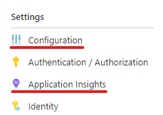

# Profile live Azure App Service apps with Application Insights

You can run Profiler on ASP.NET and ASP.NET Core apps that are running on Azure App Service using Basic service tier or higher. Enabling Profiler on Linux is currently only possible via [this method](profiler-aspnetcore-linux.md).

##  Enable Profiler for your app
To enable Profiler for an app, follow the instructions below. If you're running a different type of Azure service, here are instructions for enabling Profiler on other supported platforms:
* [Cloud Services](../../azure-monitor/app/profiler-cloudservice.md?toc=/azure/azure-monitor/toc.json)
* [Service Fabric Applications](../../azure-monitor/app/profiler-servicefabric.md?toc=/azure/azure-monitor/toc.json)
* [Virtual Machines](../../azure-monitor/app/profiler-vm.md?toc=/azure/azure-monitor/toc.json)

Application Insights Profiler is pre-installed as part of the App Services runtime. The steps below will show you how to enable it for your App Service. Follow these steps even if you've included the App Insights SDK in your application at build time.

1. Navigate to the Azure control panel for your App Service.
1. Enable "Always On" setting for your app service. You can find this setting under **Settings**, **Configuration** page (see screenshot in the next step), and click the **General settings** tab.
1. Navigate to **Settings > Application Insights** page.

   

1. Either follow the instructions on the pane to create a new resource or select an existing App Insights resource to monitor your app. Also make sure the Profiler is **On**. If your Application Insights resource is in a different subscription from your App Service, you can't use this page to configure Application Insights. You can still do it manually though by creating the necessary app settings manually. [The next section contains instructions for manually enabling Profiler.](#enable-profiler-manually-or-with-azure-resource-manager) 

   ![Add App Insights site extension][Enablement UI]

1. Profiler is now enabled using an App Services App Setting.

    ![App Setting for Profiler][profiler-app-setting]

## Enable Profiler manually or with Azure Resource Manager
Application Insights Profiler can be enabled by creating app settings for your Azure App Service. The page with the options shown above creates these app settings for you. But you can automate the creation of these settings using a template or other means. These settings will also work if your Application Insights resource is in a different subscription from your Azure App Service.
Here are the settings needed to enable the profiler:

|App Setting    | Value    |
|---------------|----------|
|APPINSIGHTS_INSTRUMENTATIONKEY         | iKey for your Application Insights resource    |
|APPINSIGHTS_PROFILERFEATURE_VERSION | 1.0.0 |
|DiagnosticServices_EXTENSION_VERSION | ~3 |

You can set these values using [Azure Resource Manager Templates](../../azure-monitor/app/azure-web-apps.md#app-service-application-settings-with-azure-resource-manager), [Azure PowerShell](https://docs.microsoft.com/powershell/module/az.websites/set-azwebapp),  [Azure CLI](https://docs.microsoft.com/cli/azure/webapp/config/appsettings?view=azure-cli-latest).

### Enabling Profiler for other clouds manually

If you want to enable the profiler for other clouds, you can use the below app settings.

|App Setting    | US Government Values| China Cloud |   
|---------------|---------------------|-------------|
|ApplicationInsightsProfilerEndpoint         | `https://agent.serviceprofiler.azure.us`    | `https://profiler.applicationinsights.azure.cn` |
|ApplicationInsightsEndpoint | `https://dc.applicationinsights.us` | `https://dc.applicationinsights.azure.cn` |

## Disable Profiler

To stop or restart Profiler for an individual app's instance, under **WebJobs** and stop the webjob named ApplicationInsightsProfiler3. Even if the profiler is disabled using the switch on the Application Insights page as described above, the profiler process will still run. The profiler will check to see if it's enabled. If it's disabled, it will go to sleep for a period of time before checking again. It doesn't do any profiling if it's disabled. If you disable this webjob, the profiler process won't run at all, even to check to see if it's enabled.

  ![Disable Profiler for a web job][disable-profiler-webjob]

We recommend that you have Profiler enabled on all your apps to discover any performance issues as early as possible.

Profiler's files can be deleted when using WebDeploy to deploy changes to your web application. You can prevent the deletion by excluding the App_Data folder from being deleted during deployment. 

## Next steps

* [Working with Application Insights in Visual Studio](https://docs.microsoft.com/azure/application-insights/app-insights-visual-studio)

[Enablement UI]: ./media/profiler/Enablement_UI.png
[profiler-app-setting]:./media/profiler/profiler-app-setting.png
[disable-profiler-webjob]: ./media/profiler/disable-profiler-webjob.png
