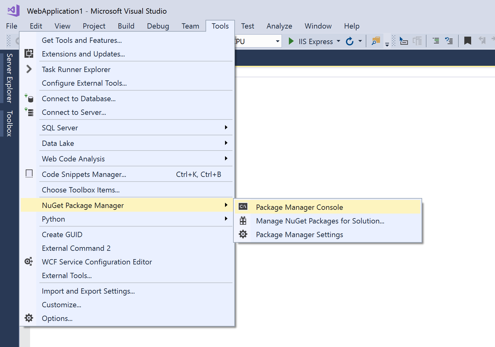
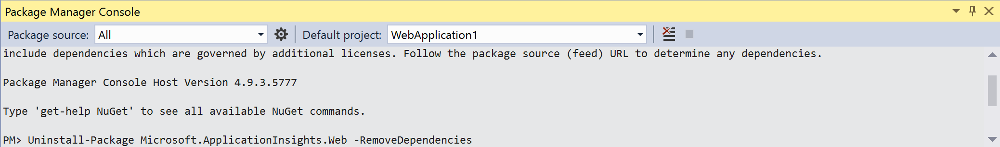
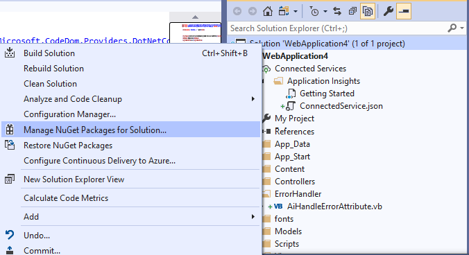
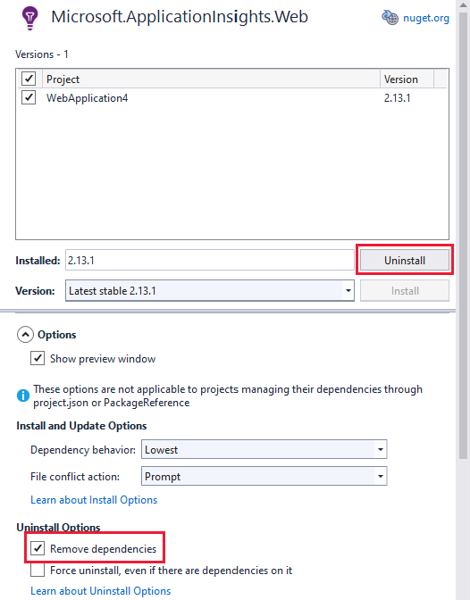
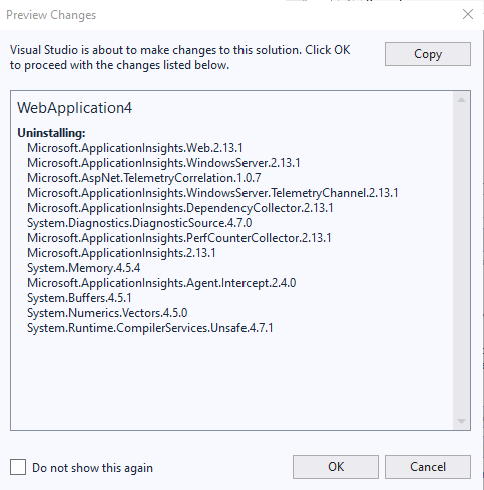
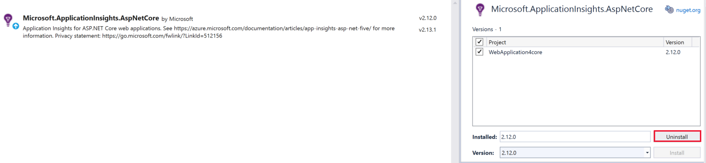

# How to remove Application Insights in Visual Studio

This article will show you how to remove the ASP.NET and .NET Core Application Insights SDK in Visual Studio.

## .NET

To remove Application Insights, you will need to remove the NuGet packages and references from the API in your application.

### .NET: What is created when you add Application Insights

When you add Application Insights Telemetry to a Visual Studio ASP.NET template project, it adds the following files:

- ApplicationInsights.config
- AiHandleErrorAttribute.vb

The following pieces of code are added:

- [Your project's name].vbproj

```C#
 <ApplicationInsightsResourceId>/subscriptions/00000000-0000-0000-0000-000000000000/resourcegroups/Default-ApplicationInsights-EastUS/providers/microsoft.insights/components/WebApplication4</ApplicationInsightsResourceId>
```

- Packages.config

```xml
<packages>
...

  <package id="Microsoft.ApplicationInsights" version="2.12.0" targetFramework="net472" />
  <package id="Microsoft.ApplicationInsights.Agent.Intercept" version="2.4.0" targetFramework="net472" />
  <package id="Microsoft.ApplicationInsights.DependencyCollector" version="2.12.0" targetFramework="net472" />
  <package id="Microsoft.ApplicationInsights.PerfCounterCollector" version="2.12.0" targetFramework="net472" />
  <package id="Microsoft.ApplicationInsights.Web" version="2.12.0" targetFramework="net472" />
  <package id="Microsoft.ApplicationInsights.WindowsServer" version="2.12.0" targetFramework="net472" />
  <package id="Microsoft.ApplicationInsights.WindowsServer.TelemetryChannel" version="2.12.0" targetFramework="net472" />

  <package id="Microsoft.AspNet.TelemetryCorrelation" version="1.0.7" targetFramework="net472" />

  <package id="System.Buffers" version="4.4.0" targetFramework="net472" />
  <package id="System.Diagnostics.DiagnosticSource" version="4.6.0" targetFramework="net472" />
  <package id="System.Memory" version="4.5.3" targetFramework="net472" />
  <package id="System.Numerics.Vectors" version="4.4.0" targetFramework="net472" />
  <package id="System.Runtime.CompilerServices.Unsafe" version="4.5.2" targetFramework="net472" />
...
</packages>
```

- Layout.vbhtml

```html
<head>
...
    <script type = 'text/javascript' >
        var appInsights=window.appInsights||function(config)
        {
            function r(config){ t[config] = function(){ var i = arguments; t.queue.push(function(){ t[config].apply(t, i)})} }
            var t = { config:config},u=document,e=window,o='script',s=u.createElement(o),i,f;for(s.src=config.url||'//az416426.vo.msecnd.net/scripts/a/ai.0.js',u.getElementsByTagName(o)[0].parentNode.appendChild(s),t.cookie=u.cookie,t.queue=[],i=['Event','Exception','Metric','PageView','Trace','Ajax'];i.length;)r('track'+i.pop());return r('setAuthenticatedUserContext'),r('clearAuthenticatedUserContext'),config.disableExceptionTracking||(i='onerror',r('_'+i),f=e[i],e[i]=function(config, r, u, e, o) { var s = f && f(config, r, u, e, o); return s !== !0 && t['_' + i](config, r, u, e, o),s}),t
        }({
            instrumentationKey:'00000000-0000-0000-0000-000000000000'
        });
        
        window.appInsights=appInsights;
        appInsights.trackPageView();
    </script>
...
</head>
```

- ConnectedService.json

```json
{
  "ProviderId": "Microsoft.ApplicationInsights.ConnectedService.ConnectedServiceProvider",
  "Version": "16.0.0.0",
  "GettingStartedDocument": {
    "Uri": "https://go.microsoft.com/fwlink/?LinkID=613413"
  }
}
```

- FilterConfig.vb

```vb
Public Module FilterConfig
    Public Sub RegisterGlobalFilters(ByVal filters As GlobalFilterCollection)
        filters.Add(New ErrorHandler.AiHandleErrorAttribute()) // Remove this line
    End Sub
End Module
```

### .NET: Using the Package Management Console

1. To open the Package Management Console, in the top menu select Tools > NuGet Package Manager > Package Manager Console.

   > [!div class="mx-imgBorder"]
   >

1. Enter the following command: `Uninstall-Package Microsoft.ApplicationInsights.Web -RemoveDependencies`
    After entering the command, the Application Insights package and all of its dependencies will be uninstalled from the project.

   > [!div class="mx-imgBorder"]
   >

### .NET: Using the Visual Studio NuGet UI

1.  In the *Solution Explore* on the right, right click on **Solution** and select **Manage NuGet Packages for Solution**

 You'll then see a screen that allows you to edit all the NuGet packages that are part of the project.

   > [!div class="mx-imgBorder"]
   >

1. Click on the "Microsoft.ApplicationInsights.Web" package. On the right, check the checkbox next to **Project** to select all projects.
2. To remove all dependencies when uninstalling, select the **Options** dropdown button below the section where you selected project. Under *Uninstall Options*, select the checkbox next to *Remove dependencies*.
3. Select Uninstall

    > [!div class="mx-imgBorder"]
    >

   A dialog box will display that shows all of the dependencies to be removed from the application. Select **ok** to remove them.

    > [!div class="mx-imgBorder"]
    >

1. After everything is uninstalled, you may still see  "ApplicationInsights.config" and "AiHandleErrorAttribute.vb" in the *Solution Explore*. You can delete the two files manually.

## .NET Core

To remove Application Insights, you will need to remove the NuGet packages and references from the API in your application.

### .NET Core: What is created when you add Application Insights

When you add Application Insights Telemetry to a Visual Studio ASP.NET Core template project, it adds the following code:

- [Your project's name].csproj

    ```C#
      <PropertyGroup>
        <TargetFramework>netcoreapp3.1</TargetFramework>
        <ApplicationInsightsResourceId>/subscriptions/b21990e9-15a7-47eb-9ad0-f6b7155ab349/resourcegroups/Default-ApplicationInsights-EastUS/providers/microsoft.insights/components/WebApplication4core</ApplicationInsightsResourceId>
      </PropertyGroup>
    
      <ItemGroup>
        <PackageReference Include="Microsoft.ApplicationInsights.AspNetCore" Version="2.12.0" />
      </ItemGroup>
    
      <ItemGroup>
        <WCFMetadata Include="Connected Services" />
      </ItemGroup>
    ```
- Appsettings.json in AllowedHosts:

    ```json
    "ApplicationInsights": {
        "InstrumentationKey": "00000000-0000-0000-0000-000000000000"
    ```

- ConnectedService.json
    
    ```json
    {
      "ProviderId": "Microsoft.ApplicationInsights.ConnectedService.ConnectedServiceProvider",
      "Version": "16.0.0.0",
      "GettingStartedDocument": {
        "Uri": "https://go.microsoft.com/fwlink/?LinkID=798432"
      }
    }
    ```
- Startup.cs

    ```C#
       public void ConfigureServices(IServiceCollection services)
            {
                services.AddRazorPages();
                services.AddApplicationInsightsTelemetry(); // This is added
            }
    ```


### .NET Core: Using the Package Management Console

1. To open the Package Management Console, in the top menu select Tools > NuGet Package Manager > Package Manager Console.
1. Enter the following command: ` Uninstall-Package Microsoft.ApplicationInsights.AspNetCore -RemoveDependencies`
    After entering the command, the Application Insights package and all of its dependencies will be uninstalled from the project.
  
### .NET Core: Using the Visual Studio NuGet UI

1.  In the *Solution Explore* on the right, right click on **Solution** and select **Manage NuGet Packages for Solution*

 You'll then see a screen that allows you to edit all the NuGet packages that are part of the project.

   >[!div class="mx-imgBorder"]
   >

1. Click on "Microsoft.ApplicationInsights.AspNetCore" package. On the right, check the checkbox next to **Project** to select all projects.

   > [!div class="mx-imgBorder"]
   >
