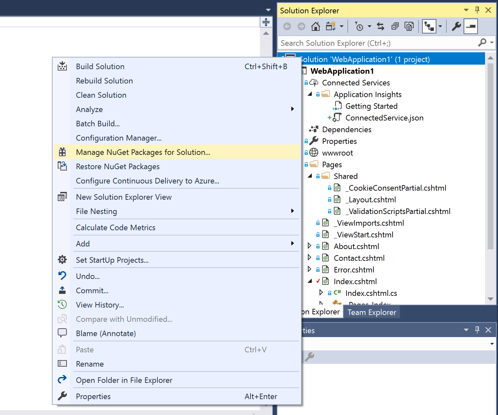
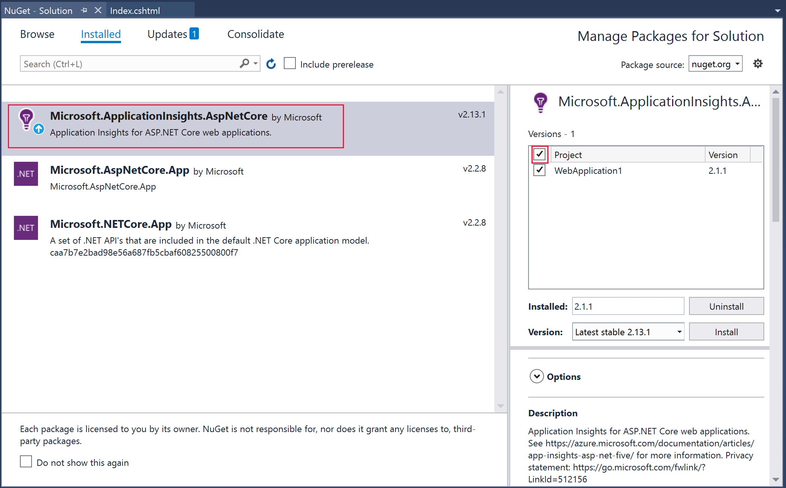
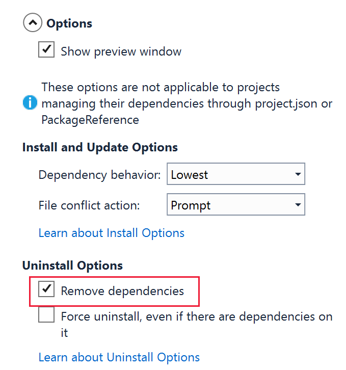
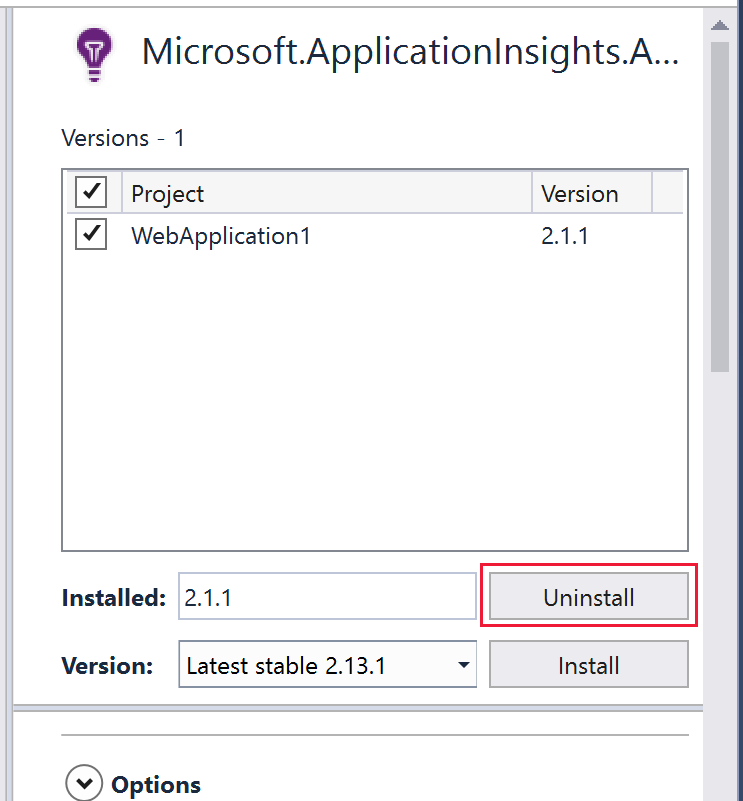

# How to remove Application Insights in Visual Studio

This article will show you how to remove the ASP.NET and .NET Core Application Insights SDK in Visual Studio.

## Option 1: Using the Package Management Console

1. To open the Package Management Console, in the top menu select Tools > NuGet Package Manager > Package Manager Console.
    > [!div class="mx-imgBorder"]
    >

1. Enter the following command: `Uninstall-Package Microsoft.ApplicationInsights.Web -RemoveDependencies`

    After entering the command, the Application Insights package and all of its dependencies will be uninstalled from the project.
    > [!div class="mx-imgBorder"]
    >

## Option 2: Using the Visual Studio NuGet UI

1. In the *Solution Explore* on the right, right click on **Solution** and select **Manage NuGet Packages for Solution**

     You'll then see a screen that allows you to edit all the NuGet packages that are part of the project.
    > [!div class="mx-imgBorder"]
    >

1. Click on the "Microsoft.ApplicationInsights.Web" package. On the right, check the checkbox next to **Project** to select all projects.
    > [!div class="mx-imgBorder"]
    >

1. To remove all dependencies when uninstalling, select the **Options** dropdown button below the section where you selected project.
    a. Under *Uninstall Options*, select the checkbox next to *Remove dependencies*.

    > [!div class="mx-imgBorder"]
    >

1.  Select **Uninstall**.

     > [!div class="mx-imgBorder"]
    >

    a.  A dialog box will display that shows all of the unnecessary dependencies to be removed from the application. Select **approve** to remove them.

1. After everything is uninstalled, you may still see  "ApplicationInsights.config" and "ErrorHandler" folders in the *Solution Explore*. You can delete the two folders manually.
