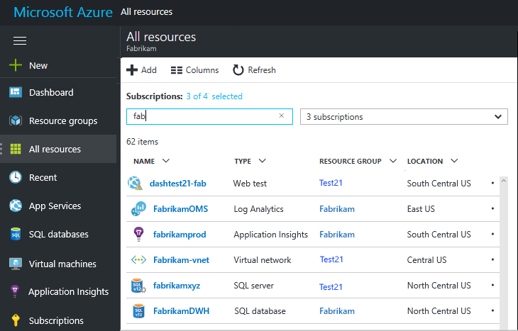
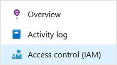
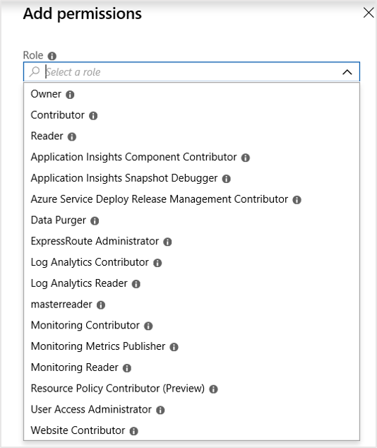

# Resources, roles, and access control in Application Insights

You can control who has read and update access to your data in Azure [Application Insights][start], by using [Role-based access control in Microsoft Azure](../../role-based-access-control/role-assignments-portal.md).

> [!IMPORTANT]
> Assign access to users in the **resource group or subscription** to which your application resource belongs - not in the resource itself. Assign the **Application Insights component contributor** role. This ensures uniform control of access to web tests and alerts along with your application resource. [Learn more](#access).


[!INCLUDE [updated-for-az](../../../includes/updated-for-az.md)]

## Resources, groups and subscriptions

First, some definitions:

* **Resource** - An instance of a Microsoft Azure service. Your Application Insights resource collects, analyzes and displays the telemetry data sent from your application.  Other types of Azure resources include web apps, databases, and VMs.
  
    To see your resources, open the [Azure portal][portal], sign in, and click All Resources. To find a resource, type part of its name in the filter field.
  
    

<a name="resource-group"></a>

* [**Resource group**][group] - Every resource belongs to one group. A group is a convenient way to manage related resources, particularly for access control. For example, into one resource group you could put a Web App, an Application Insights resource to monitor the app, and a Storage resource to keep exported data.

* [**Subscription**](https://portal.azure.com) - To use Application Insights or other Azure resources, you sign in to an Azure subscription. Every resource group belongs to one Azure subscription, where you choose your price package and, if it's an organization subscription, choose the members and their access permissions.
* [**Microsoft account**][account] - The username and password that you use to sign in to Microsoft Azure subscriptions, XBox Live, Outlook.com, and other Microsoft services.

## <a name="access"></a> Control access in the resource group

It's important to understand that in addition to the resource you created for your application, there are also separate hidden resources for alerts and web tests. They are attached to the same [resource group](#resource-group) as your Application Insights resource. You might also have put other Azure services in there, such as websites or storage.

## To provide access to another user

You must have Owner rights to the subscription or the resource group.

The user must have a [Microsoft Account][account], or access to their [organizational Microsoft Account](../../active-directory/fundamentals/sign-up-organization.md). You can provide access to individuals, and also to user groups defined in Azure Active Directory.

#### Navigate to resource group or directly to the resource itself

Choose **Access control (IAM)** from the left-hand menu.



Select **Add role assignment**


The **Add permissions** view below is primarily specific to Application Insights resources, if you were viewing the access control permissions from a higher level like resource groups, you would see additional non-Application Insights-centric roles.

To view information on all Azure role-based access control built-in roles use the [official reference content](https://docs.microsoft.com/azure/role-based-access-control/built-in-roles).



#### Select a role

Where applicable we link to the associated official reference documentation.

| Role | In the resource group |
| --- | --- |
| [Owner](https://docs.microsoft.com/azure/role-based-access-control/built-in-roles#owner) |Can change anything, including user access. |
| [Contributor](https://docs.microsoft.com/azure/role-based-access-control/built-in-roles#contributor) |Can edit anything, including all resources. |
| [Application Insights Component contributor](https://docs.microsoft.com/azure/role-based-access-control/built-in-roles#application-insights-component-contributor) |Can edit Application Insights resources. |
| [Reader](https://docs.microsoft.com/azure/role-based-access-control/built-in-roles#reader) |Can view but not change anything. |
| [Application Insights Snapshot Debugger](https://docs.microsoft.com/azure/role-based-access-control/built-in-roles#application-insights-snapshot-debugger) | Gives the user permission to use Application Insights Snapshot Debugger features. Note that this role is included in neither the Owner nor Contributor roles. |
| Azure Service Deploy Release Management Contributor | Contributor role for services deploying through Azure Service Deploy. |
| [Data Purger](https://docs.microsoft.com/azure/role-based-access-control/built-in-roles#data-purger) | Special role for purging personal data. See our [guidance for personal data](https://docs.microsoft.com/azure/application-insights/app-insights-customer-data) for more information.   |
| ExpressRoute Administrator | Can create delete and manage express routes.|
| [Log Analytics Contributor](https://docs.microsoft.com/azure/role-based-access-control/built-in-roles#log-analytics-contributor) | Log Analytics Contributor can read all monitoring data and edit monitoring settings. Editing monitoring settings includes adding the VM extension to VMs; reading storage account keys to be able to configure collection of logs from Azure Storage; creating and configuring Automation accounts; adding solutions; and configuring Azure diagnostics on all Azure resources.  |
| [Log Analytics Reader](https://docs.microsoft.com/azure/role-based-access-control/built-in-roles#log-analytics-reader) | Log Analytics Reader can view and search all monitoring data as well as and view monitoring settings, including viewing the configuration of Azure diagnostics on all Azure resources. |
| masterreader | Allows a user to view everything but not make changes. |
| [Monitoring Contributor](https://docs.microsoft.com/azure/role-based-access-control/built-in-roles#monitoring-contributor) | Can read all monitoring data and update monitoring settings.|
| [Monitoring Metrics Publisher](https://docs.microsoft.com/azure/role-based-access-control/built-in-roles#monitoring-metrics-publisher) | Enables publishing metrics against Azure resources. |
| [Monitoring Reader](https://docs.microsoft.com/azure/role-based-access-control/built-in-roles#monitoring-reader) | Can read all monitoring data. |
| Resource Policy Contributor (Preview) | Backfilled users from EA, with rights to create/modify resource policy, create support ticket and read resource/hierarchy.  |
| [User Access Administrator](https://docs.microsoft.com/azure/role-based-access-control/built-in-roles#user-access-administrator) | Allows a user to manage access for other users to Azure resources.|
| [Website Contributor](https://docs.microsoft.com/azure/role-based-access-control/built-in-roles#website-contributor) | Lets you manage websites (not web plans), but not access to them..|

'Editing' includes creating, deleting and updating:

* Resources
* Web tests
* Alerts
* Continuous export

#### Select the user

If the user you want isn't in the directory, you can invite anyone with a Microsoft account.
(If they use services like Outlook.com, OneDrive, Windows Phone, or XBox Live, they have a Microsoft account.)

## Related content

* [Role based access control in Azure](../../role-based-access-control/role-assignments-portal.md)

## PowerShell query to determine role membership

Since certain roles can be linked to notifications and e-mail alerts it can be helpful to be able to generate a list of users who belong to a given role. To help with generating these types of lists we offer the following sample queries that can be adjusted to fit your specific needs:

### Query entire subscription for Admin roles + Contributor roles

```powershell
(Get-AzRoleAssignment -IncludeClassicAdministrators | Where-Object {$_.RoleDefinitionName -in @('ServiceAdministrator', 'CoAdministrator', 'Owner', 'Contributor') } | Select -ExpandProperty SignInName | Sort-Object -Unique) -Join ", "
```

### Query within the context of a specific Application Insights resource for owners and contributors

```powershell
$resourceGroup = "RGNAME"
$resourceName = "AppInsightsName"
$resourceType = "microsoft.insights/components"
(Get-AzRoleAssignment -ResourceGroup $resourceGroup -ResourceType $resourceType -ResourceName $resourceName | Where-Object {$_.RoleDefinitionName -in @('Owner', 'Contributor') } | Select -ExpandProperty SignInName | Sort-Object -Unique) -Join ", "
```

### Query within the context of a specific resource group for owners and contributors

```powershell
$resourceGroup = "RGNAME"
(Get-AzRoleAssignment -ResourceGroup $resourceGroup | Where-Object {$_.RoleDefinitionName -in @('Owner', 'Contributor') } | Select -ExpandProperty SignInName | Sort-Object -Unique) -Join ", "
```

<!--Link references-->

[account]: https://account.microsoft.com
[group]: ../../azure-resource-manager/management/overview.md
[portal]: https://portal.azure.com/
[start]: ../../azure-monitor/app/app-insights-overview.md
