# Walkthrough: Enabling Telemetry for Microsoft Dynamics CRM Online using Application Insights
This article shows you how to get telemetry data from [Microsoft Dynamics CRM Online](https://www.dynamics.com/) using [Azure Application Insights](https://azure.microsoft.com/services/application-insights/). We’ll walk through the complete process of adding Application Insights script to your application, capturing data, and data visualization.

> [!NOTE]
> [Browse the sample solution](https://dynamicsandappinsights.codeplex.com/).
> 
> 

## Add Application Insights to new or existing CRM Online instance
To monitor your application, you add an Application Insights SDK to your application. The SDK sends telemetry to the [Application Insights portal](https://portal.azure.com), where you can use our powerful analysis and diagnostic tools, or export the data to storage.

### Create an Application Insights resource in Azure
1. Get [an account in Microsoft Azure](https://azure.com/pricing). 
2. Sign into the [Azure portal](https://portal.azure.com) and add a new Application Insights resource. This is where your data will be processed and displayed.

    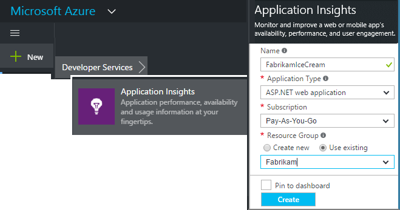

    Choose ASP.NET as the application type.
3. Follow the instructions to [get the JavaScript SDK script for your app](../../azure-monitor/app/javascript.md#set-up-application-insights-for-your-web-page), copy the JavaScript snippet and make sure to replace the Instrumentation Key with the correct value for your Application Insights resource.

### Create a JavaScript web resource in Microsoft Dynamics CRM
1. Open your CRM Online instance and login with administrator privileges.
2. Open Microsoft Dynamics CRM Settings, Customizations, Customize the System

    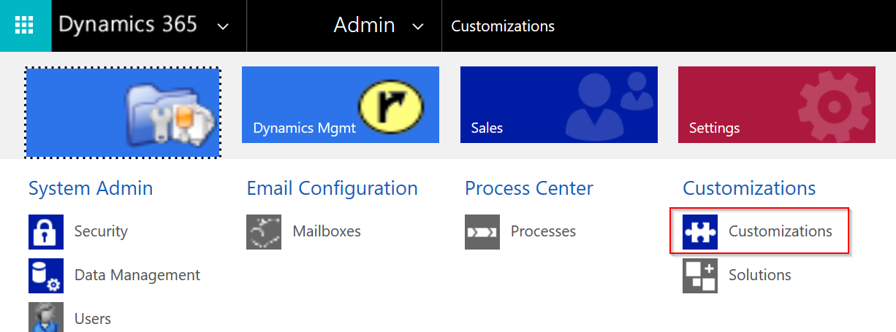

    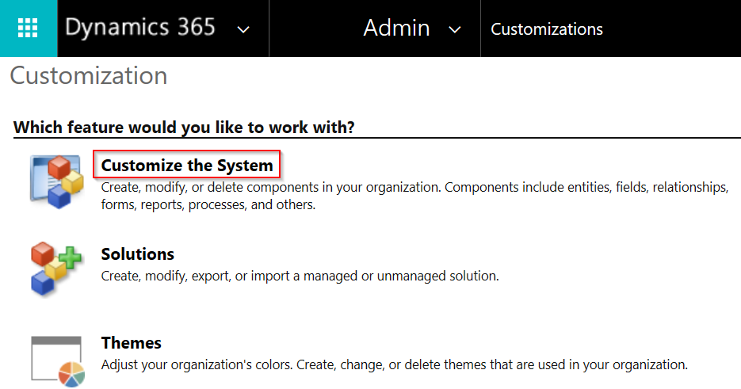

1. Create a JavaScript resource.

    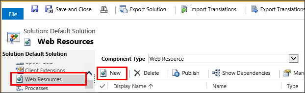

    Give it a name, select **Script (JScript)** and open the text editor.

    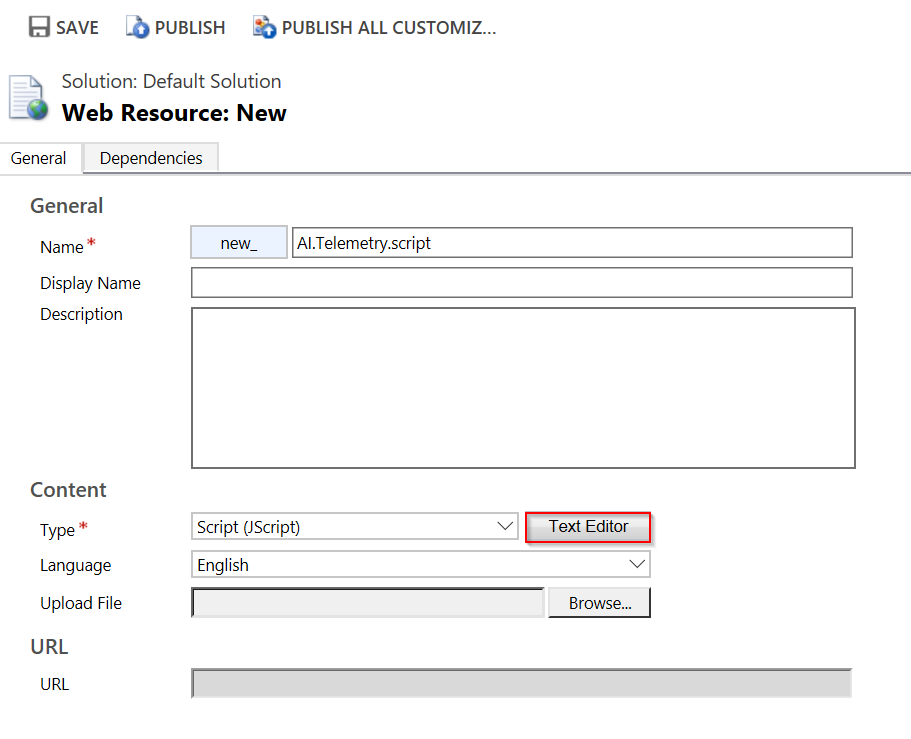
2. Copy the code from the Application Insights JavaScript SDK in which you configured your Instrumentation Key before. While copying, make sure to ignore script tags. Refer to the screenshot below:

    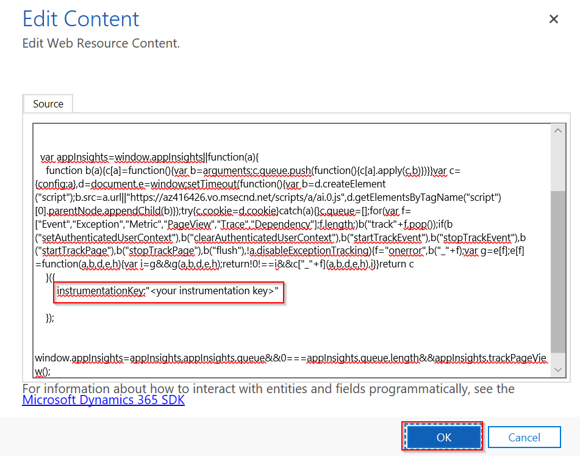

    The code includes the instrumentation key that identifies your Application insights resource.
3. Save and publish.

    

### Instrument Forms
1. In Microsoft CRM Online, open the Account form

    
2. Open the form Properties

    
3. Add the JavaScript web resource that you created

    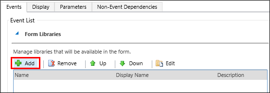

4. Save and publish your form customizations.

## Metrics captured
You have now set up telemetry capture for the form. Whenever it is used, data will be sent to your Application Insights resource.

Here are samples of the data that you'll see.

#### Application health
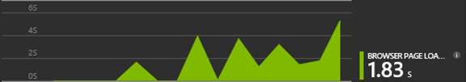

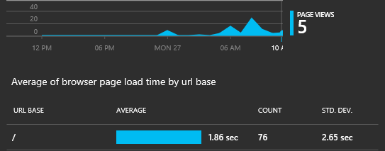

Browser exceptions:

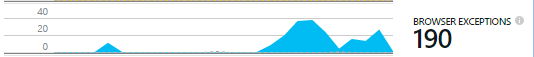

Click the chart to get more detail:

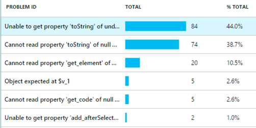

#### Usage
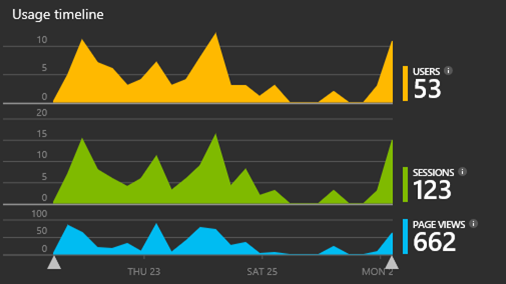

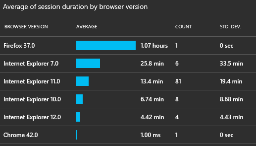

#### Browsers

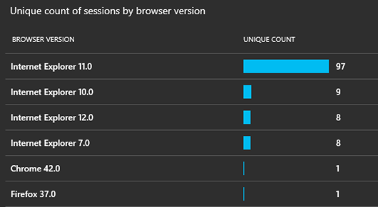

#### Geolocation
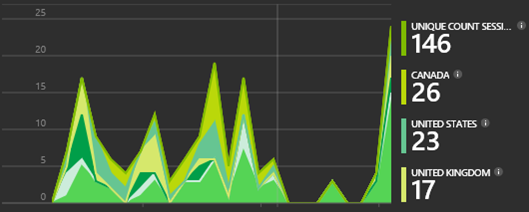

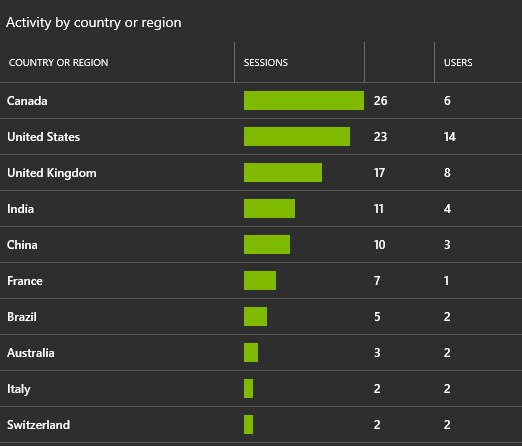

#### Inside page view request
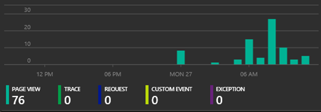

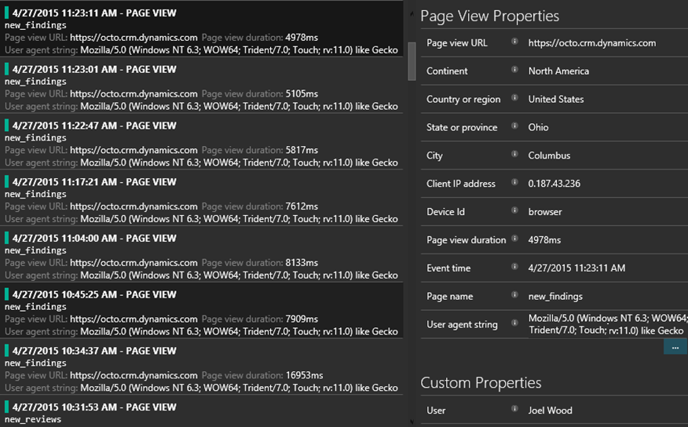

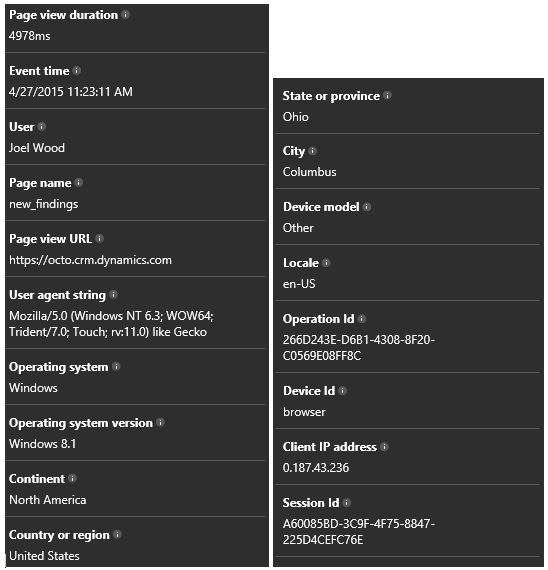

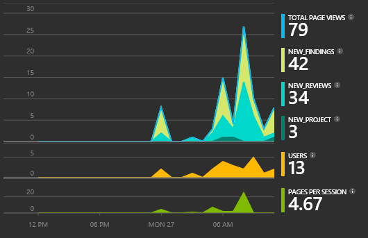

## Sample code
[Browse the sample code](https://dynamicsandappinsights.codeplex.com/).

## Power BI
You can do even deeper analysis if you [export the data to Microsoft Power BI](../../azure-monitor/app/export-power-bi.md ).

## Sample Microsoft Dynamics CRM Solution
[Here is the sample solution implemented in Microsoft Dynamics CRM](https://dynamicsandappinsights.codeplex.com/).

## Learn more
* [What is Application Insights?](../../azure-monitor/app/app-insights-overview.md)
* [Application Insights for web pages](../../azure-monitor/app/javascript.md)
* [More samples and walkthroughs](../../azure-monitor/app/app-insights-overview.md)
