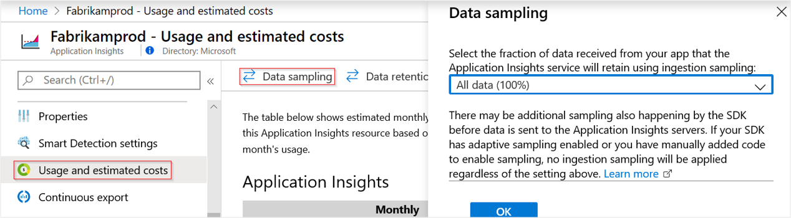

# Sampling in Application Insights

Sampling is a feature in [Azure Application Insights](../../azure-monitor/app/app-insights-overview.md). It is the recommended way to reduce telemetry traffic, data costs, and storage costs, while preserving a statistically correct analysis of application data. Sampling also helps you avoid Application Insights throttling your telemetry. The sampling filter selects items that are related, so that you can navigate between items when you are doing diagnostic investigations.

When metric counts are presented in the portal, they are renormalized to take into account sampling. Doing so minimizes any effect on the statistics.

## Brief summary

* There are three different types of sampling: adaptive sampling, fixed-rate sampling, and ingestion sampling.
* Adaptive sampling is enabled by default in all the latest versions of the Application Insights ASP.NET and ASP.NET Core Software Development Kits (SDKs). It is also used by [Azure Functions](https://docs.microsoft.com/azure/azure-functions/functions-overview).
* Fixed-rate sampling is available in recent versions of the Application Insights SDKs for ASP.NET, ASP.NET Core, Java (both the agent and the SDK), and Python.
* Ingestion sampling works on the Application Insights service endpoint. It only applies when no other sampling is in effect. If the SDK samples your telemetry, ingestion sampling is disabled.
* For web applications, if you log custom events and need to ensure that a set of events is retained or discarded together, the events must have the same `OperationId` value.
* If you write Analytics queries, you should [take account of sampling](../../azure-monitor/log-query/aggregations.md). In particular, instead of simply counting records, you should use `summarize sum(itemCount)`.
* Some telemetry types, including performance metrics and custom metrics, are always kept regardless of whether sampling is enabled or not.

The following table summarizes the sampling types available for each SDK and type of application:

| Application Insights SDK | Adaptive sampling supported | Fixed-rate sampling supported | Ingestion sampling supported |
|-|-|-|-|
| ASP.NET | [Yes (on by default)](#configuring-adaptive-sampling-for-aspnet-applications) | [Yes](#configuring-fixed-rate-sampling-for-aspnet-applications) | Only if no other sampling is in effect |
| ASP.NET Core | [Yes (on by default)](#configuring-adaptive-sampling-for-aspnet-core-applications) | [Yes](#configuring-fixed-rate-sampling-for-aspnet-core-applications) | Only if no other sampling is in effect |
| Azure Functions | [Yes (on by default)](#configuring-adaptive-sampling-for-azure-functions) | No | Only if no other sampling is in effect |
| Java | No | [Yes](#configuring-fixed-rate-sampling-for-java-applications) | Only if no other sampling is in effect |
| Python | No | [Yes](#configuring-fixed-rate-sampling-for-opencensus-python-applications) | Only if no other sampling is in effect |
| All others | No | No | [Yes](#ingestion-sampling) |

> [!NOTE]
> The information on most of this page applies to the current versions of the Application Insights SDKs. For information on older versions of the SDKs, [see the section below](#older-sdk-versions).

## Types of sampling

There are three different sampling methods:

* **Adaptive sampling** automatically adjusts the volume of telemetry sent from the SDK in your ASP.NET/ASP.NET Core app, and from Azure Functions. This is the default sampling when you use the ASP.NET or ASP.NET Core SDK. Adaptive sampling is currently only available for ASP.NET server-side telemetry, and for Azure Functions.

* **Fixed-rate sampling** reduces the volume of telemetry sent from both your ASP.NET or ASP.NET Core or Java server and from your users' browsers. You set the rate. The client and server will synchronize their sampling so that, in Search, you can navigate between related page views and requests.

* **Ingestion sampling** happens at the Application Insights service endpoint. It discards some of the telemetry that arrives from your app, at a sampling rate that you set. It doesn't reduce telemetry traffic sent from your app, but helps you keep within your monthly quota. The main advantage of ingestion sampling is that you can set the sampling rate without redeploying your app. Ingestion sampling works uniformly for all servers and clients, but it does not apply when any other types of sampling are in operation.

> [!IMPORTANT]
> If adaptive or fixed rate sampling methods are in operation, ingestion sampling is disabled.

## Adaptive sampling

Adaptive sampling affects the volume of telemetry sent from your web server app to the Application Insights service endpoint.

> [!TIP]
> Adaptive sampling is enabled by default when you use the ASP.NET SDK or the ASP.NET Core SDK, and is also enabled by default for Azure Functions.

The volume is adjusted automatically to keep within a specified maximum rate of traffic, and is controlled via the setting `MaxTelemetryItemsPerSecond`. If the application produces a low amount of telemetry, such as when debugging or due to low usage, items won't be dropped by the sampling processor as long as volume is below `MaxTelemetryItemsPerSecond`. As the volume of telemetry increases, the sampling rate is adjusted so as to achieve the target volume. The adjustment is recalculated at regular intervals, and is based on a moving average of the outgoing transmission rate.

To achieve the target volume, some of the generated telemetry is discarded. But like other types of sampling, the algorithm retains related telemetry items. For example, when you're inspecting the telemetry in Search, you'll be able to find the request related to a particular exception.

Metric counts such as request rate and exception rate are adjusted to compensate for the sampling rate, so that they show approximately correct values in Metric Explorer.

### Configuring adaptive sampling for ASP.NET applications

> [!NOTE]
> This section applies to ASP.NET applications, not to ASP.NET Core applications. [Learn about configuring adaptive sampling for ASP.NET Core applications later in this document.](../../azure-monitor/app/sampling.md#configuring-adaptive-sampling-for-aspnet-core-applications)

In [`ApplicationInsights.config`](../../azure-monitor/app/configuration-with-applicationinsights-config.md), you can adjust several parameters in the `AdaptiveSamplingTelemetryProcessor` node. The figures shown are the default values:

* `<MaxTelemetryItemsPerSecond>5</MaxTelemetryItemsPerSecond>`
  
    The target rate that the adaptive algorithm aims for **on each server host**. If your web app runs on many hosts, reduce this value so as to remain within your target rate of traffic at the Application Insights portal.

* `<EvaluationInterval>00:00:15</EvaluationInterval>` 
  
    The interval at which the current rate of telemetry is reevaluated. Evaluation is performed as a moving average. You might want to shorten this interval if your telemetry is liable to sudden bursts.

* `<SamplingPercentageDecreaseTimeout>00:02:00</SamplingPercentageDecreaseTimeout>`
  
    When sampling percentage value changes, how soon after are we allowed to lower the sampling percentage again to capture less data?

* `<SamplingPercentageIncreaseTimeout>00:15:00</SamplingPercentageIncreaseTimeout>`
  
    When sampling percentage value changes, how soon after are we allowed to increase the sampling percentage again to capture more data?

* `<MinSamplingPercentage>0.1</MinSamplingPercentage>`
  
    As sampling percentage varies, what is the minimum value we're allowed to set?

* `<MaxSamplingPercentage>100.0</MaxSamplingPercentage>`
  
    As sampling percentage varies, what is the maximum value we're allowed to set?

* `<MovingAverageRatio>0.25</MovingAverageRatio>` 
  
    In the calculation of the moving average, this specifies the weight that should be assigned to the most recent value. Use a value equal to or less than 1. Smaller values make the algorithm less reactive to sudden changes.

* `<InitialSamplingPercentage>100</InitialSamplingPercentage>`
  
    The amount of telemetry to sample when the app has just started. Don't reduce this value while you're debugging.

* `<ExcludedTypes>Trace;Exception</ExcludedTypes>`
  
    A semi-colon delimited list of types that you do not want to be subject to sampling. Recognized types are: `Dependency`, `Event`, `Exception`, `PageView`, `Request`, `Trace`. All telemetry of the specified types is transmitted; the types that are not specified will be sampled.

* `<IncludedTypes>Request;Dependency</IncludedTypes>`
  
    A semi-colon delimited list of types that you do want to subject to sampling. Recognized types are: `Dependency`, `Event`, `Exception`, `PageView`, `Request`, `Trace`. The specified types will be sampled; all telemetry of the other types will always be transmitted.

**To switch off** adaptive sampling, remove the `AdaptiveSamplingTelemetryProcessor` node(s) from `ApplicationInsights.config`.

#### Alternative: Configure adaptive sampling in code

Instead of setting the sampling parameter in the `.config` file, you can programmatically set these values.

1. Remove all the `AdaptiveSamplingTelemetryProcessor` node(s) from the `.config` file.
2. Use the following snippet to configure adaptive sampling:

    ```csharp
    using Microsoft.ApplicationInsights;
    using Microsoft.ApplicationInsights.Extensibility;
    using Microsoft.ApplicationInsights.WindowsServer.Channel.Implementation;
    using Microsoft.ApplicationInsights.WindowsServer.TelemetryChannel;
    
    // ...

    var builder = TelemetryConfiguration.Active.DefaultTelemetrySink.TelemetryProcessorChainBuilder;
    // For older versions of the Application Insights SDK, use the following line instead:
    // var builder = TelemetryConfiguration.Active.TelemetryProcessorChainBuilder;

    // Enable AdaptiveSampling so as to keep overall telemetry volume to 5 items per second.
    builder.UseAdaptiveSampling(maxTelemetryItemsPerSecond:5);

    // If you have other telemetry processors:
    builder.Use((next) => new AnotherProcessor(next));

    builder.Build();
    ```

    ([Learn about telemetry processors](../../azure-monitor/app/api-filtering-sampling.md#filtering).)

You can also adjust the sampling rate for each telemetry type individually, or can even exclude certain types from being sampled at all:

```csharp
// The following configures adaptive sampling with 5 items per second, and also excludes Dependency telemetry from being subjected to sampling.
builder.UseAdaptiveSampling(maxTelemetryItemsPerSecond:5, excludedTypes: "Dependency");
```

### Configuring adaptive sampling for ASP.NET Core applications

There is no `ApplicationInsights.config` for ASP.NET Core applications, so all configuration is done via code.
Adaptive sampling is enabled by default for all ASP.NET Core applications. You can disable or customize the sampling behavior.

#### Turning off adaptive sampling

The default sampling feature can be disabled while adding Application Insights service, in the method `ConfigureServices`, using `ApplicationInsightsServiceOptions` within the `Startup.cs` file:

```csharp
public void ConfigureServices(IServiceCollection services)
{
    // ...

    var aiOptions = new Microsoft.ApplicationInsights.AspNetCore.Extensions.ApplicationInsightsServiceOptions();
    aiOptions.EnableAdaptiveSampling = false;
    services.AddApplicationInsightsTelemetry(aiOptions);

    //...
}
```

The above code will disable adaptive sampling. Follow the steps below to add sampling with more customization options.

#### Configure sampling settings

Use extension methods of `TelemetryProcessorChainBuilder` as shown below to customize sampling behavior.

> [!IMPORTANT]
> If you use this method to configure sampling, please make sure to set the `aiOptions.EnableAdaptiveSampling` property to `false` when calling `AddApplicationInsightsTelemetry()`.

```csharp
public void Configure(IApplicationBuilder app, IHostingEnvironment env, TelemetryConfiguration configuration)
{
    var builder = configuration.DefaultTelemetrySink.TelemetryProcessorChainBuilder;
    // For older versions of the Application Insights SDK, use the following line instead:
    // var builder = configuration.TelemetryProcessorChainBuilder;

    // Using adaptive sampling
    builder.UseAdaptiveSampling(maxTelemetryItemsPerSecond:5);

    // Alternately, the following configures adaptive sampling with 5 items per second, and also excludes DependencyTelemetry from being subject to sampling.
    // builder.UseAdaptiveSampling(maxTelemetryItemsPerSecond:5, excludedTypes: "Dependency");

    // If you have other telemetry processors:
    builder.Use((next) => new AnotherProcessor(next));
    
    builder.Build();

    // ...
}
```

### Configuring adaptive sampling for Azure Functions

Follow instructions from [this page](https://docs.microsoft.com/azure/azure-functions/functions-monitoring#configure-sampling) to configure adaptive sampling for apps running in Azure Functions.

## Fixed-rate sampling

Fixed-rate sampling reduces the traffic sent from your web server and web browsers. Unlike adaptive sampling, it reduces telemetry at a fixed rate decided by you. Fixed-rate sampling is available for ASP.NET, ASP.NET Core, Java and Python applications.

Like other sampling techniques, this also retains related items. It also synchronizes the client and server sampling so that related items are retained - for example, when you look at a page view in Search, you can find its related server requests. 

In Metrics Explorer, rates such as request and exception counts are multiplied by a factor to compensate for the sampling rate, so that they are approximately correct.

### Configuring fixed-rate sampling for ASP.NET applications

1. **Disable adaptive sampling**: In [`ApplicationInsights.config`](../../azure-monitor/app/configuration-with-applicationinsights-config.md), remove or comment out the `AdaptiveSamplingTelemetryProcessor` node.

    ```xml
    <TelemetryProcessors>
        <!-- Disabled adaptive sampling:
        <Add Type="Microsoft.ApplicationInsights.WindowsServer.TelemetryChannel.AdaptiveSamplingTelemetryProcessor, Microsoft.AI.ServerTelemetryChannel">
            <MaxTelemetryItemsPerSecond>5</MaxTelemetryItemsPerSecond>
        </Add>
        -->
    ```

2. **Enable the fixed-rate sampling module.** Add this snippet to [`ApplicationInsights.config`](../../azure-monitor/app/configuration-with-applicationinsights-config.md):
   
    ```XML
    <TelemetryProcessors>
        <Add Type="Microsoft.ApplicationInsights.WindowsServer.TelemetryChannel.SamplingTelemetryProcessor, Microsoft.AI.ServerTelemetryChannel">
            <!-- Set a percentage close to 100/N where N is an integer. -->
            <!-- E.g. 50 (=100/2), 33.33 (=100/3), 25 (=100/4), 20, 1 (=100/100), 0.1 (=100/1000) -->
            <SamplingPercentage>10</SamplingPercentage>
        </Add>
    </TelemetryProcessors>
    ```

      Alternatively, instead of setting the sampling parameter in the `ApplicationInsights.config` file, you can programmatically set these values:

    ```csharp
    using Microsoft.ApplicationInsights.Extensibility;
    using Microsoft.ApplicationInsights.WindowsServer.TelemetryChannel;

    // ...

    var builder = TelemetryConfiguration.Active.DefaultTelemetrySink.TelemetryProcessorChainBuilder;
    // For older versions of the Application Insights SDK, use the following line instead:
    // var builder = TelemetryConfiguration.Active.TelemetryProcessorChainBuilder;

    builder.UseSampling(10.0); // percentage

    // If you have other telemetry processors:
    builder.Use((next) => new AnotherProcessor(next));

    builder.Build();
    ```

    ([Learn about telemetry processors](../../azure-monitor/app/api-filtering-sampling.md#filtering).)

### Configuring fixed-rate sampling for ASP.NET Core applications

1. **Disable adaptive sampling**:  Changes can be made in the `ConfigureServices` method, using `ApplicationInsightsServiceOptions`:

    ```csharp
    public void ConfigureServices(IServiceCollection services)
    {
        // ...

        var aiOptions = new Microsoft.ApplicationInsights.AspNetCore.Extensions.ApplicationInsightsServiceOptions();
        aiOptions.EnableAdaptiveSampling = false;
        services.AddApplicationInsightsTelemetry(aiOptions);

        //...
    }
    ```

2. **Enable the fixed-rate sampling module.** Changes can be made in the `Configure` method as shown in the below snippet:

    ```csharp
    public void Configure(IApplicationBuilder app, IHostingEnvironment env)
    {
        var configuration = app.ApplicationServices.GetService<TelemetryConfiguration>();

        var builder = configuration.DefaultTelemetrySink.TelemetryProcessorChainBuilder;
        // For older versions of the Application Insights SDK, use the following line instead:
        // var builder = TelemetryConfiguration.Active.TelemetryProcessorChainBuilder;

        // Using fixed rate sampling   
        double fixedSamplingPercentage = 10;
        builder.UseSampling(fixedSamplingPercentage);

        builder.Build();

        // ...
    }
    ```

### Configuring fixed-rate sampling for Java applications

By default no sampling is enabled in the Java agent and SDK. Currently it only supports fixed rate sampling. Adaptive sampling is not supported in Java.

#### Configuring Java Agent

1. Download [applicationinsights-agent-3.0.0-PREVIEW.5.jar](https://github.com/microsoft/ApplicationInsights-Java/releases/download/3.0.0-PREVIEW.5/applicationinsights-agent-3.0.0-PREVIEW.5.jar)

1. To enable sampling add the following to your `ApplicationInsights.json` file:

```json
{
  "instrumentationSettings": {
    "preview": {
      "sampling": {
        "fixedRate": {
          "percentage": 10 //this is just an example that shows you how to enable only only 10% of transaction 
        }
      }
    }
  }
}
```

#### Configuring Java SDK

1. Download and configure your web application with the latest [Application Insights Java SDK](../../azure-monitor/app/java-get-started.md).

2. **Enable the fixed-rate sampling module** by adding the following snippet to `ApplicationInsights.xml` file:

    ```XML
    <TelemetryProcessors>
        <BuiltInProcessors>
            <Processor type="FixedRateSamplingTelemetryProcessor">
                <!-- Set a percentage close to 100/N where N is an integer. -->
                <!-- E.g. 50 (=100/2), 33.33 (=100/3), 25 (=100/4), 20, 1 (=100/100), 0.1 (=100/1000) -->
                <Add name="SamplingPercentage" value="50" />
            </Processor>
        </BuiltInProcessors>
    </TelemetryProcessors>
    ```

3. You can include or exclude specific types of telemetry from sampling using the following tags inside the `Processor` tag's `FixedRateSamplingTelemetryProcessor`:
   
    ```XML
    <ExcludedTypes>
        <ExcludedType>Request</ExcludedType>
    </ExcludedTypes>

    <IncludedTypes>
        <IncludedType>Exception</IncludedType>
    </IncludedTypes>
    ```

The telemetry types that can be included or excluded from sampling are: `Dependency`, `Event`, `Exception`, `PageView`, `Request`, and `Trace`.

> [!NOTE]
> For the sampling percentage, choose a percentage that is close to 100/N where N is an integer.  Currently sampling doesn't support other values.

### Configuring fixed-rate sampling for OpenCensus Python applications

Instrument your application with the latest [OpenCensus Azure Monitor exporters](../../azure-monitor/app/opencensus-python.md).

> [!NOTE]
> Fixed-rate sampling is not available for the metrics exporter. This means custom metrics are the only types of telemetry where sampling can NOT be configured. The metrics exporter will send all telemetry that it tracks.

#### Fixed-rate sampling for tracing ####
You may specify a `sampler` as part of your `Tracer` configuration. If no explicit sampler is provided, the `ProbabilitySampler` will be used by default. The `ProbabilitySampler` would use a rate of 1/10000 by default, meaning one out of every 10000 requests will be sent to Application Insights. If you want to specify a sampling rate, see below.

To specify the sampling rate, make sure your `Tracer` specifies a sampler with a sampling rate between 0.0 and 1.0 inclusive. A sampling rate of 1.0 represents 100%, meaning all of your requests will be sent as telemetry to Application Insights.

```python
tracer = Tracer(
    exporter=AzureExporter(
        instrumentation_key='00000000-0000-0000-0000-000000000000',
    ),
    sampler=ProbabilitySampler(1.0),
)
```

#### Fixed-rate sampling for logs ####
You can configure fixed-rate sampling for `AzureLogHandler` by modifying the `logging_sampling_rate` optional argument. If no argument is supplied, a sampling rate of 1.0 will be used. A sampling rate of 1.0 represents 100%, meaning all of your requests will be sent as telemetry to Application Insights.

```python
handler = AzureLogHandler(
    instrumentation_key='00000000-0000-0000-0000-000000000000',
    logging_sampling_rate=0.5,
)
```

### Configuring fixed-rate sampling for web pages with JavaScript

JavaScript-based web pages can be configured to use Application Insights. Telemetry is sent from the client application running within the user's browser, and the pages can be hosted from any server.

When you [configure your JavaScript-based web pages for Application Insights](javascript.md), modify the JavaScript snippet that you get from the Application Insights portal.

> [!TIP]
> In ASP.NET apps with JavaScript included, the snippet typically goes in `_Layout.cshtml`.

Insert a line like `samplingPercentage: 10,` before the instrumentation key:

```xml
<script>
    var appInsights = // ... 
    ({ 
      // Value must be 100/N where N is an integer.
      // Valid examples: 50, 25, 20, 10, 5, 1, 0.1, ...
      samplingPercentage: 10, 

      instrumentationKey: ...
    }); 

    window.appInsights = appInsights; 
    appInsights.trackPageView(); 
</script>
```

For the sampling percentage, choose a percentage that is close to 100/N where N is an integer. Currently sampling doesn't support other values.

#### Coordinating server-side and client-side sampling

The client-side JavaScript SDK participates in fixed-rate sampling in conjunction with the server-side SDK. The instrumented pages will only send client-side telemetry from the same user for which the server-side SDK made its decision to include in the sampling. This logic is designed to maintain the integrity of user sessions across client- and server-side applications. As a result, from any particular telemetry item in Application Insights you can find all other telemetry items for this user or session and in Search, you can navigate between related page views and requests.

If your client and server-side telemetry don't show coordinated samples:

* Verify that you enabled sampling both on the server and client.
* Check that you set the same sampling percentage in both the client and server.
* Make sure that the SDK version is 2.0 or above.

## Ingestion sampling

Ingestion sampling operates at the point where the telemetry from your web server, browsers, and devices reaches the Application Insights service endpoint. Although it doesn't reduce the telemetry traffic sent from your app, it does reduce the amount processed and retained (and charged for) by Application Insights.

Use this type of sampling if your app often goes over its monthly quota and you don't have the option of using either of the SDK-based types of sampling. 

Set the sampling rate in the Usage and estimated costs page:



Like other types of sampling, the algorithm retains related telemetry items. For example, when you're inspecting the telemetry in Search, you'll be able to find the request related to a particular exception. Metric counts such as request rate and exception rate are correctly retained.

Data points that are discarded by sampling are not available in any Application Insights feature such as [Continuous Export](../../azure-monitor/app/export-telemetry.md).

Ingestion sampling doesn't operate while adaptive or fixed-rate sampling is in operation. Adaptive sampling is enabled by default when the ASP.NET SDK or the ASP.NET Core SDK is being used, or when Application Insights is enabled in [Azure App Service ](azure-web-apps.md) or by using Status Monitor. When telemetry is received by the Application Insights service endpoint, it examines the telemetry and if the sampling rate is reported to be less than 100% (which indicates that telemetry is being sampled) then the ingestion sampling rate that you set is ignored.

> [!WARNING]
> The value shown on the portal tile indicates the value that you set for ingestion sampling. It doesn't represent the actual sampling rate if any sort of SDK sampling (adaptive or fixed-rate sampling) is in operation.

## When to use sampling

In general, for most small and medium size applications you don't need sampling. The most useful diagnostic information and most accurate statistics are obtained by collecting data on all your user activities. 

The main advantages of sampling are:

* Application Insights service drops ("throttles") data points when your app sends a very high rate of telemetry in a short time interval. Sampling reduces the likelihood that your application will see throttling occur.
* To keep within the [quota](pricing.md) of data points for your pricing tier. 
* To reduce network traffic from the collection of telemetry. 

### Which type of sampling should I use?

**Use ingestion sampling if:**

* You often use your monthly quota of telemetry.
* You're getting too much telemetry from your users' web browsers.
* You're using a version of the SDK that doesn't support sampling - for example ASP.NET versions earlier than 2.

**Use fixed-rate sampling if:**

* You want synchronized sampling between client and server so that, when you're investigating events in [Search](../../azure-monitor/app/diagnostic-search.md), you can navigate between related events on the client and server, such as page views and HTTP requests.
* You are confident of the appropriate sampling percentage for your app. It should be high enough to get accurate metrics, but below the rate that exceeds your pricing quota and the throttling limits.

**Use adaptive sampling:**

If the conditions to use the other forms of sampling do not apply, we recommend adaptive sampling. This setting is enabled by default in the ASP.NET/ASP.NET Core SDK. It will not reduce traffic until a certain minimum rate is reached, therefore low-use sites will probably not be sampled at all.

## Knowing whether sampling is in operation

To discover the actual sampling rate no matter where it has been applied, use an [Analytics query](../../azure-monitor/app/analytics.md) such as this:

```kusto
union requests,dependencies,pageViews,browserTimings,exceptions,traces
| where timestamp > ago(1d)
| summarize RetainedPercentage = 100/avg(itemCount) by bin(timestamp, 1h), itemType
```

If you see that `RetainedPercentage` for any type is less than 100, then that type of telemetry is being sampled.

> [!IMPORTANT]
> Application Insights does not sample session, metrics (including custom metrics), or performance counter telemetry types in any of the sampling techniques. These types are always excluded from sampling as a reduction in precision can be highly undesirable for these telemetry types.

## How sampling works

The sampling algorithm decides which telemetry items to drop, and which ones to keep. This is true whether sampling is done by the SDK or in the Application Insights service. The sampling decision is based on several rules that aim to preserve all interrelated data points intact, maintaining a diagnostic experience in Application Insights that is actionable and reliable even with a reduced data set. For example, if your app has a failed request included in a sample, the additional telemetry items (such as exception and traces logged for this request) will be retained. Sampling either keeps or drops them all together. As a result, when you look at the request details in Application Insights, you can always see the request along with its associated telemetry items.

The sampling decision is based on the operation ID of the request, which means that all telemetry items belonging to a particular operation is either preserved or dropped. For the telemetry items that do not have an operation ID set (such as telemetry items reported from asynchronous threads with no HTTP context) sampling simply captures a percentage of telemetry items of each type.

When presenting telemetry back to you, the Application Insights service adjusts the metrics by the same sampling percentage that was used at the time of collection, to compensate for the missing data points. Hence, when looking at the telemetry in Application Insights, the users are seeing statistically correct approximations that are very close to the real numbers.

The accuracy of the approximation largely depends on the configured sampling percentage. Also, the accuracy increases for applications that handle a large volume of generally similar requests from lots of users. On the other hand, for applications that don't work with a significant load, sampling is not needed as these applications can usually send all their telemetry while staying within the quota, without causing data loss from throttling. 

## Frequently asked questions

*What is the default sampling behavior in the ASP.NET and ASP.NET Core SDKs?*

* If you are using one of the latest versions of the above SDK, Adaptive Sampling is enabled by default with five telemetry items per second.
  There are two `AdaptiveSamplingTelemetryProcessor` nodes added by default, and one includes the `Event` type in sampling, while the other excludes
  the `Event` type from sampling. This configuration means that the SDK will try to limit telemetry items to five telemetry items of `Event` types, and five telemetry items of all other types combined, thereby ensuring that `Events` are sampled separately from other telemetry types. Events are typically used for business telemetry, and most likely should not be affected by diagnostic telemetry volumes.
  
  The following shows the default `ApplicationInsights.config` file generated. In ASP.NET Core, the same default behavior is enabled in code. Use the [examples in the earlier section of this page](#configuring-adaptive-sampling-for-aspnet-core-applications) to change this default behavior.

    ```xml
    <TelemetryProcessors>
        <Add Type="Microsoft.ApplicationInsights.WindowsServer.TelemetryChannel.AdaptiveSamplingTelemetryProcessor, Microsoft.AI.ServerTelemetryChannel">
            <MaxTelemetryItemsPerSecond>5</MaxTelemetryItemsPerSecond>
            <ExcludedTypes>Event</ExcludedTypes>
        </Add>
        <Add Type="Microsoft.ApplicationInsights.WindowsServer.TelemetryChannel.AdaptiveSamplingTelemetryProcessor, Microsoft.AI.ServerTelemetryChannel">
            <MaxTelemetryItemsPerSecond>5</MaxTelemetryItemsPerSecond>
            <IncludedTypes>Event</IncludedTypes>
        </Add>
    </TelemetryProcessors>
    ```

*Can telemetry be sampled more than once?*

* No. SamplingTelemetryProcessors ignore items from sampling considerations if the item is already sampled. The same is true for ingestion sampling as well, which won't apply sampling to those items already sampled in the SDK itself.

*Why isn't sampling a simple "collect X percent of each telemetry type"?*

* While this sampling approach would provide with a high level of precision in metric approximations, it would break the ability to correlate diagnostic data per user, session, and request, which is critical for diagnostics. Therefore, sampling works better with policies like "collect all telemetry items for X percent of app users", or "collect all telemetry for X percent of app requests". For the telemetry items not associated with the requests (such as background asynchronous processing), the fallback is to "collect X percent of all items for each telemetry type." 

*Can the sampling percentage change over time?*

* Yes, adaptive sampling gradually changes the sampling percentage, based on the currently observed volume of the telemetry.

*If I use fixed-rate sampling, how do I know which sampling percentage will work the best for my app?*

* One way is to start with adaptive sampling, find out what rate it settles on (see the above question), and then switch to fixed-rate sampling using that rate. 
  
    Otherwise, you have to guess. Analyze your current telemetry usage in Application Insights, observe any throttling that is occurring, and estimate the volume of the collected telemetry. These three inputs, together with your selected pricing tier, suggest how much you might want to reduce the volume of the collected telemetry. However, an increase in the number of your users or some other shift in the volume of telemetry might invalidate your estimate.

*What happens if I configure the sampling percentage to be too low?*

* Excessively low sampling percentages cause over-aggressive sampling, and reduce the accuracy of the approximations when Application Insights attempts to compensate the visualization of the data for the data volume reduction. Also your diagnostic experience might be negatively impacted, as some of the infrequently failing or slow requests may be sampled out.

*What happens if I configure the sampling percentage to be too high?*

* Configuring too high a sampling percentage (not aggressive enough) results in an insufficient reduction in the volume of the collected telemetry. You may still experience telemetry data loss related to throttling, and the cost of using Application Insights might be higher than you planned due to overage charges.

*On what platforms can I use sampling?*

* Ingestion sampling can occur automatically for any telemetry above a certain volume, if the SDK is not performing sampling. This configuration would work, for example, if you are using an older version of the ASP.NET SDK or Java SDK.
* If you're using the current ASP.NET or ASP.NET Core SDKs (hosted either in Azure or on your own server), you get adaptive sampling by default, but you can switch to fixed-rate as described above. With fixed-rate sampling, the browser SDK automatically synchronizes to sample related events. 
* If you're using the current Java agent, you can configure `ApplicationInsights.json` (for Java SDK, configure `ApplicationInsights.xml`) to turn on fixed-rate sampling. Sampling is turned off by default. With fixed-rate sampling, the browser SDK and the server automatically synchronize to sample related events.

*There are certain rare events I always want to see. How can I get them past the sampling module?*

* The best way to achieve this is to write a custom [TelemetryInitializer](../../azure-monitor/app/api-filtering-sampling.md#addmodify-properties-itelemetryinitializer), which sets the `SamplingPercentage` to 100 on the telemetry item you want retained, as shown below. As initializers are guaranteed to be run before telemetry processors (including sampling), this ensures that all sampling techniques will ignore this item from any sampling considerations. Custom telemetry initializers are available in the ASP.NET SDK, the ASP.NET Core SDK, the JavaScript SDK, and the Java SDK. For example, you can configure a telemetry initializer using the ASP.NET SDK:

    ```csharp
    public class MyTelemetryInitializer : ITelemetryInitializer
    {
        public void Initialize(ITelemetry telemetry)
        {
            if(somecondition)
            {
                ((ISupportSampling)telemetry).SamplingPercentage = 100;
            }
        }
    }
    ```

## Older SDK versions

Adaptive sampling is available for the Application Insights SDK for ASP.NET v2.0.0-beta3 and later, Microsoft.ApplicationInsights.AspNetCore SDK v2.2.0-beta1 and later, and is enabled by default.

Fixed-rate sampling is a feature of the SDK in ASP.NET versions from 2.0.0 and Java SDK version 2.0.1 and onwards.

Prior to v2.5.0-beta2 of the ASP.NET SDK, and v2.2.0-beta3 of ASP.NET Core SDK, the sampling decision was based on the hash of the user ID for applications that define "user" (that is, most typical web applications). For the types of applications that didn't define users (such as web services) the sampling decision was based on the operation ID of the request. Recent versions of the ASP.NET and ASP.NET Core SDKs use the operation ID for the sampling decision.

## Next steps

* [Filtering](../../azure-monitor/app/api-filtering-sampling.md) can provide more strict control of what your SDK sends.
* Read the Developer Network article [Optimize Telemetry with Application Insights](https://msdn.microsoft.com/magazine/mt808502.aspx).
