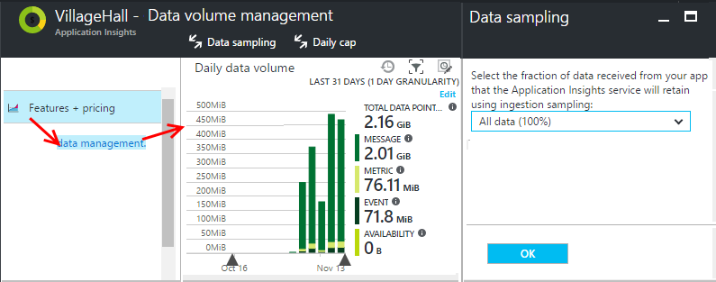

# Sampling in Application Insights

Sampling is a feature in [Azure Application Insights](../../azure-monitor/app/app-insights-overview.md). It is the recommended way to reduce telemetry traffic and storage, while preserving  a statistically correct analysis of application data. The filter selects items that are related, so that you can navigate between items when you are doing diagnostic investigations.
When metric counts are presented in the portal, they are renormalized to take into account sampling. Doing so minimizes any effect on the statistics.

Sampling reduces traffic and data costs, and helps you avoid throttling.

## In brief:

* Sampling retains 1 in *n* records and discards the rest. For example, it might retain one in five events, a sampling rate of 20%. 
* Adaptive Sampling is enabled by default in all the latest version of ASP.NET and ASP.NET Core Software Development Kits (SDKs).
* You can also set sampling manually. This can be configured in the portal on the *Usage and estimated costs page*,  in the ASP.NET SDK in the ApplicationInsights.config file, in the ASP.NET Core SDK via code or in the Java SDK in the ApplicationInsights.xml file.
* If you log custom events and need to ensure that a set of events is retained or discarded together, the events must have the same OperationId value.
* The sampling divisor *n* is reported in each record in the property `itemCount`, which in Search appears under the friendly name "request count" or "event count". `itemCount==1`when sampling is not in operation.
* If you write Analytics queries, you should [take account of sampling](../../azure-monitor/log-query/aggregations.md). In particular, instead of simply counting records, you should use `summarize sum(itemCount)`.

## Types of sampling

There are three alternative sampling methods:

* **Adaptive sampling** automatically adjusts the volume of telemetry sent from the SDK in your ASP.NET/ASP.NET Core app. This is the default sampling from ASP.NET Web SDK v 2.0.0-beta3 onwards and Microsoft.ApplicationInsights.AspNetCore SDK v 2.2.0-beta1 onwards.  Adaptive sampling is currently only available for ASP.NET server-side telemetry.

* **Fixed-rate sampling** reduces the volume of telemetry sent from both your ASP.NET or ASP.NET Core or Java server and from your users' browsers. You set the rate. The client and server will synchronize their sampling so that, in Search, you can navigate between related page views and requests.

* **Ingestion sampling**
Works in the Azure portal. It discards some of the telemetry that arrives from your app, at a sampling rate that you set. It doesn't reduce telemetry traffic sent from your app, but helps you keep within your monthly quota. The main advantage of ingestion sampling is that you can set the sampling rate without redeploying your app. Ingestion sampling works uniformly for all servers and clients.

If Adaptive or Fixed rate sampling are in operation, Ingestion sampling is disabled.


## Adaptive sampling in your ASP.NET/ASP.NET Core Web Applications

Adaptive sampling is available for the Application Insights SDK for ASP.NET v 2.0.0-beta3 and later, Microsoft.ApplicationInsights.AspNetCore SDK v 2.2.0-beta1 and later, and is enabled by default.

Adaptive sampling affects the volume of telemetry sent from your web server app to the Application Insights service endpoint. The volume is adjusted automatically to keep within a specified maximum rate of traffic, and is controlled via the setting `MaxTelemetryItemsPerSecond`. If the application produces a low amount of telemetry, such as when debugging or due to low usage, items won't be dropped by the sampling processor as long as volume is below `MaxTelemetryItemsPerSecond`. As the volume of telemetry increases, sampling rate is adjusted so as to achieve the target volume.

To achieve the target volume, some of the generated telemetry is discarded. But like other types of sampling, the algorithm retains related telemetry items. For example, when you're inspecting the telemetry in Search, you'll be able to find the request related to a particular exception.

Metric counts such as request rate and exception rate are adjusted to compensate for the sampling rate, so that they show approximately correct values in Metric Explorer.

## Configuring adaptive sampling for ASP.NET Applications

[Learn](../../azure-monitor/app/sampling.md#configuring-adaptive-sampling-for-aspnet-core-applications) about configuring adaptive sampling for ASP.NET Core Applications. 

In [ApplicationInsights.config](../../azure-monitor/app/configuration-with-applicationinsights-config.md), you can adjust several parameters in the `AdaptiveSamplingTelemetryProcessor` node. The figures shown are the default values:

* `<MaxTelemetryItemsPerSecond>5</MaxTelemetryItemsPerSecond>`
  
    The target rate that the adaptive algorithm aims for **on each server host**. If your web app runs on many hosts, reduce this value so as to remain within your target rate of traffic at the Application Insights portal.
* `<EvaluationInterval>00:00:15</EvaluationInterval>` 
  
    The interval at which the current rate of telemetry is reevaluated. Evaluation is performed as a moving average. You might want to shorten this interval if your telemetry is liable to sudden bursts.
* `<SamplingPercentageDecreaseTimeout>00:02:00</SamplingPercentageDecreaseTimeout>`
  
    When sampling percentage value changes, how soon after are we allowed to lower sampling percentage again to capture less data.
* `<SamplingPercentageIncreaseTimeout>00:15:00</SamplingPercentageIncreaseTimeout>`
  
    When sampling percentage value changes, how soon after are we allowed to increase sampling percentage again to capture more data.
* `<MinSamplingPercentage>0.1</MinSamplingPercentage>`
  
    As sampling percentage varies, what is the minimum value we're allowed to set.
* `<MaxSamplingPercentage>100.0</MaxSamplingPercentage>`
  
    As sampling percentage varies, what is the maximum value we're allowed to set.
* `<MovingAverageRatio>0.25</MovingAverageRatio>` 
  
    In the calculation of the moving average, the weight assigned to the most recent value. Use a value equal to or less than 1. Smaller values make the algorithm less reactive to sudden changes.
* `<InitialSamplingPercentage>100</InitialSamplingPercentage>`
  
    The value assigned when the app has just started. Don't reduce value while you're debugging.

* `<ExcludedTypes>Trace;Exception</ExcludedTypes>`
  
    A semi-colon delimited list of types that you do not want to be sampled. Recognized types are: Dependency, Event, Exception, PageView, Request, Trace. All instances of the specified types are transmitted; the types that are not specified are sampled.

* `<IncludedTypes>Request;Dependency</IncludedTypes>`
  
    A semi-colon delimited list of types that you want to be sampled. Recognized types are: Dependency, Event, Exception, PageView, Request, Trace. The specified types are sampled; all instances of the other types will always be transmitted.


**To switch off** adaptive sampling, remove the AdaptiveSamplingTelemetryProcessor node(s) from applicationinsights-config.

### Alternative: configure adaptive sampling in code

Instead of setting the sampling parameter in the .config file, you can programmatically set these values.

1. Remove all the `AdaptiveSamplingTelemetryProcessor` node(s) from the .config file.
2. Use the following snippet to configure Adaptive Sampling.

*C#*

```csharp

    using Microsoft.ApplicationInsights;
    using Microsoft.ApplicationInsights.Extensibility;
    using Microsoft.ApplicationInsights.WindowsServer.Channel.Implementation;
    using Microsoft.ApplicationInsights.WindowsServer.TelemetryChannel;
    ...

    var builder = TelemetryConfiguration.Active.TelemetryProcessorChainBuilder;
    // If you are on ApplicationInsights SDK v 2.8.0-beta2 or higher, use the following line instead
    // var builder = TelemetryConfiguration.Active.DefaultTelemetrySink.TelemetryProcessorChainBuilder;

    // Enable AdaptiveSampling so as to keep overall telemetry volume to 5 items per second.
    builder.UseAdaptiveSampling(maxTelemetryItemsPerSecond:5);

    // If you have other telemetry processors:
    builder.Use((next) => new AnotherProcessor(next));

    builder.Build();

```

([Learn about telemetry processors](../../azure-monitor/app/api-filtering-sampling.md#filtering).)

You can also adjust the sampling rate for each Telemetry type individually, or can even exclude certain types from being sampled at all. 

*C#*

```csharp
    // The following configures adaptive sampling with 5 items per second, and also excludes DependencyTelemetry from being subject to sampling.
    builder.UseAdaptiveSampling(maxTelemetryItemsPerSecond:5, excludedTypes: "Dependency");
```

## Configuring adaptive sampling for ASP.NET Core Applications.

There is no `ApplicationInsights.Config` for ASP.NET Core Applications, so every configuration is done via code.
Adaptive sampling is enabled by default for all ASP.NET Core applications. You can disable or customize the sampling behavior.

### Turning off Adaptive Sampling

The default sampling feature can be disabled while adding Application Insights service, in the method ```ConfigureServices```, using ```ApplicationInsightsServiceOptions``` within the `Startup.cs` file:

```csharp
public void ConfigureServices(IServiceCollection services)
{
    // ...

    var aiOptions = new Microsoft.ApplicationInsights.AspNetCore.Extensions.ApplicationInsightsServiceOptions();
    aiOptions.EnableAdaptiveSampling = false;
    services.AddApplicationInsightsTelemetry(aiOptions);
    //...
}
```

The above code will disable sampling feature. Follow the steps below to add sampling with more customization options.

### Configure Sampling settings

Use extension methods of ```TelemetryProcessorChainBuilder``` as shown below to customize sampling behavior.

> [!IMPORTANT]
> If you use this method to configure sampling, please make sure to use aiOptions.EnableAdaptiveSampling = false; settings with AddApplicationInsightsTelemetry().

```csharp
public void Configure(IApplicationBuilder app, IHostingEnvironment env, TelemetryConfiguration configuration)
{
    var builder = configuration.TelemetryProcessorChainBuilder;
    // version 2.5.0-beta2 and above should use the following line instead of above. (https://github.com/Microsoft/ApplicationInsights-aspnetcore/blob/develop/CHANGELOG.md#version-250-beta2)
    // var builder = configuration.DefaultTelemetrySink.TelemetryProcessorChainBuilder;

    // Using adaptive sampling
    builder.UseAdaptiveSampling(maxTelemetryItemsPerSecond:5);

    // Alternately, the following configures adaptive sampling with 5 items per second, and also excludes DependencyTelemetry from being subject to sampling.
    // builder.UseAdaptiveSampling(maxTelemetryItemsPerSecond:5, excludedTypes: "Dependency");

    builder.Build();

    // If you have other telemetry processors:
    builder.Use((next) => new AnotherProcessor(next));
    // ...
}

```

**If using the above method to configure sampling, make sure to use ```aiOptions.EnableAdaptiveSampling = false;``` settings with AddApplicationInsightsTelemetry().**

## Fixed-rate sampling for ASP.NET, ASP.NET Core, and Java websites

Fixed rate sampling reduces the traffic sent from your web server and web browsers. Unlike adaptive sampling, it reduces telemetry at a fixed rate decided by you. It also synchronizes the client and server sampling so that related items are retained - for example, when  you look at a page view in Search, you can find its related request.

Like other sampling techniques, this also retains related items. For each HTTP request event, the request and its related events are either discarded or transmitted together.

In Metrics Explorer, rates such as request and exception counts are multiplied by a factor to compensate for the sampling rate, so that they are approximately correct.

### Configuring fixed-rate sampling in ASP.NET

1. **Disable adaptive sampling**: In [ApplicationInsights.config](../../azure-monitor/app/configuration-with-applicationinsights-config.md), remove or comment out the `AdaptiveSamplingTelemetryProcessor` node.

    ```xml

    <TelemetryProcessors>

    <!-- Disabled adaptive sampling:
      <Add Type="Microsoft.ApplicationInsights.WindowsServer.TelemetryChannel.AdaptiveSamplingTelemetryProcessor, Microsoft.AI.ServerTelemetryChannel">
        <MaxTelemetryItemsPerSecond>5</MaxTelemetryItemsPerSecond>
      </Add>
    -->
    ```

2. **Enable the fixed-rate sampling module.** Add this snippet to [ApplicationInsights.config](../../azure-monitor/app/configuration-with-applicationinsights-config.md):
   
    ```XML
   
    <TelemetryProcessors>
     <Add  Type="Microsoft.ApplicationInsights.WindowsServer.TelemetryChannel.SamplingTelemetryProcessor, Microsoft.AI.ServerTelemetryChannel">
   
      <!-- Set a percentage close to 100/N where N is an integer. -->
     <!-- E.g. 50 (=100/2), 33.33 (=100/3), 25 (=100/4), 20, 1 (=100/100), 0.1 (=100/1000) -->
      <SamplingPercentage>10</SamplingPercentage>
      </Add>
    </TelemetryProcessors>
   
    ```
   ### Alternative: enable fixed-rate sampling in your server code
	
	Instead of setting the sampling parameter in the .config file, you can programmatically set these values. 

*C#*

```csharp

    using Microsoft.ApplicationInsights.Extensibility;
    using Microsoft.ApplicationInsights.WindowsServer.TelemetryChannel;
    ...

    var builder = TelemetryConfiguration.Active.TelemetryProcessorChainBuilder;
    // If you are on ApplicationInsights SDK v 2.8.0-beta2 or higher, use the following line instead
    // var builder = TelemetryConfiguration.Active.DefaultTelemetrySink.TelemetryProcessorChainBuilder;

    builder.UseSampling(10.0); // percentage

    // If you have other telemetry processors:
    builder.Use((next) => new AnotherProcessor(next));

    builder.Build();

```
([Learn about telemetry processors](../../azure-monitor/app/api-filtering-sampling.md#filtering).)

### Configuring fixed-rate sampling in ASP.NET Core

1. **Disable adaptive sampling**:  Changes can be made in the method ```ConfigureServices```, using ```ApplicationInsightsServiceOptions```:

    ```csharp
    public void ConfigureServices(IServiceCollection services)
    {
    // ...

        var aiOptions = new Microsoft.ApplicationInsights.AspNetCore.Extensions.ApplicationInsightsServiceOptions();
        aiOptions.EnableAdaptiveSampling = false;
        services.AddApplicationInsightsTelemetry(aiOptions);
    //...
    }
    ```

2. **Enable the fixed-rate sampling module.** Changes can be made in the method ```Configure``` as shown in below snippet:

    ```csharp
    public void Configure(IApplicationBuilder app, IHostingEnvironment env)
    {
        var configuration = app.ApplicationServices.GetService<TelemetryConfiguration>();

        var builder = configuration.TelemetryProcessorChainBuilder;
        // version 2.5.0-beta2 and above should use the following line instead of above. (https://github.com/Microsoft/ApplicationInsights-aspnetcore/blob/develop/CHANGELOG.md#version-250-beta2)
        // var builder = configuration.DefaultTelemetrySink.TelemetryProcessorChainBuilder;

        // Using fixed rate sampling   
        double fixedSamplingPercentage = 10;
        builder.UseSampling(fixedSamplingPercentage);

        builder.Build();

        // ...
    }

    ```

### Configuring fixed-rate sampling in JAVA ###

1. Download and configure your web application with latest [application insights java SDK](../../azure-monitor/app/java-get-started.md)

2. **Enable the fixed-rate sampling module** by adding the following snippet to ApplicationInsights.xml file.

    ```XML
        <TelemetryProcessors>
            <BuiltInProcessors>
                <Processor type = "FixedRateSamplingTelemetryProcessor">
                    <!-- Set a percentage close to 100/N where N is an integer. -->
                    <!-- E.g. 50 (=100/2), 33.33 (=100/3), 25 (=100/4), 20, 1 (=100/100), 0.1 (=100/1000) -->
                    <Add name = "SamplingPercentage" value = "50" />
                </Processor>
            </BuiltInProcessors>
        </TelemetryProcessors>
    ```

3. You can Include or Exclude specific types of telemetry from Sampling using the following tags inside the Processor tag "FixedRateSamplingTelemetryProcessor"
    ```XML
        <ExcludedTypes>
            <ExcludedType>Request</ExcludedType>
        </ExcludedTypes>

        <IncludedTypes>
            <IncludedType>Exception</IncludedType>
        </IncludedTypes>
    ```

The telemetry types that can be included or excluded from sampling are: Dependency, Event, Exception, PageView, Request, and Trace.

> [!NOTE]
> For the sampling percentage, choose a percentage that is close to 100/N where N is an integer.  Currently sampling doesn't support other values.
> 
> 

<a name="other-web-pages"></a>


## Ingestion sampling

This form of sampling operates at the point where the telemetry from your web server, browsers, and devices reaches the Application Insights service endpoint. Although it doesn't reduce the telemetry traffic sent from your app, it does reduce the amount processed and retained (and charged for) by Application Insights.

Use this type of sampling if your app often goes over its monthly quota and you don't have the option of using either of the SDK-based types of sampling. 

Set the sampling rate in the Usage and estimated costs page:



Like other types of sampling, the algorithm retains related telemetry items. For example, when you're inspecting the telemetry in Search, you'll be able to find the request related to a particular exception. Metric counts such as request rate and exception rate are correctly retained.

Data points that are discarded by sampling are not available in any Application Insights feature such as [Continuous Export](../../azure-monitor/app/export-telemetry.md).

Ingestion sampling doesn't operate while SDK-based adaptive or fixed-rate sampling is in operation. Adaptive sampling is enabled by default when ASP.NET/ASP.NET Core SDK is enabled in Visual Studio or enabled in Azure Web App extensions or by using Status Monitor, and ingestion sampling is disabled. If the sampling rate at the SDK is less than 100% (i.e items are being sampled)  then the ingestion sampling rate that you set is ignored.

> [!WARNING]
> The value shown on the tile indicates the value that you set for ingestion sampling. It doesn't represent the actual sampling rate if SDK sampling is in operation.
>
>
## Sampling for web pages with JavaScript
You can configure web pages for fixed-rate sampling from any server. 

When you [configure the web pages for Application Insights](../../azure-monitor/app/javascript.md), modify the JavaScript snippet that you get from the Application Insights portal. (In ASP.NET apps, the snippet typically goes in _Layout.cshtml.)  Insert a line like `samplingPercentage: 10,` before the instrumentation key:

    <script>
    var appInsights= ... 
    }({ 


    // Value must be 100/N where N is an integer.
    // Valid examples: 50, 25, 20, 10, 5, 1, 0.1, ...
    samplingPercentage: 10, 

    instrumentationKey:...
    }); 

    window.appInsights=appInsights; 
    appInsights.trackPageView(); 
    </script> 

For the sampling percentage, choose a percentage that is close to 100/N where N is an integer.  Currently sampling doesn't support other values.

If you also enable fixed-rate sampling at the server, the clients and server will synchronize so that, in Search, you can  navigate between related page views and requests.

## When to use sampling?

Adaptive sampling is automatically enabled in latest .NET and .NET Core SDKs. Regardless of which version of the SDK you use, you can enable ingestion sampling to allow Application Insights to sample the collected data.

By default no sampling is enabled in Java SDK. Currently, it only supports Fixed Rate Sampling. Adaptive Sampling is not supported in Java SDK.

In general, for most small and medium size applications you don’t need sampling. The most useful diagnostic information and most accurate statistics are obtained by collecting data on all your user activities. 

The main advantages of sampling are:

* Application Insights service drops ("throttles") data points when your app sends a very high rate of telemetry in short time interval. 
* To keep within the [quota](../../azure-monitor/app/pricing.md) of data points for your pricing tier. 
* To reduce network traffic from the collection of telemetry. 

### Which type of sampling should I use?

**Use ingestion sampling if:**

* You often go through your monthly quota of telemetry.
* You're using a version of the SDK that doesn't support sampling - for example ASP.NET versions earlier than 2.
* You're getting too much telemetry from your users' web browsers.

**Use fixed-rate sampling if:**

* You're using the Application Insights SDK for ASP.NET web services version 2.0.0 or later or Java SDK v2.0.1 or later, and
* You want synchronized sampling between client and server, so that, when you're investigating events in [Search](../../azure-monitor/app/diagnostic-search.md), you can navigate between related events on the client and server, such as page views and http requests.
* You are confident of the appropriate sampling percentage for your app. It should be high enough to get accurate metrics, but below the rate that exceeds your pricing quota and the throttling limits. 

**Use adaptive sampling:**

If the conditions to use the other forms of sampling do not apply, we recommend adaptive sampling. This setting is enabled by default in the ASP.NET/ASP.NET Core server SDK. It will not reduce traffic until a certain minimum rate is reached, therefore, low-use sites will not be affected.

## How do I know whether sampling is in operation?

To discover the actual sampling rate no matter where it has been applied, use an [Analytics query](../../azure-monitor/app/analytics.md) such as this:

```
union requests,dependencies,pageViews,browserTimings,exceptions,traces
| where timestamp > ago(1d)
| summarize RetainedPercentage = 100/avg(itemCount) by bin(timestamp, 1h), itemType
```

If RetainedPercentage for any type is less than 100, then that item is being sampled.

**Application Insights does not sample session, metrics and performance counters telemetry types in any sampling techniques described above. These types are always excluded from sampling as reduction in precision can be highly undesirable for these telemetry types**

## How does sampling work?

Fixed-rate sampling feature of the SDK in ASP.NET versions from 2.0.0 and Java SDK version 2.0.1 and onwards. Adaptive sampling is a feature of SDK in ASP.NET versions from 2.0.0 onwards. Ingestion sampling is a feature of the Application Insights service, and can be in operation if the SDK is not performing sampling.

The sampling algorithm decides which telemetry items to drop, and which ones to keep (whether it's in the SDK or in the Application Insights service). The sampling decision is based on several rules that aim to preserve all interrelated data points intact, maintaining a diagnostic experience in Application Insights that is actionable and reliable even with a reduced data set. For example, if for a failed request your app sends additional telemetry items (such as exception and traces logged from this request), sampling will not split this request and other telemetry. It either keeps or drops them all together. As a result, when you look at the request details in Application Insights, you can always see the request along with its associated telemetry items. 

The sampling decision is based on the operation ID of the request, which means that all telemetry items belonging to a particular operation is either preserved or dropped. For the telemetry items that do not have operation ID set (for example telemetry items reported from asynchronous threads with no http context) sampling simply captures a percentage of telemetry items of each type. 
Prior to 2.5.0-beta2 of .NET SDK, and 2.2.0-beta3 of ASP.NET Core SDK, the sampling decision was based on the hash of the user ID for applications that define "user" (that is, most typical web applications). For the types of applications that didn't define users (such as web services) the sampling decision was based on the operation ID of the request.

When presenting telemetry back to you, the Application Insights service adjusts the metrics by the same sampling percentage that was used at the time of collection, to compensate for the missing data points. Hence, when looking at the telemetry in Application Insights, the users are seeing statistically correct approximations that are very close to the real numbers.

The accuracy of the approximation largely depends on the configured sampling percentage. Also, the accuracy increases for applications that handle a large volume of generally similar requests from lots of users. On the other hand, for applications that don't work with a significant load, sampling is not needed as these applications can usually send all their telemetry while staying within the quota, without causing data loss from throttling. 

> [!WARNING]
> Application Insights does not sample metrics and sessions telemetry types. Reduction in the precision can be highly undesirable for these telemetry types.
> 

### Adaptive sampling

Adaptive sampling adds a component that monitors the current rate of transmission from the SDK, and adjusts the sampling percentage to try to stay within the target maximum rate. The adjustment is recalculated at regular intervals, and is based on a moving average of the outgoing transmission rate.

## Sampling and the JavaScript SDK

The client-side (JavaScript) SDK participates in fixed-rate sampling in conjunction with the server-side SDK. The instrumented pages will only send client-side telemetry from the same users for which the server-side made its decision to "sample in." This logic is designed to maintain integrity of user session across client- and server-sides. As a result, from any particular telemetry item in Application Insights you can find all other telemetry items for this user or session. 

*My client and server-side telemetry don't show coordinated samples as you describe above.*

* Verify that you enabled fixed-rate sampling both on server and client.
* Make sure that the SDK version is 2.0 or above.
* Check that you set the same sampling percentage in both the client and server.

## Frequently Asked Questions

*What is the default sampling behavior in ASP.NET and ASP.NET Core SDK?*

* If you are using one of the latest versions of the above SDK, Adaptive Sampling is enabled by default with five telemetry items per second.
  There are 2 AdaptiveSamplingTelemetryProcessors added by default, and one includes Event type in sampling, and the other excludes
  Event type from sampling. This configuration means that the SDK will try to limit telemetry items to five telemetry items of Event types, and five telemetry items of all other types combined, thereby ensuring that Events are sampled separately from other Telemetry types. Events are typically used for
  business telemetry, and most likely should not be affected by diagnostic telemetry volumes.
  
  The following shows the default ApplicationInsights.Config file generated. As described, there are two separate AdaptiveSamplingTelemetryProcessor nodes added, one excluding Event types, and another including it. In ASP.NET Core, exact same default behavior is enabled in code. Use the examples in the earlier section of the document to change this default behavior.

    ```xml
    <TelemetryProcessors>
        <Add Type="Microsoft.ApplicationInsights.WindowsServer.TelemetryChannel.AdaptiveSamplingTelemetryProcessor, Microsoft.AI.ServerTelemetryChannel">
            <MaxTelemetryItemsPerSecond>5</MaxTelemetryItemsPerSecond>
            <ExcludedTypes>Event</ExcludedTypes>
        </Add>
        <Add Type="Microsoft.ApplicationInsights.WindowsServer.TelemetryChannel.AdaptiveSamplingTelemetryProcessor, Microsoft.AI.ServerTelemetryChannel">
            <MaxTelemetryItemsPerSecond>5</MaxTelemetryItemsPerSecond>
            <IncludedTypes>Event</IncludedTypes>
        </Add>
    </TelemetryProcessors>
    ```

*Can telemetry be sampled more than once?*

* No. SamplingTelemetryProcessors ignore items from sampling considerations if the item is already sampled. The same is true for Ingestion sampling as well, which won't
apply sampling to those items already sampled in the SDK itself.'

*Why isn't sampling a simple "collect X percent of each telemetry type"?*

* While this sampling approach would provide with a high level of precision in metric approximations, it would break ability to correlate diagnostic data per user, session, and request, which is critical for diagnostics. Therefore, sampling works better with "collect all telemetry items for X percent of app users", or "collect all telemetry for X percent of app requests" logic. For the telemetry items not associated with the requests (such as background asynchronous processing), the fallback is to "collect X percent of all items for each telemetry type." 

*Can the sampling percentage change over time?*

* Yes, adaptive sampling gradually changes the sampling percentage, based on the currently observed volume of the telemetry.

*If I use fixed-rate sampling, how do I know which sampling percentage will work the best for my app?*

* One way is to start with adaptive sampling, find out what rate it settles on (see the above question), and then switch to fixed-rate sampling using that rate. 
  
    Otherwise, you have to guess. Analyze your current telemetry usage in Application Insights, observe any throttling that is occurring, and estimate the volume of the collected telemetry. These three inputs, together with your selected pricing tier, suggest how much you might want to reduce the volume of the collected telemetry. However, an increase in the number of your users or some other shift in the volume of telemetry might invalidate your estimate.

*What happens if I configure sampling percentage too low?*

* Excessively low sampling percentage (over-aggressive sampling) reduces the accuracy of the approximations, when Application Insights attempts to compensate the visualization of the data for the data volume reduction. Also, diagnostic experience might be negatively impacted, as some of the infrequently failing or slow requests may be sampled out.

*What happens if I configure sampling percentage too high?*

* Configuring too high sampling percentage (not aggressive enough) results in an insufficient reduction in the volume of the collected telemetry. You may still experience telemetry data loss related to throttling, and the cost of using Application Insights might be higher than you planned due to overage charges.

*On what platforms can I use sampling?*

* Ingestion sampling can occur automatically for any telemetry above a certain volume, if the SDK is not performing sampling. This configuration would work, for example, if you are using an older version of the ASP.NET SDK or previous version of Java SDK(1.0.10 or before).
* If you're using ASP.NET SDK versions 2.0.0 and above or ASP.NET CORE SDK version 2.2.0 and above (hosted either in Azure or on your own server), you get adaptive sampling by default, but you can switch to fixed-rate as described above. With fixed-rate sampling, the browser SDK automatically synchronizes to sample related events. 
* If you're using Java SDK version 2.0.1 or above, you can configure ApplicationInsights.xml to turn on Fixed Rate Sampling. Sampling is turned off by default. With fixed-rate sampling, the browser SDK automatically synchronizes to sample related events.

*There are certain rare events I always want to see. How can I get them past the sampling module?*

* The best way to achieve this is to write a custom [TelemetryProcessor](../../azure-monitor/app/api-filtering-sampling.md#filtering), which sets the `SamplingPercentage` to 100 on the telemetry item you want retained, as shown below. This ensures that all sampling techniques will ignore this item from any sampling considerations.

```csharp
    if(somecondition)
    {
        ((ISupportSampling)item).SamplingPercentage = 100;
    }
```

## Next steps

* [Filtering](../../azure-monitor/app/api-filtering-sampling.md) can provide more strict control of what your SDK sends.
* Read the Developer Network article [Optimize Telemetry with Application Insights](https://msdn.microsoft.com/magazine/mt808502.aspx).
