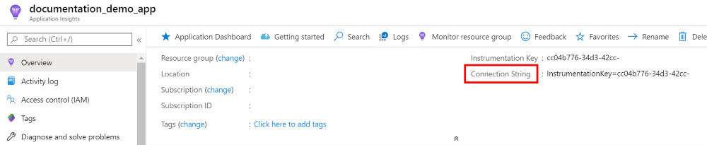

# Connection strings

## Overview

Connection strings provide Application Insight users with a single configuration setting, eliminating the need for multiple proxy settings. Highly useful for intranet web servers, sovereign or hybrid cloud environments looking to send in data to the monitoring service.

The key value pairs provide an easy way for users to define a prefix suffix combination for each Application Insights (AI) service/ product.

> [!IMPORTANT]
> We don't recommend setting both Connection String and Instrumentation key. In the event that a user does set both, whichever was set last will take precedence. 


## Scenario overview 

Customer scenarios where we visualize this having the most impact:

- Firewall exceptions or proxy redirects 

    In cases where monitoring for intranet web server is required, our earlier solution asked customers to add individual service endpoints to your configuration. For more information, see [here](https://docs.microsoft.com/azure/azure-monitor/app/troubleshoot-faq#can-i-monitor-an-intranet-web-server). 
    Connection strings offer a better alternative by reducing this effort to a single setting. A simple prefix, suffix amendment allows automatic population and redirection of all endpoints to the right services. 

- Sovereign or Hybrid cloud environments

    Users can send data to a defined [Azure Government Region](https://docs.microsoft.com/azure/azure-government/documentation-government-services-monitoringandmanagement#application-insights).
    Connection strings allow you to define endpoint settings for your intranet servers or hybrid cloud settings. 

## Getting started

### Finding my connection string?

Your connection string is displayed on the Overview blade of your Application Insights resource.



### Schema

#### Max length

The connection has a maximum supported length of 4096 characters.

#### Key-value pairs

Connection string consists of a list of settings represented as key-value pairs separated by semicolon:
`key1=value1;key2=value2;key3=value3`

#### Syntax

- `InstrumentationKey` (ex: 00000000-0000-0000-0000-000000000000)
   The connection string is a **required** field.
- `Authorization` (ex: ikey) (This setting is optional because today we only support ikey authorization.)
- `EndpointSuffix` (ex: applicationinsights.azure.cn)
   Setting the endpoint suffix will instruct the SDK which Azure cloud to connect to. The SDK will assemble the rest of the endpoint for individual services.
- Explicit Endpoints.
  Any service can be explicitly overridden in the connection string.
   - `IngestionEndpoint` (ex: `https://dc.applicationinsights.azure.com`)
   - `LiveEndpoint` (ex: `https://live.applicationinsights.azure.com`)
   - `ProfilerEndpoint` (ex: `https://profiler.applicationinsights.azure.com`)
   - `SnapshotEndpoint` (ex: `https://snapshot.applicationinsights.azure.com`)

#### Endpoint schema

`<prefix>.<suffix>`
- Prefix: Defines a service. 
- Suffix: Defines the common domain name.

##### Valid suffixes

Here's a list of valid suffixes 
- applicationinsights.azure.cn
- applicationinsights.us


See also: https://docs.microsoft.com/azure/azure-monitor/app/custom-endpoints#regions-that-require-endpoint-modification


##### Valid prefixes

- [Telemetry Ingestion](./app-insights-overview.md): `dc`
- [Live Metrics](./live-stream.md): `live`
- [Profiler](./profiler-overview.md): `profiler`
- [Snapshot](./snapshot-debugger.md): `snapshot`


## Connection string examples


### Minimal valid connection string

`InstrumentationKey=00000000-0000-0000-0000-000000000000;`

In this example, only the Instrumentation Key has been set.

- Authorization scheme defaults to "ikey" 
- Instrumentation Key: 00000000-0000-0000-0000-000000000000
- The regional service URIs are based on the [SDK defaults](https://github.com/microsoft/ApplicationInsights-dotnet/blob/e50d569cebf485e72e98f4a08a0bc0e30cdf42bc/BASE/src/Microsoft.ApplicationInsights/Extensibility/Implementation/Endpoints/Constants.cs#L6) and will connect to the public global Azure:
   - Ingestion: `https://dc.services.visualstudio.com/`
   - Live metrics: `https://rt.services.visualstudio.com/`
   - Profiler: `https://agent.azureserviceprofiler.net/`
   - Debugger: `https://agent.azureserviceprofiler.net/`


### Connection string with endpoint suffix

`InstrumentationKey=00000000-0000-0000-0000-000000000000;EndpointSuffix=ai.contoso.com;`

In this example, this connection string specifies the endpoint suffix and the SDK will construct service endpoints.

- Authorization scheme defaults to "ikey" 
- Instrumentation Key: 00000000-0000-0000-0000-000000000000
- The regional service URIs are based on provided endpoint suffix: 
   - Ingestion: `https://dc.ai.contoso.com`
   - Live metrics: `https://live.ai.contoso.com`
   - Profiler: `https://profiler.ai.contoso.com`
   - Debugger: `https://snapshot.ai.contoso.com`  


### Connection string with explicit endpoint overrides 

`InstrumentationKey=00000000-0000-0000-0000-000000000000;IngestionEndpoint=https://custom.com:111/;LiveEndpoint=https://custom.com:222/;ProfilerEndpoint=https://custom.com:333/;SnapshotEndpoint=https://custom.com:444/;`

In this example, this connection string specifies explicit overrides for every service. The SDK will use the exact endpoints provided without modification.

- Authorization scheme defaults to "ikey" 
- Instrumentation Key: 00000000-0000-0000-0000-000000000000
- The regional service URIs are based on the explicit override values: 
   - Ingestion: `https://custom.com:111/`
   - Live metrics: `https://custom.com:222/`
   - Profiler: `https://custom.com:333/`
   - Debugger: `https://custom.com:444/`  


## How to set a connection string

Connection Strings are supported in the following SDK versions:
- .NET and .NET Core v2.12.0
- Java v2.5.1 and Java 3.0
- JavaScript v2.3.0
- NodeJS v1.5.0
- Python v1.0.0

A connection string can be set by either in code, environment variable, or configuration file.


### Environment variable

- Connection String: `APPLICATIONINSIGHTS_CONNECTION_STRING`

# [.NET/.NetCore](#tab/net)

TelemetryConfiguration.ConnectionString: https://github.com/microsoft/ApplicationInsights-dotnet/blob/add45ceed35a817dc7202ec07d3df1672d1f610d/BASE/src/Microsoft.ApplicationInsights/Extensibility/TelemetryConfiguration.cs#L271-L274

.NET Explicitly Set:
```csharp
var configuration = new TelemetryConfiguration
{
    ConnectionString = "InstrumentationKey=00000000-0000-0000-0000-000000000000;"
};
```

.NET Config File:

```xml
<?xml version="1.0" encoding="utf-8"?>
<ApplicationInsights xmlns="http://schemas.microsoft.com/ApplicationInsights/2013/Settings">
    <ConnectionString>InstrumentationKey=00000000-0000-0000-0000-000000000000</ConnectionString>
</ApplicationInsights>
```

NetCore Explicitly Set:
```csharp
public void ConfigureServices(IServiceCollection services)
{
    var options = new ApplicationInsightsServiceOptions { ConnectionString = "InstrumentationKey=00000000-0000-0000-0000-000000000000;" };
    services.AddApplicationInsightsTelemetry(options: options);
}
```

NetCore config.json: 

```json
{
  "ApplicationInsights": {
    "ConnectionString" : "InstrumentationKey=00000000-0000-0000-0000-000000000000;"
    }
  }
```


# [Java](#tab/java)


Java (v2.5.x) Explicitly Set:
```java
TelemetryConfiguration.getActive().setConnectionString("InstrumentationKey=00000000-0000-0000-0000-000000000000");
```

ApplicationInsights.xml
```xml
<?xml version="1.0" encoding="utf-8"?>
<ApplicationInsights xmlns="http://schemas.microsoft.com/ApplicationInsights/2013/Settings">
    <ConnectionString>InstrumentationKey=00000000-0000-0000-0000-000000000000;</ConnectionString>
</ApplicationInsights>
```

# [JavaScript](#tab/js)

Important: JavaScript doesn't support the use of Environment Variables.

Using the snippet:

```javascript
<script type="text/javascript">
var sdkInstance="appInsightsSDK";window[sdkInstance]="appInsights";var aiName=window[sdkInstance],aisdk=window[aiName]||function(e){function n(e){t[e]=function(){var n=arguments;t.queue.push(function(){t[e].apply(t,n)})}}var t={config:e};t.initialize=!0;var i=document,a=window;setTimeout(function(){var n=i.createElement("script");n.src=e.url||"https://az416426.vo.msecnd.net/scripts/b/ai.2.min.js",i.getElementsByTagName("script")[0].parentNode.appendChild(n)});try{t.cookie=i.cookie}catch(e){}t.queue=[],t.version=2;for(var r=["Event","PageView","Exception","Trace","DependencyData","Metric","PageViewPerformance"];r.length;)n("track"+r.pop());n("startTrackPage"),n("stopTrackPage");var s="Track"+r[0];if(n("start"+s),n("stop"+s),n("addTelemetryInitializer"),n("setAuthenticatedUserContext"),n("clearAuthenticatedUserContext"),n("flush"),t.SeverityLevel={Verbose:0,Information:1,Warning:2,Error:3,Critical:4},!(!0===e.disableExceptionTracking||e.extensionConfig&&e.extensionConfig.ApplicationInsightsAnalytics&&!0===e.extensionConfig.ApplicationInsightsAnalytics.disableExceptionTracking)){n("_"+(r="onerror"));var o=a[r];a[r]=function(e,n,i,a,s){var c=o&&o(e,n,i,a,s);return!0!==c&&t["_"+r]({message:e,url:n,lineNumber:i,columnNumber:a,error:s}),c},e.autoExceptionInstrumented=!0}return t}(
{
  connectionString:"InstrumentationKey=00000000-0000-0000-0000-000000000000;"
}
);window[aiName]=aisdk,aisdk.queue&&0===aisdk.queue.length&&aisdk.trackPageView({});
</script>
```


Manual Setup:
```javascript
import { ApplicationInsights } from '@microsoft/applicationinsights-web'

const appInsights = new ApplicationInsights({ config: {
  connectionString: 'InstrumentationKey=00000000-0000-0000-0000-000000000000;'
  /* ...Other Configuration Options... */
} });
appInsights.loadAppInsights();
appInsights.trackPageView();
```

# [Node.js](#tab/nodejs)

```javascript
const appInsights = require("applicationinsights");
appInsights.setup("InstrumentationKey=00000000-0000-0000-0000-000000000000;");
appInsights.start();
```

# [Python](#tab/python)

We recommend users set the environment variable.

To explicitly set the connection string:

```python
from opencensus.ext.azure.trace_exporter import AzureExporter
from opencensus.trace.samplers import ProbabilitySampler
from opencensus.trace.tracer import Tracer

tracer = Tracer(exporter=AzureExporter(connection_string='InstrumentationKey=00000000-0000-0000-0000-000000000000'), sampler=ProbabilitySampler(1.0))
```


## Next steps

Get started at runtime with:

* [Azure VM and Azure virtual machine scale set IIS-hosted apps](../../azure-monitor/app/azure-vm-vmss-apps.md)
* [IIS server](../../azure-monitor/app/monitor-performance-live-website-now.md)
* [Azure Web Apps](../../azure-monitor/app/azure-web-apps.md)

Get started at development time with:

* [ASP.NET](../../azure-monitor/app/asp-net.md)
* [ASP.NET Core](../../azure-monitor/app/asp-net-core.md)
* [Java](../../azure-monitor/app/java-get-started.md)
* [Node.js](../../azure-monitor/app/nodejs.md)
* [Python](../../azure-monitor/app/opencensus-python.md)
