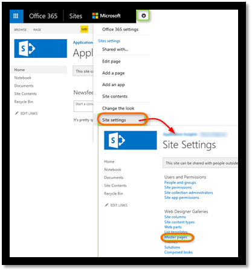
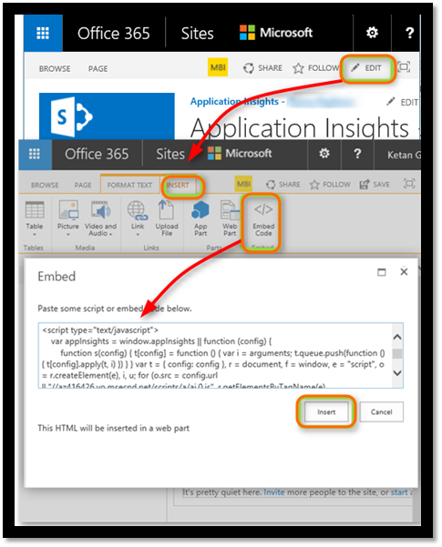
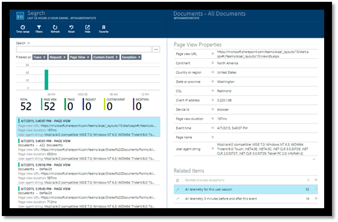
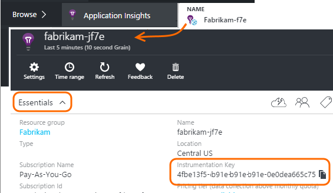

# Monitor a SharePoint site with Application Insights
Azure Application Insights monitors the availability, performance and usage of your apps. Here you'll learn how to set it up for a SharePoint site.

## Create an Application Insights resource
In the [Azure portal](https://portal.azure.com), create a new Application Insights resource. Choose ASP.NET as the application type.


The window that opens is the place where you'll see performance and usage data about your app. To get back to it next time you login to Azure, you should find a tile for it on the start screen. Alternatively click Browse to find it.

## Add the script to your web pages

```HTML
<!-- 
To collect user behavior analytics tools about your application, 
insert the following script into each page you want to track.
Place this code immediately before the closing </head> tag,
and before any other scripts. Your first data will appear 
automatically in just a few seconds.
-->
<script type="text/javascript">
var sdkInstance="appInsightsSDK";window[sdkInstance]="appInsights";var aiName=window[sdkInstance],aisdk=window[aiName]||function(n){var o={config:n,initialize:!0},t=document,e=window,i="script";setTimeout(function(){var e=t.createElement(i);e.src=n.url||"https://az416426.vo.msecnd.net/scripts/b/ai.2.min.js",t.getElementsByTagName(i)[0].parentNode.appendChild(e)});try{o.cookie=t.cookie}catch(e){}function a(n){o[n]=function(){var e=arguments;o.queue.push(function(){o[n].apply(o,e)})}}o.queue=[],o.version=2;for(var s=["Event","PageView","Exception","Trace","DependencyData","Metric","PageViewPerformance"];s.length;)a("track"+s.pop());var r="Track",c=r+"Page";a("start"+c),a("stop"+c);var u=r+"Event";if(a("start"+u),a("stop"+u),a("addTelemetryInitializer"),a("setAuthenticatedUserContext"),a("clearAuthenticatedUserContext"),a("flush"),o.SeverityLevel={Verbose:0,Information:1,Warning:2,Error:3,Critical:4},!(!0===n.disableExceptionTracking||n.extensionConfig&&n.extensionConfig.ApplicationInsightsAnalytics&&!0===n.extensionConfig.ApplicationInsightsAnalytics.disableExceptionTracking)){a("_"+(s="onerror"));var p=e[s];e[s]=function(e,n,t,i,a){var r=p&&p(e,n,t,i,a);return!0!==r&&o["_"+s]({message:e,url:n,lineNumber:t,columnNumber:i,error:a}),r},n.autoExceptionInstrumented=!0}return o}(
{
  instrumentationKey:"INSTRUMENTATION_KEY"
}
);(window[aiName]=aisdk).queue&&0===aisdk.queue.length&&aisdk.trackPageView({});
</script>
```

Insert the script just before the &lt;/head&gt; tag of every page you want to track. If your website has a master page, you can put the script there. For example, in an ASP.NET MVC project, you'd put it in View\Shared\_Layout.cshtml

The script contains the instrumentation key that directs the telemetry to your Application Insights resource.

### Add the code to your site pages
#### On the master page
If you can edit the site's master page, that will provide monitoring for every page in the site.

Check out the master page and edit it using SharePoint Designer or any other editor.



Add the code just before the </head> tag. 


#### Or on individual pages
To monitor a limited set of pages, add the script separately to each page. 

Insert a web part and embed the code snippet in it.



## View data about your app
Redeploy your app.

Return to your application blade in the [Azure portal](https://portal.azure.com).

The first events will appear in Search. 



Click Refresh after a few seconds if you're expecting more data.

## Capturing User Id
The standard web page code snippet doesn't capture the user id from SharePoint, but you can do that with a small modification.

1. Copy your app's instrumentation key from the Essentials drop-down in Application Insights. 

    

1. Substitute the instrumentation key for 'XXXX' in the snippet below. 
2. Embed the script in your SharePoint app instead of the snippet you get from the portal.

```


<SharePoint:ScriptLink ID="ScriptLink1" name="SP.js" runat="server" localizable="false" loadafterui="true" /> 
<SharePoint:ScriptLink ID="ScriptLink2" name="SP.UserProfiles.js" runat="server" localizable="false" loadafterui="true" /> 

<script type="text/javascript"> 
var personProperties; 

// Ensure that the SP.UserProfiles.js file is loaded before the custom code runs. 
SP.SOD.executeOrDelayUntilScriptLoaded(getUserProperties, 'SP.UserProfiles.js'); 

function getUserProperties() { 
    // Get the current client context and PeopleManager instance. 
    var clientContext = new SP.ClientContext.get_current(); 
    var peopleManager = new SP.UserProfiles.PeopleManager(clientContext); 

    // Get user properties for the target user. 
    // To get the PersonProperties object for the current user, use the 
    // getMyProperties method. 

    personProperties = peopleManager.getMyProperties(); 

    // Load the PersonProperties object and send the request. 
    clientContext.load(personProperties); 
    clientContext.executeQueryAsync(onRequestSuccess, onRequestFail); 
} 

// This function runs if the executeQueryAsync call succeeds. 
function onRequestSuccess() { 
var appInsights=window.appInsights||function(config){
function s(config){t[config]=function(){var i=arguments;t.queue.push(function(){t[config].apply(t,i)})}}var t={config:config},r=document,f=window,e="script",o=r.createElement(e),i,u;for(o.src=config.url||"//az416426.vo.msecnd.net/scripts/a/ai.0.js",r.getElementsByTagName(e)[0].parentNode.appendChild(o),t.cookie=r.cookie,t.queue=[],i=["Event","Exception","Metric","PageView","Trace"];i.length;)s("track"+i.pop());return config.disableExceptionTracking||(i="onerror",s("_"+i),u=f[i],f[i]=function(config,r,f,e,o){var s=u&&u(config,r,f,e,o);return s!==!0&&t["_"+i](config,r,f,e,o),s}),t
    }({
        instrumentationKey:"XXXX"
    });
    window.appInsights=appInsights;
    appInsights.trackPageView(document.title,window.location.href, {User: personProperties.get_displayName()});
} 

// This function runs if the executeQueryAsync call fails. 
function onRequestFail(sender, args) { 
} 
</script> 


```


## Next Steps
* [Web tests](../../azure-monitor/app/monitor-web-app-availability.md) to monitor the availability of your site.
* [Application Insights](../../azure-monitor/app/app-insights-overview.md) for other types of app.

<!--Link references-->


