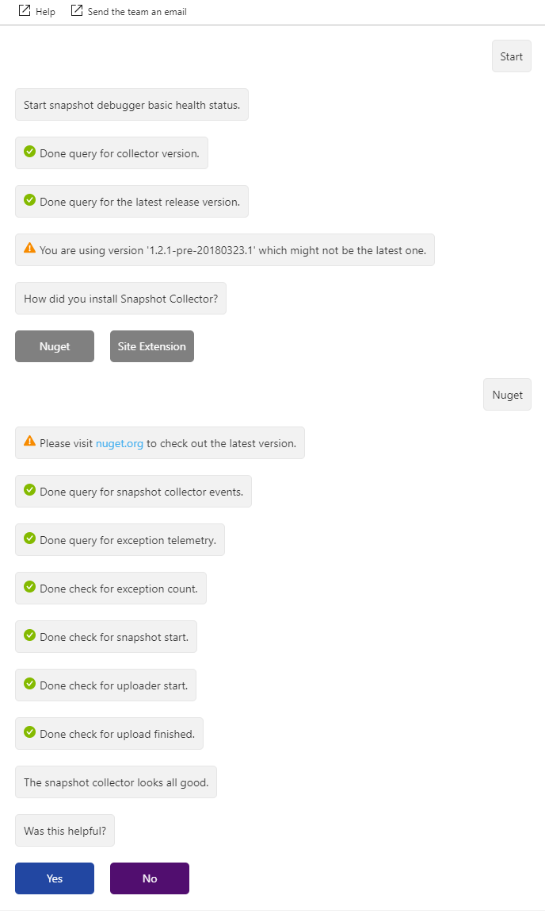
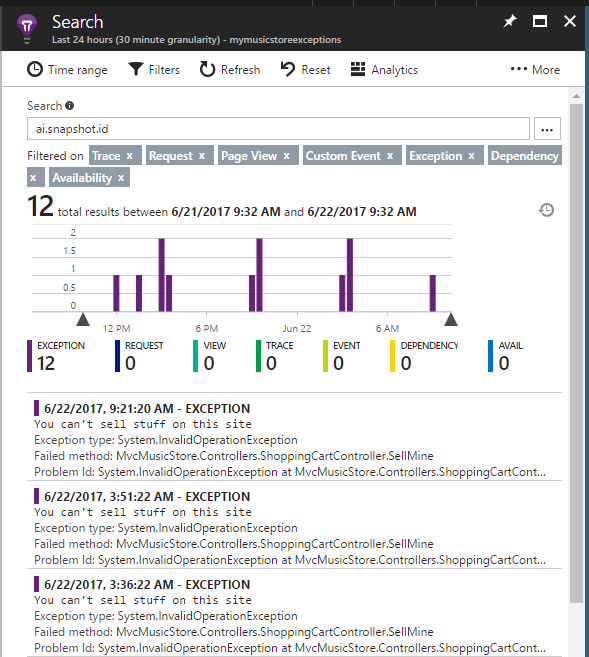

# <a id="troubleshooting"></a> Troubleshoot problems enabling Application Insights Snapshot Debugger or viewing snapshots
If you enabled Application Insights Snapshot Debugger for your application, but are not seeing snapshots for exceptions, you can use these instructions to troubleshoot. There can be many different reasons why snapshots are not generated. You can run the snapshot health check to identify some of the possible common causes.

## Use the snapshot health check
Several common problems result in the Open Debug Snapshot not showing up. Using an outdated Snapshot Collector, for example; reaching the daily upload limit; or perhaps the snapshot is just taking a long time to upload. Use the Snapshot Health Check to troubleshoot common problems.

There's a link in the exception pane of the end-to-end trace view that takes you to the Snapshot Health Check.


The interactive, chat-like interface looks for common problems and guides you to fix them.



If that doesn't solve the problem, then refer to the following manual troubleshooting steps.

## Verify the instrumentation key

Make sure you're using the correct instrumentation key in your published application. Usually, the instrumentation key is read from the ApplicationInsights.config file. Verify the value is the same as the instrumentation key for the Application Insights resource that you see in the portal.

## Preview Versions of .NET Core
If the application uses a preview version of .NET Core, and Snapshot Debugger was enabled through the [Application Insights pane](snapshot-debugger-appservice.md?toc=/azure/azure-monitor/toc.json) in the portal, then Snapshot Debugger may not start. Follow the instructions at [Enable Snapshot Debugger for other environments](snapshot-debugger-vm.md?toc=/azure/azure-monitor/toc.json) first to include the [Microsoft.ApplicationInsights.SnapshotCollector](https://www.nuget.org/packages/Microsoft.ApplicationInsights.SnapshotCollector) NuGet package with the application ***in addition*** to enabling through the [Application Insights pane](snapshot-debugger-appservice.md?toc=/azure/azure-monitor/toc.json).


## Upgrade to the latest version of the NuGet package

If Snapshot Debugger was enabled through the [Application Insights pane in the portal](snapshot-debugger-appservice.md?toc=/azure/azure-monitor/toc.json), then your application should already be running the latest NuGet package. If Snapshot Debugger was enabled by including the [Microsoft.ApplicationInsights.SnapshotCollector](https://www.nuget.org/packages/Microsoft.ApplicationInsights.SnapshotCollector) NuGet package, use Visual Studio's NuGet Package Manager to make sure you're using the latest version of Microsoft.ApplicationInsights.SnapshotCollector. Release notes can be found at https://github.com/Microsoft/ApplicationInsights-Home/issues/167

## Check the uploader logs

After a snapshot is created, a minidump file (.dmp) is created on disk. A separate uploader process creates that minidump file and uploads it, along with any associated PDBs, to Application Insights Snapshot Debugger storage. After the minidump has uploaded successfully, it's deleted from disk. The log files for the uploader process are kept on disk. In an App Service environment, you can find these logs in `D:\Home\LogFiles`. Use the Kudu management site for App Service to find these log files.

1. Open your App Service application in the Azure portal.
2. Click **Advanced Tools**, or search for **Kudu**.
3. Click **Go**.
4. In the **Debug console** drop-down list box, select **CMD**.
5. Click **LogFiles**.

You should see at least one file with a name that begins with `Uploader_` or `SnapshotUploader_` and a `.log` extension. Click the appropriate icon to download any log files or open them in a browser.
The file name includes a unique suffix that identifies the App Service instance. If your App Service instance is hosted on more than one machine, there are separate log files for each machine. When the uploader detects a new minidump file, it's recorded in the log file. Here's an example of a successful snapshot and upload:

```
SnapshotUploader.exe Information: 0 : Received Fork request ID 139e411a23934dc0b9ea08a626db16c5 from process 6368 (Low pri)
    DateTime=2018-03-09T01:42:41.8571711Z
SnapshotUploader.exe Information: 0 : Creating minidump from Fork request ID 139e411a23934dc0b9ea08a626db16c5 from process 6368 (Low pri)
    DateTime=2018-03-09T01:42:41.8571711Z
SnapshotUploader.exe Information: 0 : Dump placeholder file created: 139e411a23934dc0b9ea08a626db16c5.dm_
    DateTime=2018-03-09T01:42:41.8728496Z
SnapshotUploader.exe Information: 0 : Dump available 139e411a23934dc0b9ea08a626db16c5.dmp
    DateTime=2018-03-09T01:42:45.7525022Z
SnapshotUploader.exe Information: 0 : Successfully wrote minidump to D:\local\Temp\Dumps\c12a605e73c44346a984e00000000000\139e411a23934dc0b9ea08a626db16c5.dmp
    DateTime=2018-03-09T01:42:45.7681360Z
SnapshotUploader.exe Information: 0 : Uploading D:\local\Temp\Dumps\c12a605e73c44346a984e00000000000\139e411a23934dc0b9ea08a626db16c5.dmp, 214.42 MB (uncompressed)
    DateTime=2018-03-09T01:42:45.7681360Z
SnapshotUploader.exe Information: 0 : Upload successful. Compressed size 86.56 MB
    DateTime=2018-03-09T01:42:59.6184651Z
SnapshotUploader.exe Information: 0 : Extracting PDB info from D:\local\Temp\Dumps\c12a605e73c44346a984e00000000000\139e411a23934dc0b9ea08a626db16c5.dmp.
    DateTime=2018-03-09T01:42:59.6184651Z
SnapshotUploader.exe Information: 0 : Matched 2 PDB(s) with local files.
    DateTime=2018-03-09T01:42:59.6809606Z
SnapshotUploader.exe Information: 0 : Stamp does not want any of our matched PDBs.
    DateTime=2018-03-09T01:42:59.8059929Z
SnapshotUploader.exe Information: 0 : Deleted D:\local\Temp\Dumps\c12a605e73c44346a984e00000000000\139e411a23934dc0b9ea08a626db16c5.dmp
    DateTime=2018-03-09T01:42:59.8530649Z
```

> [!NOTE]
> The example above is from version 1.2.0 of the Microsoft.ApplicationInsights.SnapshotCollector NuGet package. In earlier versions, the uploader process is called `MinidumpUploader.exe` and the log is less detailed.

In the previous example, the instrumentation key is `c12a605e73c44346a984e00000000000`. This value should match the instrumentation key for your application.
The minidump is associated with a snapshot with the ID `139e411a23934dc0b9ea08a626db16c5`. You can use this ID later to locate the associated exception telemetry in Application Insights Analytics.

The uploader scans for new PDBs about once every 15 minutes. Here's an example:

```
SnapshotUploader.exe Information: 0 : PDB rescan requested.
    DateTime=2018-03-09T01:47:19.4457768Z
SnapshotUploader.exe Information: 0 : Scanning D:\home\site\wwwroot for local PDBs.
    DateTime=2018-03-09T01:47:19.4457768Z
SnapshotUploader.exe Information: 0 : Local PDB scan complete. Found 2 PDB(s).
    DateTime=2018-03-09T01:47:19.4614027Z
SnapshotUploader.exe Information: 0 : Deleted PDB scan marker : D:\local\Temp\Dumps\c12a605e73c44346a984e00000000000\6368.pdbscan
    DateTime=2018-03-09T01:47:19.4614027Z
```

For applications that _aren't_ hosted in App Service, the uploader logs are in the same folder as the minidumps: `%TEMP%\Dumps\<ikey>` (where `<ikey>` is your instrumentation key).

## Troubleshooting Cloud Services
For roles in Cloud Services, the default temporary folder may be too small to hold the minidump files, leading to lost snapshots.
The space needed depends on the total working set of your application and the number of concurrent snapshots.
The working set of a 32-bit ASP.NET web role is typically between 200 MB and 500 MB.
Allow for at least two concurrent snapshots.
For example, if your application uses 1 GB of total working set, you should make sure that there is at least 2 GB of disk space to store snapshots.
Follow these steps to configure your Cloud Service role with a dedicated local resource for snapshots.

1. Add a new local resource to your Cloud Service by editing the Cloud Service definition (.csdef) file. The following example defines a resource called `SnapshotStore` with a size of 5 GB.
   ```xml
   <LocalResources>
     <LocalStorage name="SnapshotStore" cleanOnRoleRecycle="false" sizeInMB="5120" />
   </LocalResources>
   ```

2. Modify your role's startup code to add an environment variable that points to the `SnapshotStore` local resource. For Worker Roles, the code should be added to your role's `OnStart` method:
   ```csharp
   public override bool OnStart()
   {
       Environment.SetEnvironmentVariable("SNAPSHOTSTORE", RoleEnvironment.GetLocalResource("SnapshotStore").RootPath);
       return base.OnStart();
   }
   ```
   For Web Roles (ASP.NET), the code should be added to your web application's `Application_Start` method:
   ```csharp
   using Microsoft.WindowsAzure.ServiceRuntime;
   using System;

   namespace MyWebRoleApp
   {
       public class MyMvcApplication : System.Web.HttpApplication
       {
          protected void Application_Start()
          {
             Environment.SetEnvironmentVariable("SNAPSHOTSTORE", RoleEnvironment.GetLocalResource("SnapshotStore").RootPath);
             // TODO: The rest of your application startup code
          }
       }
   }
   ```

3. Update your role's ApplicationInsights.config file to override the temporary folder location used by `SnapshotCollector`
   ```xml
   <TelemetryProcessors>
    <Add Type="Microsoft.ApplicationInsights.SnapshotCollector.SnapshotCollectorTelemetryProcessor, Microsoft.ApplicationInsights.SnapshotCollector">
      <!-- Use the SnapshotStore local resource for snapshots -->
      <TempFolder>%SNAPSHOTSTORE%</TempFolder>
      <!-- Other SnapshotCollector configuration options -->
    </Add>
   </TelemetryProcessors>
   ```

## Overriding the Shadow Copy folder

When the Snapshot Collector starts up, it tries to find a folder on disk that is suitable for running the Snapshot Uploader process. The chosen folder is known as the Shadow Copy folder.

The Snapshot Collector checks a few well-known locations, making sure it has permissions to copy the Snapshot Uploader binaries. The following environment variables are used:
- Fabric_Folder_App_Temp
- LOCALAPPDATA
- APPDATA
- TEMP

If a suitable folder can't be found, Snapshot Collector reports an error saying _"Could not find a suitable shadow copy folder."_

If the copy fails, Snapshot Collector reports a `ShadowCopyFailed` error.

If the uploader can't be launched, Snapshot Collector reports an `UploaderCannotStartFromShadowCopy` error. The body of the message often contains `System.UnauthorizedAccessException`. This error usually occurs because the application is running under an account with reduced permissions. The account has permission to write to the shadow copy folder, but it doesn't have permission to execute code.

Since these errors usually happen during startup, they'll usually be followed by an `ExceptionDuringConnect` error saying _"Uploader failed to start."_

To work around these errors, you can specify the shadow copy folder manually via the `ShadowCopyFolder` configuration option. For example, using ApplicationInsights.config:

   ```xml
   <TelemetryProcessors>
    <Add Type="Microsoft.ApplicationInsights.SnapshotCollector.SnapshotCollectorTelemetryProcessor, Microsoft.ApplicationInsights.SnapshotCollector">
      <!-- Override the default shadow copy folder. -->
      <ShadowCopyFolder>D:\SnapshotUploader</ShadowCopyFolder>
      <!-- Other SnapshotCollector configuration options -->
    </Add>
   </TelemetryProcessors>
   ```

Or, if you're using appsettings.json with a .NET Core application:

   ```json
   {
     "ApplicationInsights": {
       "InstrumentationKey": "<your instrumentation key>"
     },
     "SnapshotCollectorConfiguration": {
       "ShadowCopyFolder": "D:\\SnapshotUploader"
     }
   }
   ```

## Use Application Insights search to find exceptions with snapshots

When a snapshot is created, the throwing exception is tagged with a snapshot ID. That snapshot ID is included as a custom property when the exception telemetry is reported to Application Insights. Using **Search** in Application Insights, you can find all telemetry with the `ai.snapshot.id` custom property.

1. Browse to your Application Insights resource in the Azure portal.
2. Click **Search**.
3. Type `ai.snapshot.id` in the Search text box and press Enter.



If this search returns no results, then no snapshots were reported to Application Insights for your application in the selected time range.

To search for a specific snapshot ID from the Uploader logs, type that ID in the Search box. If you can't find telemetry for a snapshot that you know was uploaded, follow these steps:

1. Double-check that you're looking at the right Application Insights resource by verifying the instrumentation key.

2. Using the timestamp from the Uploader log, adjust the Time Range filter of the search to cover that time range.

If you still don't see an exception with that snapshot ID, then the exception telemetry wasn't reported to Application Insights. This situation can happen if your application crashed after it took the snapshot but before it reported the exception telemetry. In this case, check the App Service logs under `Diagnose and solve problems` to see if there were unexpected restarts or unhandled exceptions.

## Edit network proxy or firewall rules

If your application connects to the Internet via a proxy or a firewall, you may need to edit the rules to allow your application to communicate with the Snapshot Debugger service. Here is [a list of IP addresses and ports used by the Snapshot Debugger](../../azure-monitor/app/ip-addresses.md#snapshot-debugger).
