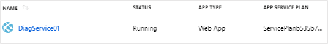
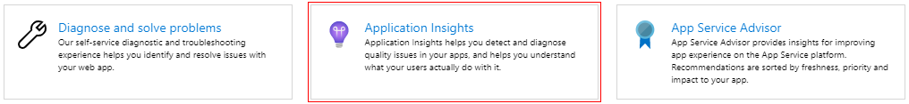
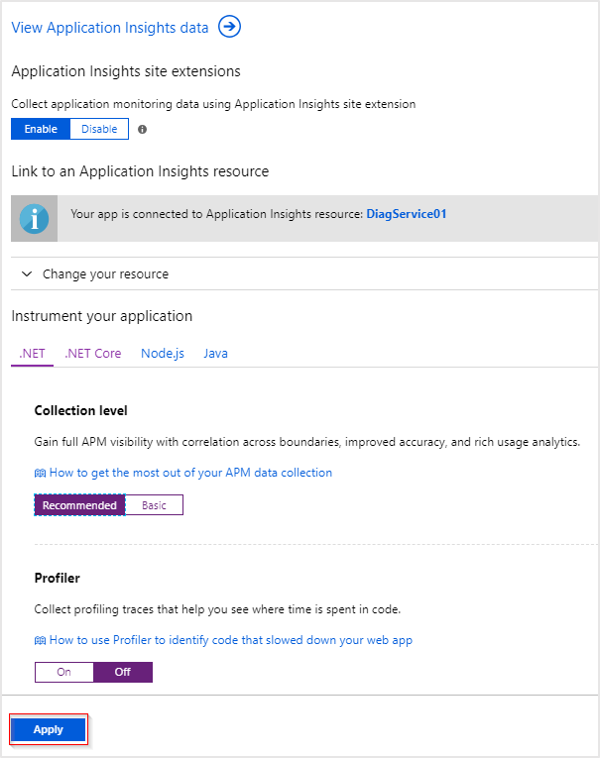
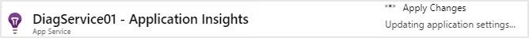
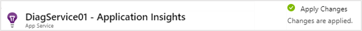

# Upgrading the Snapshot Debugger

To provide the best possible security for your data, Microsoft is moving away from TLS 1.0 and TLS 1.1, which have been shown to be vulnerable to determined attackers. If you are using an older version of the site extension, it will require an upgrade to continue working. This document outlines the steps needed to upgrade your Snapshot debugger to the latest version. 
There are two primary upgrade paths depending on if you enabled the Snapshot Debugger using a site extension or if you used an SDK/Nuget added to your application. Both upgrade paths are discussed below. 

## Upgrading the site extension

If you enabled the Snapshot debugger using the site extension, you can easily upgrade using the following procedure:

1. Sign in to the Azure portal.
2. Navigate to your resource that has Application Insights and Snapshot debugger enabled. For example, for a Web App, navigate to the App Service resource:

   

3. Once you have navigated to your resource, click on Application Insights in the Overview blade:

   

4. A new blade will open with the current settings. Unless you want to take the opportunity to change your settings, you can leave them as is. The **Apply** button on the bottom of the blade is not enabled by default and you will have to toggle one of the settings to activate the button. You don’t have to change any actual settings, rather you can change the setting and then immediately change it back. We recommend toggling the Profiler setting and then selecting **Apply**.

   

5. Once you click **Apply**, you will be asked to confirm the changes.

    > [!NOTE]
    > The site will be restarted as part of the upgrade process.

   

6. Click **Yes** to apply the changes. During the process a notification will appear showing that changes are being applied:

   

Once completed, a **"Changes are applied"** notification will appear.

   

The site has now been upgraded and is ready to use.

## Upgrading Snapshot Debugger using SDK/Nuget

If the application is using a version of `Microsoft.ApplicationInsights.SnapshotCollector` below version 1.3.1, it will need to be upgraded to a [newer version](https://www.nuget.org/packages/Microsoft.ApplicationInsights.SnapshotCollector) to continue working.
