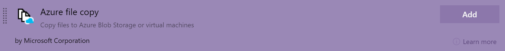

# Source map support for JavaScript applications

Application Insights supports the uploading of source maps to your own Storage Account Blob Container.
Source maps can be used to unminify call stacks found on the end to end transaction details page. Any exception sent by the [JavaScript SDK][ApplicationInsights-JS] or the [Node.js SDK][ApplicationInsights-Node.js] can be unminified with source maps.

## Create a new storage account and Blob container

If you already have an existing storage account or blob container, you can skip this step.

1. [Create a new storage account][create storage account]
2. [Create a blob container][create blob container] inside your storage account. Be sure to set the "Public access level" to `Private`, to ensure that your source maps are not publicly accessible.

> [!div class="mx-imgBorder"]
>

## Push your source maps to your Blob container

You should integrate your continuous deployment pipeline with your storage account by configuring it to automatically upload your source maps to the configured Blob container. You should not upload your source maps to a subfolder in the Blob container; currently the source map will only be fetched from the root folder.

### Upload source maps via Azure Pipelines (recommended)

If you are using Azure Pipelines to continuously build and deploy your application, add an [Azure File Copy][azure file copy] task to your pipeline to automatically upload your source maps.

> [!div class="mx-imgBorder"]
> 

## Configure your Application Insights resource with a Source Map storage account

### From the end-to-end transaction details page

From the end-to-end transaction details tab, you can click on *Unminify* and it will display a prompt to configure if your resource is unconfigured.

1. In the Portal, view the details of an exception that is minified.
2. Click on *Unminify*
3. If your resource has not been configured, a message will appear, prompting you to configure.

### From the properties page

If you would like to configure or change the storage account or Blob container that is linked to your Application Insights Resource, you can do it by viewing the Application Insights resource's *Properties* tab.

1. Navigate to the *Properties* tab of your Application Insights resource.
2. Click on *Change source map blob container*.
3. Select a different Blob container as your source maps container.
4. Click `Apply`.

> [!div class="mx-imgBorder"]
> 

## Troubleshooting

### Required role-based access control (RBAC) settings on your Blob container

Any user on the Portal using this feature must be at least assigned as a [Storage Blob Data Reader][storage blob data reader] to your Blob container. You must assign this role to anyone else that will be using the source maps through this feature.

> [!NOTE]
> Depending on how the container was created, this may not have been automatically assigned to you or your team.

### Source map not found

1. Verify that the corresponding source map is uploaded to the correct blob container
2. Verify that the source map file is named after the JavaScript file it maps to, suffixed with `.map`.
    - For example, `/static/js/main.4e2ca5fa.chunk.js` will search for the blob named `main.4e2ca5fa.chunk.js.map`
3. Check your browser's console to see if any errors are being logged. Include this in any support ticket.

## Next Steps

* [Azure File Copy task](https://docs.microsoft.com/azure/devops/pipelines/tasks/deploy/azure-file-copy?view=azure-devops)

<!-- Remote URLs -->
[create storage account]: https://docs.microsoft.com/azure/storage/common/storage-account-create?toc=%2Fazure%2Fstorage%2Fblobs%2Ftoc.json&tabs=azure-portal
[create blob container]: https://docs.microsoft.com/azure/storage/blobs/storage-quickstart-blobs-portal
[storage blob data reader]: https://docs.microsoft.com/azure/role-based-access-control/built-in-roles#storage-blob-data-reader
[ApplicationInsights-JS]: https://github.com/microsoft/applicationinsights-js
[ApplicationInsights-Node.js]: https://github.com/microsoft/applicationinsights-node.js
[azure file copy]: https://aka.ms/azurefilecopyreadme