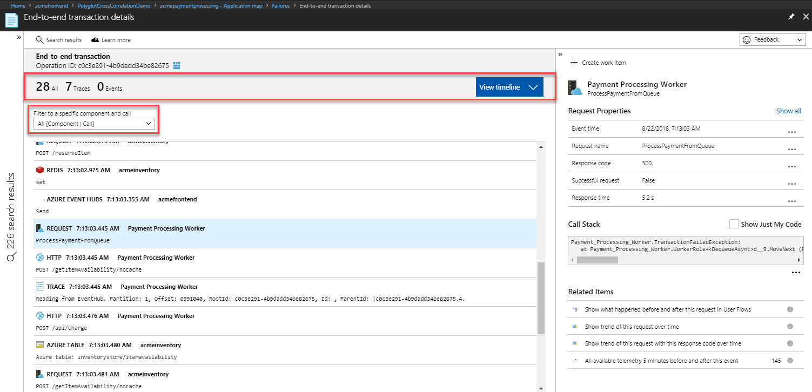
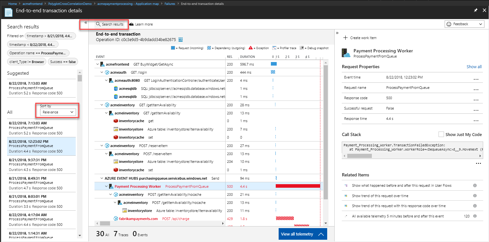

# Unified cross-component transaction diagnostics

The unified diagnostics experience automatically correlates server-side telemetry from across all your Application Insights monitored components into a single view. It doesn't matter if you have multiple resources with separate instrumentation keys. Application Insights detects the underlying relationship and allows you to easily diagnose the application component, dependency, or exception that caused a transaction slowdown or failure.

## What is a Component?

Components are independently deployable parts of your distributed/microservices application. Developers and operations teams have code-level visibility or access to telemetry generated by these application components.

* Components are different from "observed" external dependencies such as SQL, EventHub etc. which your team/organization may not have access to (code or telemetry).
* Components run on any number of server/role/container instances.
* Components can be separate Application Insights instrumentation keys (even if subscriptions are different) or different roles reporting to a single Application Insights instrumentation key. The new experience shows details across all components, regardless of how they have been set up.

> [!NOTE]
> * **Missing the related item links?** All of the related telemetry are in the [top](#cross-component-transaction-chart) and [bottom](#all-telemetry-with-this-operation-id) sections of the left side. 

## Transaction diagnostics experience
This view has four key parts: results list, a cross-component transaction chart, a time-sequence list of all telemetry related to this operation, and the details pane for any selected telemetry item on the left.

## Cross-component transaction chart

This chart provides a timeline with horizontal bars for the duration of requests and dependencies across components. Any exceptions that are collected are also marked on the timeline.

* The top row on this chart represents the entry point, the incoming request to the first component called in this transaction. The duration is the total time taken for the transaction to complete.
* Any calls to external dependencies are simple non-collapsible rows, with icons representing the dependency type.
* Calls to other components are collapsible rows. Each row corresponds to a specific operation invoked at the component.
* By default, the request, dependency, or exception that you selected is displayed on the right side.
* Select any row to see its [details on the right](#details-of-the-selected-telemetry). 

> [!NOTE]
> Calls to other components have two rows: one row represents the outbound call (dependency) from the caller component, and the other row corresponds to the inbound request at the called component. The leading icon and distinct styling of the duration bars help differentiate between them.

## All telemetry with this Operation Id

This section shows flat list view in a time sequence of all the telemetry related to this transaction. It also shows the custom events, and traces that aren't displayed in the transaction chart. You can filter this list to telemetry generated by a specific component/call. You can select any telemetry item in this list to see corresponding [details on the right](#details-of-the-selected-telemetry).

## Details of the selected telemetry

This collapsible pane shows the detail of any selected item from the transaction chart, or the list. "Show all" lists all of the standard attributes that are collected. Any custom attributes are separately listed below the standard set. Click on the "..." below the stack trace window to get an option to copy the trace. "Open profiler traces" or "Open debug snapshot" shows code level diagnostics in corresponding detail panes.

## Search results

This collapsible pane shows the other results that meet the filter criteria. Click on any result to update the respective details the 3 sections listed above. We try to find samples that are most likely to have the details available from all components even if sampling is in effect in any of them. These are shown as "suggested" samples.

## Profiler and snapshot debugger

[Application Insights profiler](../../azure-monitor/app/profiler.md) or [snapshot debugger](snapshot-debugger.md) help with code-level diagnostics of performance and failure issues. With this experience, you can see profiler traces or snapshots from any component with a single click.

If you could not get Profiler working, please contact **serviceprofilerhelp\@microsoft.com**

If you could not get Snapshot Debugger working, please contact **snapshothelp\@microsoft.com**

## FAQ

*I see a single component on the chart, and the others are only showing as external dependencies without any detail of what happened within those components.*

Potential reasons:

* Are the other components instrumented with Application Insights?
* Are they using the latest stable Application Insights SDK?
* If these components are separate Application Insights resources, do you have required access to their telemetry?

If you do have access and the components are instrumented with the latest Application Insights SDKs, let us know via the top right feedback channel.

*I see duplicate rows for the dependencies. Is this expected?*

At this time, we are showing the outbound dependency call separate from the inbound request. Typically, the two calls look identical with only the duration value being different due to the network round trip. The leading icon and distinct styling of the duration bars help differentiate between them. Is this presentation of the data confusing? Give us your feedback!

*What about clock skews across different component instances?*

Timelines are adjusted for clock skews in the transaction chart. You can see the exact timestamps in the details pane or by using Analytics.

*Why is the new experience missing most of the related items queries?*

This is by design. All of the related items, across all components, are already available on the left side (top and bottom sections). The new experience has two related items that the left side doesn't cover: all telemetry from five minutes before and after this event and the user timeline.
