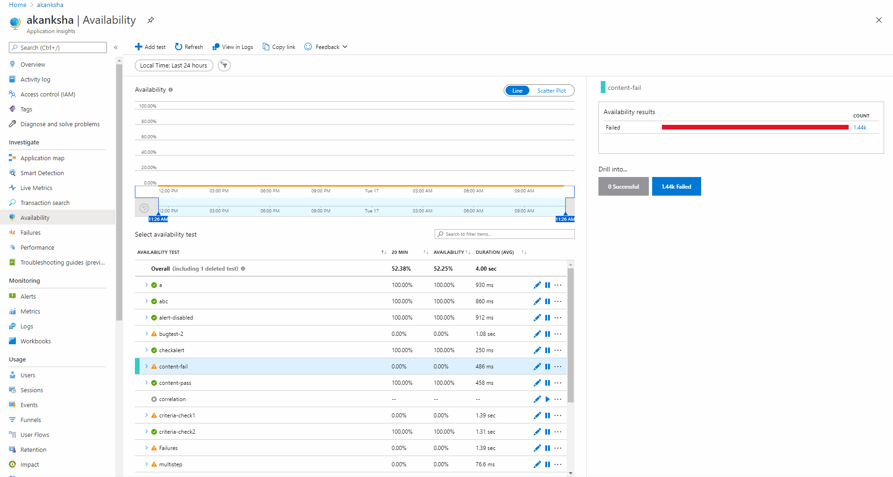

# Troubleshooting

This article will help you to troubleshoot common issues that may occur when using availability monitoring.

## Troubleshooting report steps for ping tests

The Troubleshooting Report allows you to easily diagnose common problems that cause your **ping tests** to fail.

1. On the availability tab of your Application Insights resource, select overall or one of the availability tests.
2. Either select **Failed** then a test under "Drill into" on the left or select one of the points on the scatter plot.
3. On the end-to-end transaction detail page, select an event then under "Troubleshooting report summary" select **[Go to step]** to see the troubleshooting report.

> [!NOTE]
>  If the connection re-use step is present, then DNS resolution, connection establishment, and TLS transport steps will not be present.

|Step | Error message | Possible cause |
|-----|---------------|----------------|
| Connection reuse | n/a | Usually dependent on a previously established connection meaning the web test step is dependent. So there would be no DNS, connection or SSL step required. |
| DNS resolution | The remote name could not be resolved: "your URL" | The DNS resolution process failed, most likely due to misconfigured DNS records or temporary DNS server failures. |
| Connection establishment | A connection attempt failed because the connected party did not properly respond after a period of time. | In general, it means your server is not responding to the HTTP request. A common cause is that our test agents are being blocked by a firewall on your server. If you would like to test within an Azure Virtual Network, you should add the Availability service tag to your environment.|
| TLS transport  | The client and server cannot communicate because they do not possess a common algorithm.| Only TLS 1.0, 1.1, and 1.2 are supported. SSL is not supported. This step does not validate SSL certificates and only establishes a secure connection. This step will only shows up when an error occurs. |
| Receiving response header | Unable to read data from the transport connection. The connection was closed. | Your server committed a protocol error in the response header. For example, connection closed by your server when the response is not fully. |
| Receiving response body | Unable to read data from the transport connection: The connection was closed. | Your server committed a protocol error in response body. For example, Connection closed by your server when the response is not fully read or the chunk size is wrong in chunked response body. |
| Redirect limit validation | This webpage has too many redirects. This loop will be terminated here since this request exceeded the limit for auto redirects. | There's a limit of 10 redirects per test. |
| Status code validation | `200 - OK` does not match the expected status `400 - BadRequest`. | The returned status code that is counted as a success. 200 is the code that indicates that a normal web page has been returned. |
| Content validation | The required text 'hello' did not appear in the response. | The string is not an exact case-sensitive match in the response, for example the string "Welcome!". It must be a plain string, without wildcard characters (for example an asterisk). If your page content changes you might have to update the string. Only English characters are supported with content match. |
  
## Common troubleshooting questions

### Site looks okay but I see test failures? Why is Application Insights alerting me?

   * Does your test have **Parse dependent requests** enabled? That results in a strict check on resources such as scripts, images etc. These types of failures may not be noticeable on a browser. Check all the images, scripts, style sheets, and any other files loaded by the page. If any of them fails, the test is reported as failed, even if the main HTML page loads without issue. To desensitize the test to such resource failures, simply uncheck the Parse Dependent Requests from the test configuration.

   * To reduce odds of noise from transient network blips etc., ensure Enable retries for test failures configuration is checked. You can also test from more locations and manage alert rule threshold accordingly to prevent location-specific issues causing undue alerts.

   * Click on any of the red dots from the Availability scatter plot experience experience, or any availability failure from the Search explorer to see the details of why we reported the failure. The test result, along with the correlated server-side telemetry (if enabled) should help understand why the test failed. Common causes of transient issues are network or connection issues.

   * Did the test time-out? We abort tests after 2 minutes. If your ping or multi-step test takes longer than 2 minutes, we will report it as a failure. Consider breaking the test into multiple ones that can complete in shorter durations.

   * Did all locations report failure, or only some of them? If only some reported failures, it may be due to network/CDN issues. Again, clicking on the red dots should help understand why the location reported failures.

### I did not get an email when the alert triggered, or resolved or both?

Check the alerts' action group configuration to confirm your email is directly listed, or a distribution list you are on is configured to receive notifications. If it is, then check the distribution list configuration to confirm it can receive external emails. Also check if your mail administrator may have any policies configured that may cause this issue.

### I did not receive the webhook notification?

Check to ensure the application receiving the webhook notification is available, and successfully processes the webhook requests. See [this](../alerts/alerts-log-webhook.md) for more information.

### I am getting  403 Forbidden errors, what does this mean?

This error indicates that you need to add firewall exceptions to allow the availability agents to test your target url. For a full list of agent IP addresses to allow, consult the [IP exception article](./ip-addresses.md#availability-tests).

### Intermittent test failure with a protocol violation error?

The error ("protocol violation..CR must be followed by LF") indicates an issue with the server (or dependencies). This happens when malformed headers are set in the response. It can be caused by load balancers or CDNs. Specifically, some headers might not be using CRLF to indicate end of line, which violates the HTTP specification and therefore fail validation at the .NET WebRequest level. Inspect the response to spot headers, which might be in violation.

> [!NOTE]
> The URL may not fail on browsers that have a relaxed validation of HTTP headers. See this blog post for a detailed explanation of this issue: http://mehdi.me/a-tale-of-debugging-the-linkedin-api-net-and-http-protocol-violations/  

### I don't see any related server-side telemetry to diagnose test failures?*

If you have Application Insights set up for your server-side application, that may be because [sampling](./sampling.md) is in operation. Select a different availability result.

### Can I call code from my web test?

No. The steps of the test must be in the .webtest file. And you can't call other web tests or use loops. But there are several plug-ins that you might find helpful.

### Is there a difference between "web tests" and "availability tests"?

The two terms may be referenced interchangeably. Availability tests is a more generic term that includes the single URL ping tests in addition to the multi-step web tests.

### I'd like to use availability tests on our internal server that runs behind a firewall.

   There are two possible solutions:

   * Configure your firewall to permit incoming requests from the [IP addresses
    of our web test agents](./ip-addresses.md).
   * Write your own code to periodically test your internal server. Run the code as a background process on a test server behind your firewall. Your test process can send its results to Application Insights by using [TrackAvailability()](/dotnet/api/microsoft.applicationinsights.telemetryclient.trackavailability) API in the core SDK package. This requires your test server to have outgoing access to the Application Insights ingestion endpoint, but that is a much smaller security risk than the alternative of permitting incoming requests. The results will appear in the availability web tests blades though the experience will be slightly simplified from what is available for tests created via the portal. Custom availability tests will also appear as availability results in Analytics, Search, and Metrics.

### Uploading a multi-step web test fails

Some reasons this might happen:
   * There's a size limit of 300 K.
   * Loops aren't supported.
   * References to other web tests aren't supported.
   * Data sources aren't supported.

### My multi-step test doesn't complete

There's a limit of 100 requests per test. Also, the test is stopped if it runs longer than two minutes.

### How can I run a test with client certificates?

This is currently not supported.

## Next steps

* [Multi-step web testing](availability-multistep.md)
* [URL ping tests](monitor-web-app-availability.md)