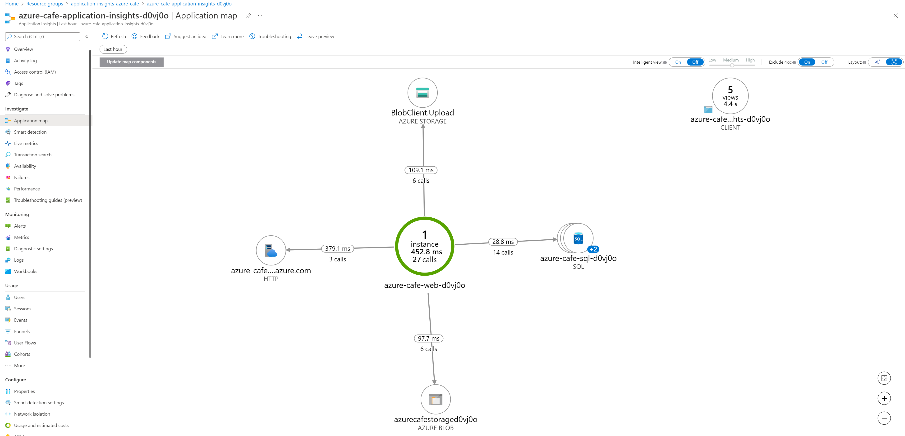

# Application Insights for ASP.NET Core applications

This article describes how to enable Application Insights for an [ASP.NET Core](https://docs.microsoft.com/aspnet/core) application deployed as an Azure Web App. This implementation utilizes an SDK-based approach, an [auto-instrumentation approach](./codeless-overview.md) is also available.

Application Insights can collect the following telemetry from your ASP.NET Core application:

> [!div class="checklist"]
> * Requests
> * Dependencies
> * Exceptions
> * Performance counters
> * Heartbeats
> * Logs

We'll use an [ASP.NET Core MVC application](https://docs.microsoft.com/aspnet/core/tutorials/first-mvc-app) example that targets `net6.0`. You can apply these instructions to all ASP.NET Core applications. If you're using the [Worker Service](https://docs.microsoft.com/aspnet/core/fundamentals/host/hosted-services#worker-service-template), use the instructions from [here](./worker-service.md).

> [!NOTE]
> A preview [OpenTelemetry-based .NET offering](./opentelemetry-enable.md?tabs=net) is available. [Learn more](./opentelemetry-overview.md).

[!INCLUDE [azure-monitor-log-analytics-rebrand](../../../includes/azure-monitor-instrumentation-key-deprecation.md)]

## Supported scenarios

The [Application Insights SDK for ASP.NET Core](https://nuget.org/packages/Microsoft.ApplicationInsights.AspNetCore) can monitor your applications no matter where or how they run. If your application is running and has network connectivity to Azure, telemetry can be collected. Application Insights monitoring is supported everywhere .NET Core is supported. Support covers the following scenarios:
* **Operating system**: Windows, Linux, or Mac
* **Hosting method**: In process or out of process
* **Deployment method**: Framework dependent or self-contained
* **Web server**: IIS (Internet Information Server) or Kestrel
* **Hosting platform**: The Web Apps feature of Azure App Service, Azure VM, Docker, Azure Kubernetes Service (AKS), and so on
* **.NET Core version**: All officially [supported .NET Core versions](https://dotnet.microsoft.com/download/dotnet-core) that aren't in preview
* **IDE**: Visual Studio, Visual Studio Code, or command line

## Prerequisites

If you'd like to follow along with the guidance in this article, certain pre-requisites are needed.

* Visual Studio 2022
* Visual Studio Workloads: ASP.NET and web development, Data storage and processing, and Azure development
* .Net 6.0
* Azure subscription and user account (with the ability to create and delete resources)

## Deploy Azure resources

Please follow the guidance to deploy the sample application from its [GitHub repository.](https://github.com/solliancenet/appinsights-azurecafe).

In order to provide globally unique names to some resources, a 5 character suffix has been assigned. Please make note of this suffix for use later on in this article.


## Create an Application Insights resource

1. In the [Azure Portal](https://portal.azure.com), locate and select the **application-insights-azure-cafe** resource group.

2. From the top toolbar menu, select **+ Create**.

    

3. On the **Create a resource** screen, search for and select `Application Insights` in the marketplace search textbox.

    

4. On the Application Insights resource overview screen, select **Create**.

    

5. On the Application Insights screen **Basics** tab. Complete the form as follows, then select the **Review + create** button. Fields not specified in the table below may retain their default values.

    | Field | Value |
    |-------|-------|
    | Name  | Enter `azure-cafe-application-insights-{SUFFIX}`, replacing **{SUFFIX}** with the appropriate suffix value recorded earlier. |
    | Region | Select the same region chosen when deploying the article resources. |
    | Log Analytics Workspace | Select `azure-cafe-log-analytics-workspace`, alternatively a new log analytics workspace can be created here. |

   

6. Once validation has passed, select **Create** to deploy the resource.

    

7. Once deployment has completed, return to the `application-insights-azure-cafe` resource group, and select the deployed Application Insights resource.

    

8. On the Overview screen of the Application Insights resource, copy the **Connection String** value for use in the next section of this article.

    

## Configure the Application Insights connection string application setting in the web App Service

1. Return to the `application-insights-azure-cafe` resource group, locate and open the **azure-cafe-web-{SUFFIX}** App Service resource.

    

2. From the left menu, beneath the Settings header, select **Configuration**. Then, on the **Application settings** tab, select **+ New application setting** beneath the Application settings header.

    

3. In the Add/Edit application setting blade, complete the form as follows and select **OK**.

    | Field | Value |
    |-------|-------|
    | Name  | APPLICATIONINSIGHTS_CONNECTION_STRING |
    | Value | Paste the Application Insights connection string obtained in the preceding section. |

    

4. On the App Service Configuration screen, select the **Save** button from the toolbar menu. When prompted to save the changes, select **Continue**.

    

## Install the Application Insights NuGet Package

We need to configure the ASP.NET Core MVC web application to send telemetry. This is accomplished using the [Application Insights for ASP.NET Core web applications NuGet package](https://nuget.org/packages/Microsoft.ApplicationInsights.AspNetCore).

1. With Visual Studio, open `1 - Starter Application\src\AzureCafe.sln`.

2. In the Solution Explorer panel, right-click the AzureCafe project file, and select **Manage NuGet Packages**.

    

3. Select the **Browse** tab, then search for and select **Microsoft.ApplicationInsights.AspNetCore**. Select **Install**, and accept the license terms. It is recommended to use the latest stable version. Find full release notes for the SDK on the [open-source GitHub repo](https://github.com/Microsoft/ApplicationInsights-dotnet/releases).

    

4. Keep Visual Studio open for the next section of the article.

## Enable Application Insights server-side telemetry

The Application Insights for ASP.NET Core web applications NuGet package encapsulates features to enable sending server-side telemetry to the Application Insights resource in Azure.

1. From the Visual Studio Solution Explorer, locate and open the **Program.cs** file.

    

2. Insert the following code prior to the `builder.Services.AddControllersWithViews()` statement. This code automatically reads the Application Insights connection string value from configuration. The `AddApplicationInsightsTelemetry` method registers the `ApplicationInsightsLoggerProvider` with the built-in dependency injection container, that will then be used to fulfill [ILogger](https://docs.microsoft.com/dotnet/api/microsoft.extensions.logging.ilogger) and [ILogger\<TCategoryName\>](https://docs.microsoft.com/dotnet/api/microsoft.extensions.logging.iloggerprovider) implementation requests.

    ```csharp
    builder.Services.AddApplicationInsightsTelemetry();
    ```

    

    > [!TIP]
    > Learn more about [configuration options in ASP.NET Core](https://docs.microsoft.com/aspnet/core/fundamentals/configuration/?view=aspnetcore-6.0).

## Enable client-side telemetry for web applications

The preceding steps are enough to help you start collecting server-side telemetry. If your application has client-side components, follow the next steps to start collecting [usage telemetry](./usage-overview.md).

1. In Visual Studio Solution explorer, locate and open `\Views\_ViewImports.cshtml`. Add the following code at the end of the existing file.

    ```cshtml
    @inject Microsoft.ApplicationInsights.AspNetCore.JavaScriptSnippet JavaScriptSnippet
    ```

    

2. To properly enable client-side monitoring for your application, the JavaScript snippet must appear in the `<head>` section of each page of your application that you want to monitor. In Visual Studio Solution Explorer, locate and open  `\Views\Shared\_Layout.cshtml`, insert the following code immediately preceding the closing `<\head>` tag.

    ```cshtml
    @Html.Raw(JavaScriptSnippet.FullScript)
    ```

    

    > [!TIP]
    > As an alternative to using the `FullScript`, the `ScriptBody` is available. Use `ScriptBody` if you need to control the `<script>` tag to set a Content Security Policy:

    ```cshtml
    <script> // apply custom changes to this script tag.
        @Html.Raw(JavaScriptSnippet.ScriptBody)
    </script>
    ```

> [!NOTE]
> JavaScript injection provides a default configuration experience. If you require [configuration](./javascript.md#configuration) beyond setting the connection string, you are required to remove auto-injection as described above and manually add the [JavaScript SDK](./javascript.md#adding-the-javascript-sdk).

## Enable monitoring of database queries

When investigating causes for performance degredation, it is important to include insights into database calls. Enable monitoring through configuration of the [dependency module](./asp-net-dependencies.md). Dependency monitoring, including SQL is enabled by default. The following steps can be followed to capture the full SQL query text.

> [!NOTE]
> SQL text may contain sensitive data such as passwords and PII. Be careful when enabling this feature.

1. From the Visual Studio Solution Explorer, locate and open the **Program.cs** file.

2. At the top of the file, add the following `using` statement.

    ```csharp
    using Microsoft.ApplicationInsights.DependencyCollector;
    ```

3. Immediately following the `builder.Services.AddApplicationInsightsTelemetry()` code, insert the following to enable SQL command text instrumentation.

    ```csharp
    builder.Services.ConfigureTelemetryModule<DependencyTrackingTelemetryModule>((module, o) => { module.EnableSqlCommandTextInstrumentation = true; });
    ```

    

## Run the Azure Cafe web application

After the web application code is deployed, telemetry will flow to Application Insights. The Application Insights SDK automatically collects incoming web requests to your application.

1. Right-click the **AzureCafe** project in Solution Explorer and select **Publish** from the context menu.

    

2. Select **Publish** to promote the new code to the Azure App Service.

    

3. Once the publish has succeeded, a new browser window opens to the Azure Cafe web application.

    

4. Perform various activities in the web application to generate some telemetry.

   1. Select **Details** next to a Cafe to view its menu and reviews.

        

   2. On the Cafe screen, select the **Reviews** tab to view and add reviews. Select the **Add review** button to add a review.

        

   3. On the Create a review dialog, enter a name, rating, comments, and upload a photo for the review. Once completed, select **Add review**.

        

   4. Repeat adding reviews as desired to generate additional telemetry.

### Live metrics

[Live Metrics](./live-stream.md) can be used to quickly verify if Application Insights monitoring is configured correctly. It might take a few minutes for telemetry to appear in the portal and analytics, but Live Metrics shows CPU usage of the running process in near real time. It can also show other telemetry like Requests, Dependencies, and Traces.

### Application map

The sample application makes calls to multiple Azure resources, including Azure SQL, Azure Blob Storage, and the Azure Language Service (for review sentiment analysis).


Application Insights introspects incoming telemetry data and is able to generate a visual map of detected system integrations.

1. Access and log into the [Azure Portal](https://portal.azure.com).

2. Open the sample application resource group `application-insights-azure-cafe`.

3. From the list of resources, select the `azure-cafe-insights-{SUFFIX}` Application Insights resource.

4. Select **Application map** from the left menu, beneath the **Investigate** heading. Observe the generated Application map.

    

### Viewing HTTP calls and database SQL command text

1. In the Azure Portal, open the Application Insights resource.

2. Beneath the **Investigate** header on the left menu, select **Performance**.

3. The **Operations** tab contains details of the HTTP calls received by the application. You can also toggle between Server and Browser (client-side) views of data.

    

4. Select an Operation from the table, and choose to drill into a sample of the request.

    

5. The End-to-end transaction displays for the selected request. In this case, a review was created including an image, thus it includes calls to Azure Storage, the Language Service (for sentiment analysis), as well as database calls into SQL Azure to persist the review. In this example, the first selected Event displays information relative to the HTTP POST call.

    

6. Select a SQL item to review the SQL command text issued to the database.

    

7. Optionally select Dependency (outgoing) requests to Azure Storage or the Language Service.

8. Return to the **Performance** screen, and select the **Dependencies** tab to investigate calls into external resources. Notice the Operations table includes calls into Sentiment Analysis, Blob Storage, and Azure SQL.

    

### Sampling

The Application Insights SDK for ASP.NET Core supports both fixed-rate and adaptive sampling. By default, adaptive sampling is enabled. You can disable or customize the sampling behavior.

#### Disabling adaptive sampling

The default sampling feature can be disabled while adding Application Insights service through a configuration option.

1. With Visual Studio 2022, locate and open `Program.cs`.

2. In `Program.cs` locate the `services.AddApplicationInsightsTelemetry()` code and amend it as follows to include the `ApplicationInsightsServiceOptions` object when adding the Application Insights Telemetry service.

    ```csharp
    var aiOptions = new Microsoft.ApplicationInsights.AspNetCore.Extensions.ApplicationInsightsServiceOptions();
    aiOptions.EnableAdaptiveSampling = false;
    builder.Services.AddApplicationInsightsTelemetry(aiOptions);
    ```

The above code will disable adaptive sampling. Follow the steps below to add sampling with more customization options.

#### Configure Fixed-rate sampling

Fixed-rate sampling reduces the traffic sent from your web server and web browsers. Unlike adaptive sampling, it reduces telemetry at a fixed rate decided by you.

Like other sampling techniques, this also retains related items. It also synchronizes the client and server sampling so that related items are retained - for example, when you look at a page view in Search, you can find its related server requests.

In Metrics Explorer, rates such as request and exception counts are multiplied by a factor to compensate for the sampling rate, so that they are approximately correct.

1. In Visual Studio 2022, locate and open `Program.cs`.

2. [**Disable adaptive sampling**](#disabling-adaptive-sampling).

3. Enable the fixed-rate sampling module by adding the following code following the `var app = builder.Build();` line of code.

    ```csharp
    var telemetryConfig = app.Services.GetService<TelemetryConfiguration>();
    if(telemetryConfig != null)
    {
        var telemetryBuilder = telemetryConfig.DefaultTelemetrySink.TelemetryProcessorChainBuilder;
        double fixedSamplingPercentage = 10;
        telemetryBuilder.UseSampling(fixedSamplingPercentage);
        telemetryBuilder.Build();
    }
    ```

## Application logging with Application Insights

### Logging overview

Application Insights is one type of [logging provider](https://docs.microsoft.com/dotnet/core/extensions/logging-providers) available to ASP.NET Core applications that becomes available to applications when the [Application Insights for ASP.NET Core](#install-the-application-insights-nuget-package) NuGet package is installed and [server-side telemetry collection enabled](#enable-application-insights-server-side-telemetry). As a reminder, the following code in **Program.cs** registers the `ApplicationInsightsLoggerProvider` with the built-in dependency injection container.

```csharp
builder.Services.AddApplicationInsightsTelemetry();
```

With the `ApplicationInsightsLoggerProvider` registered as the logging provider, the app is ready to log to Application Insights using either constructor injection with <xref:Microsoft.Extensions.Logging.ILogger> or the generic-type alternative <xref:Microsoft.Extensions.Logging.ILogger%601>. 

> [!NOTE]
> With default settings, the logging provider is configured to automatically capture log events with a severity of <xref:Microsoft.Extensions.Logging.LogLevel.Warning?displayProperty=nameWithType> or greater.

Consider the following example controller that demonstrates the injection of ILogger which is resolved with the `ApplicationInsightsLoggerProvider` that is registered with the dependency injection container. Observe in the **Get** method that an Informational, Warning and Error message are recorded. 

> [!NOTE]
> By default, the Information level trace will not be recorded. Only the Warning and above levels are captured.

```csharp
using Microsoft.AspNetCore.Mvc;

[Route("api/[controller]")]
[ApiController]
public class ValuesController : ControllerBase
{
    private readonly ILogger _logger;

    public ValuesController(ILogger<ValuesController> logger)
    {
        _logger = logger;
    }

    [HttpGet]
    public ActionResult<IEnumerable<string>> Get()
    {
        //Info level traces are not captured by default
        _logger.LogInfo("An example of an Info trace..")
        _logger.LogWarning("An example of a Warning trace..");
        _logger.LogError("An example of an Error level message");

        return new string[] { "value1", "value2" };
    }
}
```

For more information, see [Logging in ASP.NET Core](https://docs.microsoft.com/aspnet/core/fundamentals/logging/?view=aspnetcore-6.0).

## View logs in Application Insights

The ValuesController above is deployed with the sample application and is located in the **Controllers** folder of the project.

1. Using an internet browser, open the sample application. In the address bar, append `/api/Values` and press <kbd>Enter</kbd>.

    

2. Wait a few moments, then return to the **Application Insights** resource in the [Azure Portal](https://portal.azure.com).

    

3. From the left menu of the Application Insights resource, select **Logs** from beneath the **Monitoring** section. In the **Tables** pane, double-click on the **traces** table, located under the **Application Insights** tree. Modify the query to retrieve traces for the **Values** controller as follows, then select **Run** to filter the results.

    ```kql
    traces 
    | where operation_Name == "GET Values/Get"
    ```

4. Observe the results display the logging messages present in the controller. A log severity of 2 indicates a warning level, and a log severity of 3 indicates an Error level.

5. Alternatively, the query can also be written to retrieve results based on the category of the log. By default, the category is the fully qualified name of the class where the ILogger is injected, in this case **ValuesController** (if there was a namespace associated with the class the name will be prefixed with the namespace). Re-write and run the following query to retrieve results based on category.

    ```kql
    traces 
    | where customDimensions.CategoryName == "ValuesController"
    ```

## Control the level of logs sent to Application Insights

`ILogger` implementations have a built-in mechanism to apply [log filtering](https://docs.microsoft.com/dotnet/core/extensions/logging#how-filtering-rules-are-applied). This filtering lets you control the logs that are sent to each registered provider, including the Application Insights provider. You can use the filtering either in configuration (using an *appsettings.json* file) or in code. For more information about log levels and guidance on appropriate use, see the [Log Level](https://docs.microsoft.com/aspnet/core/fundamentals/logging/?view=aspnetcore-6.0#log-level) documentation.

The following examples show how to apply filter rules to the `ApplicationInsightsLoggerProvider` to control the level of logs sent to Application Insights.

### Create filter rules with configuration

The `ApplicationInsightsLoggerProvider` is aliased as **ApplicationInsights** in configuration. The following section of an *appsettings.json* file sets the default log level for all providers to <xref:Microsoft.Extensions.Logging.LogLevel.Warning?displayProperty=nameWithType>. The configuration for the ApplicationInsights provider specifically for categories that start with "ValuesController" override this default value with <xref:Microsoft.Extensions.Logging.LogLevel.Error?displayProperty=nameWithType> and higher.

```json
{
  //... additional code removed for brevity
  "Logging": {
    "LogLevel": { // No provider, LogLevel applies to all the enabled providers.
      "Default": "Warning"
    },
    "ApplicationInsights": { // Specific to the provider, LogLevel applies to the Application Insights provider.
      "LogLevel": {
        "ValuesController": "Error" //Log Level for the "ValuesController" category
      }
    }
  }
}
```

Deploying the sample application with the preceding code in *appsettings.json* will yield only the error trace being sent to Application Insights when interacting with the **ValuesController**. This is because the **LogLevel** for the **ValuesController** category is set to **Error**, therefore the **Warning** trace is suppressed.

## Turn off logging to Application Insights

To disable logging using configuration, set all LogLevel values to "None".

```json
{
  //... additional code removed for brevity
  "Logging": {
    "LogLevel": { // No provider, LogLevel applies to all the enabled providers.
      "Default": "None"
    },
    "ApplicationInsights": { // Specific to the provider, LogLevel applies to the Application Insights provider.
      "LogLevel": {
        "ValuesController": "None" //Log Level for the "ValuesController" category
      }
    }
  }
}
```

Similarly, within code, set the default level for the `ApplicationInsightsLoggerProvider` and any subsequent log levels to **None**.

```csharp
var builder = WebApplication.CreateBuilder(args);
builder.Logging.AddFilter<ApplicationInsightsLoggerProvider>("", LogLevel.None);
builder.Logging.AddFilter<Microsoft.Extensions.Logging.ApplicationInsights.ApplicationInsightsLoggerProvider>("ValuesController", LogLevel.None);
```

## Open-source SDK

* [Read and contribute to the code](https://github.com/microsoft/ApplicationInsights-dotnet).

For the latest updates and bug fixes, see the [release notes](./release-notes.md).

## Next steps

* [Explore user flows](./usage-flows.md) to understand how users navigate through your app.
* [Configure a snapshot collection](./snapshot-debugger.md) to see the state of source code and variables at the moment an exception is thrown.
* [Use the API](./api-custom-events-metrics.md) to send your own events and metrics for a detailed view of your app's performance and usage.
* Use [availability tests](./monitor-web-app-availability.md) to check your app constantly from around the world.
* [Dependency Injection in ASP.NET Core](/aspnet/core/fundamentals/dependency-injection)
* [Logging in ASP.NET Core](/aspnet/core/fundamentals/logging)
* [.NET trace logs in Application Insights](./asp-net-trace-logs.md)
* [Auto-instrumentation for Application Insights](./codeless-overview.md)

